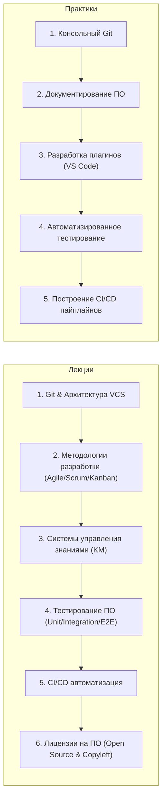
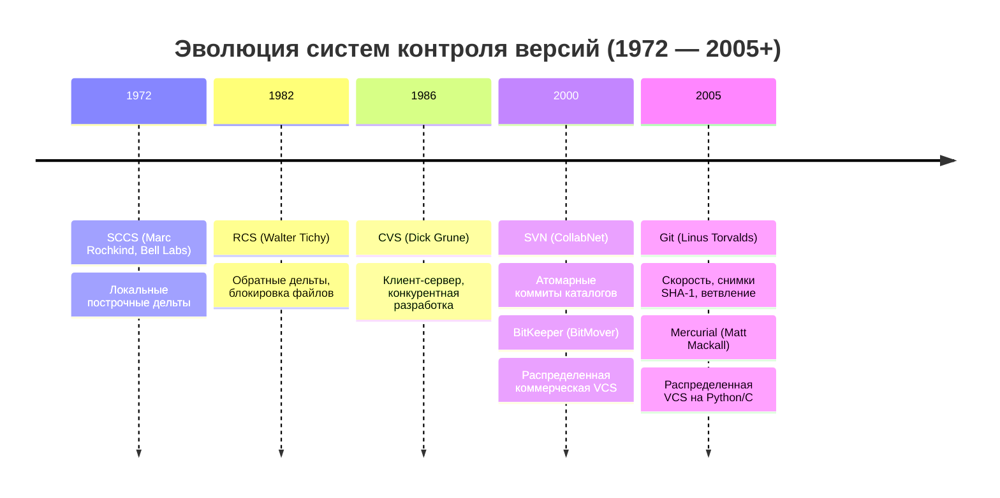
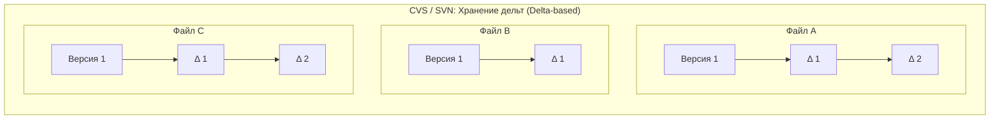
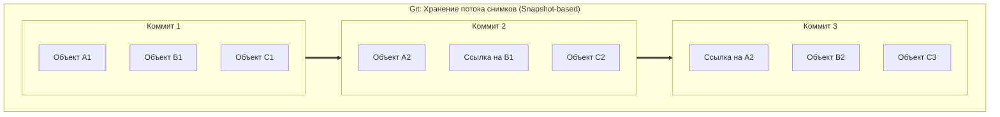
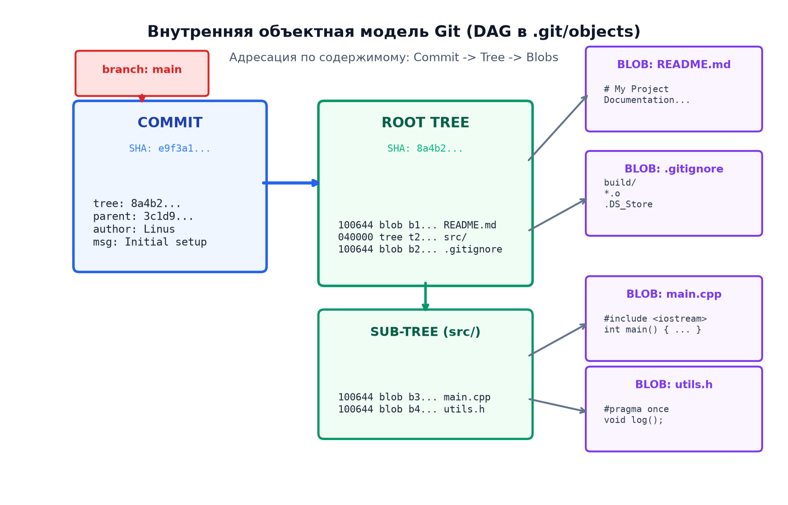
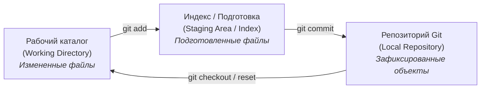
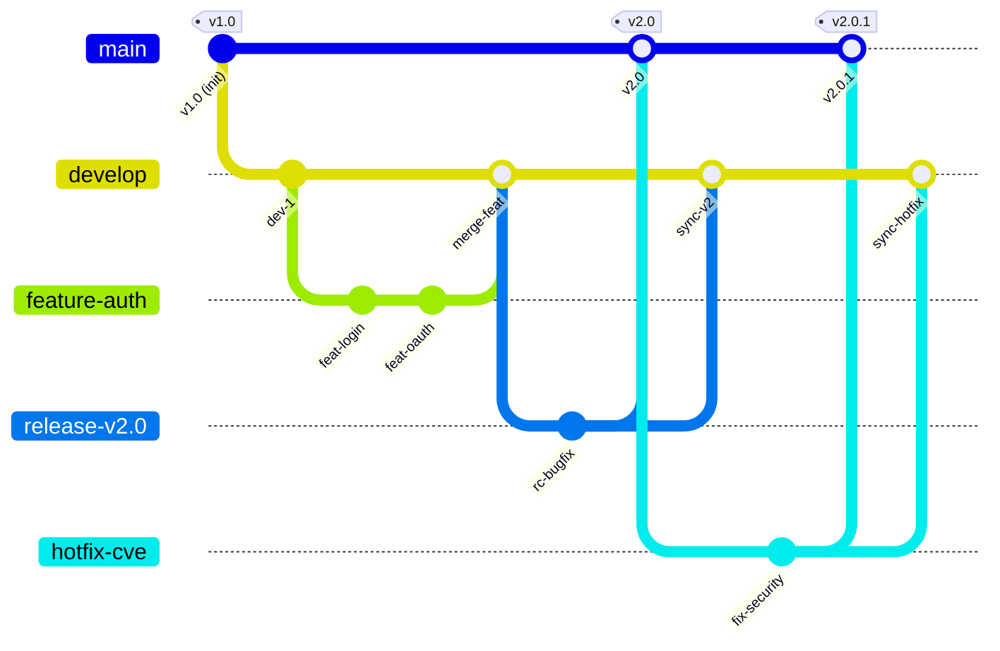
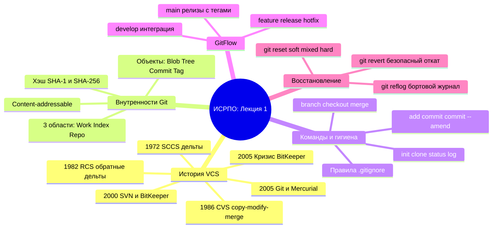

# 🛠️ Лекция 1: Введение в курс ИСРПО, эволюция систем контроля версий, архитектура Git и модель GitFlow

> **Дата проведения:** `2026-09-11` (2-я неделя)  
> **Предмет:** Инструментальные средства разработки ПО (1 семестр, 2026/27 уч. год)  
> **Преподаватель:** Кайнов Руслан Владимирович (ИТМО)  
> **Хаб дисциплины:** [[Инструментальные средства разработки ПО]]

---

## 📌 Краткое резюме (TL;DR)

1. **Регламент дисциплины:**
   - **Аттестация:** 2 рубежные контрольные работы (РК) $\implies$ дифференцированный зачет при наборе **60+ баллов**.
   - **Тематический план лекций:** Git $\to$ Методологии разработки (Agile, Scrum, Kanban) $\to$ Системы управления знаниями (Wiki, Confluence, Obsidian) $\to$ Тестирование ПО $\to$ CI/CD $\to$ Лицензии на ПО (GPL, MIT, Apache).
   - **Тематический план практик:** Git в консоли $\to$ Документирование кода $\to$ **Разработка плагинов для VS Code** (обязательный трек) $\to$ Написание тестов $\to$ Настройка CI/CD пайплайнов.
2. **Эволюция систем контроля версий (VCS):**
   - **1972 (SCCS):** первая локальная VCS (Marc Rochkind, Bell Labs), хранение текстовых дельт.
   - **1982 (RCS):** Walter Tichy, обратные дельты, монопольная блокировка файлов (`lock-modify-unlock`).
   - **1986 (CVS):** Dick Grune, централизованная клиент-серверная модель, конкурентное редактирование (`copy-modify-merge`).
   - **2000 (SVN & BitKeeper):** Subversion (CollabNet, атомарные коммиты каталогов) и BitKeeper (BitMover, распределенная проприетарная VCS ядра Linux).
   - **2005 (Кризис и рождение Git & Mercurial):** отзыв лицензии BitKeeper $\implies$ создание Mercurial (Matt Mackall) и создание Git (Linus Torvalds за 2 недели на C).
3. **Архитектура и внутреннее устройство Git:**
   - **Content-Addressable Storage:** хранилище на основе адресации по содержимому.
   - **Хэширование SHA-1:** 160-битные контрольные суммы (40 шестнадцатеричных символов) как уникальные идентификаторы объектов. Обсуждение надежности и миграции на SHA-256 после атак коллизий (Google SHAttered, 2017).
   - **4 типа объектов:** `blob` (содержимое файла), `tree` (структура директорий и права доступа), `commit` (автор, дата, родитель, дерево, комментарий), `tag` (аннотированная метка).
   - **3 области:** Working Directory (рабочая копия) $\leftrightarrow$ Staging Area / Index (индекс) $\leftrightarrow$ Repository (`.git/objects`).
4. **Консольный инструментарий Git:**
   - Базовый пайплайн: `init`, `clone`, `status`, `add`, `commit`, `commit --amend`, `log`.
   - Ветки и слияния: `branch`, `checkout` / `switch`, `merge`.
   - Сетевое взаимодействие: `pull`, `push`.
   - **Золотое правило Git:** В репозиторий помещается *только исходный код*! Бинарники, временные файлы, кэши компилятора и секреты экранируются через `.gitignore`.
5. **Модель ветвления GitFlow:**
   - Долгоживущие ветки: `main` (`master`) — релизные версии с тегами, `develop` — интеграционная ветка разработки.
   - Временные ветки: `feature/*` (разработка фич от `develop`), `release/*` (стабилизация перед релизом), `hotfix/*` (срочные патчи от `main`).
6. **Аварийное восстановление («Если что-то пошло не так»):**
   - `git reflog`: локальный бортовой самописец всех перемещений указателя `HEAD`. Восстановление потерянных коммитов через `git reset HEAD@{index}`.
   - `git reset` (`--soft`, `--mixed`, `--hard`): отмена коммитов и перемещение указателя ветки.
   - `git revert <hash>`: безопасная отмена коммита в общих ветках путем создания антикоммита без переписывания истории.

---

## 🧭 Навигация по конспекту

1. [Организация курса и программа обучения](#1-организация-курса-и-программа-обучения)
   - [Критерии оценивания и правила сдачи](#11-критерии-оценивания-и-правила-сдачи)
   - [Тематический план дисциплины](#12-тематический-план-дисциплины)
2. [Хронология и эволюция систем контроля версий](#2-хронология-и-эволюция-систем-контроля-версий)
   - [Локальные VCS: SCCS (1972) и RCS (1982)](#21-локальные-vcs-sccs-1972-и-rcs-1982)
   - [Централизованные VCS: CVS (1986) и Subversion (2000)](#22-централизованные-vcs-cvs-1986-и-subversion-2000)
   - [Кризис ядра Linux и рождение Git и Mercurial (2005)](#23-кризис-ядра-linux-и-рождение-git-и-mercurial-2005)
3. [Внутренняя архитектура Git (Under the Hood)](#3-внутренняя-архитектура-git-under-the-hood)
   - [Модель данных: снимки (Snapshots), а не дельты](#31-модель-данных-снимки-snapshots-а-не-дельты)
   - [Адресация по содержимому и хэш SHA-1](#32-адресация-по-содержимому-и-хэш-sha-1)
   - [Четыре фундаментальных объекта Git (Blob, Tree, Commit, Tag)](#33-четыре-фундаментальных-объекта-git)
   - [Три состояния файла и три дерева Git](#34-три-состояния-файла-и-три-дерева-git)
4. [Консольный рабочий процесс и основные команды](#4-консольный-рабочий-процесс-и-основные-команды)
   - [Инициализация и клонирование (init, clone)](#41-инициализация-и-клонирование)
   - [Фиксация изменений (add, commit, commit --amend)](#42-фиксация-изменений)
   - [Навигация и управление ветками (status, branch, checkout, merge)](#43-навигация-и-управление-ветками)
   - [Удаленные репозитории (pull, push, log)](#44-удаленные-репозитории)
   - [Гигиена репозитория: правила .gitignore](#45-гигиена-репозитория-правила-gitignore)
5. [Модель ветвления GitFlow](#5-модель-ветвления-gitflow)
   - [Структура веток: main, develop, feature, release, hotfix](#51-структура-веток-main-develop-feature-release-hotfix)
   - [Жизненный цикл разработки по GitFlow](#лекция-1-введение-в-курс-исрпо-эволюция-систем-контроля-версий-архитектура-git-и-модель-gitflow)
6. [Аварийное восстановление («Если что-то пошло не так»)](#6-аварийное-восстановление-если-что-то-пошло-не-так)
   - [Спасительный журнал git reflog](#61-спасительный-журнал-git-reflog)
   - [Откат через git reset: различия --soft, --mixed, --hard](#62-откат-через-git-reset-различия-soft-mixed-hard)
   - [Безопасный откат через git revert](#63-безопасный-откат-через-git-revert)
7. [Вопросы для самопроверки и подготовки к рубежному контролю](#7-вопросы-для-самопроверки-и-подготовки-к-рубежному-контролю)

---

## 1. Организация курса и программа обучения

### 1.1. Критерии оценивания и правила сдачи

Дисциплина **«Инструментальные средства разработки ПО» (ИСРПО)** направлена на освоение промышленного стека инструментов современного Software Engineer: от систем контроля версий и автоматизации сборки до создания расширений для сред разработки, тестирования и непрерывной интеграции.

> [!IMPORTANT] Формула аттестации курса
> - Итоговая аттестация: **Зачет** (дифференцированный / рубежный).
> - Критерий получения зачета: **60+ баллов**.
> - Контрольные точки: **2 рубежные контрольные работы (РК)** в течение семестра.
> - **Обязательное практическое условие:** успешная защита практических заданий, ключевым из которых является **разработка собственного плагина/расширения для VS Code**.

---

### 1.2. Тематический план дисциплины



| № | Тема лекции | Практическое занятие | Ключевые результаты и артефакты |
| :---: | :--- | :--- | :--- |
| **1** | **Git и распределенные VCS** | Работа с Git в терминале | Консольная работа, GitFlow, решение конфликтов слияния, reflog |
| **2** | **Методологии разработки** | Документирование проекта | User Stories, Scrum-доски, README, Architecture Decision Records (ADR) |
| **3** | **Системы управления знаниями** | **Разработка плагинов для VS Code** | Создание расширения на TypeScript/Node.js для VS Code API |
| **4** | **Тестирование ПО** | Написание тестов | Модульные тесты (Unit), моки, покрытие кода (Code Coverage) |
| **5** | **CI/CD процессы** | Настройка пайплайна | GitHub Actions / GitLab CI, линтеры, автосборка, автотесты |
| **6** | **Лицензирование ПО** | Рубежный контроль №2 | Анализ свободных лицензий: MIT, Apache 2.0, GPLv2/v3, BSD |

---

## 2. Хронология и эволюция систем контроля версий

История систем контроля версий (Version Control Systems, VCS) отражает эволюцию масштабов программной инженерии: от отслеживания правок одиночного файла на одном компьютере до координации десятков тысяч разработчиков по всему миру.



### 2.1. Локальные VCS: SCCS (1972) и RCS (1982)

- **1972 — SCCS (Source Code Control System):**
  - Создана **Марком Рочкиндом (Marc Rochkind)** в Bell Labs для мэйнфреймов IBM System/370.
  - Работала по принципу хранения **построчных дельт (diffs)** в едином файле формата s-file.
  - Позволяла восстанавливать любую предыдущую версию, но была крайне медленной и работала строго с отдельными файлами.
- **1982 — RCS (Revision Control System):**
  - Разработана **Вальтером Тихи (Walter Tichy)**.
  - Ключевая оптимизация: **обратные дельты (reverse diffs)**. Последняя версия файла хранилась в открытом виде (чтобы доступ к актуальному коду был мгновенным), а история версий сохранялась в виде цепочки обратных патчей.
  - Модель совместной работы: **монопольная блокировка (`lock-modify-unlock`)**. Чтобы изменить файл, разработчик обязан был заблокировать его на чтение/запись для всех остальных. Это полностью исключало параллельную работу команды.

---

### 2.2. Централизованные VCS: CVS (1986) и Subversion (2000)

С развитием локальных сетей и интернета возникла необходимость в клиент-серверной архитектуре:

- **1986 — CVS (Concurrent Versions System):**
  - Создана **Диком Груне (Dick Grune)**.
  - Переход к парадигме **`copy-modify-merge`**: разработчики клонируют локальные копии, одновременно вносят изменения и отправляют их на центральный сервер, который пытается автоматически объединить правки или сигнализирует о конфликтах.
  - *Недостатки CVS:* операции с файлами не были атомарными (сбой сети во время коммита мог повредить репозиторий), отсутствовало версионирование переименований файлов и директорий.
- **2000 — SVN (Apache Subversion):**
  - Создана компанией **CollabNet Inc** как замена CVS («CVS done right»).
  - Ввела **атомарные транзакции** (коммит либо проходит целиком для всех файлов, либо откатывается), полноценное версионирование каталогов, метаданных и бинарных файлов.
  - *Архитектурное ограничение:* единая точка отказа (Single Point of Failure). Любые операции с историей (просмотр логов, создание веток, коммит) требовали постоянного сетевого подключения к центральному серверу.

---

### 2.3. Кризис ядра Linux и рождение Git и Mercurial (2005)

С 2002 по 2005 год разработка ядра операционной системы Linux велась с использованием проприетарной распределенной системы **BitKeeper** (разработка компании BitMover Inc, основатель — Ларри МакВой). BitMover предоставляла бесплатную версию для сообщества ядра Linux.

> [!WARNING] Кризис 2005 года
> В начале 2005 года австралийский программист Эндрю Триджелл (создатель Samba) попытался декомпилировать сетевой протокол BitKeeper, чтобы написать свободный клиент. В ответ на это BitMover отозвала лицензию у Линуса Торвальдса и всех разработчиков ядра Linux.

Перед сообществом встала критическая задача: существующие открытые системы (CVS, SVN) категорически не справлялись с масштабом Linux (сотни патчей в день, гигантское дерево исходников). Ни одна доступная свободная распределенная VCS не удовлетворяла требованиям Торвальдса по скорости и надежности.

В апреле 2005 года практически одновременно стартовали две разработки:
1. **Mercurial (hg):** начата **Мэттом Макколлом (Matt Mackall)** на Python с узкими местами на C.
2. **Git:** начата **Линусом Торвальдсом (Linus Torvalds)** на чистом C.

Торвальдс сформулировал ключевые требования к Git:
- **Экстремальная скорость:** наложение патча и создание коммита должны занимать миллисекунды.
- **Полная распределенность (DVCS):** каждый разработчик имеет локально 100% истории репозитория. Операции коммита, ветвления и просмотра истории не требуют сети.
- **Надежность и целостность данных:** гарантированная защита от случайного повреждения или намеренной модификации истории.
- **Дешевые и мгновенные ветки:** слияние и переключение веток должно быть естественной и повседневной операцией, а не болезненным событием.

---

## 3. Внутренняя архитектура Git (Under the Hood)

В отличие от большинства традиционных VCS, Git внутри устроен не как система управления файлами с записью построчных различий, а как **простая база данных пар «ключ-значение»** с файловой адресацией по содержимому (Content-Addressable Storage).

### 3.1. Модель данных: снимки (Snapshots), а не дельты

Большинство традиционных систем (CVS, Subversion) хранят информацию в виде набора изменений (**дельт**) для каждого отдельного файла во времени:



Git кардинально отличается и рассматривает историю проекта как **поток снимков состояния (snapshots)** всего репозитория во времени:



> [!tip] Принцип неизменяемости и ссылочной целостности в Git
> Если файл не был изменен в очередном коммите, Git не дублирует его физическое содержимое на диске. Он сохраняет новую запись в дереве каталогов (`tree`), которая содержит тот же самый SHA-1 хеш и указывает на уже существующий неизменный объект `blob`.

---

### 3.2. Адресация по содержимому и хэш SHA-1

В основе адресации лежит криптографическая хеш-функция **SHA-1 (Secure Hash Algorithm 1)**:
- На вход подается тип объекта, его размер в байтах, нулевой байт и само содержимое:
  $$\text{header} = \text{"blob " } + \text{size} + \text{"\0"}$$
  $$\text{SHA-1} = \operatorname{hash}(\text{header} + \text{content})$$
- Результат: **160-битное число**, записываемое в виде строки из **40 шестнадцатеричных символов** (например, `2a8f9c4...`).
- Первые 2 символа хеша становятся именем подпапки в `.git/objects/`, а оставшиеся 38 — именем сжатого (zlib) файла объекта.

> [!NOTE] Вопрос из лекции: «SHA1??? Почему именно он и надежен ли он?»
> - В 2005 году Линус выбрал SHA-1 не ради криптографической защиты от спецслужб, а как надежнейшую контрольную сумму от повреждений диска и передачи по сети.
> - В 2017 году исследователи из Google и CWI Amsterdam представили практическую коллизию SHA-1 (**проект SHAttered**), сгенерировав два разных PDF-файла с одинаковым SHA-1 хешем.
> - Git внедрил защиту против атаки SHAttered (библиотека `sha1dc` детектирует попытки коллизий) и активно реализует переход на **SHA-256** (Object Format Transition).

---

### 3.3. Четыре фундаментальных объекта Git

Вся база данных Git (`.git/objects`) состоит всего из 4 типов объектов:



1. **`blob` (binary large object):**
   - Хранит чистые бинарные данные файла.
   - Не сохраняет имя файла, дату изменения или права доступа — только содержимое. Если два файла в разных папках имеют одинаковое содержимое, в репозитории будет существовать ровно один blob!
2. **`tree` (дерево):**
   - Соответствует директории файловой системы.
   - Содержит упорядоченный список записей: режим доступа (права UNIX, например `100644` для обычного файла или `040000` для папки), тип объекта (`blob` или `tree`), SHA-1 хеш и имя файла/папки.
3. **`commit` (коммит):**
   - Фиксирует состояние проекта в определенный момент времени.
   - Указывает на корневое `tree`, на один или несколько родительских коммитов (`parent`), содержит имя и email автора (`author`) и коммитера (`committer`), временную метку и текст сообщения.
4. **`tag` (аннотированный тег):**
   - Постоянный указатель на определенный коммит, содержащий имя создателя тега, дату, сообщение и, опционально, криптографическую подпись GPG.

---

### 3.4. Три состояния файла и три дерева Git

Файлы в рабочей директории могут находиться в одном из трех основных состояний:



1. **Working Directory (Рабочая область):** реальные файлы на диске, которые редактирует разработчик.
2. **Staging Area / Index (Индекс / Промежуточная область):** файл `.git/index`, содержащий список файлов и их хешей, которые войдут в следующий коммит. Позволяет точно формировать атомарные коммиты.
3. **Repository (Репозиторий `.git`):** неизменяемая база данных объектов, где надежно сохранены зафиксированные снимки.

---

## 4. Консольный рабочий процесс и основные команды

Преподаватель подчеркнул: **«Разобраться с Git консольно!»**. Разработчик обязан понимать семантику базовых команд терминала, не прячась за кнопками графических интерфейсов.

### 4.1. Инициализация и клонирование

- `git init`:
  Инициализирует пустой репозиторий в текущей директории. Создает служебную поддиректорию `.git/`, содержащую файлы конфигурации (`config`), указатель на активную ветку (`HEAD`), базу объектов (`objects/`) и ссылок (`refs/`).
- `git clone <url>`:
  Создает полную локальную копию удаленного репозитория: скачивает все коммиты, все ветки и историю изменений, настраивает удаленную ссылку `origin` и извлекает ветку по умолчанию в рабочую область.

---

### 4.2. Фиксация изменений

- `git status`:
  Выводит детальный статус: имя текущей ветки, опережение/отставание от сервера, список файлов в Staging Area (зеленые), измененных файлов вне индекса (красные) и неотслеживаемых файлов (untracked).
- `git add <path>`:
  Помещает изменения в Staging Area. При этом Git немедленно сжимает содержимое файла, создает объект `blob` в базе объектов и обновляет `.git/index`.
- `git commit -m "Сообщение"`:
  Создает объект коммита на основе текущего состояния Staging Area и перемещает указатель текущей ветки вперед на созданный коммит.
- `git commit --amend`:
  Позволяет дополнить или переписать самый последний коммит (добавить забытые файлы через `git add` или изменить текст сообщения), не создавая лишний коммит-заплатку.

> [!CAUTION] Правило безопасности amend
> Команду `git commit --amend` можно применять **только для локальных коммитов**, которые еще не были отправлены в общий репозиторий через `git push`! В противном случае изменится SHA-1 хеш коммита, что приведет к расхождению истории у коллег.

---

### 4.3. Навигация и управление ветками

Ветка в Git — это не тяжеловесная копия файлов, а **легковесный перемещаемый 41-байтный указатель** на конкретный коммит (хранится как текстовый файл в `.git/refs/heads/<branch_name>`, содержащий 40 символов хеша).

- `git branch <new-branch>`: создает новый указатель ветки на текущем коммите.
- `git checkout <branch>` (или `git switch <branch>`): перемещает указатель `HEAD` на указанную ветку и обновляет файлы в рабочей директории в соответствии со снимком этой ветки.
- `git checkout -b <new-branch>` (или `git switch -c <new-branch>`): создает ветку и сразу переключается на нее.
- `git merge <branch>`: выполняет слияние указанной ветки в текущую активную ветку:
  - **Fast-Forward:** если ветки не разошлись, Git просто сдвигает указатель вперед.
  - **Three-Way Merge (3-стороннее слияние):** если в обеих ветках появились свои коммиты, Git находит общего предка (Merge Base) и создает специальный коммит слияния (Merge Commit) с двумя родителями.

---

### 4.4. Удаленные репозитории

- `git pull`:
  Связка двух команд: `git fetch` (скачать недостающие объекты и обновить удаленные указатели `origin/*`) + `git merge origin/<branch>` (влить скачанные изменения в текущую локальную ветку).
- `git push`:
  Упаковывает новые локальные коммиты в компактные pack-файлы и передает их на удаленный сервер, обновляя ссылку ветки на сервере.
- `git log`:
  Отображает историю коммитов. Полезные флаги:
  ```bash
  git log --oneline --graph --decorate --all
  ```

---

### 4.5. Гигиена репозитория: правила `.gitignore`

> [!IMPORTANT] Золотое правило курса ИСРПО
> **В репозитории GitHub должен находиться ТОЛЬКО чистый исходный код!**

Категорически запрещено коммитить:
1. **Артефакты сборки:** скомпилированные бинарники (`*.exe`, `*.out`, `*.o`, `*.a`, `*.so`, `*.dylib`).
2. **Папки генераторов проектов и систем сборки:** `build/`, `cmake-build-debug/`, `bin/`, `obj/`, `target/`.
3. **Кэши пакетных менеджеров и зависимостей:** `node_modules/`, `.venv/`, `packages/`.
4. **Конфигурации локальных IDE:** `.vscode/` (кроме общих tasks/settings без персональных путей), `.idea/`, `.vs/`.
5. **Секреты и ключи доступа:** `.env`, приватные ключи, токены API.

Пример типового `.gitignore` для C++ и VS Code проектов:
```gitignore
# Сборка и компиляция
build/
bin/
obj/
*.o
*.exe
*.out

# IDE и редакторы
.vscode/*
!.vscode/settings.json
!.vscode/tasks.json
.idea/
*.swp

# Временные файлы и ОС
.DS_Store
Thumbs.db
*.log
```

---

## 5. Модель ветвления GitFlow

На лекции была подробно разобрана классическая архитектурная модель ветвления **GitFlow** (предложенная Винсентом Дриссеном в 2010 году), предназначенная для релиз-ориентированной командной разработки.



### 5.1. Структура веток: main, develop, feature, release, hotfix

1. **`main` (`master`):**
   - Главная ветка production-кода.
   - Код в этой ветке всегда работоспособен и готов к развертыванию.
   - Прямые коммиты в `main` запрещены.
   - Каждый коммит в `main` помечается версионным тегом в соответствии с [Semantic Versioning (SemVer)](https://semver.org/) (`v1.0.0`, `v2.0.0`).
2. **`develop`:**
   - Главная ветка интеграции текущей разработки.
   - Содержит самые свежие законченные фичи, протестированные разработчиками.
   - Служит базой для создания фиче-веток и релизных веток.
3. **`feature/<name>` (`feat 1`, `feat 2`, ...):**
   - Временные ветки для разработки отдельных функций.
   - Ответвляются от `develop`.
   - После завершения работы и прохождения Code Review вливаются обратно в `develop`.
4. **`release/<version>` (`release v1`, `release v2`, ...):**
   - Создаются от `develop`, когда набран пул фич для очередного релиза.
   - В этой ветке запрещено добавлять новые крупные функции — допускаются только исправление багов, полировка документации и подготовка конфигураций.
   - При выпуске релиза вливается одновременно:
     - в `main` (с тегом версии);
     - обратно в `develop` (чтобы багфиксы релиза не потерялись в дальнейшей разработке).
5. **`hotfix/<version>`:**
   - Экстренные патчи для устранения критических уязвимостей или сбоев на production.
   - Ответвляются напрямую от `main`.
   - После исправления вливаются одновременно в `main` (с тегом патча, например `v2.0.1`) и в `develop`.

---

## 6. Аварийное восстановление («Если что-то пошло не так»)

Каждый разработчик сталкивается с ситуациями, когда ветка поломана, коммит сделан не туда или удалена нужная история. Git обладает мощнейшими средствами самоспасения.

### 6.1. Спасительный журнал `git reflog`

> [!TIP] Запомните: в Git практически невозможно что-то удалить безвозвратно!
> Git никогда не удаляет коммиты сразу. Любой объект хранится в базе минимум 30–90 дней до запуска сборщика мусора (`git gc`).

- `git reflog` (Reference Log):
  Локальный журнал, фиксирующий каждое изменение ссылки `HEAD` (коммиты, переключения веток `checkout`, `merge`, `rebase`, `reset`).
- Каждая запись имеет вид:
  ```text
  HEAD@{0}: commit: Add user profile page
  HEAD@{1}: checkout: moving from feature to develop
  HEAD@{2}: reset: moving to HEAD~1
  HEAD@{3}: commit: Broken experimental code
  ```
- **Как восстановить состояние перед аварией:**
  1. Выполнить `git reflog`.
  2. Найти индекс `HEAD@{n}`, когда всё еще работало.
  3. Откатить репозиторий в эту точку:
     ```bash
     git reset --hard HEAD@{n}
     ```

---

### 6.2. Откат через `git reset`: различия `--soft`, `--mixed`, `--hard`

Команда `git reset` перемещает указатель текущей ветки назад во времени на указанное число коммитов (например, `HEAD~1` — на 1 коммит назад):

| Флаг команды | Перемещение ветки (`HEAD`) | Изменение индекса (`Staging Area`) | Изменение файлов на диске (`Working Dir`) | Когда использовать |
| :--- | :---: | :---: | :---: | :--- |
| **`--soft`** | ✅ Сдвигается назад | ❌ **Сохраняется** (файлы остаются staged) | ❌ **Не трогает файлы** | Перегруппировать коммиты, переписать сообщение |
| **`--mixed`** *(default)* | ✅ Сдвигается назад | ✅ **Сбрасывается** (файлы становятся unstaged) | ❌ **Не трогает файлы** | Переразбить файлы по разным коммитам |
| **`--hard`** | ✅ Сдвигается назад | ✅ **Сбрасывается** | ⚠️ **ЖЕСТКО СТИРАЕТ** все незакоммиченные правки | Полная ликвидация сломанного кода и возврат к предку |

Пример из лекции:
```bash
# Жестко удалить последний коммит и все незафиксированные правки:
git reset --hard HEAD~1
```

---

### 6.3. Безопасный откат через `git revert`

Если коммит **уже был отправлен в удаленный репозиторий (`push`)**, использовать `git reset` категорически запрещено (потребуется опасный `push --force`, который сломает историю у всей команды).

Для публичных веток используется **`git revert`**:
```bash
# 1. Найти хэш нежелательного коммита
git log --oneline

# 2. Создать анти-коммит, инвертирующий изменения
git revert 4a8f1b2
```
Git анализирует изменения в коммите `4a8f1b2` и создает **новый коммит**, который делает строго противоположные действия (удаляет добавленные строки и возвращает удаленные). История остается линейной и безопасной для совместной работы.

---

## 7. Вопросы для самопроверки и подготовки к рубежному контролю



### Вопросы для рубежного контроля:
1. В чем принципиальное отличие модели хранения изменений в Subversion (дельты) от модели Git (снимки-снапшоты)?
2. Что такое адресация по содержимому (Content-Addressable Storage) и почему при дублировании файла с одинаковым содержимым размер папки `.git/objects` не увеличивается?
3. Перечислите 4 типа объектов Git и опишите, какую роль выполняет объект `tree`.
4. Почему коллизия хэш-функции SHA-1 (проект SHAttered) теоретически опасна для систем контроля версий и как Git защищается от этой уязвимости?
5. Опишите разницу в поведении флагов `git reset --soft`, `git reset --mixed` и `git reset --hard`.
6. В какой ситуации разработчик обязан использовать `git revert` вместо `git reset`?
7. Объясните назначение веток `develop` и `release` в модели GitFlow. В какие ветки вливается ветка `release` после стабилизации?
8. Что такое `git reflog` и как восстановить ветку, если вы случайно удалили ее командой `git branch -D`?
9. Какие файлы строго запрещено добавлять в репозиторий GitHub согласно правилам гигиены кода курса ИСРПО?
10. Какое обязательное требование к практическим работам курса ИСРПО было озвучено на вводной лекции? *(Разработка плагина/расширения для VS Code)*.


---

## 5. 🔬 Криптографический Merkle DAG, Pack-файлы и DIRC-индекс

### Merkle DAG в архитектуре Git
Git является контентно-адресуемой файловой системой: хэш коммита (SHA-1 / SHA-256) вычисляется от метаданных и хэша дерева (`tree`). Любое изменение байта в истории каскадно меняет хэши всех коммитов-потомков.

---

### Дельта-компрессия Pack-файлов и DIRC-кэш
- **Pack-файлы (`.pack` / `.idx`):** алгоритм LibXDiff находит схожие файлы и сжимает их через дельты zlib. Файл `.idx` содержит таблицу префиксов для поиска смещения за $O(1)$.
- **`.git/index` (DIRC):** хранит `stat`-метаданные ОС (mtime, size, inode). Если они не изменились, Git не читает содержимое файла с диска, обеспечивая мгновенный `git status`.

---

## 🚀 Фундаментальная связь с будущими дисциплинами и технологиями (ИТМО Curriculum)

1. **Блокчейн и Распределенные реестры (Сем 8):**
   - Деревья Меркла в Git аналогичны деревьям состояния в Ethereum (Patricia Merkle Tree) для компактного доказательства включения транзакций.
2. **Облачные хранилища (Сем 6):**
   - Контентная адресация лежит в основе дедупликации слоев Docker-контейнеров и файловой системы ZFS.