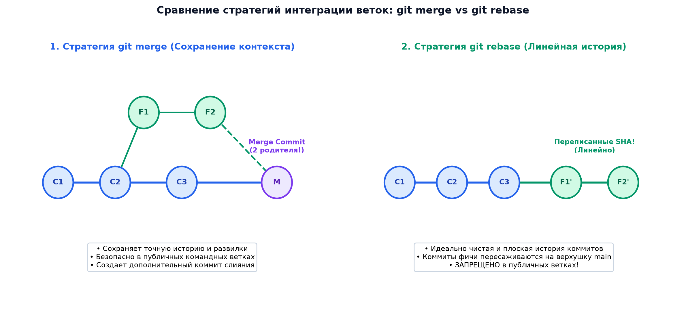

# 📌 Лекция 2: Продвинутый Git, интерактивный rebase, конфликты слияния и CI/CD

> [!abstract] О лекции
> - **Дисциплина:** [[Инструментальные средства разработки ПО]] (1 семестр)
> - **Преподаватель:** Руслан Владимирович Кайнов
> - **Ключевые концепции:** Стратегии интеграции изменений: Fast-Forward, 3-Way Merge (`--no-ff`), перемещение коммитов (`git rebase`), линеаризация истории коммитов, интерактивный ребейз (`git rebase -i`: squash, fixup, reword, drop), анатомия и разрешение конфликтов слияния (Merge Conflicts, маркеры `<<<<<<<`, `=======`, `>>>>>>>`), откат изменений (`git reset` --soft/--mixed/--hard vs `git revert`), спасательный круг `git reflog`, основы автоматизации CI/CD через GitHub Actions.

---

## 1. Стратегии слияния веток: Merge vs Rebase

При интеграции ветки фичи `feature` в базовую ветку `main` разработчик выбирает между двумя диаметрально противоположными философиями ведения истории проекта.



### Сравнение подходов:

| Критерий | `git merge` | `git rebase` |
| :--- | :--- | :--- |
| **История коммитов** | Нелинейная, древовидная, с развилками и петлями | Идеально плоская, линейная |
| **Хеши коммитов** | Сохраняются неизменными | **Перезаписываются!** Создаются новые коммиты с новыми SHA-1 |
| **Коммит слияния** | Создается специальный коммит с двумя родителями (если не fast-forward) | Отсутствует (последующий merge становится тривиальным Fast-Forward) |
| **Золотое правило** | Безопасно в любых ветках | **Никогда не ребейзить публичные ветки (`main`, `develop`), из которых работают другие разработчики!** |

---

## 2. Интерактивный Rebase (`git rebase -i`)

Интерактивный ребейз — главный инструмент подготовки аккуратного Pull Request перед отправкой ментору:

```bash
git rebase -i HEAD~4
```

В текстовом редакторе открывается список коммитов с директивами:

| Команда | Действие |
| :--- | :--- |
| `pick` (или `p`) | Использовать коммит как есть |
| `reword` (или `r`) | Использовать коммит, но изменить его сообщение |
| `edit` (или `e`) | Остановить процесс на данном коммите для внесения правок в код |
| `squash` (или `s`) | Объединить («схлопнуть») коммит с предыдущим и объединить их сообщения |
| `fixup` (или `f`) | Схлопнуть коммит с предыдущим, **выбросив** текущее сообщение |
| `drop` (или `d`) | Полностью удалить данный коммит из истории |

> [!tip] Практика идеального PR
> Перед отправкой лабораторной работы на ревью ментору:
> 1. Схлопните мелкие коммиты («fix bug», «typo») с помощью `fixup`.
> 2. Сделайте осмысленные атомарные сообщения в формате Conventional Commits:
>    `feat: implement insertion sort algorithm`
>    `test: add unit tests for empty array edge case`

---

## 3. Анатомия и разрешение конфликтов слияния (Merge Conflicts)

Конфликт возникает, когда в обеих ветках были изменены **одни и те же строки одного файла**, либо файл был удален в одной ветке и изменен в другой.

### Маркеры конфликта Git:
```cpp
<<<<<<< HEAD (Текущая ветка, например main)
int calculate_sum(int a, int b) {
    return a + b;
}
=======
long long calculate_sum(long long a, long long b) {
    return a + b;
}
>>>>>>> feature/64bit-ints (Сливаемая ветка)
```

### Алгоритм разрешения:
1. Выполнить `git status` и определить список конфликтующих файлов (`both modified`).
2. Открыть файлы в редакторе (VS Code / CLion подсвечивают кнопки: *Accept Current Change*, *Accept Incoming Change*, *Accept Both Changes*).
3. Удалить разделители `<<<<<<<`, `=======`, `>>>>>>>` и отредактировать финальный код.
4. Добавить разрешенные файлы в индекс:
   ```bash
   git add <filename>
   ```
5. Завершить слияние или ребейз:
   ```bash
   git commit          # Если был merge
   git rebase --continue # Если был rebase
   ```
   *(Если что-то пошло не так: `git merge --abort` или `git rebase --abort`).*

---

## 4. Откат изменений и безопасность: `reset`, `revert`, `reflog`

### `git revert` (Безопасный откат для публичных веток):
Создает **новый коммит**, производящий действия, противоположные указанному коммиту:
```bash
git revert <commit_hash>
```

### `git reset` (Перемещение указателя ветки):
- `--soft`: сдвигает указатель ветки назад, оставляя изменения в индексе (`Staging Area`).
- `--mixed` (по умолчанию): сдвигает указатель и очищает индекс, сохраняя изменения в рабочей директории (`Working Directory`).
- `--hard`: **безвозвратно удаляет** все незакоммиченные изменения рабочей директории!

### Спасательный круг: `git reflog`
Git никогда не удаляет коммиты сразу. Журнал `reflog` ведет лог всех перемещений указателя `HEAD`:
```bash
git reflog
# Находим хеш потерянного коммита (например, HEAD@{2})
git reset --hard HEAD@{2} # Восстановление состояния!
```

---

## 5. Введение в GitHub Actions и CI/CD

В курсах ИСРПО и программирования проверка лабораторных работ автоматизирована через GitHub Actions.

### Файл конфигурации `.github/workflows/ci.yml`:
```yaml
name: C++ CI Pipeline

on:
  push:
    branches: [ main ]
  pull_request:
    branches: [ main ]

jobs:
  build_and_test:
    runs-on: ubuntu-latest
    steps:
      - name: Checkout repository
        uses: actions/checkout@v4

      - name: Install dependencies and Clang
        run: |
          sudo apt-get update
          sudo apt-get install -y cmake clang-18 clang-tidy-18

      - name: Configure CMake
        run: cmake -B build -DCMAKE_CXX_COMPILER=clang++-18

      - name: Build Project
        run: cmake --build build

      - name: Run Clang-Tidy Lint
        run: cmake --build build --target clang-tidy

      - name: Run Unit Tests
        run: ctest --test-dir build --output-on-failure
```

---

## 5. 🔬 Алгоритмы поиска LCA, Criss-Cross Merges и механизм Rerere

### Поиск базы слияния: Наименьший общий предок (LCA)
При слиянии ветвей Git находит базовый коммит $\text{LCA}(A, B)$. В случае перекрестных слияний (Criss-Cross Merge), когда существует несколько несравнимых LCA $B_1, B_2$, стратегия `recursive` строит виртуальный базовый коммит их слиянием. Современная стратегия `ort` (Ostensibly Recursive's Twin) оптимизирует вычисление переименований с мемоизацией.

---

### Механизм `git rerere` (Reuse Recorded Resolution)
При возникновении конфликта Git сохраняет сигнатуру конфликта в `.git/rr-cache/`. После ручного разрешения при повторном возникновении аналогичного конфликта при ребейзе Git автоматически применяет ранее сохраненное решение.

---

## 🚀 Фундаментальная связь с будущими дисциплинами и технологиями (ИТМО Curriculum)

1. **DevOps и GitOps (Сем 6, 7):**
   - Инфраструктура как код (ArgoCD, Kubernetes) синхронизирует состояние кластера с репозиторием `main`.
2. **Безопасность цепочек поставок ПО (Сем 8):**
   - Криптографическая подпись коммитов ключами GPG/SSH и верификация зависимостей через SBOM (Software Bill of Materials).

---

## 🔗 Связанные материалы
- [[Инструментальные средства разработки ПО]] — главная страница дисциплины
- [[01. Лекция - Системы контроля версий, архитектура Git и модель GitFlow (2026-09-11)]]
- [[01. Семинар - Работа с консолью и Linux окружение для C++ (2026-09-07)]]
