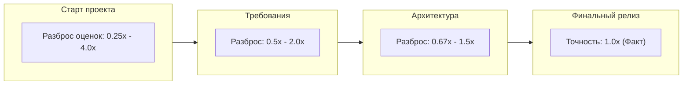
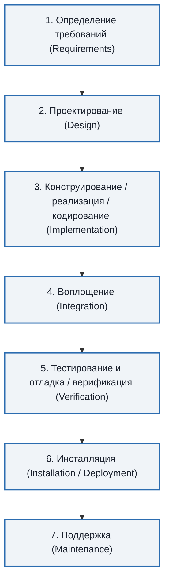
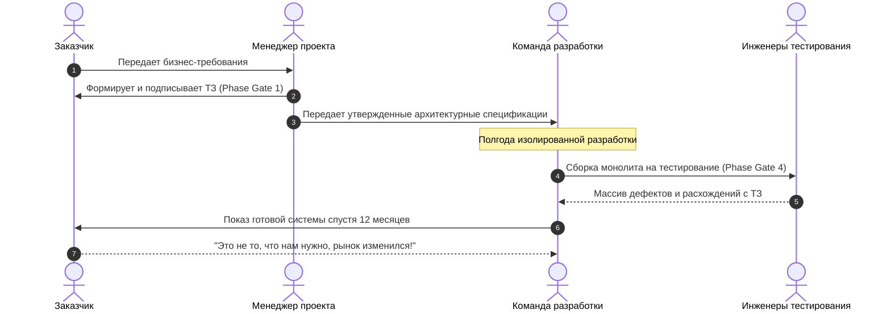
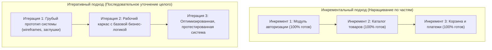
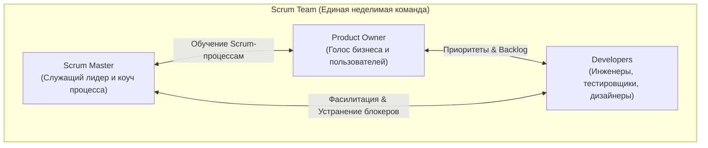
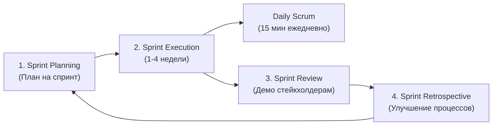
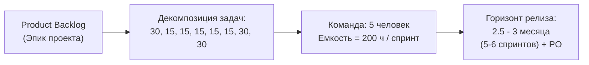
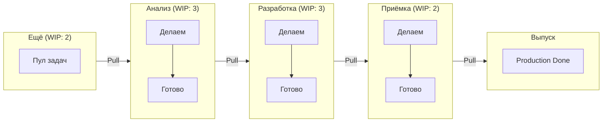
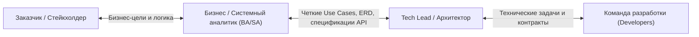

# 🛠️ Лекция 3: Методологии разработки ПО: Waterfall, Agile-манифест, Scrum, Kanban и инкрементальные модели

> [!abstract] О занятии
> - **Дисциплина:** [[Инструментальные средства разработки ПО]] (1 семестр, ФИТиП ИТМО)
> - **Преподаватель:** Кайнов Руслан Владимирович
> - **Дата и время:** `2026-09-25` (Четная неделя 4, пятница, `15:30 — 17:00`, ауд. 2342)
> - **Направление:** Software Engineering (Поток 2, группа M3107)
> - **Хаб дисциплины:** [[Инструментальные средства разработки ПО]]
> - **Ключевые концепции:** Кризис ПО, каскадная модель (Waterfall) и фазовые шлюзы, V-модель, инкрементальный и итеративный подходы (метафора Книберга), 4 ценности и 12 принципов Agile Manifesto, фреймворк Scrum (артефакты, события, роли, расчет capacity команды $5$ человек на $200$ часов), метод Kanban (вытягивающие системы, визуализация потока, закон Литтла, WIP-лимиты, DoD колонок), карго-культ «*gile», роль Tech Lead и критическая необходимость бизнес- и системного анализа (BA/SA).

---

## 📌 Краткое резюме (TL;DR)

1. **Парадигмальный сдвиг в Software Engineering:**
   - От **предиктивного (планового)** управления с фиксацией требований (Waterfall, ГОСТ 19/34) к **адаптивному (эмпирическому)** управлению рисками в условиях высокой неопределенности (Agile, Scrum, Kanban).
2. **Каскадная модель (Waterfall, Winston Royce, 1970):**
   - Строгая линейная последовательность фаз: *Определение требований $\to$ Проектирование $\to$ Конструирование/Реализация $\to$ Воплощение $\to$ Тестирование/Верификация $\to$ Инсталляция $\to$ Поддержка*.
   - Переход между этапами через формальные фазовые шлюзы (Phase Gates). Главный порок — перенос интеграции и тестирования на финал, приводящий к экспоненциальному росту стоимости исправления ошибок (кривая Боэма).
3. **Инкрементальный vs Итеративный подход:**
   - *Инкрементальность:* разбиение системы на завершенные функциональные части (кусочки).
   - *Итеративность:* последовательное эволюционное приближение всей системы от грубого прототипа к детализированному решению (скейтборд $\to$ самокат $\to$ велосипед $\to$ автомобиль).
4. **Agile Manifesto (2001, Snowbird):**
   - 4 базовые ценности: **Люди и взаимодействие** важнее процессов и инструментов; **Работающий продукт** важнее исчерпывающей документации; **Сотрудничество с заказчиком** важнее согласования условий контракта; **Готовность к изменениям** важнее следования первоначальному плану.
   - *«Не отрицая важности того, что справа, мы всё-таки больше ценим то, что слева»*.
5. **Scrum Framework:**
   - Эмпирический контроль (прозрачность, инспекция, адаптация). Time-boxed циклы (спринты 1–4 недели).
   - 3 роли: *Product Owner* (бизнес-ценность и бэклог), *Scrum Master* (фасилитация и устранение помех), *Developers / Scrum Team* (кросс-функциональная самоорганизующаяся команда).
   - Расчет ресурсов из лекции: кросс-функциональная команда из $5$ человек формирует ресурс около $200$ продуктивных человеко-часов на двухнедельный спринт; декомпозиция задач (`30, 15, 15, 15, 15, 15, 30, 30` Story Points/часов) позволяет спрогнозировать релиз MVP за $2.5 - 3$ месяца.
6. **Kanban Method (Lean & Pull Systems):**
   - Управление потоком создания ценности (Value Stream) без жестких спринтов.
   - Ограничение незавершенной работы (**WIP-лимиты**): основано на законе Литтла ($\text{Lead Time} = \text{WIP} / \text{Throughput}$). Деление колонок на `Делаем` и `Готово` (буфер вытягивания).
   - Четкие критерии готовности (DoD/Exit criteria) на каждом этапе воронки (Анализ $\to$ Разработка $\to$ Приемка $\to$ Выпуск).
7. **Индустриальные реалии и критика карго-культа (Anti-patterns):**
   - «Agile ради Agile» (*gile): распад проекта на тысячи мелких тикетов без глобального архитектурного видения.
   - Миф о «полной самоорганизации без лидов»: проекты гибнут без технических лидеров (Tech Lead, System Architect) и без профессионального бизнес- и системного анализа (BA/SA). Разработчики без требований тратят до $70\%$ времени на пустые споры и бесконечные переделки.

---

## 1. Предпосылки и эволюция программной инженерии

### 1.1. Кризис программного обеспечения (Software Crisis)

В конце 1960-х годов стремительное развитие аппаратного обеспечения (появление мэйнфреймов IBM System/360) опередило методы разработки софта. На исторической конференции НАТО в Гармише (Garmisch, Германия, 1968 год) был официально введен термин **Software Engineering** («Программная инженерия») и констатирован **кризис ПО**:
- Проекты регулярно срывали сроки на $100 - 300\%$;
- Бюджеты превышались в разы;
- Готовые программы содержали критические дефекты и не решали задач заказчика;
- Проекты превращались в «Death March» (марш обреченных), когда разработчики месяцами работали в авральном режиме над неработоспособным кодом.

Причиной кризиса была попытка управлять нематериальным, быстро меняющимся программным продуктом методами классического строительства или тяжелого машиностроения.

### 1.2. Конус неопределенности (Cone of Uncertainty)

Стив Макконнелл (Steve McConnell) и Барри Боэм (Barry Boehm) сформулировали феномен **конуса неопределенности**: в начале любого IT-проекта невозможно точно предсказать трудозатраты, сроки и финальный состав функций.



На этапе первоначального замысла ошибка в оценке сроков и бюджета может достигать **$400\%$ в большую или меньшую сторону** ($\times 4$ или $\times 0.25$). Любая попытка зафиксировать требования на $100\%$ в виде жесткого контракта на берегу неизбежно разбивается о конус неопределенности.

### 1.3. Кривая стоимости изменений Барри Боэма (Boehm's Cost of Change)

Классическая эмпирическая закономерность Боэма показывает, как возрастает цена исправления дефекта или внесения изменения в зависимости от фазы жизненного цикла ПО:

| Фаза жизненного цикла | Относительная стоимость исправления дефекта | Суть издержек |
| :--- | :---: | :--- |
| **Сбор и анализ требований** | $1\times$ (базовая) | Исправление формулировки в текстовом документе / тикете. |
| **Системное проектирование** | $3\times - 5\times$ | Перерисовка архитектурных диаграмм и интерфейсов API. |
| **Кодирование (Implementation)** | $10\times$ | Переписывание функций, классов, локальных юнит-тестов. |
| **Системное тестирование** | $20\times - 50\times$ | Регрессия, перезапуск пайплайнов, переработка зависимостей. |
| **Эксплуатация (Production)** | $100\times - 200\times$ | Простой бизнеса, аварийные патчи, миграция БД, репутационные потери. |

> [!important] Главный конфликт методологий
> **Waterfall** пытается победить рост стоимости изменений путем глубочайшей предварительной проработки документации на фазе $1\times$.  
> **Agile/Scrum/Kanban** снижают стоимость изменений за счет коротких циклов, автоматизированного тестирования (CI/CD) и непрерывной обратной связи, не позволяя дефектам доживать до продакшена.

---

## 2. Каскадная модель разработки (Waterfall Model)

### 2.1. Истоки модели и работа Уинстона Ройса (1970)

Классическая каскадная модель была формализована в статье Уинстона Ройса (Winston W. Royce) *«Managing the Development of Large Software Systems»* (1970).

> [!info] Исторический парадокс статьи Ройса
> Ройс привел ступенчатую диаграмму как **пример заведомо рискованной и нежизнеспособной модели** для сложных систем! Он прямо утверждал, что линейный процесс без постоянных итеративных петель обратной связи и создания предварительных прототипов обречен на катастрофу. Однако военные и государственные заказчики (включая Министерство обороны США, стандарт DoD-STD-2167) заимствовали именно упрощенную линейную схему из-за ее видимого административного удобства.

### 2.2. Этапы классического каскада (По материалам лекции)

На слайде лекции зафиксирована строгая последовательность семи канонических шагов каскадной модели:



#### Детальное содержание каждой фазы:

1. **Определение требований (Requirements Analysis & Specification):**
   - Сбор потребностей заказчика, проведение интервью, формализация ТЗ (Технического задания) или SRS (*Software Requirements Specification*).
   - Результат: объемный, юридически обязывающий документ, утверждаемый подписями сторон.
2. **Проектирование (System & Software Design):**
   - Выбор архитектурных шаблонов (микросервисы, монолит, клиент-сервер), проектирование схемы базы данных (ER-диаграммы), протоколов взаимодействия и интерфейсов компонентов.
   - Результат: Архитектурный документ (*Software Architecture Document*, SAD), спецификации API.
3. **Конструирование (Implementation / Coding / Realization):**
   - Непосредственное написание исходного кода модулей по утвержденным спецификациям. Программисты работают изолированно, следуя предписанным интерфейсам.
4. **Воплощение (Integration):**
   - Сборка написанных модулей в единую систему. В классическом каскаде этот этап часто называют «точкой сборки» или фазой интеграционного шока, так как нестыковки спецификаций выявляются одновременно.
5. **Тестирование и отладка (Verification & Validation):**
   - Проверка готового программного комплекса на соответствие первоначальному ТЗ: функциональное, нагрузочное, регрессионное тестирование. Поиск и исправление багов.
6. **Инсталляция (Installation / Deployment):**
   - Развертывание системы на целевой инфраструктуре заказчика, ввод в промышленную эксплуатацию, миграция исторических данных.
7. **Поддержка (Maintenance):**
   - Эксплуатационное сопровождение: исправление критических инцидентов, поддержка пользователей, плановое обновление серверов.

### 2.3. Принцип фазовых шлюзов (Phase-Gate Process)

В каскадной модели действует жесткое правило: **ни одна фаза не начинается до тех пор, пока полностью не завершена и документально не подписана предыдущая**.



### 2.4. Модификация: V-образная модель (V-Model)

Развитием каскадной модели стала **V-модель** (разработка через верификацию). Она подчеркивает, что планирование тестирования для каждого уровня архитектуры должно начинаться на соответствующем этапе нисходящего анализа:

| Нисходящая ветвь (Проектирование) | Восходящая ветвь (Верификация и тестирование) | Связующий артефакт |
| :--- | :--- | :--- |
| **Бизнес-требования** | **Приемочное тестирование (User Acceptance Testing, UAT)** | Сценарии приемочных тестов, бизнес-кейсы |
| **Системные требования** | **Системное тестирование (System Testing)** | Нагрузочные, интеграционные и стресс-тесты |
| **Архитектурный дизайн** | **Интеграционное тестирование (Integration Testing)** | Тесты межсервисного взаимодействия, контракты API |
| **Детальное проектирование модулей** | **Модульное тестирование (Unit Testing)** | Модульные тесты функций и классов |

### 2.5. Анализ применимости каскадной модели

> [!tip] Сильные стороны Waterfall
> - **Прозрачность финансового планирования:** фиксированный бюджет (Fixed Price) и четкие сроки (Deadlines).
> - **Исчерпывающая документация:** любой новый разработчик может изучить спецификации без обращения к авторам кода.
> - **Простота контроля для менеджмента:** процент завершения проекта оценивается по закрытым формальным вехам (Milestones).

> [!danger] Критические пороки Waterfall в коммерческой разработке
> 1. **Позднее обнаружение рисков:** работающий софт появляется только в последней трети жизненного цикла проекта.
> 2. **Негибкость к изменениям:** любое изменение ТЗ требует длительной бюрократической процедуры *Change Request* и пересогласования сметы.
> 3. **Разрыв между документами и реальностью:** к моменту релиза бумажное ТЗ часто устаревает, а построенная система решает проблемы годичной давности.

#### Области, где каскад оправдан и обязателен:
- Критически важные системы безопасности (*Safety-critical*): авионика, бортовое ПО космических аппаратов, медицинские приборы поддержания жизни, системы управления АЭС;
- Государственные контракты с жесткими регламентами приемки по ГОСТ (ГОСТ 34, ГОСТ 19);
- Проекты с неизменными физическими ограничениями (разработка прошивок под готовую заказную кремниевую микросхему ASIC).

---

## 3. Инкрементальная и итеративная модели разработки

### 3.1. Разграничение понятий: Инкремент vs Итерация

В классической литературе по Software Engineering часто смешивают понятия «итеративный» и «инкрементальный». Однако концептуально это два ортогональных механизма:



| Параметр сравнения | Инкрементальная модель (Incremental) | Итеративная модель (Iterative) |
| :--- | :--- | :--- |
| **Стратегия создания** | Система строится блоками («по кирпичикам»). Каждый блок сразу реализуется полностью. | Создается вся система целиком в черновом виде, затем последовательно детализируется. |
| **Статус промежуточного продукта** | Часть функций готова к промышленной эксплуатации, остальные отсутствуют. | Вся система существует, но работает на базовом, прототипном уровне надежности и дизайна. |
| **Управление рисками** | Риски распределены по отдельным функциональным модулям. | Архитектурные риски выявляются на самых ранних итерациях. |

### 3.2. Классическая метафора Хенрика Книберга (Henrik Kniberg)

Хенрик Книберг (консультант Spotify и Lego) проиллюстрировал разницу между ошибочным поэтапным созданием продукта и правильной итеративно-инкрементальной разработкой ценности:

1. **Как не надо делать продукт под меняющиеся потребности (Fake Incremental):**
   - Шаг 1: Одно колесо $\implies$ *Пользователь не может ехать, ценность = 0*.
   - Шаг 2: Два колеса и ось $\implies$ *Ценность = 0*.
   - Шаг 3: Кузов без мотора $\implies$ *Ценность = 0*.
   - Шаг 4: Готовый автомобиль $\implies$ *Только через 2 года пользователь получает ценность, но к этому времени у него закончились деньги на бензин*.
2. **Как надо делать гибкий продукт (True Agile / Iterative & Incremental):**
   - Шаг 1: **Скейтборд** $\implies$ *Пользователь уже может передвигаться быстрее, чем пешком. Собрана первая обратная связь: «Трудно держать равновесие»*.
   - Шаг 2: **Самокат** (добавили руль) $\implies$ *Управлять легче, но скорость мала на неровностях*.
   - Шаг 3: **Велосипед** (добавили педали и цепь) $\implies$ *Можно преодолевать большие расстояния*.
   - Шаг 4: **Мотоцикл** $\implies$ *Высокая скорость, запрос на комфорт в непогоду*.
   - Шаг 5: **Автомобиль** $\implies$ *Финальный продукт идеально отвечает реальным условиям, выверенным на каждом шаге эволюции*.

### 3.3. Спиральная модель Боэма (Spiral Model, 1986)

Спиральная модель объединяет идеи прототипирования и водопада, делая краеугольным камнем **непрерывный анализ и купирование рисков (Risk Management)**.

Каждый виток спирали проходит через четыре квадранта:
1. **Определение целей:** выявление требований, альтернативных решений и граничных условий витка.
2. **Оценка альтернатив и идентификация рисков:** анализ технических сложностей, разработка исследовательских прототипов (*Spike solutions*), моделирование нагрузки.
3. **Разработка и тестирование:** создание продукта текущего уровня зрелости, прогон тестов.
4. **Планирование следующего витка:** ретроспектива, подведение итогов, согласование перехода к следующему этапу.

---

## 4. Манифест гибкой разработки ПО (Agile Manifesto)

### 4.1. Предыстория создания манифеста (2001)

11–13 февраля 2001 года на горнолыжном курорте *The Lodge at Snowbird* (штат Юта, США) собрались 17 ведущих независимых экспертов по разработке ПО (включая создателей Extreme Programming Кента Бека и Уорда Каннингема, создателей Scrum Кена Швабера и Джеффа Сазерленда, авторов DSDM, Crystal и Feature-Driven Development).

Они стремились найти общую альтернативу тяжеловесным, зарегулированным, забюрократизированным процессам разработки, парализовавшим индустрию. Итогом встречи стал документ из 68 слов — **Agile Manifesto**.

### 4.2. Четыре базовые ценности Agile (По слайду лекции)

На слайде лекции зафиксированы 4 канонических постулата Agile Manifesto:

> [!important] 4 Ценности Agile Manifesto
> 1. **Люди и взаимодействие** важнее процессов и инструментов  
>    *(Individuals and interactions over processes and tools)*
> 2. **Работающий продукт** важнее исчерпывающей документации  
>    *(Working software over comprehensive documentation)*
> 3. **Сотрудничество с заказчиком** важнее согласования условий контракта  
>    *(Customer collaboration over contract negotiation)*
> 4. **Готовность к изменениям** важнее следования первоначальному плану  
>    *(Responding to change over following a plan)*

#### Ключевой комментарий преподавателя:
> **«То есть, не отрицая важности того, что справа, мы всё-таки больше ценим то, что слева».**

Разбор семантики манифеста:
- Правая часть (*процессы, инструменты, документация, контракты, планы*) **НЕ** объявляется злом или бесполезной тратой времени. Хороший CI/CD пайплайн (инструмент), архитектурный манифест (документация) и соглашение об уровне сервиса SLA (контракт) необходимы.
- Однако при возникновении конфликта приоритетов **левая часть всегда имеет преобладающее значение**: лучше подойти и обсудить проблему устно за 5 минут, чем заводить тикет в трех трекерах и ждать формального аппрува регламента.

### 4.3. Двенадцать принципов Agile

В дополнение к 4 ценностям авторы манифеста сформулировали 12 принципов, определяющих поведение инженерных команд:

1. **Наивысший приоритет** — удовлетворение потребностей заказчика благодаря регулярной и ранней поставке ценного ПО.
2. **Приветствие изменений требований** даже на поздних стадиях разработки. Гибкие процессы превращают изменения в конкурентное преимущество заказчика.
3. **Частая поставка работающего ПО:** от нескольких недель до нескольких месяцев, с предпочтением меньших интервалов.
4. **Ежедневная совместная работа** представителей бизнеса и разработчиков на протяжении всего жизненного цикла проекта.
5. **Проекты строятся вокруг мотивированных профессионалов.** Им создаются необходимые условия, оказывается поддержка и выражается полное доверие.
6. **Непосредственное личное общение (face-to-face)** — самый эффективный способ передачи информации как внутри команды, так и вовне.
7. **Работающий софт** — главный и единственный объективный измеритель прогресса проекта.
8. **Поддержание устойчивого темпа разработки (Sustainable Pace).** Спонсоры, разработчики и пользователи должны иметь возможность поддерживать постоянный темп бесконечно (запрет на систематические переработки/овертаймы).
9. **Постоянное внимание к техническому совершенству (Technical Excellence)** и качеству архитектуры повышает гибкость проекта.
10. **Простота (Simplicity)** — искусство максимизации объема несделанной работы — фундаментально необходима.
11. **Лучшие архитектуры, требования и технические решения** рождаются в самоорганизующихся командах.
12. **Регулярная командная рефлексия (Ретроспектива):** команда систематически анализирует способы повышения эффективности и соответственно корректирует свой рабочий процесс.

---

## 5. Фреймворк Scrum (Глубокий инженерный разбор)

### 5.1. Теоретический фундамент: Эмпиризм (Empiricism)

Scrum — это не свод жестких директивных указаний, а легковесный фреймворк, базирующийся на теории управления эмпирическими процессами. Эмпиризм утверждает, что знания приходят из реального опыта, а решения принимаются на основе наблюдаемых фактов.

Scrum опирается на **три столпа эмпирического контроля процессов**:
1. **Прозрачность (Transparency):** рабочий процесс и артефакты должны быть видимы всем участникам (общее понимание того, что означает статус «Готово»).
2. **Инспекция (Inspection):** артефакты и прогресс регулярно проверяются для своевременного обнаружения отклонений от цели.
3. **Адаптация (Adaptation):** если параметры процесса выходят за допустимые границы, процесс или материалы корректируются как можно быстрее.

### 5.2. Роли в Scrum (Accountabilities)

В современной редакции *Scrum Guide* традиционное понятие «роли» заменено на «зоны ответственности» (*Accountabilities*), подчеркивая отсутствие кастовости и иерархии:



#### 1. Product Owner (Владелец Продукта)
- **Зона ответственности:** максимизация бизнес-ценности продукта и эффективности работы команды.
- Единственный человек, имеющий право управлять **Product Backlog**: формулировать элементы бэклога (PBI), упорядочивать их по приоритету и ценности, обеспечивать их понятность для команды.
- Принимает решение о выпуске релиза в продакшен.

#### 2. Scrum Master (Скрам-Мастер)
- **Зона ответственности:** внедрение и поддержка фреймворка Scrum в соответствии с его ценностями.
- Служащий лидер (*Servant-Leader*): не раздает задачи и не ставит дедлайны. Устраняет препятствия (*Impediments*), изолирует команду от несанкционированного внешнего вмешательства менеджеров, фасилитирует командные события.

#### 3. Developers (Разработчики / Команда)
- **Зона ответственности:** создание качественного инкремента, пригодного для выпуска, в каждом спринте.
- Характеристики:
  - **Кросс-функциональность:** команда обладает всеми навыками (frontend, backend, QA, DevOps, системный анализ, UX), необходимыми для выпуска рабочего инкремента без привлечения внешних подрядчиков.
  - **Самоорганизация:** команда сама решает, *кто*, *как* и *в каком порядке* будет выполнять задачи спринта.
  - Оптимальный размер: от $3$ до $9$ человек (классическое эмпирическое правило $7 \pm 2$). При меньшем составе не хватает кросс-функциональности, при большем — число каналов коммуникации растет по квадратичному закону:
    $$
    C = \frac{n(n - 1)}{2}
    $$
    Для команды из 5 человек: $C = \frac{5 \times 4}{2} = 10$ каналов.  
    Для команды из 15 человек: $C = \frac{15 \times 14}{2} = 105$ каналов (коммуникационный коллапс).

---

### 5.3. События (Церемонии) Scrum

Все события в Scrum ограничены по времени (**Time-boxed**), что предотвращает затягивание встреч и повышает фокус.



| Событие | Длительность (на 2 нед. спринт) | Участники | Цель и результат |
| :--- | :---: | :--- | :--- |
| **Sprint (Спринт)** | 1–4 недели (чаще 2 недели) | Вся Scrum-команда | Контейнер для всех остальных событий. Создание готового Increment. |
| **Sprint Planning** | До 4 часов | PO, SM, Developers | Ответы на 3 вопроса: *Зачем этот спринт? Что берем в спринт? Как будем делать?* Формируется **Sprint Goal** и **Sprint Backlog**. |
| **Daily Scrum** | Строго 15 минут | Developers (SM и PO опционально) | Ежедневная синхронизация у доски: *Что сделал вчера? Что сделаю сегодня? Какие препятствия мешают работе?* |
| **Sprint Review (Demo)**| До 2 часов | Scrum-команда + Стейкхолдеры | Демонстрация живого работающего инкремента. Получение немедленного фидбэка от пользователей и бизнеса. |
| **Sprint Retrospective**| До 1.5 часов | Developers + SM (+ PO) | Внутренний разбор полетов: *Что шло хорошо? Что пошло не так? Что улучшим в следующем спринте?* (Формирование Action Items). |

---

### 5.4. Артефакты Scrum и их обязательства (Commitments)

Каждый артефакт в Scrum содержит конкретное обязательство, гарантирующее прозрачность и измерение прогресса:

1. **Product Backlog (Бэклог продукта):**
   - Упорядоченный динамический список всех требований, доработок, фич и багов проекта.
   - **Обязательство:** **Product Goal (Цель продукта)** — долгосрочная миссия, к которой движется команда.
2. **Sprint Backlog (Бэклог спринта):**
   - Набор элементов Product Backlog, выбранных на текущий спринт, плюс детальный план их технической реализации.
   - **Обязательство:** **Sprint Goal (Цель спринта)** — неизменная бизнес-цель спринта, создающая фокус для команды.
3. **Increment (Инкремент продукта):**
   - Сумма всех завершенных элементов бэклога за текущий спринт плюс ценность предыдущих спринтов.
   - **Обязательство:** **Definition of Done (DoD / Критерии готовности)** — формальный чек-лист технического качества (код отревьюен, покрыт тестами $\ge 80\%$, протестирован на staging, развернут без ошибок).

---

### 5.5. Математика емкости и планирования: Разбор доски преподавателя

На фотографиях 3 и 4 зафиксирована реальная схема расчета спринтов, емкости и графика релизов, разобранная лектором Русланом Владимировичем Кайновым на лекции.



#### Математический анализ схемы с доски:

1. **Размер команды:**
   $$\text{Team Size} = 5 \text{ человек (Developers)}$$
2. **Расчет полезной емкости (Team Capacity):**
   - Номинальное рабочее время на команду за 2 недели (10 рабочих дней):
     $$T_{\text{nominal}} = 5 \text{ чел} \times 8 \text{ ч/день} \times 10 \text{ дней} = 400 \text{ человеко-часов}$$
   - В реальности инженер не может писать код 8 часов в день из-за встреч (Daily, Planning, Review, Retro), код-ревью, ответов в Slack/Mattermost и переключения контекста. Применяется **коэффициент фокусировки (Focus Factor)** $F \approx 0.5 - 0.6$:
     $$T_{\text{effective}} = T_{\text{nominal}} \times F = 400 \times 0.5 = 200 \text{ продуктивных человеко-часов}$$
   - На доске лектора зафиксировано значение: **`5 чел` $\implies$ `= 200 ч`**! Это эталонный реалистичный фонд чистого инженерного времени команды на один спринт.
3. **Оценка декомпозированных задач:**
   - На временной шкале доски лектором выписаны оценки стори-поинтов или трудоемкости задач для крупного эпика:
     $$\{30, 15, 15, 15, 15, 15, 30, 30\}$$
   - Суммарная трудоемкость бэклога:
     $$\Sigma = 30 + 15 + 15 + 15 + 15 + 15 + 30 + 30 = 165 \text{ единиц (часов / Story Points)}$$
4. **Горизонт выпуска (Релизный цикл):**
   - На доске обведено число **`2,5 - 3`** (месяца) и приписано **`+ PO`** (Product Owner).
   - При двухнедельных спринтах за 2.5–3 месяца проходит:
     $$\text{Количество спринтов} = \frac{10 - 12 \text{ недель}}{2 \text{ недели}} = 5 - 6 \text{ спринтов}$$
   - Это стандартный интервал вывода нового жизнеспособного продукта (MVP) на рынок с непрерывной валидацией гипотез владельцем продукта (PO).

---

## 6. Метод Kanban (Эволюционный подход и вытягивающие системы)

### 6.1. Философия и происхождение (Toyota Production System & Lean)

Метод Kanban возник в корпорации Toyota в 1950-х годах благодаря инженеру Тайити Оно (Taiichi Ohno) как инструмент **бережливого производства (Lean Manufacturing)** и **вытягивающих систем (Pull Systems)**. Японское слово 看板 (Kanban) дословно означает «вывеска» или «сигнальная карточка».

В разработку программного обеспечения метод был адаптирован Дэвидом Андерсоном (David J. Anderson) в середине 2000-х годов.

В отличие от Scrum, Kanban:
- Не требует смены ролей и названий должностей;
- Не навязывает жестких временных отрезков (спринтов);
- Управляет непрерывным потоком задач через оптимизацию пропускной способности системы.

### 6.2. Фундаментальный Закон Литтла (Little's Law)

Математический фундамент метода Kanban базируется на теории массового обслуживания и законе Джона Литтла (1961):

$$
\text{Lead Time} = \frac{\text{WIP}}{\text{Throughput}}
$$

Где:
- $\text{WIP}$ (*Work In Progress*) — объем одновременно выполняемой работы (количество карточек на доске);
- $\text{Throughput}$ — пропускная способность системы (число задач, завершаемых за единицу времени, например, за неделю);
- $\text{Lead Time}$ — среднее время прохождения задачи от момента появления в бэклоге до сдачи в эксплуатацию.

> [!important] Физический вывод из закона Литтла
> Чем больше задач команда берет в работу одновременно (рост $\text{WIP}$), тем **дольше делается каждая отдельная задача** ($\text{Lead Time}$ растет линейно или даже экспоненциально из-за переключения контекста).  
> **Чтобы делать задачи быстрее, нужно не нанимать больше людей, а ограничить количество одновременно выполняемых задач!**  
> Главный лозунг Kanban: *«Stop starting, start finishing!»* («Перестаньте начинать, начните заканчивать!»).

---

### 6.3. Детальный разбор Kanban-доски из лекции (Photo 5)

На слайде 5 лекции представлена образцовая структура производственной Kanban-доски с двухуровневыми колонками, явными WIP-лимитами и строгими критериями готовности:



#### Архитектура колонок, WIP-лимиты и критерии готовности (DoD):

| Колонка (Этап) | WIP-лимит | Подколонки | Критерии готовности (Definition of Done / Exit Criteria) |
| :--- | :---: | :---: | :--- |
| **1. Ещё (To Do / Backlog)** | **2** | Нет | Задача сформулирована, имеет бизнес-обоснование. Ограничение входа не дает раздувать бэклог неактуальными идеями. |
| **2. Анализ (Analysis)** | **3** | `Делаем` \| `Готово` | 1. **Цель ясна** (понятен ожидаемый бизнес-результат);<br/>2. **Есть первая задача** (понятно, с чего начинать реализацию);<br/>3. **Истории разбиты** (если задача слишком велика, она декомпозирована). |
| **3. Разработка (Development)**| **3** | `Делаем` \| `Готово` | 1. **Чистый код добавлен в рабочую ветку** (Pull Request прошел ревью и слит);<br/>2. **Завершено интеграционное и регрессионное тестирование** (нет упавших автотестов);<br/>3. **Всё работает в тестовой среде** (успешный деплой на staging). |
| **4. Приёмка (Review / UAT)** | **2** | `Делаем` \| `Готово` | 1. **Заказчик утвердил** (PO или клиент проверил функционал);<br/>2. **Готово к работе в реальной системе** (подготовлены скрипты миграции БД, документация). |
| **5. Выпуск (Release / Done)** | $\infty$ | Нет | Финальное состояние. Функционал развернут в production и доступен конечным пользователям. |

### 6.4. Механика работы подколонок «Делаем» и «Готово»

Зачем каждая функциональная колонка разделена на подколонки `Делаем` (In Progress) и `Готово` (Buffer/Done)?

1. **Буфер вытягивания (Pull Buffer):**
   - Когда разработчик закончил писать код, он переносит карточку из «Разработка $\to$ Делаем» в «Разработка $\to$ Готово».
   - Эта задача **продолжает занимать WIP-лимит колонки «Разработка»** (сумма карточек в `Делаем` и `Готово` не может превышать 3)!
2. **Предотвращение заторов:**
   - Если этап «Приёмка» перегружен (там уже 2 задачи), приемщик не может взять задачу из «Разработка $\to$ Готово».
   - Лимит разработки (3) быстро заполняется. Разработчики **не имеют права брать новые задачи в работу**!
   - Вместо создания новых задач программисты вынуждены идти и помогать тестировщикам или приемщикам разгребать затор («Swarming»). Поток восстанавливается автоматически!

---

## 7. Сравнительный анализ: Waterfall vs Scrum vs Kanban vs XP

| Критерий | Waterfall (Каскад) | Scrum | Kanban | Extreme Programming (XP) |
| :--- | :--- | :--- | :--- | :--- |
| **Парадигма** | Предиктивная (плановая) | Адаптивная (эмпирическая) | Эволюционная (потоковая) | Инженерно-ориентированная |
| **Каденция (Ритм)** | Линейный жизненный цикл | Фиксированные спринты (1–4 нед) | Непрерывный поток (Continuous) | Сверхкороткие итерации (1 нед) |
| **Управление объемом** | Объем зафиксирован в ТЗ | Фиксируется на спринт (Sprint Goal) | Варьируется через WIP-лимиты | Варьируется на основе User Stories |
| **Реакция на изменения** | Через бюрократический Change Request | Изменения вносятся в новый спринт | Изменения вносятся в любой момент | Изменения приветствуются непрерывно |
| **Командные роли** | PM, Архитектор, Ведущий разработчик, QA | Product Owner, Scrum Master, Developers | Роли не регламентируются | Парное программирование, заказчик рядом |
| **Метрики эффективности** | Освоенный объем (Earned Value), Milestone | Скорость команды (Velocity), Burndown | Lead Time, Cycle Time, Throughput, CFD | Скорость, покрытие тестами (TDD) |
| **Инженерные практики** | Не регламентируются | Не регламентируются (на усмотрение команды)| Не регламентируются | TDD, CI/CD, Refactoring, Pair Programming |

---

## 8. Реальность индустрии, антипаттерны и критика карго-культа

На заключительных слайдах лекции (фотографии 7 и 8) лектор Кайнов Р.В. акцентировал внимание студентов на суровой практике коммерческой разработки и типичных болезнях гибких процессов.

### 8.1. Разбор карикатуры: Waterfall, Scrum и «*gile» (Photo 7)

```mermaid
flowchart TD
    subgraph WF["1. Waterfall (Иллюзия предсказуемости)"]
        W1["Хотим на Марс"] --> W2["Строим ракету"] --> W3["Тестируем ракету"] --> W4["Летим на Марс"]
    end
    subgraph SC["2. Scrum (Адаптация под открывшиеся факты)"]
        S1["Хотим на Марс, наверное"] --> S2["Начинаем строить"] --> S3["Понимаем, что лучше лететь на Уран"] --> S4["Прилетаем на Луну (но софт рабочий!)"]
    end
    subgraph FG["3. *gile (Карго-культ и бюрократия)"]
        G1["Хотим на Марс"] --> G2["Дробим работу на 10 000 мелких тикетов"] --> G3["Прошел год: сидим и ждем, когда согласуют подлокотники"]
    end
```



- **Waterfall:** идеализированная вера в то, что мир статичен, а первоначальные требования совершенны.
- **Scrum:** честное признание неопределенности; продукт адаптируется под реальные изменения рынка и доступные ресурсы.
- **«\*gile» (Fake Agile / Dark Agile):** формальное следование ритуалам (утренние дейли-стендапы, миллионы цветных стикеров на досках Miro/Jira, бесконечный груминг бэклога), при котором **полностью теряется видение конечного продукта**. Команда имитирует бурную деятельность, решая изолированные микрозадачи, но годами не может собрать работающий релиз.

---

### 8.2. Разбор реального кейса: Миф о самоорганизации без лидеров (Photo 8)

На слайде 8 приведен фрагмент реального профессионального обсуждения из профильного Telegram-канала:

> *«...есть одна скрам-мастерица, которая мечтает про самоорганизацию, упивается канбаном и вообще за светлое будущее. Реальность каждый раз показывает, что это не работает без альф/лидов.*  
> *Надо признать, что команды, действительно, автономные, умеют работать в условиях неопределённости очень хорошо. Но из-за отсутствия порой фокуса и нормального бизнес-анализа, тратят дохрена времени на обсуждения и переделки.*  
> *Я больше не верю в agile с самоорганизацией и влажными фантазиями "нам для продукта ba/sa не нужны, у нас разработчики всё сами"».*

#### Глубокий анализ ключевых проблем, поднятых в этом кейсе:

#### 1. Утопия абсолютной самоорганизации без Tech Lead / Team Lead
- Классический Scrum постулирует, что все разработчики равны, а команда самоорганизуется.
- **В реальном production:** сложная программная система требует архитектурной целостности (Architectural Integrity). Без технического лидера («альфы»), обладающего системным кругозором и правом решающего голоса, принятие любого технического решения (выбор БД, дизайн API, схема авторизации) вырождается в бесконечные междоусобные дебаты.
- Команда обязана иметь ведущего архитектора/техлида, который направляет инженерные поиски и несет ответственность за устойчивость системы.

#### 2. Критическая необходимость бизнес- и системного анализа (BA / SA)
- Опаснейший антипаттерн неопытных стартапов — выбросить из штата системных аналитиков (*System Analyst, SA*) и бизнес-аналитиков (*Business Analyst, BA*), наивно полагая, что «разработчики поговорят с заказчиком напрямую и сами всё запрограммируют».
- **Последствия отказа от аналитиков:**
  - Разработчик мыслит структурами данных, таблицами БД и библиотечными функциями;
  - Заказчик мыслит выручкой, конверсиями и бизнес-правилами;
  - Без аналитика возникает «эффект испорченного телефона»: разработчики строят систему на основе своих фантазий, а на демонстрации выясняется, что забыты критические бизнес-сценарии (краевые случаи, юридические ограничения, интеграции со старыми сервисами);
  - Команда тратит до $50 - 70\%$ фонда рабочего времени на бесконечные переделки кода и споры о том, «что на самом деле имел в виду клиент».



> [!important] Золотое правило зрелой программной инженерии
> Agile не отменяет проектирование и анализ — он делает их **итеративными и непрерывными**. Наличие сильного продуктового тандема (Product Owner + Системный аналитик) и сильного инженерного ядра (Tech Lead + Senior Developers) является обязательным предусловием успеха гибких методологий.

---

## 9. Инструментарий и артефакты в реальной практике

### 9.1. Формат идеальной пользовательской истории (User Story)

В Agile требования формулируются с точки зрения конечной ценности для пользователя:

$$\text{Формула: } \textbf{Как} \; \langle\text{роль}\rangle, \; \textbf{я хочу} \; \langle\text{действие}\rangle, \; \textbf{чтобы} \; \langle\text{ценность}\rangle.$$

#### Пример:
> **Как** студент Университета ИТМО,  
> **я хочу** скачивать конспекты лекций в формате Markdown из репозитория,  
> **чтобы** готовиться к экзаменам офлайн в приложении Obsidian.

### 9.2. Критерии приемки: Нотация Gherkin (Given-When-Then)

Для исключения двусмысленности каждая User Story снабжается критериями приемки (*Acceptance Criteria*):

```gherkin
Сценарий: Успешное получение конспекта по прямой ссылке
  Дано (Given): Авторизованный студент находится на странице предмета "ИСРПО"
  Когда (When): Студент кликает на ссылку "03. Лекция - Методологии разработки ПО"
  Тогда (Then): Страница отображает конспект с поддержкой формул KaTeX и диаграмм Mermaid
  И (And): Время отклика страницы не превышает 500 миллисекунд
```

---

## 10. ❓ Вопросы для самопроверки к коллоквиуму / экзамену

- [ ] В чем заключался кризис программного обеспечения конца 1960-х годов и почему провалились попытки управлять IT-проектами методами строительной индустрии?
- [ ] Опишите конус неопределенности Стива Макконнелла. Какова амплитуда погрешности оценки трудозатрат на этапе первоначальной концепции?
- [ ] Во сколько раз (согласно кривой Барри Боэма) возрастает стоимость исправления дефекта на стадии промышленной эксплуатации по сравнению с этапом формулирования требований?
- [ ] Назовите 7 канонических фаз классической каскадной модели разработки. Почему Уинстон Ройс считал строгий линейный каскад порочной практикой?
- [ ] В чем заключается фундаментальное отличие инкрементальной модели разработки от итеративной? Приведите метафору Хенрика Книберга.
- [ ] Назовите 4 ключевые ценности Agile Manifesto. Как авторы манифеста объясняют баланс между элементами левой и правой колонок?
- [ ] Перечислите три роли (зоны ответственности), три артефакта и пять событий фреймворка Scrum. Каково их назначение?
- [ ] Исходя из разобранного на лекции примера, рассчитайте чистую емкость команды из 5 инженеров на 2-недельный спринт при коэффициенте фокуса $0.5$.
- [ ] Сформулируйте закон Литтла. Почему ограничение незавершенного производства (WIP-лимиты) в Kanban приводит к ускорению поставки задач заказчику?
- [ ] С какой целью колонки на производственной Kanban-доске разделяются на подколонки «Делаем» и «Готово»?
- [ ] В чем опасность феномена «\*gile» (карго-культа гибких методологий) и почему попытка построить разработку без технических лидеров (Tech Leads) и системных аналитиков (BA/SA) ведет к провалу проекта?

---

## 📚 Рекомендуемые источники и литература

1. **Royce, Winston W.** *Managing the Development of Large Software Systems*. Proceedings of IEEE WESCON, 1970.
2. **Schwaber, Ken; Sutherland, Jeff.** *The Scrum Guide: The Definitive Guide to Scrum: The Rules of the Game*. Scrum.org, 2020.
3. **Anderson, David J.** *Kanban: Successful Evolutionary Change for Your Technology Business*. Blue Hole Press, 2010.
4. **Книберг, Хенрик.** *Scrum и XP с передовой. Как мы делаем это*. C4Media, 2007.
5. **Макконнелл, Стив.** *Скоростная разработка программного обеспечения (Rapid Development)*. Питер, 2019.
6. **Фаулер, Мартин; Бек, Кент и др.** *Манифест гибкой разработки программного обеспечения (Agile Manifesto)*. agilemanifesto.org, 2001.
