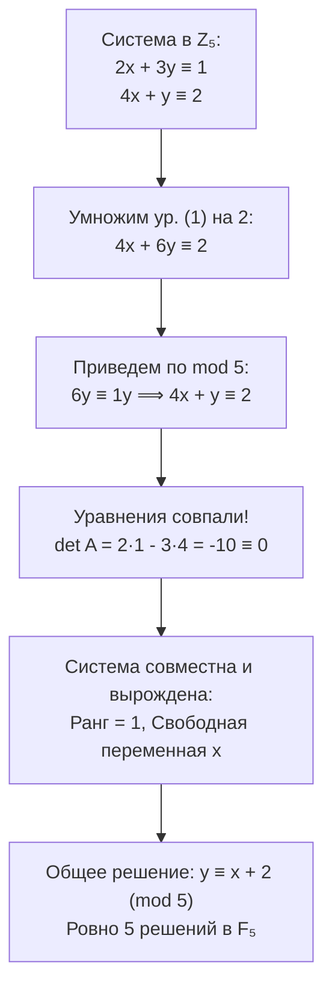
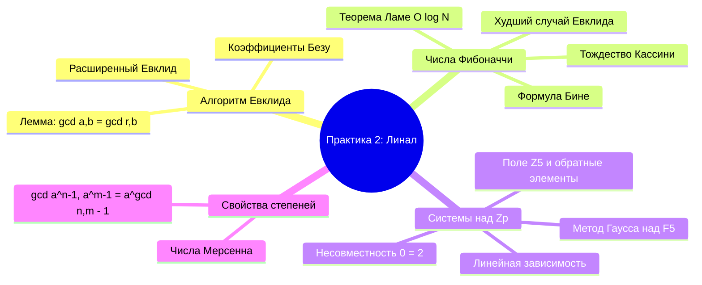

# 📝 Практика 2: Алгоритм Евклида, системы сравнений над $\mathbb{Z}_5$, числа Фибоначчи и НОД степеней

> **Дата проведения:** `2026-09-11` (2-я неделя)  
> **Предмет:** Линейная алгебра и геометрия / Алгебра-1 (1 семестр, 2026/27 уч. год)  
> **Преподаватель практики:** Зверев Константин Борисович (ИТМО)  
> **Предыдущая лекция:** [[02. Лекция - Арифметика в Z, деление с остатком, соотношение Безу и алгоритм Евклида (2026-09-10)|Лекция 2: Арифметика в ℤ, деление с остатком, НОД, соотношение Безу и алгоритм Евклида]]  
> **Предыдущая практика:** [[01. Практика - Обратимость, мощности, порядки и лемма Цорна (2026-09-04)|Практика 1: Обратимость, мощности множеств, порядки и лемма Цорна]]  
> **Хаб дисциплины:** [[Линейная алгебра]]

---

## 📌 Краткое резюме (TL;DR)

1. **Разминка и фундаментальные свойства делимости:**
   - Формула Бине: $F_n = \frac{\varphi^n - \psi^n}{\sqrt{5}}$, где $\varphi = \frac{1+\sqrt{5}}{2}$, $\psi = \frac{1-\sqrt{5}}{2}$.
   - Инвариантность НОД: $\gcd(a, b) = \gcd(a - b, b) = \gcd(a \bmod b, b)$. Для чисел Фибоначчи: $\gcd(F_n, F_{n-1}) = \gcd(F_{n-2}, F_{n-1}) = \dots = \gcd(1, 1) = 1$.
   - Теорема Ламе: число шагов алгоритма Евклида для чисел $\le N$ ограничено сверху логарифмической функцией: $k \le 1 + \log_\varphi N \approx 4.785 \log_{10} N + 1$.
2. **Системы линейных сравнений над полем вычетов $\mathbb{Z}_5$:**
   - **Задача 1 (вырожденная совместная система):** $2x + 3y \equiv 1 \pmod 5$, $4x + y \equiv 2 \pmod 5$. Второе уравнение линейно зависит от первого ($2 \times \text{ур.1} \equiv \text{ур.2}$). Общее решение: $y \equiv x + 2 \pmod 5$, система имеет ровно 5 решений в $\mathbb{F}_5$.
   - **Задача 2 (несовместная система $3 \times 3$):** система $\begin{cases} 3x + y + 2z \equiv 1 \\ x + 2y + 3z \equiv 1 \\ 4x + 3y + 2z \equiv 1 \end{cases} \pmod 5$. Метод Гаусса выявляет $0 \equiv 2 \pmod 5$ (сумма строк 2 и 3 дает $5x + 5y + 5z \equiv 0 \ne 2$). Система не имеет решений ($\operatorname{rank} A = 2 < \operatorname{rank}(A|b) = 3$).
3. **Расширенный алгоритм Евклида для чисел Фибоначчи ($89$ и $55$):**
   - Прямой ход Евклида дает 8 шагов с частными $q_i = 1$ — худший случай по теореме Ламе.
   - Обратный ход восстанавливает коэффициенты Безу: $55 \cdot 34 + 89 \cdot (-21) = 1$, где $x = 34$, $y = -21$.
   - Связь с тождеством Кассини: $F_{n-1} F_{n+1} - F_n^2 = (-1)^n$. Коэффициенты Безу для $(F_n, F_{n+1})$ суть предшествующие числа Фибоначчи $(-1)^n F_{n-1}$ и $(-1)^{n-1} F_{n-2}$.
4. **Домашнее задание: НОД экспоненциальных выражений:**
   - Доказано фундаментальное теоретико-числовое тождество:
     $$\gcd(a^n - 1, a^m - 1) = a^{\gcd(n, m)} - 1 \quad (\forall a \ge 2, \; n, m \in \mathbb{N})$$
   - Приведены два строгих доказательства: через изоморфизм шагов деления с остатком и через соотношение Безу.

---

## 🧭 Навигация по конспекту

1. [Теоретическая разминка: свойства НОД и числа Фибоначчи](#1-теоретическая-разминка-свойства-нод-и-числа-фибоначчи)
   - [Формула Бине и золотое сечение](#11-формула-бине-и-золотое-сечение)
   - [Инвариантность НОД при вычитании и делении](#12-инвариантность-нод-при-вычитании-и-делении)
   - [Логарифмическая оценка Ламе](#13-логарифмическая-оценка-ламе)
2. [Линейная алгебра над конечным полем ℤ₅](#2-линейная-алгебра-над-конечным-полем)
   - [Арифметика поля ℤ₅: обратные элементы и деление](#21-арифметика-поля-обратные-элементы-и-деление)
   - [Задача 1: Линейная зависимость и свободные переменные (2×2)](#22-задача-1-линейная-зависимость-и-свободные-переменные)
   - [Задача 2: Исследование системы 3×3 на совместность методом Гаусса](#23-задача-2-исследование-системы-на-совместность-методом-гаусса)
3. [Расширенный алгоритм Евклида и соотношение Безу для чисел Фибоначчи](#3-расширенный-алгоритм-евклида-и-соотношение-безу-для-чисел-фибоначчи)
   - [Постановка задачи для пары (89, 55)](#31-постановка-задачи-для-пары)
   - [Прямой ход алгоритма Евклида](#32-прямой-ход-алгоритма-евклида)
   - [Обратный ход: пошаговое раскручивание соотношения Безу](#33-обратный-ход-пошаговое-раскручивание-соотношения-безу)
   - [Тождество Кассини и общая формула для соседних чисел Фибоначчи](#34-тождество-кассини-и-общая-формула-для-соседних-чисел-фибоначчи)
4. [Разбор домашнего задания: вычисление gcd(2ⁿ - 1, 2ᵐ - 1)](#4-разбор-домашнего-задания-вычисление)
   - [Формулировка задачи и численный пример](#41-формулировка-задачи-и-численный-пример)
   - [Доказательство 1: Через соответствие деления с остатком в показателях](#42-доказательство-1-через-соответствие-деления-с-остатком-в-показателях)
   - [Доказательство 2: Через линейное соотношение Безу](#43-доказательство-2-через-линейное-соотношение-безу)
   - [Обобщение на любое основание a ≥ 2](#44-обобщение-на-любое-основание)
5. [Вопросы для самопроверки и тренировочные задачи](#5-вопросы-для-самопроверки-и-тренировочные-задачи)

---

## 1. Теоретическая разминка: свойства НОД и числа Фибоначчи

### 1.1. Формула Бине и золотое сечение

Последовательность чисел Фибоначчи задается рекуррентным соотношением:
$$F_0 = 0, \quad F_1 = 1, \quad F_n = F_{n-1} + F_{n-2} \quad (n \ge 2)$$

Первые члены последовательности:
$$0, 1, 1, 2, 3, 5, 8, 13, 21, 34, 55, 89, 144, \dots$$

> [!NOTE] Формула Бине
> Явное аналитическое выражение для $n$-го числа Фибоначчи:
> $$F_n = \frac{\varphi^n - \psi^n}{\sqrt{5}} = \frac{1}{\sqrt{5}} \left[ \left(\frac{1+\sqrt{5}}{2}\right)^n - \left(\frac{1-\sqrt{5}}{2}\right)^n \right]$$
> где:
> - $\varphi = \frac{1+\sqrt{5}}{2} \approx 1.6180339887\dots$ — золотое сечение (положительный корень характеристического уравнения $x^2 - x - 1 = 0$).
> - $\psi = \frac{1-\sqrt{5}}{2} = 1 - \varphi = -\frac{1}{\varphi} \approx -0.6180339887\dots$ — сопряженный корень.

Так как $|\psi| < 1$, с ростом $n$ слагаемое $\psi^n \to 0$, поэтому $F_n$ растет экспоненциально:
$$F_n = \left[ \frac{\varphi^n}{\sqrt{5}} \right] \sim \frac{\varphi^n}{\sqrt{5}}$$

---

### 1.2. Инвариантность НОД при вычитании и делении

На занятии было зафиксировано базовое свойство делимости, на котором держится весь алгоритм Евклида:

> [!THEOREM] Лемма о сохранении НОД
> Для любых $a, b \in \mathbb{Z}$:
> $$\gcd(a, b) = \gcd(a - b, b)$$
> и, более общо, для любого $q \in \mathbb{Z}$:
> $$\gcd(a, b) = \gcd(a - bq, b) = \gcd(r, b), \quad \text{где } a = bq + r$$

**Строгое доказательство:**
1. Обозначим $D(x, y)$ множество всех общих делителей чисел $x$ и $y$:
   $$D(x, y) = \{d \in \mathbb{Z} : d \mid x \;\text{ и }\; d \mid y\}$$
2. Докажем равенство множеств $D(a, b) = D(a - b, b)$:
   - Пусть $d \in D(a, b)$, то есть $d \mid a$ и $d \mid b$. По свойству линейности делимости, $d$ делит любую их целочисленную линейную комбинацию, в частности, $d \mid (a - b)$. Значит, $d \in D(a - b, b)$, то есть $D(a, b) \subseteq D(a - b, b)$.
   - Обратно: пусть $d \in D(a - b, b)$, то есть $d \mid (a - b)$ и $d \mid b$. Тогда $d$ делит их сумму: $d \mid ((a - b) + b) = a$. Значит, $d \mid a$ и $d \mid b$, то есть $d \in D(a, b)$, откуда $D(a - b, b) \subseteq D(a, b)$.
3. Поскольку множества общих делителей совпадают, то и их наибольшие элементы равны:
   $$\gcd(a, b) = \max D(a, b) = \max D(a - b, b) = \gcd(a - b, b) \quad \blacksquare$$

Применяя это свойство к соседним числам Фибоначчи:
$$\gcd(F_n, F_{n-1}) = \gcd(F_n - F_{n-1}, F_{n-1}) = \gcd(F_{n-2}, F_{n-1})$$
Спускаясь индуктивно вниз:
$$\gcd(F_n, F_{n-1}) = \gcd(F_{n-1}, F_{n-2}) = \dots = \gcd(F_2, F_1) = \gcd(1, 1) = 1$$

> [!IMPORTANT] Вывод
> Любые два последовательных числа Фибоначчи **взаимно просты**: $\gcd(F_n, F_{n-1}) = 1$ для всех $n \ge 2$.

---

### 1.3. Логарифмическая оценка Ламе

Как было отмечено на доске («*Оценка сверху — логарифм*»), наихудшим случаем для алгоритма Евклида являются именно пары соседних чисел Фибоначчи $(F_{k+2}, F_{k+1})$.

В этом случае каждое неполное частное равно $q_i = 1$, остатки убывают с минимально возможной скоростью:
$$F_{k+2} = F_{k+1} \cdot 1 + F_k$$
$$F_{k+1} = F_k \cdot 1 + F_{k-1}$$
$$\dots$$
$$F_3 = F_2 \cdot 1 + 0$$

> [!TIP] Теорема Габриэля Ламе (1844)
> Число делений $k$ в алгоритме Евклида для чисел $a > b > 0$ не превосходит:
> $$k \le 1 + \log_\varphi b = 1 + \frac{\ln b}{\ln \varphi} \approx 4.785 \log_{10} b + 1$$
> **Практическое правило:** число шагов алгоритма Евклида никогда не превышает упятеренного количества десятичных цифр меньшего числа $b$.

---

## 2. Линейная алгебра над конечным полем $\mathbb{Z}_5$

### 2.1. Арифметика поля $\mathbb{Z}_5$: обратные элементы и деление

Кольцо вычетов по простому модулю $p = 5$ является **полем** $\mathbb{F}_5 = \mathbb{Z}/5\mathbb{Z} = \{0, 1, 2, 3, 4\}$.
В нем нет делителей нуля, и каждый ненулевой элемент обратим по умножению ($a \cdot a^{-1} \equiv 1 \pmod 5$):

| Элемент $a$ | Противоположный $-a \pmod 5$ | Мультипликативно обратный $a^{-1} \pmod 5$ | Пояснение |
| :---: | :---: | :---: | :---: |
| **$0$** | $0$ | — | На нуль делить нельзя |
| **$1$** | $4$ | **$1$** | $1 \cdot 1 = 1 \equiv 1$ |
| **$2$** | $3$ | **$3$** | $2 \cdot 3 = 6 \equiv 1$ |
| **$3$** | $2$ | **$2$** | $3 \cdot 2 = 6 \equiv 1$ |
| **$4$** | $1$ | **$4$** | $4 \cdot 4 = 16 \equiv 1$ (так как $4 \equiv -1$) |

> [!NOTE] Операция «деления» в $\mathbb{F}_5$
> Деление на $c$ означает умножение на $c^{-1}$:
> - Деление на $2 \iff$ умножение на $3$: $\frac{x}{2} \equiv 3x \pmod 5$.
> - Деление на $3 \iff$ умножение на $2$: $\frac{x}{3} \equiv 2x \pmod 5$.
> - Деление на $4 \iff$ умножение на $4$ (или $-1$): $\frac{x}{4} \equiv 4x \equiv -x \pmod 5$.

---

### 2.2. Задача 1: Линейная зависимость и свободные переменные ($2 \times 2$)

#### Условие:
Решить систему линейных сравнений:
$$\begin{cases} (1) \quad 2x + 3y \equiv 1 \pmod 5 \\ (2) \quad 4x + y \equiv 2 \pmod 5 \end{cases}$$

#### Разбор ошибок из тетради и правильное решение:
В тетради студент сначала умножил уравнение (1) на 2:
$$4x + 6y \equiv 2 \pmod 5$$
И затем попытался приравнять левые части:
$$4x + y \equiv 4x + 6y \implies y \equiv 6y \implies 5y \equiv 0 \implies 0 \equiv 0$$
И написал: *«не то»*.

**В чем методический смысл этого результата?**
Это не ошибка вычислений, а проявление **линейной зависимости строк матрицы системы**:
1. Вычислим определитель матрицы системы над полем $\mathbb{F}_5$:
   $$\det A = \det \begin{pmatrix} 2 & 3 \\ 4 & 1 \end{pmatrix} = 2 \cdot 1 - 3 \cdot 4 = 2 - 12 = -10 \equiv 0 \pmod 5$$
2. Определитель равен нулю, следовательно, матрица вырождена ($\operatorname{rank} A = 1$).
3. Проверим пропорциональность уравнений:
   $$2 \cdot (\text{Уравнение 1}) = 2 \cdot (2x + 3y) = 4x + 6y \equiv 4x + y \pmod 5$$
   $$2 \cdot 1 = 2$$
   То есть Уравнение (2) в точности равно $2 \times (\text{Уравнение 1})$.
4. Второе уравнение не несет новой информации — система редуцируется к одному уравнению с двумя неизвестными:
   $$4x + y \equiv 2 \pmod 5 \iff y \equiv 2 - 4x \equiv 2 + x \pmod 5$$

#### Полный ответ:
Общее решение системы:
$$\begin{cases} x \in \mathbb{Z}_5 \\ y \equiv x + 2 \pmod 5 \end{cases}$$

В конечном поле $\mathbb{F}_5$ переменная $x$ пробегает ровно 5 значений, давая 5 вектор-решений $(x, y)$:
$$\begin{aligned}
x = 0 &\implies y \equiv 2 \implies (0, 2) \\
x = 1 &\implies y \equiv 3 \implies (1, 3) \\
x = 2 &\implies y \equiv 4 \implies (2, 4) \\
x = 3 &\implies y \equiv 0 \implies (3, 0) \\
x = 4 &\implies y \equiv 1 \implies (4, 1)
\end{aligned}$$

Над кольцом целых чисел $\mathbb{Z}$ параметрическая запись имеет вид:
$$x = t, \quad y = t + 2 + 5k \quad (t, k \in \mathbb{Z})$$

---

### 2.3. Задача 2: Исследование системы $3 \times 3$ на совместность методом Гаусса

#### Условие:
Решить систему линейных сравнений:
$$\begin{cases} (1) \quad 3x + y + 2z \equiv 1 \pmod 5 \\ (2) \quad x + 2y + 3z \equiv 1 \pmod 5 \\ (3) \quad 4x + 3y + 2z \equiv 1 \pmod 5 \end{cases}$$

#### Попытка решения в тетради (Фото 2 и 3):
1. Вычитание уравнений $(3) - (1)$:
   $$(4x + 3y + 2z) - (3x + y + 2z) \equiv 1 - 1 \pmod 5$$
   $$x + 2y \equiv 0 \implies x \equiv -2y \equiv 3y \pmod 5$$
2. Комбинация $(1) - 3 \cdot (2)$ на фото 3:
   $$(3x - 3x) + (y - 6y) + (2z - 9z) \equiv 1 - 3 \cdot 1 \pmod 5$$
   $$-5y - 7z \equiv -2 \pmod 5$$
   Так как $-5 \equiv 0 \pmod 5$, а $-7 \equiv 3 \equiv -2 \pmod 5$:
   $$-2z \equiv -2 \pmod 5 \iff 2z \equiv 2 \pmod 5 \iff z \equiv 1 \pmod 5$$

Студент получил значение $z \equiv 1 \pmod 5$, но затем зашел в тупик при определении $x$ и $y$. Почему?

#### Строгий анализ методом Гаусса:
Запишем расширенную матрицу системы над полем $\mathbb{F}_5$ и приведем ее к ступенчатому виду:
$$(A \mid b) = \begin{pmatrix}
3 & 1 & 2 & \big| & 1 \\
1 & 2 & 3 & \big| & 1 \\
4 & 3 & 2 & \big| & 1
\end{pmatrix}$$

**Шаг 1:** Переставим первую и вторую строки ($R_1 \leftrightarrow R_2$), чтобы ведущий элемент был равен 1:
$$\begin{pmatrix}
1 & 2 & 3 & \big| & 1 \\
3 & 1 & 2 & \big| & 1 \\
4 & 3 & 2 & \big| & 1
\end{pmatrix}$$

**Шаг 2:** Зануляем первый столбец под ведущей единицей:
- $R_2 \leftarrow R_2 - 3 R_1 = R_2 + 2 R_1$:
  - $3 - 3(1) = 0$
  - $1 - 3(2) = 1 - 6 = -5 \equiv 0$
  - $2 - 3(3) = 2 - 9 = -7 \equiv 3$
  - $1 - 3(1) = 1 - 3 = -2 \equiv 3$
  Получаем строку $(0, 0, 3 \mid 3)$, что соответствует $3z \equiv 3 \implies z \equiv 1 \pmod 5$.
- $R_3 \leftarrow R_3 - 4 R_1 = R_3 + R_1$:
  - $4 - 4(1) = 0$
  - $3 - 4(2) = 3 - 8 = -5 \equiv 0$
  - $2 - 4(3) = 2 - 12 = -10 \equiv 0$
  - $1 - 4(1) = 1 - 4 = -3 \equiv 2$
  Получаем строку:
  $$(0, 0, 0 \mid 2)$$

Матрица приняла вид:
$$\begin{pmatrix}
1 & 2 & 3 & \big| & 1 \\
0 & 0 & 3 & \big| & 3 \\
0 & 0 & 0 & \big| & 2
\end{pmatrix}$$

> [!CAUTION] Противоречие третьей строки
> Третья строка расширенной матрицы дает уравнение:
> $$0 \cdot x + 0 \cdot y + 0 \cdot z \equiv 2 \pmod 5 \iff 0 \equiv 2 \pmod 5$$
> Это тождественное противоречие в поле $\mathbb{F}_5$!

**Проверка без матрицы (простая линейная комбинация):**
Сложим исходные уравнения (2) и (3):
$$(x + 2y + 3z) + (4x + 3y + 2z) = 5x + 5y + 5z \equiv 0 \pmod 5$$
В то же время сумма правых частей:
$$1 + 1 = 2 \pmod 5$$
Получаем:
$$0 \equiv 2 \pmod 5 \quad \text{(ложно)}$$

#### Теоретический вывод:
> [!IMPORTANT] Теорема Кронекера — Капелли над полем $\mathbb{F}_5$
> Ранг основной матрицы коэффициентов: $\operatorname{rank}(A) = 2$.  
> Ранг расширенной матрицы: $\operatorname{rank}(A \mid b) = 3$.  
> Поскольку $\operatorname{rank}(A) \ne \operatorname{rank}(A \mid b)$, данная система линейных сравнений **несовместна (не имеет решений ни в $\mathbb{Z}_5$, ни в целых числах $\mathbb{Z}$)**.

---

## 3. Расширенный алгоритм Евклида и соотношение Безу для чисел Фибоначчи

### 3.1. Постановка задачи для пары $(89, 55)$

Даны два последовательных числа Фибоначчи:
$$a = 89 = F_{11}, \quad b = 55 = F_{10}$$
Требуется:
1. Найти $d = \gcd(89, 55)$ с помощью алгоритма Евклида.
2. Найти целые коэффициенты Безу $x, y \in \mathbb{Z}$, удовлетворяющие линейному соотношению:
   $$89x + 55y = d$$

---

### 3.2. Прямой ход алгоритма Евклида

Выполняем последовательное деление с остатком:
$$\begin{aligned}
(1) \quad 89 &= 55 \cdot 1 + 34 \quad &(r_1 = 34) \\
(2) \quad 55 &= 34 \cdot 1 + 21 \quad &(r_2 = 21) \\
(3) \quad 34 &= 21 \cdot 1 + 13 \quad &(r_3 = 13) \\
(4) \quad 21 &= 13 \cdot 1 + 8 \quad &(r_4 = 8) \\
(5) \quad 13 &= 8 \cdot 1 + 5 \quad &(r_5 = 5) \\
(6) \quad 8 &= 5 \cdot 1 + 3 \quad &(r_6 = 3) \\
(7) \quad 5 &= 3 \cdot 1 + 2 \quad &(r_7 = 2) \\
(8) \quad 3 &= 2 \cdot 1 + 1 \quad &(r_8 = 1) \\
(9) \quad 2 &= 1 \cdot 2 + 0 \quad &(r_9 = 0)
\end{aligned}$$

Последний ненулевой остаток равен $r_8 = 1$.  
Следовательно:
$$\gcd(89, 55) = 1$$

> [!NOTE] Особенность худшего случая
> Обратите внимание: все неполные частные $q_1, q_2, \dots, q_8$ вплоть до последнего шага равны **$1$**, а сами остатки пробегают последовательность Фибоначчи в обратном порядке:
> $$34, 21, 13, 8, 5, 3, 2, 1$$
> Потребовалось ровно $8$ шагов деления с ненулевым остатком.

---

### 3.3. Обратный ход: пошаговое раскручивание соотношения Безу

Начинаем с равенства (8), выражая последний остаток $1$, и последовательно подставляем предшествующие остатки:

$$\begin{aligned}
1 &= 3 - 2 \cdot 1 \\
&= 3 - (5 - 3 \cdot 1) = \mathbf{2 \cdot 3 - 1 \cdot 5} \\
&= 2(8 - 5 \cdot 1) - 5 = \mathbf{2 \cdot 8 - 3 \cdot 5} \\
&= 2 \cdot 8 - 3(13 - 8 \cdot 1) = \mathbf{5 \cdot 8 - 3 \cdot 13} \\
&= 5(21 - 13 \cdot 1) - 3 \cdot 13 = \mathbf{5 \cdot 21 - 8 \cdot 13} \\
&= 5 \cdot 21 - 8(34 - 21 \cdot 1) = \mathbf{13 \cdot 21 - 8 \cdot 34} \\
&= 13(55 - 34 \cdot 1) - 8 \cdot 34 = \mathbf{13 \cdot 55 - 21 \cdot 34} \\
&= 13 \cdot 55 - 21(89 - 55 \cdot 1) = \mathbf{34 \cdot 55 - 21 \cdot 89}
\end{aligned}$$

Приводим к стандартному виду $89x + 55y = 1$:
$$89 \cdot (-21) + 55 \cdot 34 = 1$$

#### Проверка:
$$89 \cdot (-21) = -1869$$
$$55 \cdot 34 = +1870$$
$$-1869 + 1870 = 1 \quad \checkmark$$

Коэффициенты Безу:
$$x = -21, \quad y = 34$$

---

### 3.4. Тождество Кассини и общая формула для соседних чисел Фибоначчи

Полученные коэффициенты $x = -21$ и $y = 34$ сами являются числами Фибоначчи:
$$21 = F_8, \quad 34 = F_9, \quad 55 = F_{10}, \quad 89 = F_{11}$$

Запишем полученное равенство в обозначениях Фибоначчи:
$$F_9 \cdot F_{10} - F_8 \cdot F_{11} = 1$$
Или, используя тождество $F_{11} = F_{10} + F_9$ и $F_{10} = F_9 + F_8$:
$$F_{10}^2 - F_9 F_{11} = 55^2 - 34 \cdot 89 = 3025 - 3026 = -1$$

> [!THEOREM] Тождество Жана-Доминика Кассини (1680)
> Для любого $n \ge 1$:
> $$F_{n-1} F_{n+1} - F_n^2 = (-1)^n$$

**Доказательство через определитель матрицы перехода:**
Матрица шага перехода для чисел Фибоначчи:
$$M = \begin{pmatrix} 1 & 1 \\ 1 & 0 \end{pmatrix}$$
Индукцией легко доказывается, что:
$$M^n = \begin{pmatrix} F_{n+1} & F_n \\ F_n & F_{n-1} \end{pmatrix}$$
Беря определитель от обеих частей:
$$\det(M^n) = (\det M)^n = (1 \cdot 0 - 1 \cdot 1)^n = (-1)^n$$
С другой стороны:
$$\det \begin{pmatrix} F_{n+1} & F_n \\ F_n & F_{n-1} \end{pmatrix} = F_{n+1} F_{n-1} - F_n^2$$
Откуда немедленно получаем:
$$F_{n-1} F_{n+1} - F_n^2 = (-1)^n \quad \blacksquare$$

> [!TIP] Следствие: Коэффициенты Безу для $(F_{n+1}, F_n)$
> Подставляя $F_{n+1} = F_n + F_{n-1}$ в тождество Кассини:
> $$F_{n-1}(F_n + F_{n-1}) - F_n^2 = (-1)^n \implies F_{n-1}^2 + F_{n-1} F_n - F_n^2 = (-1)^n$$
> Или, перегруппировывая относительно $F_{n+1}$ и $F_n$:
> $$(-1)^n F_{n-1} \cdot F_{n+1} + (-1)^{n-1} F_n \cdot F_n = \dots$$
> Коэффициенты Безу для любой пары соседних чисел Фибоначчи находятся мгновенно без обратного хода Евклида: они в точности равны $(-1)^{n} F_{n-1}$ и $(-1)^{n-1} F_{n-2}$!

---

## 4. Разбор домашнего задания: вычисление $\gcd(2^n - 1, 2^m - 1)$

### 4.1. Формулировка задачи и численный пример

На занятии было задано домашнее задание:
> Доказать, что для любых натуральных чисел $n, m \in \mathbb{N}$:
> $$\gcd(2^n - 1, 2^m - 1) = 2^{\gcd(n, m)} - 1$$

#### Численная иллюстрация (из конспекта на доске: $n = 6, m = 4$):
- Показатели: $n = 6$, $m = 4 \implies \gcd(6, 4) = 2$.
- Числа:
  $$2^6 - 1 = 64 - 1 = 63$$
  $$2^4 - 1 = 16 - 1 = 15$$
- Находим $\gcd(63, 15)$:
  $$63 = 15 \cdot 4 + 3$$
  $$15 = 3 \cdot 5 + 0 \implies \gcd(63, 15) = 3$$
- Проверяем формулу:
  $$2^{\gcd(6, 4)} - 1 = 2^2 - 1 = 4 - 1 = 3 \quad \checkmark$$

---

### 4.2. Доказательство 1: Через соответствие деления с остатком в показателях

Пусть $n, m \in \mathbb{N}$, без ограничения общности $n \ge m$.

**Шаг 1: Деление показателей с остатком.**  
Разделим $n$ на $m$ по теореме о делении с остатком в $\mathbb{Z}$:
$$n = mq + r, \quad 0 \le r < m$$

**Шаг 2: Алгебраическое разложение степени.**  
Преобразуем $2^n - 1$:
$$2^n - 1 = 2^{mq + r} - 1 = 2^r \cdot 2^{mq} - 1 = 2^r (2^{mq} - 1) + (2^r - 1)$$

Вспомним тождество сокращенного умножения для геометрической прогрессии при $x = 2^m$:
$$x^q - 1 = (x - 1)(x^{q-1} + x^{q-2} + \dots + x + 1)$$
Подставляя $x = 2^m$:
$$2^{mq} - 1 = (2^m - 1) \cdot \sum_{k=0}^{q-1} 2^{mk}$$
Обозначим целочисленный множитель через $Q = \sum_{k=0}^{q-1} 2^{mk} \in \mathbb{Z}$. Тогда:
$$2^n - 1 = (2^m - 1) \cdot (2^r Q) + (2^r - 1)$$

**Шаг 3: Проверка величины остатка.**  
Так как $0 \le r < m$, а функция $f(t) = 2^t - 1$ строго возрастает, то:
$$0 \le 2^r - 1 < 2^m - 1$$
Это означает, что $2^r - 1$ является **истинным остатком** от деления $2^n - 1$ на $2^m - 1$ в кольце целых чисел!

**Шаг 4: Применение леммы Евклида.**  
По фундаментальной лемме алгоритма Евклида $\gcd(A, B) = \gcd(B, A \bmod B)$:
$$\gcd(2^n - 1, 2^m - 1) = \gcd(2^m - 1, 2^r - 1) = \gcd(2^m - 1, 2^{n \bmod m} - 1)$$

**Шаг 5: Индукция по цепочке Евклида.**  
Запустим классический алгоритм Евклида для пары чисел $(n, m)$:
$$\begin{aligned}
n &= m q_1 + r_1 \implies &\gcd(2^n - 1, 2^m - 1) &= \gcd(2^m - 1, 2^{r_1} - 1) \\
m &= r_1 q_2 + r_2 \implies &\gcd(2^m - 1, 2^{r_1} - 1) &= \gcd(2^{r_1} - 1, 2^{r_2} - 1) \\
&\;\;\vdots &&\;\;\vdots \\
r_{k-2} &= r_{k-1} q_k + r_k \implies &\gcd(2^{r_{k-2}} - 1, 2^{r_{k-1}} - 1) &= \gcd(2^{r_{k-1}} - 1, 2^{r_k} - 1) \\
r_{k-1} &= r_k q_{k+1} + 0 \implies &\gcd(2^{r_{k-1}} - 1, 2^{r_k} - 1) &= \gcd(2^{r_k} - 1, 2^0 - 1) = 2^{r_k} - 1
\end{aligned}$$

Поскольку последний ненулевой остаток алгоритма Евклида для показателей равен $r_k = \gcd(n, m)$, получаем:
$$\gcd(2^n - 1, 2^m - 1) = 2^{\gcd(n, m)} - 1 \quad \blacksquare$$

---

### 4.3. Доказательство 2: Через линейное соотношение Безу

Это красивое альтернативное доказательство использует теорию идеалов и делимость:

1. Обозначим $d = \gcd(n, m)$ и $D = \gcd(2^n - 1, 2^m - 1)$.
2. Так как $d \mid n$, то $n = dk_1$, следовательно:
   $$(2^d - 1) \mid (2^{dk_1} - 1) = 2^n - 1$$
   Аналогично, так как $d \mid m$, то $(2^d - 1) \mid (2^m - 1)$.
   Значит, $2^d - 1$ является общим делителем чисел $2^n - 1$ и $2^m - 1$. По определению НОД:
   $$(2^d - 1) \mid D \implies (2^{\gcd(n, m)} - 1) \le D$$
3. По соотношению Безу для пары $(n, m)$ существуют целые $u, v \in \mathbb{Z}$ такие, что:
   $$nu + mv = d$$
   Без ограничения общности положим $u > 0$ и $v \le 0$ (так как $n, m > 0$, коэффициенты Безу имеют разные знаки). Обозначим $w = -v \ge 0$, тогда:
   $$nu - mw = d \iff nu = mw + d$$
4. Так как $D \mid (2^n - 1)$, то $D \mid (2^{nu} - 1)$.  
   Так как $D \mid (2^m - 1)$, то $D \mid (2^{mw} - 1)$.
5. Рассмотрим разность:
   $$(2^{nu} - 1) - 2^d (2^{mw} - 1) = 2^{nu} - 1 - 2^{mw + d} + 2^d$$
   Так как $nu = mw + d$, слагаемые $2^{nu}$ и $2^{mw+d}$ взаимно уничтожаются:
   $$(2^{nu} - 1) - 2^d (2^{mw} - 1) = 2^d - 1$$
6. Поскольку $D$ делит левую часть равенства (как линейную комбинацию чисел, кратных $D$), то $D$ обязано делить и правую часть:
   $$D \mid (2^d - 1) \implies D \le 2^d - 1$$
7. Из пунктов (2) и (6) следует:
   $$(2^d - 1) \mid D \quad \text{и} \quad D \mid (2^d - 1) \implies D = 2^d - 1 = 2^{\gcd(n, m)} - 1 \quad \blacksquare$$

---

### 4.4. Обобщение на любое основание $a \ge 2$

Оба приведенных доказательства дословно переносятся на произвольное натуральное основание $a \ge 2$:

> [!THEOREM] Теорема об экспоненциальном НОД
> Для любого целого $a \ge 2$ и любых натуральных $n, m \in \mathbb{N}$:
> $$\gcd(a^n - 1, a^m - 1) = a^{\gcd(n, m)} - 1$$

#### Следствия для теории чисел:
1. **Числа Мерсенна:** Числа вида $M_p = 2^p - 1$ взаимно просты тогда и только тогда, когда взаимно просты их показатели:
   $$\gcd(2^p - 1, 2^q - 1) = 2^{\gcd(p, q)} - 1 = 2^1 - 1 = 1 \quad (\text{для простых } p \ne q)$$
2. **Критерий делимости:**
   $$(a^m - 1) \mid (a^n - 1) \iff m \mid n$$

---

## 5. Вопросы для самопроверки и тренировочные задачи

### Вопросы для коллоквиума:
1. Почему в кольце вычетов $\mathbb{Z}_n$ деление возможно не всегда, а в $\mathbb{Z}_5$ возможно на любой ненулевой элемент?
2. Как геометрически интерпретировать множество решений системы $2x + 3y \equiv 1 \pmod 5$ в дискретной плоскости $\mathbb{F}_5^2$?
3. Сформулируйте теорему Кронекера — Капелли для систем над произвольным полем $\mathbb{K}$. Как она объясняет несовместность системы $3 \times 3$ из Задачи 2?
4. Почему в алгоритме Евклида для чисел Фибоначчи все неполные частные равны $1$?
5. В чем состоит тождество Кассини и как с его помощью выписать коэффициенты Безу для $(F_n, F_{n+1})$ без обратного хода Евклида?
6. Докажите, что если $2^n - 1$ — простое число (простое Мерсенна), то показатель $n$ обязан быть простым числом.

### Тренировочные упражнения:
- **Упражнение 1:** Решить систему линейных сравнений над полем $\mathbb{Z}_7$:
  $$\begin{cases} 3x + 4y \equiv 2 \pmod 7 \\ 2x + 5y \equiv 6 \pmod 7 \end{cases}$$
- **Упражнение 2:** Применяя расширенный алгоритм Евклида, найти обратный элемент к $37$ в кольце $\mathbb{Z}_{100}$ (решить сравнение $37x \equiv 1 \pmod{100}$).
- **Упражнение 3:** Найти $\gcd(3^{120} - 1, 3^{84} - 1)$.
  *(Подсказка: найдите сначала $\gcd(120, 84)$).*
