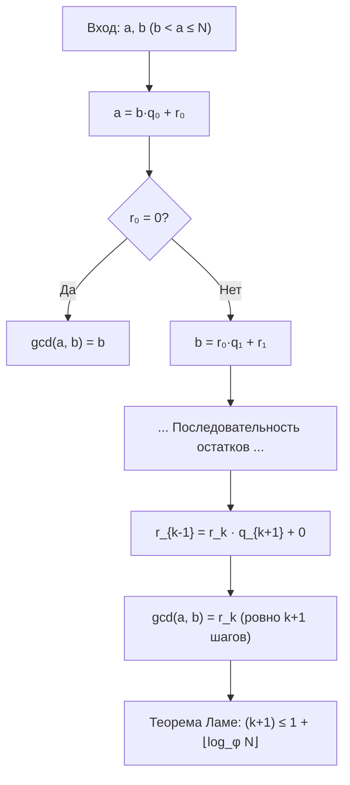
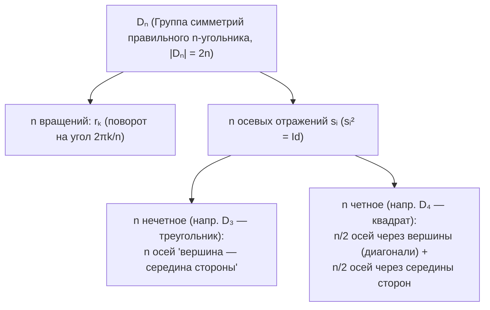

# 📐 Лекция 3: Теорема Ламе, линейные диофантовы уравнения, ОТА, КТО и введение в теорию групп

> [!abstract] О занятии
> - **Дисциплина:** [[Линейная алгебра]] (1 семестр)
> - **Дата:** 17 сентября 2026 (неделя 2, четверг, 08:10)
> - **Поток:** **Поток 2** (Software Engineering, Университет ИТМО)
> - **Ключевые темы:** Оценка числа шагов алгоритма Евклида через числа Фибоначчи (Теорема Ламе), разрешимость и общее решение линейных диофантовых уравнений $ax + by = c$, простые числа и лемма Евклида, Основная теорема арифметики (ОТА) и теорема Евклида о бесконечности простых чисел, отношение сравнения по модулю и его свойства, Китайская теорема об остатках (КТО: биективное и конструктивное доказательства), введение в абстрактную алгебру, аксиомы группы, единственность нейтрального и обратного элементов, подробная классификация 7 фундаментальных классов групп ($(\mathbb{Z}, +)$, $(\mathbb{Z}/n\mathbb{Z})^*$, $S_X$, $D_n$, $\mathbb{R}^\mathbb{N}$, $\mathrm{Fun}(\mathbb{R}, \mathbb{R})$).

---

## 1. Сложность алгоритма Евклида и теорема Ламе

Напомним, что для двух натуральных чисел $a > b > 0$ **алгоритм Евклида** последовательно производит деление с остатком:
$$a = b q_0 + r_0, \quad 0 \le r_0 < b$$
$$b = r_0 q_1 + r_1, \quad 0 \le r_1 < r_0$$
$$r_0 = r_1 q_2 + r_2, \quad 0 \le r_2 < r_1$$
$$\dots$$
$$r_{k-2} = r_{k-1} q_k + r_k, \quad 0 \le r_k < r_{k-1}$$
$$r_{k-1} = r_k q_{k+1} + r_{k+1}, \quad r_{k+1} = 0$$

Последний ненулевой остаток $r_k$ равен наибольшему общему делителю: $r_k = \gcd(a, b)$. Всего алгоритм совершает $(k + 1)$ шагов деления с остатком.



> [!theorem] Теорема Ламе (Gabriel Lamé, 1844)
> Пусть $b < a \le N$, где $a, b \in \mathbb{N}$. Тогда число шагов $(k + 1)$ в алгоритме Евклида ограничено сверху:
> $$(k + 1) \le 1 + \lfloor \log_\varphi N \rfloor$$
> где $\varphi = \frac{1 + \sqrt{5}}{2} \approx 1.6180339...$ — золотое сечение (положительный корень характеристического уравнения $\varphi^2 - \varphi - 1 = 0$).

> [!proof] Доказательство через числа Фибоначчи (по доске лекции)
> Напомним последовательность Фибоначчи: $F_0 = 0, F_1 = 1, F_2 = 1, F_3 = 2, F_4 = 3, F_5 = 5, \dots$, задаваемую рекуррентным соотношением $F_n = F_{n-1} + F_{n-2}$ при $n \ge 2$.
> 
> Положим $a = r_{-1}$ и $b = r_0$, а последний ненулевой остаток $r_k = \gcd(a, b) > r_{k+1} = 0$.
> Докажем по индукции, что для всех $i \ge 0$:
> $$r_{k+1-i} \ge F_i$$
> 
> **База индукции:**
> 1. При $i = 0$: $r_{k+1} = 0 \ge F_0 = 0$.
> 2. При $i = 1$: последний ненулевой остаток $r_k \in \mathbb{N} \implies r_k \ge 1 = F_1$.
> 
> **Индукционный переход:**
> Предположим, что утверждение верно для всех значений до $i$ включительно ($r_{k+1-i} \ge F_i$ и $r_{k+1-(i-1)} \ge F_{i-1}$).
> На соответствующем шаге алгоритма Евклида имеем:
> $$r_{k-i} = q_{k-i+2} \cdot r_{k-i+1} + r_{k-i+2}$$
> Заметим, что $r_{k-i} = r_{k+1-(i+1)}$, $r_{k-i+1} = r_{k+1-i}$, $r_{k-i+2} = r_{k+1-(i-1)}$.  
> Так как все неполные частные $q_j \ge 1$, получаем:
> $$r_{k+1-(i+1)} \ge 1 \cdot r_{k+1-i} + r_{k+1-(i-1)} \ge F_i + F_{i-1} = F_{i+1}$$
> Индукционный переход доказан для всех $i \ge 0$!
> 
> **Оценка числа шагов:**
> Подставим $i = k+2$, что соответствует числу $a = r_{-1} = r_{k+1-(k+2)}$:
> $$N \ge a \ge F_{k+2}$$
> Из свойств чисел Фибоначчи (золотого сечения $\varphi = \frac{1+\sqrt{5}}{2}$):
> $$F_{k+2} > \varphi^k$$
> *(Действительно: $F_2 = 1 = \varphi^0$, $F_3 = 2 > \varphi^1 \approx 1.618$, $F_4 = 3 > \varphi^2 \approx 2.618$, и по индукции $F_{n+2} > \varphi^n$)*.
> 
> Логарифмируя обе части неравенства $N > \varphi^k$ по основанию $\varphi$:
> $$\log_\varphi N > k \implies k \le \lfloor \log_\varphi N \rfloor$$
> Так как всего алгоритм делает $(k + 1)$ шагов деления:
> $$(k + 1) \le 1 + \lfloor \log_\varphi N \rfloor \quad \blacksquare$$

> [!tip] Худший случай для алгоритма Евклида
> Худшим случаем (максимальное число шагов при заданном размере чисел) для алгоритма Евклида являются **два последовательных числа Фибоначчи**: $a = F_{n+1}, b = F_n$.  
> Для них все неполные частные $q_i = 1$, и число шагов в точности равно $n-1 = \Theta(\log N)$. Таким образом, алгоритм Евклида работает за **логарифмическое время** $O(\log(\min(a, b)))$.

> [!important] Критерий взаимной простоты
> Целые числа $a$ и $b$ взаимно просты ($\gcd(a, b) = 1$) тогда и только тогда, когда существуют $s, t \in \mathbb{Z}$ такие, что:
> $$a s + b t = 1 \quad \text{(Тождество Безу)}$$

---

## 2. Линейные диофантовы уравнения

**Линейным диофантовым уравнением от двух переменных** называется уравнение вида:
$$a x + b y = c, \quad a, b, c \in \mathbb{Z}$$
где неизвестные $x, y$ ищутся строго во множестве целых чисел $\mathbb{Z}$.

### 2.1. Анализ граничных случаев
1. **$a = 0, b = 0$:**
   - Если $c = 0$, то решением является любая пара $(x, y) \in \mathbb{Z}^2$.
   - Если $c \ne 0$, решений в $\mathbb{Z}$ нет ($\varnothing$).
2. **$a = 0, b \ne 0$ (или $a \ne 0, b = 0$):**
   - Уравнение сводится к $b y = c$. Разрешимо $\iff c \ \vdots \ b$. Тогда $y = c/b$, а $x \in \mathbb{Z}$ произвольно.

---

### 2.2. Содержательный случай: $a \ne 0, b \ne 0$

> [!theorem] Критерий разрешимости диофантова уравнения
> Уравнение $ax + by = c$ разрешимо в целых числах $\mathbb{Z}$ тогда и только тогда, когда:
> $$\gcd(a, b) \mid c$$

> [!proof] Доказательство
> $(\implies)$ Пусть пара $(x_*, y_*) \in \mathbb{Z}^2$ — решение, то есть $a x_* + b y_* = c$.  
> По определению делителя, $\gcd(a, b) \mid a$ и $\gcd(a, b) \mid b$.  
> Следовательно, $\gcd(a, b)$ делит любую линейную комбинацию: $\gcd(a, b) \mid (a x_* + b y_*) = c$.
> 
> $(\impliedby)$ Пусть $\gcd(a, b) \mid c$, то есть $c = c' \cdot \gcd(a, b)$, где $c' \in \mathbb{Z}$.  
> По тождеству Безу существуют целые числа $s_0, t_0 \in \mathbb{Z}$ такие, что:
> $$a s_0 + b t_0 = \gcd(a, b)$$
> Умножим обе части равенства на $c'$:
> $$a (s_0 \cdot c') + b (t_0 \cdot c') = \gcd(a, b) \cdot c' = c$$
> Положив $x_0 = s_0 \cdot c'$ и $y_0 = t_0 \cdot c'$, получаем частное решение $(x_0, y_0) \in \mathbb{Z}^2$. $\blacksquare$

---

### 2.3. Метод нахождения общего решения

1. Вычисляем $d = \gcd(a, b)$ с помощью алгоритма Евклида.
2. Проверяем условие $c \ \vdots \ d$. Если $c \not\vdots \ d$, решений нет.
3. Делим обе части уравнения на $d$:
   $$a' x + b' y = c', \quad \text{где } a' = \frac{a}{d}, \ b' = \frac{b}{d}, \ c' = \frac{c}{d}, \ \gcd(a', b') = 1$$
4. С помощью расширенного алгоритма Евклида находим коэффициенты Безу $s_0, t_0 \in \mathbb{Z}$:
   $$a' s_0 + b' t_0 = 1$$
5. Частное решение приведенного уравнения:
   $$x_0 = s_0 \cdot c', \quad y_0 = t_0 \cdot c'$$
6. **Теорема об общем решении:**
   Пусть $(x_0, y_0)$ — частное решение. Если $(x, y)$ — любое другое решение, то:
   $$a' x + b' y = c' \quad \text{и} \quad a' x_0 + b' y_0 = c'$$
   Вычитая равенства:
   $$a' (x - x_0) + b' (y - y_0) = 0 \iff a' (x - x_0) = b' (y_0 - y)$$
   Поскольку $\gcd(a', b') = 1$, по лемме Евклида $b' \mid a'(x - x_0) \implies b' \mid (x - x_0)$.  
   Значит, существует $u \in \mathbb{Z}$ такое, что:
   $$x - x_0 = b' u \implies x = x_0 + b' u$$
   Подставляя в исходное равенство:
   $$a' (b' u) = b' (y_0 - y) \implies y_0 - y = a' u \implies y = y_0 - a' u$$

> [!important] Формула общего решения в $\mathbb{Z}$
> $$\begin{cases} x = x_0 + \dfrac{b}{\gcd(a, b)} \cdot u \\ y = y_0 - \dfrac{a}{\gcd(a, b)} \cdot u \end{cases}, \quad u \in \mathbb{Z}$$

> [!example] Практический пример решения
> Решить в целых числах: $61x + 24y = 7$.
> 
> 1. Вычисляем $\gcd(61, 24)$:
>    - $61 = 24 \cdot 2 + 13$
>    - $24 = 13 \cdot 1 + 11$
>    - $13 = 11 \cdot 1 + 2$
>    - $11 = 2 \cdot 5 + 1$
>    - $2 = 1 \cdot 2 + 0 \implies \gcd(61, 24) = 1$.
> 2. $\gcd(61, 24) = 1 \mid 7 \implies$ уравнение разрешимо.
> 3. Раскручиваем остатки (обратный ход Безу):
>    $$1 = 11 - 2 \cdot 5 = 11 - (13 - 11) \cdot 5 = 6 \cdot 11 - 5 \cdot 13$$
>    $$= 6 \cdot (24 - 13) - 5 \cdot 13 = 6 \cdot 24 - 11 \cdot 13$$
>    $$= 6 \cdot 24 - 11 \cdot (61 - 24 \cdot 2) = 28 \cdot 24 - 11 \cdot 61$$
>    То есть $61 \cdot (-11) + 24 \cdot (28) = 1$.
> 4. Умножаем на $c = 7$:
>    $$x_0 = -11 \cdot 7 = -77, \quad y_0 = 28 \cdot 7 = 196$$
> 5. Общее решение:
>    $$\begin{cases} x = -77 + 24 u \\ y = 196 - 61 u \end{cases}, \quad u \in \mathbb{Z}$$
>    *(При $u = 3$: $x = -77 + 72 = -5, y = 196 - 183 = 13 \implies 61(-5) + 24(13) = -305 + 312 = 7$).*

---

## 3. Простые числа и Основная теорема арифметики (ОТА)

> [!info] Определение
> Число $p \in \mathbb{N}, p \ge 2$ называется **простым**, если множество его натуральных делителей состоит ровно из двух элементов: $\{1, p\}$.  
> Число $n \ge 2$, не являющееся простым, называется **составным**.

> [!theorem] Лемма Евклида
> Пусть $p \ge 2$ — целое число. Тогда:
> $$p \text{ — простое} \iff \Big( \forall a, b \in \mathbb{Z}: p \mid ab \implies (p \mid a \lor p \mid b) \Big)$$

> [!proof] Доказательство
> $(\implies)$ Пусть $p$ — простое, и $p \mid ab$.  
> Рассмотрим $\gcd(a, p)$. Так как делители $p$ — только $1$ и $p$, то $\gcd(a, p)$ равен либо $p$, либо $1$.
> - Если $\gcd(a, p) = p \implies p \mid a$, утверждение доказано.
> - Если $\gcd(a, p) = 1$, то по тождеству Безу существуют $s, t \in \mathbb{Z}: as + pt = 1$.
>   Умножим на $b$: $a b s + p b t = b$.  
>   Так как $p \mid ab$, левая часть делится на $p$, значит, $p \mid b$.
> 
> $(\impliedby)$ Докажем от противного. Предположим, что $p$ не является простым, то есть составное.  
> Тогда $p = n \cdot m$, где $1 < n < p$ и $1 < m < p$.  
> Тогда $p \mid (n \cdot m)$, но по условию $n < p \implies p \nmid n$ и $m < p \implies p \nmid m$.  
> Получили противоречие с посылкой леммы. Следовательно, $p$ обязано быть простым. $\blacksquare$

---

### 3.1. Основная теорема арифметики

> [!theorem] Основная теорема арифметики (ОТА)
> Любое целое число $n \in \mathbb{Z} \setminus \{0, \pm 1\}$ может быть представлено в виде произведения простых чисел:
> $$n = \varepsilon \cdot p_1 \cdot p_2 \dots p_k$$
> где $\varepsilon = \pm 1$, а $p_1, \dots, p_k$ — простые числа.  
> Более того, такое представление **единственно** с точностью до порядка следования сомножителей.

> [!proof] Доказательство
> **1. Существование (по индукции по $n \in \mathbb{N}_{\ge 2}$):**
> - *База:* $n = 2$ — простое число, разложение $2 = 2$ тривиально существует.
> - *Переход:* Пусть для всех $k < n$ разложение существует. Рассмотрим $n$.
>   - Если $n$ простое — разложение построено.
>   - Если $n$ составное — то $n = n_1 \cdot n_2$, где $1 < n_1, n_2 < n$. По предположению индукции $n_1 = p_1 \dots p_m$ и $n_2 = r_1 \dots r_s$. Тогда $n = p_1 \dots p_m r_1 \dots r_s$ — искомое разложение для $n$.
> 
> **2. Единственность (по индукции по числу сомножителей):**
> Пусть $n$ имеет два разложения:
> $$n = p_1 p_2 \dots p_k = q_1 q_2 \dots q_m$$
> Число $q_1$ делит произведение $p_1 \dots p_k$. По лемме Евклида $q_1$ обязано делить хотя бы один сомножитель $p_i$.  
> Так как порядок множителей не важен, перенумеруем $p_i$ так, чтобы $q_1 \mid p_1$.  
> Но $p_1$ простое, а $q_1 > 1 \implies q_1 = p_1$.  
> Разделим обе части равенства на $p_1 = q_1$:
> $$p_2 \dots p_k = q_2 \dots q_m$$
> По предположению индукции (для меньшего числа сомножителей) $k - 1 = m - 1 \implies k = m$, и множества простых сомножителей $\{p_2, \dots, p_k\}$ и $\{q_2, \dots, q_m\}$ совпадают. $\blacksquare$

> [!info] Канонический вид разложения
> Группируя одинаковые простые множители, любое целое $n \ne 0$ однозначно записывается как:
> $$n = \varepsilon \cdot p_1^{\alpha_1} p_2^{\alpha_2} \dots p_l^{\alpha_l}, \quad \varepsilon = \pm 1, \ \alpha_i \in \mathbb{N}, \ p_1 < p_2 < \dots < p_l$$

---

### 3.2. Бесконечность множества простых чисел

> [!corollary] Следствие Евклида: Бесконечность множества простых чисел
> Множество простых чисел бесконечно.

> [!proof] Доказательство от противного (по доске лекции)
> Предположим противное: простых чисел конечное число, запишем их полный список:
> $$\mathbb{P} = \{p_1, p_2, \dots, p_s\}$$
> Рассмотрим целое число:
> $$N = p_1 \cdot p_2 \dots p_s + 1$$
> Так как $N > 1$, по Основной теореме арифметики у числа $N$ обязан существовать хотя бы один простой делитель $p$.  
> При этом $p \ne p_i$ для всех $1 \le i \le s$, так как при делении $N$ на любое $p_i$ остаток равен $1 \ne 0$ ($N \equiv 1 \pmod{p_i}$).  
> Следовательно, $p$ — простое число, не входящее в исходный конечный набор $\{p_1, \dots, p_s\}$.  
> Полученное противоречие доказывает, что множество простых чисел бесконечно. $\blacksquare$

---

## 4. Теория сравнений по модулю

> [!info] Определение
> Пусть $n \in \mathbb{N}, a, b \in \mathbb{Z}$. Говорят, что $a$ **сравнимо с $b$ по модулю $n$**, если их разность делится на $n$:
> $$a \equiv b \pmod n \overset{\text{def}}{\iff} (a - b) \ \vdots \ n$$

### Свойства отношения сравнения:
1. **Эквивалентность:** Отношение $\equiv \pmod n$ является отношением эквивалентности на $\mathbb{Z}$:
   - *Рефлексивность:* $a - a = 0 = 0 \cdot n \implies a \equiv a \pmod n$.
   - *Симметричность:* $(a - b) \ \vdots \ n \iff (b - a) \ \vdots \ n$.
   - *Транзитивность:* $(a - b) \ \vdots \ n \land (b - c) \ \vdots \ n \implies (a - c) = (a - b) + (b - c) \ \vdots \ n$.
2. **Арифметика сравнений:** Если $a_1 \equiv a_2 \pmod n$ и $b_1 \equiv b_2 \pmod n$, то:
   $$a_1 + b_1 \equiv a_2 + b_2 \pmod n$$
   $$a_1 \cdot b_1 \equiv a_2 \cdot b_2 \pmod n$$
3. **Правило сокращения:**
   $$a c \equiv b c \pmod n \iff a \equiv b \pmod{\frac{n}{\gcd(c, n)}}$$
   В частности, если $\gcd(c, n) = 1$, то на $c$ **можно сокращать обе части сравнения**:
   $$a c \equiv b c \pmod n \implies a \equiv b \pmod n$$

---

## 5. Китайская теорема об остатках (КТО)

Рассмотрим систему линейных сравнений с разными модулями:
$$\begin{cases} x \equiv a_1 \pmod n \\ x \equiv a_2 \pmod m \end{cases}$$

> [!theorem] Китайская теорема об остатках (CRT)
> Пусть $m, n \in \mathbb{N}$ — взаимно простые числа ($\gcd(m, n) = 1$).  
> Тогда для любых целых $a_1, a_2 \in \mathbb{Z}$ система сравнений имеет **единственное решение по модулю $m \cdot n$** (то есть существует единственное $x \in \{0, 1, \dots, mn-1\}$).

```mermaid
graph LR
    Zmn["ℤ_{mn} = {0, ..., mn-1}"] -->|f - биекция| Prod["ℤ_n × ℤ_m"]
    Prod -->|f(x) = (x mod n, x mod m)| Pair["(a₁, a₂)"]
    Pair -->|x = a₂nt + a₁ms (mod mn)| Zmn
```

> [!proof] Доказательство 1 (Теоретико-множественное через биекцию)
> Рассмотрим отображение между конечными множествами:
> $$f: \{0, 1, \dots, mn - 1\} \to \{0, 1, \dots, n - 1\} \times \{0, 1, \dots, m - 1\}$$
> задаваемое правилом: $f(a) = (a \bmod n, \ a \bmod m)$.
> 
> 1. **Инъективность:**
>    Пусть $y, z \in \{0, \dots, mn - 1\}$ таковы, что $f(y) = f(z)$.  
>    Это означает, что $y \equiv z \pmod n$ и $y \equiv z \pmod m$, то есть:
>    $$(y - z) \ \vdots \ n \quad \text{и} \quad (y - z) \ \vdots \ m$$
>    Так как $\gcd(m, n) = 1$, то наименьшее общее кратное $\operatorname{lcm}(m, n) = m n$.  
>    Следовательно, $(y - z) \ \vdots \ mn$.  
>    Но $y, z \in \{0, \dots, mn - 1\} \implies |y - z| < mn$, откуда следует $y - z = 0 \implies y = z$.  
>    Инъективность доказана!
> 
> 2. **Сюръективность:**
>    Мощность области определения равна $mn$.  
>    Мощность декартова произведения областей значений также равна $n \cdot m = mn$.  
>    Любая инъекция между конечными множествами одинаковой мощности автоматически является **биекцией** (сюръекцией).  
>    Значит, для любой пары остатков $(a_1, a_2)$ существует единственный прообраз $x \in \{0, \dots, mn - 1\}$. $\blacksquare$

> [!proof] Доказательство 2 (Конструктивное через тождество Безу)
> Так как $\gcd(m, n) = 1$, по тождеству Безу существуют целые числа $s, t \in \mathbb{Z}$ такие, что:
> $$m s + n t = 1$$
> 
> Положим:
> $$x = a_1 m s + a_2 n t$$
> 
> Проверим оба сравнения:
> 1. По модулю $n$: так как $n t \equiv 0 \pmod n$ и $m s = 1 - n t \equiv 1 \pmod n$, имеем:
>    $$x = a_1 (m s) + a_2 (n t) \equiv a_1 \cdot 1 + a_2 \cdot 0 \equiv a_1 \pmod n$$
> 2. По модулю $m$: аналогично, $m s \equiv 0 \pmod m$ и $n t = 1 - m s \equiv 1 \pmod m$, поэтому:
>    $$x = a_1 (m s) + a_2 (n t) \equiv a_1 \cdot 0 + a_2 \cdot 1 \equiv a_2 \pmod m$$
> 
> Таким образом, решение $x$ явно построено!  
> Единственность: если $x_1, x_2$ — два решения, то $(x_1 - x_2) \ \vdots \ n$ и $(x_1 - x_2) \ \vdots \ m \implies (x_1 - x_2) \ \vdots \ mn \implies x_1 \equiv x_2 \pmod{mn}$. $\blacksquare$

---

## 6. Введение в абстрактную алгебру: Теория групп

### 6.1. Понятие операции
Пусть $X$ — произвольное непустое множество.
- $n$-арной алгебраической операцией на $X$ называется отображение:
  $$\omega: \underbrace{X \times X \times \dots \times X}_{n} \to X$$
- При $n = 2$ операция называется **бинарной**: $\cdot : X \times X \to X$, сопоставляющей паре $(x, y)$ элемент $x \cdot y \in X$.

---

### 6.2. Аксиомы группы

> [!info] Определение группы
> Множество $G$ с заданной бинарной операцией $\cdot : G \times G \to G$ называется **группой** $(G, \cdot)$, если выполнены следующие три аксиомы:
> 
> 1. **Ассоциативность:**
>    $$\forall g, h, f \in G : (g \cdot h) \cdot f = g \cdot (h \cdot f)$$
> 2. **Существование нейтрального элемента:**
>    $$\exists e \in G \ \forall g \in G : g \cdot e = e \cdot g = g$$
> 3. **Существование обратного элемента:**
>    $$\forall g \in G \ \exists g^{-1} \in G : g \cdot g^{-1} = g^{-1} \cdot g = e$$

Если дополнительно выполнена **аксиома коммутативности**:
$$\forall g, h \in G : g \cdot h = h \cdot g$$
то группа называется **коммутативной** (или **абелевой**).

---

### 6.3. Фундаментальные теоремы о нейтральном и обратном элементах

> [!theorem] Единственность нейтрального элемента (Замечание 1 с доски)
> В любой группе $(G, \cdot)$ нейтральный элемент $e$ единственен.

> [!proof] Доказательство
> Предположим, что существуют два нейтральных элемента $e_1, e_2 \in G$.  
> Так как $e_1$ — нейтральный: $e_1 \cdot e_2 = e_2$.  
> Так как $e_2$ — нейтральный: $e_1 \cdot e_2 = e_1$.  
> Следовательно:
> $$e_1 = e_1 \cdot e_2 = e_2 \quad \blacksquare$$

> [!theorem] Единственность обратного элемента (Замечание 2 с доски)
> Для каждого элемента $g \in G$ обратный элемент $g^{-1}$ единственен.

> [!proof] Доказательство
> Пусть $g^{-1}$ и $\tilde{g}^{-1}$ — два обратных к элементу $g$, то есть $g \cdot g^{-1} = g^{-1} \cdot g = e$ и $g \cdot \tilde{g}^{-1} = \tilde{g}^{-1} \cdot g = e$.  
> Воспользуемся ассоциативностью операции:
> $$\tilde{g}^{-1} = (g^{-1} \cdot g) \cdot \tilde{g}^{-1} = g^{-1} \cdot (g \cdot \tilde{g}^{-1}) = g^{-1} \cdot e = g^{-1}$$
> Значит, $\tilde{g}^{-1} = g^{-1}$. $\blacksquare$

> [!tip] Обратный к произведению
> Для любых $g, h \in G$:
> $$(g \cdot h)^{-1} = h^{-1} \cdot g^{-1}$$
> *(Порядок сомножителей обращается!)*

---

### 6.4. Разбор фундаментальных классов групп с доски лекции

| № | Обозначение | Носитель и операция | Нейтральный элемент $e$ | Обратный элемент $g^{-1}$ | Свойства |
| :-: | :--- | :--- | :-: | :-: | :--- |
| **0** | **Тривиальная** | $G = \{e\}$, операция $e \cdot e = e$ | $e$ | $e^{-1} = e$ | Абелева, порядок $\|G\| = 1$ |
| **1** | **Аддитивные числовые** | $(\mathbb{Z}, +), (\mathbb{Q}, +), (\mathbb{R}, +)$ и $(\mathbb{Z}/n\mathbb{Z}, +)$ | $0$ | $-g$ | Бесконечные (или порядка $n$), абелевы. $(\mathbb{Z}/n, +)$ — фактор-множество по отношению $\equiv \pmod n$ |
| **2** | **Мультипликативные** | $(\{\pm 1\}, \cdot), (\mathbb{Q} \setminus \{0\}, \cdot), (\mathbb{R} \setminus \{0\}, \cdot)$ и $((\mathbb{Z}/n\mathbb{Z})^\times, \cdot)$ | $1$ | $1/g$ (или $g^{-1} \bmod n$) | $((\mathbb{Z}/n)^\times)$ — множество обратимых вычетов, порядок $\varphi(n)$ |
| **3** | **Симметрическая группа** | $S_X = \{f: X \to X \mid f \text{ — биекция}\}$, операция $\circ$ | $\mathrm{Id}_X$ | $f^{-1}$ (обратное отображение) | **Неабелева** при $\|X\| \ge 3$; при $\|X\| = n$ порядок $\|S_n\| = n!$ |
| **4** | **Диэдральная группа** | $D_n$ — группа симметрий правильного $n$-угольника, операция $\circ$ | Поворот на $0^\circ$ | Обратный поворот / то же отражение | **Неабелева** при $n \ge 3$, порядок $\|D_n\| = 2n$ ($n$ поворотов, $n$ отражений) |
| **5** | **Последовательности** | $\mathbb{R}^\mathbb{N} = \{(x_n)_{n \in \mathbb{N}} \mid x_n \in \mathbb{R}\}$, покомпонентный $+$ | Последовательность $(0, 0, \dots)$ | $(-x_n)_{n \in \mathbb{N}}$ | Бесконечномерная абелева группа |
| **6** | **Функциональная группа** | $(\mathrm{Fun}(\mathbb{R}, \mathbb{R}), +)$, $(f + g)(x) = f(x) + g(x)$ | Тождественный ноль $\mathbf{0}(x) \equiv 0$ | Функция $-f$ | Абелева группа над полем $\mathbb{R}$ |

---

### Детальный разбор ключевых примеров с доски:

#### 1. Группа обратимых вычетов $((\mathbb{Z}/n\mathbb{Z})^\times, \cdot)$
> [!info] Определение обратимого элемента по модулю $n$ (с доски)
> Элемент $a \in \mathbb{Z}/n\mathbb{Z}$ называется **обратимым**, если существует $a^{-1} \in \mathbb{Z}/n\mathbb{Z}$ такой, что:
> $$a \cdot a^{-1} \equiv a^{-1} \cdot a \equiv 1 \pmod n$$
- По критерию Безу $a \cdot s + n \cdot t = 1 \iff \gcd(a, n) = 1$.  
- Следовательно, множество обратимых элементов состоит в точности из вычетов, взаимно простых с модулем:
  $$(\mathbb{Z}/n\mathbb{Z})^\times = \{a \in \mathbb{Z}/n\mathbb{Z} \mid \gcd(a, n) = 1\}$$
- Порядок группы равен значению функции Эйлера: $|(\mathbb{Z}/n\mathbb{Z})^\times| = \varphi(n)$.

#### 2. Диэдральная группа $D_n$ (геометрия симметрий)
Группа $D_n$ представляет собой группу всех самосовмещений (движений) плоскости, переводящих правильный $n$-угольник в себя.  
Операция — композиция движений плоскости ($\circ$). Порядок группы равен $|D_n| = 2n$.

Она порождается двумя типами движений:
1. **$n$ поворотов:** $r_k = r_\alpha^k$ на углы $\alpha = \frac{2\pi k}{n}$ для $k = 0, 1, \dots, n-1$ вокруг центра многоугольника ($r_0 = \mathrm{Id}$).
2. **$n$ осевых отражений $s_i$ (зеркальных симметрий):**
   - **При нечетном $n$ (например, $D_3$ для правильного треугольника):**  
     Все $n$ осей симметрии проходят через одну из вершин и середину противоположной стороны.
   - **При четном $n$ (например, $D_4$ для квадрата):**  
     Оси симметрии делятся на два типа:
     - $\frac{n}{2}$ осей проходят через противоположные вершины (диагонали квадрата);
     - $\frac{n}{2}$ осей проходят через середины противоположных сторон (срединные перпендикуляры).



#### 3. Пространство последовательностей $\mathbb{R}^\mathbb{N}$
- Носитель: множество всех вещественных последовательностей $x = (x_1, x_2, \dots, x_k, \dots) \in \mathbb{R}^\mathbb{N}$.
- Операция: покомпонентное сложение последовательностей:
  $$(x_n) + (y_n) = (x_1 + y_1, x_2 + y_2, \dots, x_k + y_k, \dots)$$
- Нейтральный элемент: стационарная нулевая последовательность $\mathbf{0} = (0, 0, \dots)$.
- Обратный элемент: $(-x_n) = (-x_1, -x_2, \dots)$.
- Свойства: ассоциативность и коммутативность наследуются из поля $\mathbb{R}$, образуя бесконечномерную аддитивную абелеву группу.

---

## 🔗 Связанные материалы
- ⬅️ [[02. Лекция - Арифметика в Z, деление с остатком, соотношение Безу и алгоритм Евклида (2026-09-10)|Лекция 2: Арифметика в Z, алгоритм Евклида и Безу]]
- 📐 [[Линейная алгебра]] — главный хаб дисциплины
- 🎯 [[Экзаменационный трекер и банк тем I семестра]] — вопросы 1–5 (алгебраические структуры и числа)
- 🔢 [[Конспекты/1 семестр/Поток 2/Дискретная математика/01. Лекция - Высказывания, связки, таблицы истинности, законы логики и следствие (2026-09-09)|Дискретная математика: Логика и отношения]]
- 🏠 [[README|Главная страница базы знаний]]
