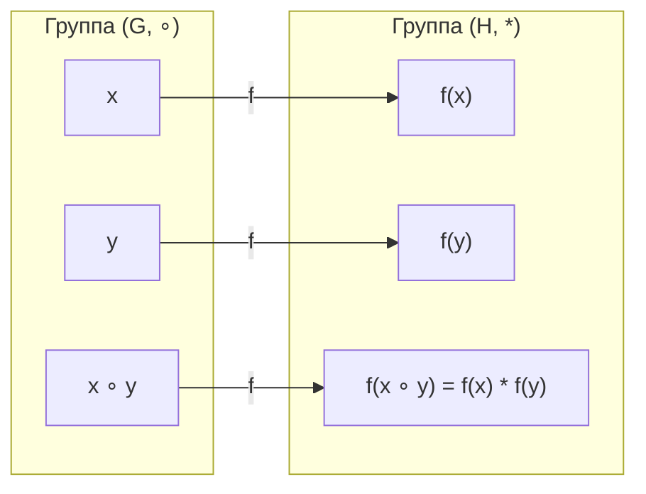
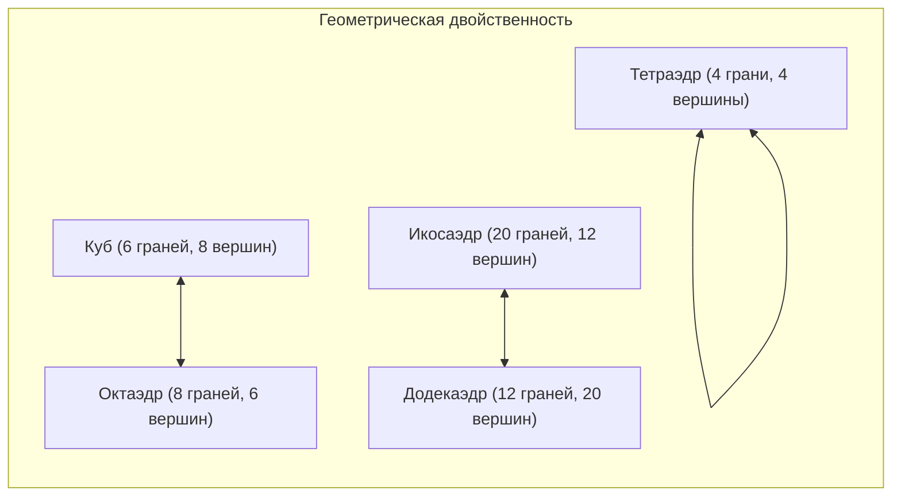
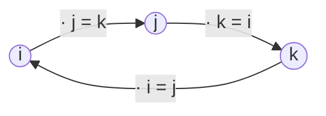

# 📝 Практика 3: Группы, гомоморфизмы, группа диэдра $D_3$, подгруппы правильных многогранников и кольца вычетов

> **Дата проведения:** `2026-09-18` (3-я неделя, пятница, сдвоенная пара практики: `11:30 — 15:00`)  
> **Предмет:** [[Линейная алгебра]] (1 семестр, Software Engineering, Поток 2)  
> **Преподаватель практики:** Цветков Константин Борисович (ИТМО)  
> **Предыдущая лекция:** [[03. Лекция - Теорема Ламе, диофантовы уравнения, ОТА, КТО и группы (2026-09-17)|Лекция 3: Теорема Ламе, диофантовы уравнения, ОТА, КТО и группы]]  
> **Предыдущая практика:** [[02. Практика - Алгоритм Евклида, системы сравнений над Z5, числа Фибоначчи (2026-09-11)|Практика 2: Алгоритм Евклида, системы сравнений над ℤ₅, числа Фибоначчи]]  
> **Хаб дисциплины:** [[Линейная алгебра]]

---

## 📌 Краткое резюме (TL;DR)

1. **Аксиоматика группы и базовые доказательства:**
   - Группа $(G, \circ)$ — множество с ассоциативной бинарной операцией, нейтральным элементом $e$ и обратимостью каждого элемента: $\forall x \in G \; \exists x^{-1}: x x^{-1} = e = x^{-1} x$.
   - **Единственность нейтрального элемента:** если есть два нейтральных $e_1, e_2$, то $e_1 = e_1 e_2 = e_2$.
   - **Единственность обратного элемента:** если $y_1, y_2$ обратны к $x$, то $y_1 = y_1 e = y_1 (x y_2) = (y_1 x) y_2 = e y_2 = y_2$.
   - Если дополнительно выполняется коммутативность $xy = yx$, группа называется **абелевой**.
2. **Гомоморфизмы и изоморфизмы:**
   - Отображение $f: (G, \circ) \to (H, *)$ называется гомоморфизмом, если $f(x \circ y) = f(x) * f(y)$.
   - **Изоморфизм** — биективный (обратимый) гомоморфизм ($G \cong H$).
   - Фундаментальный непрерывный пример: $\exp: (\mathbb{R}, +) \xrightarrow{\sim} (\mathbb{R}_{>0}, \cdot)$, так как $e^{x+y} = e^x \cdot e^y$, с обратным изоморфизмом $\ln: (\mathbb{R}_{>0}, \cdot) \xrightarrow{\sim} (\mathbb{R}, +)$, где $\ln(xy) = \ln x + \ln y$.
3. **Группа диэдра $D_n$ и таблица Кэли для $D_3$:**
   - $D_n$ — группа геометрических симметрий правильного $n$-угольника ($n$ поворотов и $n$ осевых отражений), порядок $|D_n| = 2n$.
   - Для равностороннего треугольника: $D_3 = \{r_0, r_1, r_2, s_1, s_2, s_3\}$, $|D_3| = 6$. Группа $D_3$ **неабелева** ($r_1 s_1 = s_2 \ne s_3 = s_1 r_1$).
   - **Свойство латинского квадрата:** в таблице Кэли любой группы в каждой строке и столбце каждый элемент встречается ровно один раз. Это прямое следствие законов сокращения: $xy = xz \implies y = z$.
4. **Симметрическая группа $S_n$ и вложение:**
   - $S_X$ — группа всех биекций множества $X$ на себя; для $n$ элементов $|S_n| = n!$.
   - Доказан изоморфизм **$D_3 \cong S_3$** (каждая симметрия треугольника однозначно задает перестановку 3 его вершин, $2 \cdot 3 = 3! = 6$).
   - При $n > 3$ группа $D_n$ инъективно вкладывается в $S_n$ ($D_n \hookrightarrow S_n$), но не изоморфна ей, так как $2n < n!$.
5. **Подгруппы и группы симметрий Платоновых тел:**
   - Критерий подгруппы: $H \le G \iff H \ne \varnothing$ и $\forall a, b \in H: a b^{-1} \in H$.
   - Вращения правильного тетраэдра изоморфны знакопеременной группе $A_4$ ($|A_4| = 12$).
   - Вращения куба и октаэдра (двойственные тела) изоморфны группе перестановок четырех главных пространственных диагоналей $S_4$ ($|S_4| = 24$). Полная группа симметрий куба с центральной симметрией — $S_4 \times \mathbb{Z}_2$ ($48$ элементов).
   - Вращения икосаэдра и додекаэдра изоморфны группе $A_5$ ($|A_5| = 60$).
6. **Китайская теорема об остатках (КТО) и функция Эйлера:**
   - Прямое произведение групп $G \times H$ с покомпонентным умножением.
   - Если $\gcd(m, n) = 1$, то $\mathbb{Z}/mn\mathbb{Z} \cong \mathbb{Z}/m\mathbb{Z} \times \mathbb{Z}/n\mathbb{Z}$.
   - Мультипликативность функции Эйлера: $\varphi(mn) = \varphi(m)\varphi(n)$, формула $\varphi(p^k) = p^k - p^{k-1} = p^{k-1}(p-1)$.
7. **Поля $\mathbb{F}_p$, теорема Вильсона и кватернионы $Q_8$:**
   - Кольцо $\mathbb{Z}/n\mathbb{Z}$ является полем $\iff n = p$ (простое). При составном $n$ возникают делители нуля ($ab \equiv 0$).
   - Обратный элемент в поле $\mathbb{F}_p$ находится через соотношение Безу: $ax + py = 1 \implies a^{-1} \equiv x \pmod p$.
   - **Теорема Вильсона:** $(p-1)! \equiv -1 \pmod p$ доказана через спаривание взаимно обратных элементов в $\mathbb{F}_p^*$.
   - **Идемпотенты в $\mathbb{Z}/6\mathbb{Z}$:** уравнение $x^2 = x$ имеет 4 решения: $x \in \{0, 1, 3, 4\}$.
   - **Группа кватернионов $Q_8 = \{\pm 1, \pm i, \pm j, \pm k\}$:** неабелева группа порядка 8 с соотношениями Гамильтона $i^2 = j^2 = k^2 = -1 = ijk$.

---

## 🧭 Навигация по занятию

1. [Аксиоматика группы и базовые теоремы](#1-аксиоматика-группы-и-базовые-теоремы)
   - [Определение группы и обозначения](#11-определение-группы-и-обозначения)
   - [Теорема о единственности нейтрального элемента](#12-теорема-о-единственности-нейтрального-элемента)
   - [Теорема о единственности обратного элемента](#13-теорема-о-единственности-обратного-элемента)
   - [Абелевы группы и примеры](#14-абелевы-группы-и-примеры)
2. [Гомоморфизмы и изоморфизмы групп](#2-гомоморфизмы-и-изоморфизмы-групп)
   - [Определения и свойства](#21-определения-и-свойства)
   - [Канонический изоморфизм (ℝ, +) ≅ (ℝ>0, ·)](#22-канонический-изоморфизм-r---r0-)
3. [Группа диэдра Dn и симметрии треугольника D3](#3-группа-диэдра-dn-и-симметрии-треугольника-d3)
   - [Геометрическая природа Dn](#31-геометрическая-природа-dn)
   - [Элементы группы D3](#32-элементы-группы-d3)
   - [Полная таблица Кэли для D3](#33-полная-таблица-кэли-для-d3)
   - [Свойство латинского квадрата и закон сокращения](#34-свойство-латинского-квадрата-и-закон-сокращения)
   - [Теорема Шаля](#35-теорема-шаля)
4. [Симметрическая группа Sn и изоморфизм D3 ≅ S3](#4-симметрическая-группа-sn-и-изоморфизм-d3--s3)
   - [Группа перестановок Sn](#41-группа-перестановок-sn)
   - [Изоморфизм D3 ≅ S3 и вложение Dn ↪ Sn](#42-изоморфизм-d3--s3-и-вложение-dn--sn)
5. [Подгруппы и группы симметрий Платоновых тел](#5-подгруппы-и-группы-симметрий-платоновых-тел)
   - [Критерий подгруппы](#51-критерий-подгруппы)
   - [Симметрии правильных многогранников в пространстве](#52-симметрии-правильных-многогранников-в-пространстве)
6. [Прямое произведение групп и Китайская теорема об остатках (КТО)](#6-прямое-произведение-групп-и-китайская-теорема-об-остатках-кто)
   - [Определение прямого произведения](#61-определение-прямого-произведения)
   - [Алгебраическая формулировка КТО](#62-алгебраическая-формулировка-кто)
   - [Разбор изоморфизма ℤ/6ℤ ≅ ℤ/2ℤ × ℤ/3ℤ](#63-разбор-изоморфизма-z6z--z2z--z3z)
7. [Мультипликативная группа кольца, функция Эйлера и поля 𝔽p](#7-мультипликативная-группа-кольца-функция-эйлера-и-поля-fp)
   - [Группа обратимых элементов R*](#71-группа-обратимых-элементов-r)
   - [Мультипликативность функции Эйлера через КТО](#72-мультипликативность-функции-эйлера-через-кто)
   - [Формула для степени простого числа](#73-формула-для-степени-простого-числа)
   - [Критерий поля для ℤ/nℤ и делители нуля](#74-критерий-поля-для-znz-и-делители-нуля)
   - [Поле 𝔽p и обратные элементы по Безу](#75-поле-fp-и-обратные-элементы-по-безу)
8. [Теорема Вильсона](#8-теорема-вильсона)
   - [Формулировка и строгое доказательство](#81-формулировка-и-строгое-доказательство)
9. [Идемпотенты в кольцах вычетов](#9-идемпотенты-в-кольцах-вычетов)
   - [Решение уравнения x² = x в ℤ/6ℤ](#91-решение-уравнения-x--x-в-z6z)
10. [Группа кватернионов Q8](#10-группа-кватернионов-q8)
    - [Соотношения Гамильтона и таблица умножения](#101-соотношения-гамильтона-и-таблица-умножения)
    - [Сравнение структур Q8 и D4](#102-сравнение-структур-q8-и-d4)

---

## 1. Аксиоматика группы и базовые теоремы

### 1.1. Определение группы и обозначения

> [!abstract] Определение бинарной операции
> **Бинарной операцией** на множестве $G$ называется отображение декартова произведения множества на себя в это же множество:
> $$\circ: G \times G \to G, \quad (x, y) \mapsto x \circ y$$
> В зависимости от контекста операцию обозначают символами $\cdot, +, \circ, *$, либо записывают мультипликативно без знака: $xy$.

> [!important] Определение группы
> Множество $G$ с заданной на нем бинарной операцией $\circ$ называется **группой** $(G, \circ)$, если выполнены следующие три аксиомы:
> 1. **Ассоциативность:**
>    $$\forall x, y, z \in G: \quad (x \circ y) \circ z = x \circ (y \circ z)$$
>    *Следствие:* результат произведения любого конечного числа сомножителей $x_1 \circ x_2 \circ \dots \circ x_n$ не зависит от расстановки скобок.
> 2. **Существование нейтрального элемента:**
>    $$\exists e \in G \quad \forall x \in G: \quad x \circ e = x = e \circ x$$
>    В мультипликативной записи нейтральный элемент часто обозначают $e$ или $1$, в аддитивной — $0$.
> 3. **Существование обратного элемента:**
>    $$\forall x \in G \quad \exists y \in G: \quad x \circ y = e = y \circ x$$
>    Элемент $y$ называется *обратным* к $x$ и обозначается $x^{-1}$ (в аддитивной записи — *противоположным* и обозначается $-x$).

---

### 1.2. Теорема о единственности нейтрального элемента

> [!tip] Теорема 1 (Единственность нейтрального элемента)
> В любой группе $(G, \circ)$ нейтральный элемент $e$ единственен.

> [!proof] Доказательство (с доски)
> Предположим, что существуют два нейтральных элемента $e_1$ и $e_2$.
> - Поскольку $e_2$ — нейтральный элемент, для любого элемента $x \in G$ выполнено $x \circ e_2 = x$. Полагая $x = e_1$, получаем:
>   $$e_1 \circ e_2 = e_1$$
> - С другой стороны, поскольку $e_1$ — нейтральный элемент, для любого $x \in G$ выполнено $e_1 \circ x = x$. Полагая $x = e_2$, получаем:
>   $$e_1 \circ e_2 = e_2$$
> 
> Приравнивая левые части обоих равенств:
> $$e_1 = e_1 \circ e_2 = e_2 \implies e_1 = e_2 \quad \blacksquare$$

---

### 1.3. Теорема о единственности обратного элемента

> [!tip] Теорема 2 (Единственность обратного элемента)
> Для каждого элемента $x$ группы $(G, \circ)$ обратный элемент $x^{-1}$ определен единственным образом.

> [!proof] Доказательство (с доски)
> Пусть элемент $x \in G$ имеет два обратных элемента $y_1$ и $y_2$. По определению обратного элемента:
> $$x \circ y_1 = y_1 \circ x = e \quad \text{и} \quad x \circ y_2 = y_2 \circ x = e$$
> 
> Рассмотрим элемент $y_1$. По свойствам нейтрального элемента и ассоциативности:
> $$y_1 = y_1 \circ e = y_1 \circ (x \circ y_2) = (y_1 \circ x) \circ y_2 = e \circ y_2 = y_2$$
> 
> Следовательно, $y_1 = y_2$, и обратный элемент единственен: $y = x^{-1}$ $\blacksquare$.

---

### 1.4. Абелевы группы и примеры

> [!abstract] Определение
> Группа $(G, \circ)$ называется **абелевой** (или **коммутативной**), если бинарная операция коммутативна:
> $$\forall x, y \in G: \quad x \circ y = y \circ x$$

**Классические примеры групп (с доски):**
1. **Аддитивные абелевы группы $(G, +)$:**
   - Тривиальная группа: $\{0\}$.
   - Группа целых чисел: $(\mathbb{Z}, +)$.
   - Группы рациональных, вещественных и комплексных чисел: $(\mathbb{Q}, +)$, $(\mathbb{R}, +)$, $(\mathbb{C}, +)$.
2. **Мультипликативные абелевы группы $(G, \cdot)$:**
   - Одноэлементная группа: $\{1\}$.
   - Двухэлементная группа корней из единицы: $\{\pm 1\}$.
   - Множество корней $n$-й степени из единицы в $\mathbb{C}$: $\mu_n = \{z \in \mathbb{C} \mid z^n = 1\}$.
   - Множество обратимых элементов поля $F$: если $F$ — произвольное поле ($\mathbb{Q}, \mathbb{R}, \mathbb{C}$), то множество ненулевых элементов образует **мультипликативную группу поля**:
     $$F^* = F \setminus \{0\}$$

---

## 2. Гомоморфизмы и изоморфизмы групп

### 2.1. Определения и свойства

> [!important] Определение гомоморфизма
> Отображение $f: (G, \circ) \to (H, *)$ называется **гомоморфизмом групп**, если оно сохраняет групповую операцию:
> $$\forall x, y \in G: \quad f(x \circ y) = f(x) * f(y)$$

> [!tip] Следствия аксиомы гомоморфизма
> 1. Нейтральный элемент переходит в нейтральный: $f(e_G) = e_H$.
>    *(Доказательство: $f(e_G) = f(e_G \circ e_G) = f(e_G) * f(e_G)$, домножая на $f(e_G)^{-1}$, получаем $e_H = f(e_G)$).*
> 2. Обратный переходит в обратный: $f(x^{-1}) = (f(x))^{-1}$.

> [!abstract] Определение изоморфизма
> Гомоморфизм $f: (G, \circ) \to (H, *)$ называется **изоморфизмом**, если $f$ является **обратимым отображением** (что равносильно **биективности** гомоморфизма $f$).
> 
> Если между группами $G$ и $H$ существует хотя бы один изоморфизм, группы называются **изоморфными** (обозначается $G \cong H$). С алгебраической точки зрения изоморфные группы устроены абсолютно тождественно.

---

### 2.2. Канонический изоморфизм $(\mathbb{R}, +) \cong (\mathbb{R}_{>0}, \cdot)$

На доске разобран классический пример непрерывного изоморфизма между аддитивной группой вещественных чисел и мультипликативной группой строго положительных чисел:

$$\exp: (\mathbb{R}, +) \xrightarrow{\sim} (\mathbb{R}_{>0}, \cdot), \quad x \mapsto e^x$$

**Проверка аксиомы гомоморфизма:**
$$\exp(x + y) = e^{x+y} = e^x \cdot e^y = \exp(x) \cdot \exp(y)$$

**Обратное отображение:**
Функция натурального логарифма задает обратный изоморфизм:
$$\ln: (\mathbb{R}_{>0}, \cdot) \xrightarrow{\sim} (\mathbb{R}, +), \quad u \mapsto \ln u$$
$$\ln(u \cdot v) = \ln(u) + \ln(v)$$

> [!example] Смысл изоморфизма
> Логарифмирование переводит операцию умножения положительных чисел в операцию сложения вещественных чисел. Именно этот групповой изоморфизм исторически лежал в основе изобретения логарифмических линеек и таблиц Брадиса.

---

## 3. Группа диэдра $D_n$ и симметрии треугольника $D_3$

### 3.1. Геометрическая природа $D_n$

> [!important] Определение группы диэдра
> **Группой диэдра $D_n$** ($n \ge 3$) называется группа всех евклидовых движений плоскости, переводящих правильный $n$-угольник в себя.
> 
> Группа $D_n$ состоит из $2n$ элементов:
> 1. **$n$ вращений (поворотов)** вокруг центра многоугольника на углы:
>    $$\alpha_k = \frac{2\pi k}{n}, \quad k = 0, 1, \dots, n-1$$
> 2. **$n$ зеркальных отражений (осевых симметрий)** относительно прямых, проходящих через центр многоугольника.
> 
> **Порядок группы:** $|D_n| = 2n$.

---

### 3.2. Элементы группы $D_3$

Для правильного треугольника ($n = 3$) вершины обозначим $1, 2, 3$:

Группа $D_3$ состоит из 6 элементов:
$$D_3 = \{r_0, r_1, r_2, s_1, s_2, s_3\}$$

- **Повороты вокруг центра:**
  - $r_0$ — тождественное преобразование (поворот на $0^\circ$, нейтральный элемент $e$).
  - $r_1$ — поворот на $120^\circ$ против часовой стрелки: $1 \to 2 \to 3 \to 1$.
  - $r_2$ — поворот на $240^\circ$ против часовой стрелки ($r_2 = r_1^2 = r_1^{-1}$): $1 \to 3 \to 2 \to 1$.
- **Отражения относительно биссектрис/высот:**
  - $s_1$ — ось проходит через вершину $1$ и середину стороны $2-3$: фиксирует $1$, меняет $2 \leftrightarrow 3$ ($1 \to 1, 2 \to 3, 3 \to 2$).
  - $s_2$ — ось проходит через вершину $2$: фиксирует $2$, меняет $1 \leftrightarrow 3$ ($1 \to 3, 2 \to 2, 3 \to 1$).
  - $s_3$ — ось проходит через вершину $3$: фиксирует $3$, меняет $1 \leftrightarrow 2$ ($1 \to 2, 2 \to 1, 3 \to 3$).

---

### 3.3. Полная таблица Кэли для $D_3$

Операцией является **композиция движений**: запись $a \circ b$ означает, что сначала выполняется преобразование $a$ (по строке), затем преобразование $b$ (по столбцу):

| $\circ$ | $r_0$ | $r_1$ | $r_2$ | $s_1$ | $s_2$ | $s_3$ |
| :---: | :---: | :---: | :---: | :---: | :---: | :---: |
| **$r_0$** | $r_0$ | $r_1$ | $r_2$ | $s_1$ | $s_2$ | $s_3$ |
| **$r_1$** | $r_1$ | $r_2$ | $r_0$ | $s_2$ | $s_3$ | $s_1$ |
| **$r_2$** | $r_2$ | $r_0$ | $r_1$ | $s_3$ | $s_1$ | $s_2$ |
| **$s_1$** | $s_1$ | $s_3$ | $s_2$ | $r_0$ | $r_1$ | $r_2$ |
| **$s_2$** | $s_2$ | $s_1$ | $s_3$ | $r_2$ | $r_0$ | $r_1$ |
| **$s_3$** | $s_3$ | $s_2$ | $s_1$ | $r_1$ | $r_2$ | $r_0$ |

> [!warning] Важные структурные выводы из таблицы:
> 1. **Некоммутативность:**
>    $$r_1 \circ s_1 = s_2, \quad \text{но} \quad s_1 \circ r_1 = s_3 \implies r_1 \circ s_1 \ne s_1 \circ r_1$$
>    Группа $D_3$ является **наименьшей неабелевой группой** (все группы порядков от 1 до 5 строго абелевы).
> 2. **Инволютивность отражений:** $s_1^2 = s_2^2 = s_3^2 = r_0$ (на диагонали стоят $r_0$).
> 3. **Композиция двух отражений дает поворот:** например, $s_1 \circ s_2 = r_1$. Угол между осями $s_1$ и $s_2$ равен $60^\circ$, а угол результирующего поворота вдвое больше: $2 \times 60^\circ = 120^\circ$.

---

### 3.4. Свойство латинского квадрата и закон сокращения

На доске подробно выделено свойство таблицы Кэли: в каждой строке и в каждом столбце каждый элемент группы встречается **ровно один раз**.

> [!proof] Доказательство через закон сокращения (с доски)
> Предположим, что в строке, соответствующей элементу $x$, в двух разных столбцах $y$ и $z$ стоит один и тот же результат:
> $$x \circ y = x \circ z$$
> 
> Домножим обе части равенства слева на обратный элемент $x^{-1} \in G$:
> $$x^{-1} \circ (x \circ y) = x^{-1} \circ (x \circ z)$$
> По ассоциативности:
> $$(x^{-1} \circ x) \circ y = (x^{-1} \circ x) \circ z \implies e \circ y = e \circ z \implies y = z$$
> 
> Таким образом, если столбцы различны ($y \ne z$), то и результаты в строке обязаны быть различными ($xy \ne xz$). Аналогично доказывается сокращение справа для столбцов ($yx = zx \implies y = z$).
> Следовательно, таблица Кэли конечной группы всегда образует **латинский квадрат** $\blacksquare$.

---

### 3.5. Теорема Шаля

> [!info] Справка: Теорема Шаля (Chasles' theorem)
> Любое собственное движение трехмерного евклидова пространства является **винтовым движением** (композицией вращения вокруг некоторой прямой и параллельного переноса вдоль этой же прямой).
> 
> В контексте плоских симметрий многоугольников: любое движение плоскости, сохраняющее ориентируемость, есть поворот вокруг неподвижной точки, а движение, меняющее ориентацию — зеркальная (или скользящая) симметрия.

---

## 4. Симметрическая группа $S_n$ и изоморфизм $D_3 \cong S_3$

### 4.1. Группа перестановок $S_n$

> [!abstract] Определение
> Пусть $X$ — произвольное множество. Множество всех биективных отображений $X$ на себя с операцией композиции образует **симметрическую группу** $S_X$:
> $$S_X = \{\pi: X \to X \mid \pi \text{ — биекция}\}$$
> 
> Если $X = \{1, 2, \dots, n\}$, группа обозначается $S_n$ и называется **группой перестановок (подстановок) степени $n$**. Порядок группы:
> $$|S_n| = n!$$

Перестановки традиционно записываются двухстрочной матрицей:
$$\pi = \begin{pmatrix} 1 & 2 & 3 & \dots & n \\ \pi(1) & \pi(2) & \pi(3) & \dots & \pi(n) \end{pmatrix}$$

Пример транспозиции вершин $2$ и $3$ при фиксированной вершине $1$ (с доски):
$$\pi = \begin{pmatrix} 1 & 2 & 3 \\ 1 & 3 & 2 \end{pmatrix}$$

---

### 4.2. Изоморфизм $D_3 \cong S_3$ и вложение $D_n \hookrightarrow S_n$

> [!tip] Теорема 3 (Изоморфизм D₃ и S₃)
> Группа диэдра $D_3$ изоморфна симметрической группе $S_3$:
> $$D_3 \cong S_3$$

> [!proof] Обоснование
> 1. Любое движение плоскости, переводящее треугольник в себя, переставляет его вершины $\{1, 2, 3\}$. При этом движение плоскости однозначно определяется образами вершин.
> 2. Следовательно, отображение $\Phi: D_3 \to S_3$, сопоставляющее геометрическому движению перестановку номеров вершин, является гомоморфизмом и инъективно.
> 3. Сравним порядки групп:
>    $$|D_3| = 2 \times 3 = 6, \quad |S_3| = 3! = 1 \times 2 \times 3 = 6$$
>    Инъективное отображение между конечными множествами одинаковой мощности автоматически является биекцией. Следовательно, $\Phi$ — изоморфизм: $D_3 \cong S_3$ $\blacksquare$.

**Сопоставление элементов:**
- $r_0 \longleftrightarrow \begin{pmatrix} 1 & 2 & 3 \\ 1 & 2 & 3 \end{pmatrix}$ (тождественная перестановка $(1)$)
- $r_1 \longleftrightarrow \begin{pmatrix} 1 & 2 & 3 \\ 2 & 3 & 1 \end{pmatrix}$ (цикл $(1\,2\,3)$)
- $r_2 \longleftrightarrow \begin{pmatrix} 1 & 2 & 3 \\ 3 & 1 & 2 \end{pmatrix}$ (цикл $(1\,3\,2)$)
- $s_1 \longleftrightarrow \begin{pmatrix} 1 & 2 & 3 \\ 1 & 3 & 2 \end{pmatrix}$ (транспозиция $(2\,3)$)
- $s_2 \longleftrightarrow \begin{pmatrix} 1 & 2 & 3 \\ 3 & 2 & 1 \end{pmatrix}$ (транспозиция $(1\,3)$)
- $s_3 \longleftrightarrow \begin{pmatrix} 1 & 2 & 3 \\ 2 & 1 & 3 \end{pmatrix}$ (транспозиция $(1\,2)$)

> [!note] Различие при $n \ge 4$
> Для $n = 4$ порядок группы диэдра $|D_4| = 2 \times 4 = 8$, тогда как $|S_4| = 4! = 24$.
> Любое движение квадрата переставляет его 4 вершины, сохраняя смежность ребер (противоположные вершины не могут стать соседними). Поэтому отображение $D_n \to S_n$ является **инъективным гомоморфизмом (вложением подгруппы $D_n \le S_n$)**, но **не изоморфизмом**!

---

## 5. Подгруппы и группы симметрий Платоновых тел

### 5.1. Критерий подгруппы

> [!abstract] Определение
> Подмножество $H \subseteq G$ называется **подгруппой** группы $(G, \circ)$ (обозначается $H \le G$), если $H$ само является группой относительно сужения операции $\circ$.

> [!tip] Критерий подгруппы (с доски)
> Непустое подмножество $H \subseteq G$ является подгруппой тогда и только тогда, когда:
> 1. $H \ne \varnothing$
> 2. $\forall a, b \in H \implies a \circ b^{-1} \in H$
> 
> *Эквивалентная формулировка через два условия:*
> - 2.1) **Замкнутость:** $\forall a, b \in H \implies a \circ b \in H$;
> - 2.2) **Обратимость:** $\forall b \in H \implies b^{-1} \in H$.

Пример: циклическая подгруппа вращений $C_n = \{r_0, r_1, \dots, r_{n-1}\}$ является подгруппой индекса 2 в группе диэдра: $C_n \le D_n$.

---

### 5.2. Симметрии правильных многогранников в пространстве

На доске поставлена фундаментальная задача: *«Описать группы симметрий и подгруппы вращений правильных многогранников»*.

| Правильный многогранник | Число вершин / граней / ребер | Подгруппа собственных вращений ($SO(3)$) | Полная группа симметрий ($O(3)$) |
| :--- | :---: | :---: | :---: |
| **Тетраэдр** | $V=4, F=4, E=6$ | **$A_4$** (порядок $12$) | **$S_4$** (порядок $24$) |
| **Куб / Октаэдр** | Куб: $V=8, F=6$; Октаэдр: $V=6, F=8$ ($E=12$) | **$S_4$** (порядок $24$) | **$S_4 \times \mathbb{Z}_2$** (порядок $48$) |
| **Икосаэдр / Додекаэдр** | Икосаэдр: $V=12, F=20$; Додекаэдр: $V=20, F=12$ ($E=30$) | **$A_5$** (порядок $60$) | **$A_5 \times \mathbb{Z}_2$** (порядок $120$) |

> [!example] Почему вращения куба изоморфны $S_4$?
> У куба ровно **4 главные пространственные диагонали**, соединяющие противоположные вершины.
> Любое вращение куба в трехмерном пространстве однозначно задает перестановку этих 4 диагоналей. Поскольку число собственных вращений куба равно $24$ (3 граничные оси 4-го порядка, 4 диагональные оси 3-го порядка, 6 реберных осей 2-го порядка + тождественное), а $|S_4| = 4! = 24$, группа собственных вращений куба **строго изоморфна симметрической группе $S_4$**!

---

## 6. Прямое произведение групп и Китайская теорема об остатках (КТО)

### 6.1. Определение прямого произведения

> [!important] Определение прямого произведения
> Пусть $(G, \circ)$ и $(H, *)$ — две группы. Их **прямым произведением** называется множество пар:
> $$G \times H = \{(g, h) \mid g \in G, \; h \in H\}$$
> с покомпонентно заданной групповой операцией:
> $$(g, h) \cdot (g', h') = (g \circ g', \; h * h')$$
> 
> Нейтральный элемент: $e_{G \times H} = (e_G, e_H)$. Обратный элемент: $(g, h)^{-1} = (g^{-1}, h^{-1})$.
> Порядок прямого произведения равен произведению порядков: $|G \times H| = |G| \cdot |H|$.

---

### 6.2. Алгебраическая формулировка КТО

> [!tip] Китайская теорема об остатках (в структурной форме)
> Если числа $m$ и $n$ взаимно просты ($\gcd(m, n) = 1$), то аддитивная группа (и кольцо) вычетов по модулю $mn$ изоморфна прямому произведению групп (колец) вычетов по модулям $m$ и $n$:
> $$\mathbb{Z}/mn\mathbb{Z} \xrightarrow{\sim} \mathbb{Z}/m\mathbb{Z} \times \mathbb{Z}/n\mathbb{Z}$$
> Канонический изоморфизм сопоставляет каждому вычету пару его остатков:
> $$(k \bmod mn) \xmapsto{\quad} (k \bmod m, \; k \bmod n)$$

Это означает, что система сравнений:
$$\begin{cases} x \equiv k \pmod m \\ x \equiv l \pmod n \end{cases}$$
при $\gcd(m, n) = 1$ имеет **единственное решение** по модулю $mn$ для любой пары остатков $(k, l) \in \mathbb{Z}/m\mathbb{Z} \times \mathbb{Z}/n\mathbb{Z}$.

---

### 6.3. Разбор изоморфизма $\mathbb{Z}/6\mathbb{Z} \cong \mathbb{Z}/2\mathbb{Z} \times \mathbb{Z}/3\mathbb{Z}$

На доске подробно выписана таблица соответствия для $m = 2, n = 3$ ($\gcd(2, 3) = 1, mn = 6$):

| $k \in \mathbb{Z}/6\mathbb{Z}$ | Остаток по $\bmod 2$ | Остаток по $\bmod 3$ | Пара $(k \bmod 2, \; k \bmod 3)$ |
| :---: | :---: | :---: | :---: |
| **0** | $0$ | $0$ | **$(0, 0)$** |
| **1** | $1$ | $1$ | **$(1, 1)$** |
| **2** | $0$ | $2$ | **$(0, 2)$** |
| **3** | $1$ | $0$ | **$(1, 0)$** |
| **4** | $0$ | $1$ | **$(0, 1)$** |
| **5** | $1$ | $2$ | **$(1, 2)$** |

Все 6 возможных пар остатков покрываются взаимно однозначно. Например, сложение $2 + 3 = 5 \pmod 6$ в произведении соответствует:
$$(0, 2) + (1, 0) = (0+1 \bmod 2, \; 2+0 \bmod 3) = (1, 2) \longleftrightarrow 5$$

---

## 7. Мультипликативная группа кольца, функция Эйлера и поля $\mathbb{F}_p$

### 7.1. Группа обратимых элементов $R^*$

> [!abstract] Определение
> Пусть $R$ — ассоциативное кольцо с единицей $1 \ne 0$. Множество всех обратимых по умножению элементов кольца образует группу относительно умножения, называемую **мультипликативной группой кольца** $R$:
> $$R^* = \{x \in R \mid \exists x^{-1} \in R: x x^{-1} = x^{-1} x = 1\}$$

**Примеры с доски:**
1. Для кольца целых чисел $R = \mathbb{Z}$: обратимы только $\pm 1$:
   $$\mathbb{Z}^* = \{+1, -1\}, \quad |\mathbb{Z}^*| = 2$$
2. Для кольца вычетов $R = \mathbb{Z}/n\mathbb{Z}$: элемент $\bar{a}$ обратим тогда и только тогда, когда $\gcd(a, n) = 1$.
   Порядок мультипликативной группы кольца вычетов равен **функции Эйлера**:
   $$|\mathbb{Z}/n\mathbb{Z}^*| = \varphi(n)$$

---

### 7.2. Мультипликативность функции Эйлера через КТО

Применяя изоморфизм колец из Китайской теоремы об остатках при $\gcd(m, n) = 1$:
$$\mathbb{Z}/mn\mathbb{Z} \cong \mathbb{Z}/m\mathbb{Z} \times \mathbb{Z}/n\mathbb{Z}$$
Элемент прямого произведения пар обратим тогда и только тогда, когда обратима каждая его координата:
$$(R \times S)^* \cong R^* \times S^*$$
Следовательно:
$$(\mathbb{Z}/mn\mathbb{Z})^* \cong (\mathbb{Z}/m\mathbb{Z})^* \times (\mathbb{Z}/n\mathbb{Z})^*$$
Приравнивая мощности обеих групп:
$$|(\mathbb{Z}/mn\mathbb{Z})^*| = |(\mathbb{Z}/m\mathbb{Z})^*| \cdot |(\mathbb{Z}/n\mathbb{Z})^*| \implies \varphi(mn) = \varphi(m) \cdot \varphi(n)$$

Функция Эйлера **мультипликативна**!

---

### 7.3. Формула для степени простого числа

Пусть $n = p^k$, где $p$ — простое число, $k \ge 1$.
- Всего вычетов от $0$ до $p^k - 1$ ровно $p^k$.
- Элемент $\bar{x}$ не обратим $\iff \gcd(x, p^k) > 1 \iff x$ делится на $p$.
- Числа от $1$ до $p^k$, делящиеся на $p$, имеют вид $c \cdot p$, где $c \in \{1, 2, \dots, p^{k-1}\}$. Их ровно $p^{k-1}$.

Отсюда формула (с доски):
$$\varphi(p^k) = p^k - p^{k-1} = (p - 1)p^{k-1} = p^k \left(1 - \frac{1}{p}\right)$$

Благодаря мультипликативности, для любого канонического разложения $n = p_1^{k_1} \dots p_s^{k_s}$:
$$\varphi(n) = n \left(1 - \frac{1}{p_1}\right) \left(1 - \frac{1}{p_2}\right) \dots \left(1 - \frac{1}{p_s}\right)$$

---

### 7.4. Критерий поля для $\mathbb{Z}/n\mathbb{Z}$ и делители нуля

На доске поставлен ключевой вопрос: *«При каких $n$ кольцо $\mathbb{Z}/n\mathbb{Z}$ является полем?»*

> [!important] Теорема 4 (Критерий поля для ℤ/nℤ)
> Кольцо вычетов $\mathbb{Z}/n\mathbb{Z}$ является полем тогда и только тогда, когда $n$ — **простое число** ($n = p$).

> [!proof] Доказательство (с доски)
> 1. **Необходимость (если $n$ составное $\implies$ не поле):**
>    Пусть $n$ составное, то есть представимо в виде $n = a \cdot b$, где $1 < a, b < n$.
>    Тогда в кольце вычетов $\mathbb{Z}/n\mathbb{Z}$:
>    $$\bar{a} \ne \bar{0} \quad \text{и} \quad \bar{b} \ne \bar{0}, \quad \text{но} \quad \bar{a} \cdot \bar{b} = \bar{n} = \bar{0}$$
>    Элементы $\bar{a}$ и $\bar{b}$ являются **делителями нуля**.
>    В поле не может существовать делителей нуля (если бы $\bar{a}$ имел обратный $\bar{a}^{-1}$, то $\bar{a}^{-1}(\bar{a}\bar{b}) = \bar{a}^{-1}\bar{0} \implies \bar{b} = \bar{0}$, что противоречит $\bar{b} \ne \bar{0}$).
>    Значит, при составном $n$ кольцо $\mathbb{Z}/n\mathbb{Z}$ полем быть не может.
> 
> 2. **Достаточность (если $n = p$ простое $\implies$ поле):**
>    Пусть $n = p$ — простое число.
>    Для любого ненулевого вычета $\bar{a} \in \mathbb{Z}/p\mathbb{Z}$ выполнено $1 \le a \le p-1$, следовательно, $\gcd(a, p) = 1$.
>    По **соотношению Безу** найдутся целые числа $x, y \in \mathbb{Z}$ такие, что:
>    $$a \cdot x + p \cdot y = 1$$
>    Переходя к вычетам по модулю $p$:
>    $$a \cdot x \equiv 1 \pmod p \implies \bar{a} \cdot \bar{x} = \bar{1}$$
>    Это означает, что элемент $\bar{x}$ является мультипликативным обратным к $\bar{a}$: $\bar{a}^{-1} = \bar{x}$.
>    Поскольку каждый ненулевой элемент обратим, $(\mathbb{Z}/p\mathbb{Z}, +, \cdot)$ — поле $\blacksquare$.

Обозначения конечного поля из $p$ элементов:
$$\mathbb{F}_p = GF(p) = \mathbb{Z}/p\mathbb{Z}$$
(где $GF$ означает *Galois Field* — поле Галуа).

---

### 7.5. Поле $\mathbb{F}_p$ и обратные элементы по Безу

> [!tip] Практический алгоритм нахождения $\bar{a}^{-1}$ в $\mathbb{F}_p$
> Чтобы обратить вычет $\bar{a} \ne \bar{0}$ по простому модулю $p$:
> 1. Запускаем **расширенный алгоритм Евклида** для пары $(a, p)$.
> 2. Находим коэффициенты Безу: $a \cdot x + p \cdot y = 1$.
> 3. Тогда $\bar{a}^{-1} \equiv x \pmod p$.

---

## 8. Теорема Вильсона

### 8.1. Формулировка и строгое доказательство

> [!tip] Теорема Вильсона
> Натуральное число $p > 1$ является простым тогда и только тогда, когда:
> $$(p - 1)! \equiv -1 \pmod p$$

> [!proof] Доказательство с доски (для простого $p$)
> 1. Рассмотрим мультипликативную группу поля $\mathbb{F}_p^* = \{1, 2, 3, \dots, p-1\}$.
> 2. Поскольку это группа, каждый элемент $x \in \mathbb{F}_p^*$ обладает единственным обратным $x^{-1} \in \mathbb{F}_p^*$.
> 3. Выясним, какие элементы группы **обратны сами себе**:
>    $$x = x^{-1} \iff x^2 \equiv 1 \pmod p \iff x^2 - 1 \equiv 0 \pmod p \iff (x - 1)(x + 1) \equiv 0 \pmod p$$
> 4. Так как $\mathbb{F}_p$ — поле (нет делителей нуля), произведение делится на $p$ тогда и только тогда, когда один из сомножителей делится на $p$:
>    $$x \equiv 1 \pmod p \quad \text{или} \quad x \equiv -1 \equiv p - 1 \pmod p$$
> 5. Таким образом, среди элементов $\{1, 2, \dots, p-1\}$ только два элемента равны своим обратным: $1$ и $p-1$.
> 6. Все остальные $p-3$ элемента $\{2, 3, \dots, p-2\}$ разбиваются на попарно непересекающиеся пары взаимно обратных чисел $\{a, b\}$, где $a \cdot b \equiv 1 \pmod p$.
> 7. Перемножая все элементы группы:
>    $$(p - 1)! = 1 \cdot \underbrace{(2 \cdot 3 \dots (p - 2))}_{\text{произведение пар } = 1} \cdot (p - 1) \equiv 1 \cdot 1 \cdot (p - 1) \equiv -1 \pmod p \quad \blacksquare$$

---

## 9. Идемпотенты в кольцах вычетов

### 9.1. Решение уравнения $x^2 = x$ в $\mathbb{Z}/6\mathbb{Z}$

> [!abstract] Определение
> Элемент $x$ кольца называется **идемпотентным (идемпотентом)**, если его квадрат равен самому себе:
> $$x^2 = x$$
> В любом кольце элементы $0$ и $1$ тривиально являются идемпотентами ($0^2 = 0, 1^2 = 1$). Интерес представляют **нетривиальные идемпотенты**.

**Разбор задачи с доски:**
Найти все идемпотенты в кольце $\mathbb{Z}/6\mathbb{Z}$:
$$x^2 - x \equiv 0 \pmod 6 \iff x(x - 1) \equiv 0 \pmod 6$$

Проверим все вычеты $x \in \{0, 1, 2, 3, 4, 5\}$:
- $x = 0$: $0^2 = 0 \equiv 0$ — **идемпотент** ✅
- $x = 1$: $1^2 = 1 \equiv 1$ — **идемпотент** ✅
- $x = 2$: $2^2 = 4 \not\equiv 2 \pmod 6$ ❌
- $x = 3$: $3^2 = 9 \equiv 3 \pmod 6$ — **нетривиальный идемпотент!** ✅
- $x = 4$: $4^2 = 16 \equiv 4 \pmod 6$ — **нетривиальный идемпотент!** ✅
- $x = 5$: $5^2 = 25 \equiv 1 \not\equiv 5 \pmod 6$ ❌

**Ответ:** в $\mathbb{Z}/6\mathbb{Z}$ ровно 4 идемпотента: $\{0, 1, 3, 4\}$.

> [!tip] Объяснение через Китайскую теорему об остатках
> Поскольку $\mathbb{Z}/6\mathbb{Z} \cong \mathbb{Z}/2\mathbb{Z} \times \mathbb{Z}/3\mathbb{Z}$, уравнение $x^2 = x$ покомпонентно распадается на два независимых уравнения:
> 1. В поле $\mathbb{Z}/2\mathbb{Z}$: только $0$ и $1$ (2 решения).
> 2. В поле $\mathbb{Z}/3\mathbb{Z}$: только $0$ и $1$ (2 решения).
> 
> В прямом произведении получаем $2 \times 2 = 4$ пары идемпотентов:
> - $(0, 0) \longleftrightarrow 0$
> - $(1, 1) \longleftrightarrow 1$
> - $(1, 0) \longleftrightarrow 3$ (так как $3 \equiv 1 \bmod 2$ и $3 \equiv 0 \bmod 3$)
> - $(0, 1) \longleftrightarrow 4$ (так как $4 \equiv 0 \bmod 2$ и $4 \equiv 1 \bmod 3$)

---

## 10. Группа кватернионов $Q_8$

### 10.1. Соотношения Гамильтона и таблица умножения

> [!important] Определение группы кватернионов
> **Группа кватернионов (кватернионных единиц) $Q_8$** — это мультипликативная группа порядка 8, состоящая из элементов:
> $$Q_8 = \{+1, -1, +i, -i, +j, -j, +k, -k\}$$
> со следующими базовыми соотношениями Уильяма Роуэна Гамильтона (1843 г.):
> $$i^2 = j^2 = k^2 = -1 = ijk$$

**Правила перемножения мнимых единиц (антикоммутативность):**
$$ij = k, \quad ji = -k$$
$$jk = i, \quad kj = -i$$
$$ki = j, \quad ik = -j$$

*(По часовой стрелке произведение двух единиц дает третью со знаком $+$, против часовой стрелки — со знаком $-$).*

**Таблица умножения базисных элементов $\{1, i, j, k\}$:**

| $\cdot$ | $1$ | $i$ | $j$ | $k$ |
| :---: | :---: | :---: | :---: | :---: |
| **$1$** | $1$ | $i$ | $j$ | $k$ |
| **$i$** | $i$ | $-1$ | $k$ | $-j$ |
| **$j$** | $j$ | $-k$ | $-1$ | $i$ |
| **$k$** | $k$ | $j$ | $-i$ | $-1$ |

Элемент $-1$ коммутирует со всеми элементами: $(-1) \cdot x = x \cdot (-1) = -x$.

---

### 10.2. Сравнение структур $Q_8$ и $D_4$

Среди всех групп порядка 8 существуют ровно **две неабелевы группы**: группа кватернионов $Q_8$ и группа диэдра квадрата $D_4$.

| Свойство | Группа кватернионов $Q_8$ | Группа диэдра $D_4$ |
| :--- | :---: | :---: |
| **Порядок $|G|$** | $8$ | $8$ |
| **Коммутативность** | Неабелева ($ij \ne ji$) | Неабелева ($r_1 s \ne s r_1$) |
| **Центр группы $Z(G)$** | $\{\pm 1\}$ (порядок 2) | $\{r_0, r_2\}$ (порядок 2) |
| **Число элементов порядка 2** | **Ровно 1** (только $-1$) | **Ровно 5** ($r_2$ и 4 отражения) |
| **Число элементов порядка 4** | **Ровно 6** ($\pm i, \pm j, \pm k$) | **Ровно 2** ($r_1, r_3$) |
| **Изоморфизм** | $Q_8 \not\cong D_4$ | $D_4 \not\cong Q_8$ |

> [!tip] Экзаменационный вывод
> Хотя группы $Q_8$ и $D_4$ имеют одинаковый порядок $8$ и обе некоммутативны, они **не изоморфны**, так как спектры порядков их элементов не совпадают (в $Q_8$ шесть элементов порядка 4 и только один элемент порядка 2, а в $D_4$ пять элементов порядка 2 и только два элемента порядка 4).

---

## 📚 Рекомендуемая литература и материалы к занятию
- **Э. Б. Винберг** — *«Курс алгебры»* (МЦНМО, главы 1–3: группы, гомоморфизмы, подгруппы, симметрии).
- **Д. В. Беклемишев** — *«Курс аналитической геометрии и линейной алгебры»* (глава 1).
- Кафедральное пособие: [[Основы линейной алгебры. Часть 1 - Бакеева, Зубок (ИТМО, 2026).pdf]].
- Общий навигатор: [[Учебные материалы/Полезные ресурсы и материалы для обучения]].
