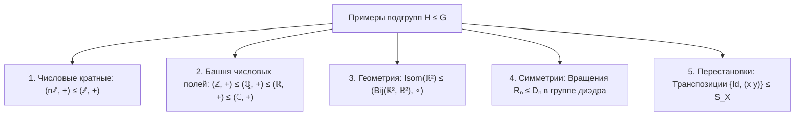
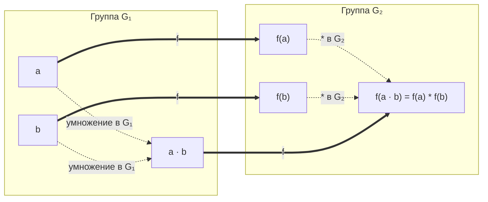
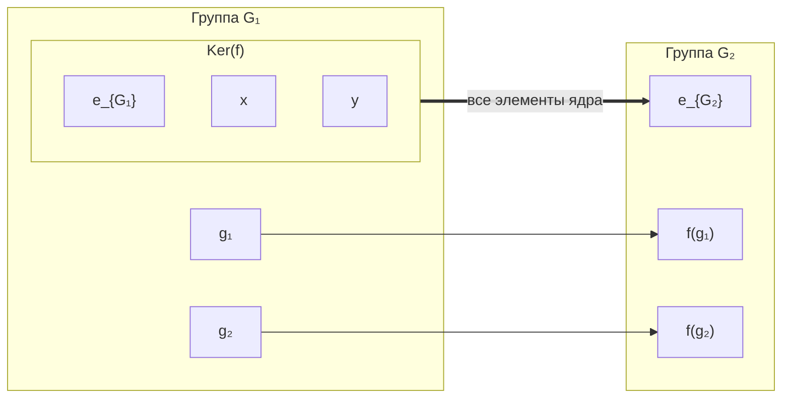
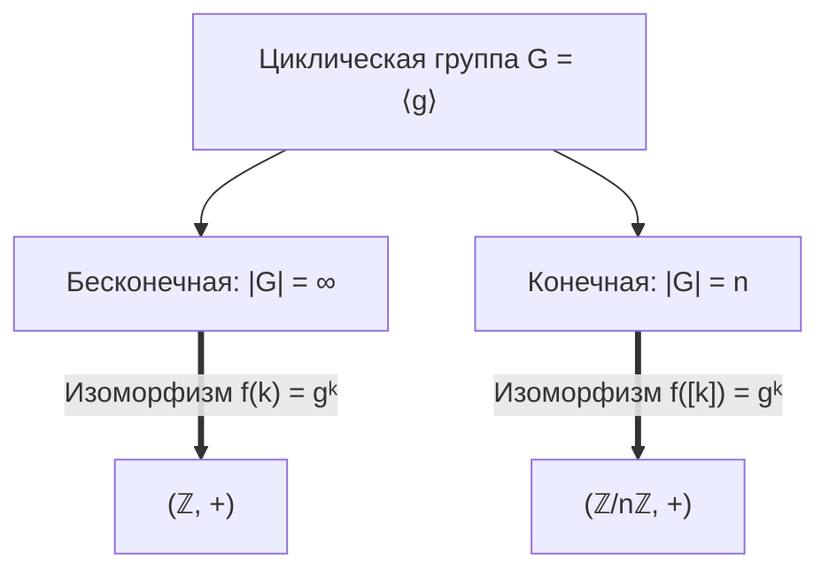

# 📐 Лекция 4: Подгруппы, прямое произведение, гомоморфизмы, циклические группы и порядок элемента

> [!abstract] О занятии
> - **Дисциплина:** [[Линейная алгебра]] (1 семестр)
> - **Дата проведения:** 24 сентября 2026 года (неделя 4, четная, четверг, 08:10 – 09:40)
> - **Аудитория:** Orange Classroom 1229 (Кронверкский пр., д. 49, лит. А)
> - **Преподаватель (лектор):** Кумалагов Давид Заурович
> - **Поток:** **Поток 2** (Software Engineering, Университет ИТМО)
> - **Первоисточники:** 15 лекционных фотоснимков (доска аудитории 1229 и подробный рукописный студенческий конспект от 24.09.2026); фундаментальные монографии: Э. Б. Винберг («Курс алгебры», гл. 2 «Основы теории групп»), А. Л. Городенцев («Алгебра-1», гл. 2).
> - **Ключевые концепции:** Аксиоматика подгруппы $H \le G$, критерий подгруппы, 5 классических примеров с доски ($(n\mathbb{Z}, +)$, цепочка числовых полей, изометрии $\mathrm{Isom}(\mathbb{R}^2)$, вращения $R_n \le D_n$, транспозиции в $S_X$), прямое произведение групп $G_1 \times G_2$, гомоморфизмы и изоморфизмы групп, фундаментальные свойства гомоморфизмов с полными выводами ($f(e_1)=e_2$, $f(a^{-1}) = f(a)^{-1}$, $f(a^n) = f(a)^n$), ядро гомоморфизма $\mathrm{Ker}(f)$ и критерий инъективности ($\mathrm{Ker}(f) = \{e_1\}$), 8 эталонных примеров гомоморфизмов, подгруппа, порожденная подмножеством $\langle X \rangle$, теорема о пересечении семейства подгрупп, словарное представление порожденной подгруппы, порядок элемента $\mathrm{ord}(g)$ (эквивалентность двух определений и строгое доказательство), пример мультипликативной группы $(\mathbb{Z}/8\mathbb{Z})^* \cong V_4$, циклические группы $\langle g \rangle$, Фундаментальная теорема о классификации циклических групп (изоморфизм $\mathbb{Z}$ или $\mathbb{Z}/n\mathbb{Z}$) с исчерпывающим доказательством.

---

## 📌 Краткое резюме (TL;DR)

1. **Подгруппа ($H \le G$):** Непустое подмножество $H \subseteq G$ называется подгруппой, если оно замкнуто относительно умножения ($\forall a, b \in H \implies ab \in H$), взятия обратного ($\forall a \in H \implies a^{-1} \in H$) и содержит нейтральный элемент ($e \in H$). Компактный критерий: $H \ne \varnothing$ и $\forall a, b \in H \implies a b^{-1} \in H$.
2. **Прямое произведение ($G_1 \times G_2$):** Множество пар $(a, b)$ с покомпонентной операцией $(a, b)(c, d) = (ac, bd)$, единицей $(e_1, e_2)$ и обратным $(a^{-1}, b^{-1})$. Порядок равен $|G_1| \cdot |G_2|$.
3. **Гомоморфизм:** Отображение $f: G_1 \to G_2$, сохраняющее операцию: $f(ab) = f(a) * f(b)$. Автоматически сохраняет единицу $f(e_1) = e_2$, обратные $f(a^{-1}) = f(a)^{-1}$ и любые целые степени $f(a^n) = f(a)^n$. Изоморфизм — это биективный гомоморфизм ($G_1 \cong G_2$).
4. **Ядро ($\mathrm{Ker}(f)$):** Множество элементов, переходящих в нейтральный: $\mathrm{Ker}(f) = \{x \in G_1 \mid f(x) = e_2\} \le G_1$. **Критерий инъективности:** $f$ инъективен $\iff \mathrm{Ker}(f) = \{e_1\}$.
5. **Порождение подгруппы ($\langle X \rangle$):** Наименьшая по включению подгруппа, содержащая $X$. Эквивалентно: пересечение всех подгрупп, содержащих $X$, или множество всех конечных слов вида $x_1^{\varepsilon_1} \dots x_n^{\varepsilon_n}$ ($\varepsilon_i = \pm 1$).
6. **Порядок элемента ($\mathrm{ord}(g)$):** Два эквивалентных определения:
   - Теоретико-групповое: $\mathrm{ord}(g) \overset{\text{def}}{=} |\langle g \rangle|$;
   - Минимальная степень: наименьшее натуральное $n \in \mathbb{N}$ такое, что $g^n = e$ (если такого $n$ нет, то $\mathrm{ord}(g) = \infty$).
7. **Теорема о классификации циклических групп:** Всякая циклическая группа $G = \langle g \rangle$ с точностью до изоморфизма устроена одним из двух способов:
   - Если $G$ бесконечна $\implies G \cong (\mathbb{Z}, +)$ посредством $k \mapsto g^k$;
   - Если $G$ конечна порядка $n$ $\implies G \cong (\mathbb{Z}/n\mathbb{Z}, +)$ посредством $[k] \mapsto g^k$.

---

## 🧭 Навигация по конспекту

1. [Подгруппы: определение, критерии и примеры](#1-подгруппы-определение-критерии-и-примеры)
   - [Аксиоматическое определение](#11-аксиоматическое-определение-подгруппы)
   - [Критерий подгруппы](#12-критерий-подгруппы)
   - [Разбор 5 примеров с доски лекции](#13-разбор-5-фундаментальных-примеров-с-доски)
2. [Прямое произведение групп](#2-прямое-произведение-групп)
3. [Гомоморфизмы и изоморфизмы групп](#3-гомоморфизмы-и-изоморфизмы-групп)
   - [Базовые определения](#31-определения-гомоморфизма-и-изоморфизма)
   - [4 фундаментальных свойства и их доказательства](#32-четыре-фундаментальных-свойства-гомоморфизмов)
   - [Ядро гомоморфизма и критерий инъективности](#33-ядро-гомоморфизма-и-критерий-инъективности)
4. [Каталог 8 эталонных примеров гомоморфизмов](#4-каталог-8-эталонных-примеров-гомоморфизмов)
5. [Порождение подгрупп множеством](#5-порождение-подгрупп-множеством)
   - [Пересечение семейства подгрупп](#51-теорема-о-пересечении-подгрупп)
   - [Определение через минимальность](#52-порожденная-подгруппа-langle-x-rangle)
   - [Словарная лемма и конструктивное доказательство](#53-словарная-лемма-явный-конструктивный-вид)
6. [Порядок элемента группы](#6-порядок-элемента-группы)
   - [Два эквивалентных определения](#61-определения-порядка-элемента)
   - [Теорема об эквивалентности и ее строгое доказательство](#62-теорема-об-эквивалентности-определений-порядка)
   - [Разбор контрпримера: группа вычетов (Z/8Z)* и четверная группа Клейна](#63-разбор-группа-z8z-и-четверная-группа-клейна-v4)
7. [Циклические группы и классификационная теорема](#7-циклические-группы-и-классификационная-теорема)
   - [Определение циклической группы](#71-определение-циклической-группы)
   - [Формулировка теоремы о классификации](#72-теорема-о-классификации-циклических-групп)
   - [Полное доказательство: бесконечный и конечный случаи](#73-строгое-доказательство-теоремы-о-классификации)
8. [Реализация на Modern C++20 и приложения в Computer Science](#8-реализация-на-modern-c20-и-приложения-в-computer-science)
9. [Сводные аналитические таблицы](#9-сводные-аналитические-таблицы)
10. [Ловушки и предупреждения к экзамену](#10-ловушки-и-предупреждения-к-экзамену)
11. [Вопросы для самопроверки](#11-вопросы-для-самопроверки)
12. [Связанные материалы](#12-связанные-материалы)

---

## 1. Подгруппы: определение, критерии и примеры

### 1.1. Аксиоматическое определение подгруппы

> [!important] Определение подгруппы (с доски лекции)
> Пусть $(G, \cdot)$ — группа с нейтральным элементом $e$.  
> Непустое подмножество $H \subseteq G$ называется **подгруппой** группы $G$ (обозначается $H \le G$), если сужение операции группы $G$ на множество $H$ превращает $H$ в группу с той же операцией.  
> 
> В явном виде это равносильно выполнению трех условий:
> 1. **Замкнутость относительно операции:**
>    $$\forall a, b \in H \implies a \cdot b \in H$$
> 2. **Замкнутость относительно взятия обратного элемента:**
>    $$\forall a \in H \implies a^{-1} \in H$$
> 3. **Принадлежность нейтрального элемента:**
>    $$e \in H$$

> [!tip] Замечание о нейтральном элементе
> Если множество $H$ не пусто ($H \ne \varnothing$) и выполнены условия (1) и (2), то условие (3) выполняется автоматически:  
> Возьмем любой элемент $h \in H$. По условию (2) обратный элемент $h^{-1} \in H$. Тогда по условию (1) их произведение $e = h \cdot h^{-1} \in H$.  
> Таким образом, для непустого $H$ аксиома нейтрального элемента избыточна, однако фиксация $e \in H$ удобна на практике для быстрой первичной проверки непустоты множества.

### 1.2. Критерий подгруппы

> [!theorem] Критерий подгруппы (в один шаг)
> Непустое подмножество $H \subseteq G$ является подгруппой ($H \le G$) тогда и только тогда, когда:
> $$\forall a, b \in H \implies a \cdot b^{-1} \in H$$

> [!proof] Доказательство критерия
> - $(\implies)$ Пусть $H \le G$. Если $a, b \in H$, то в силу замкнутости относительно взятия обратного $b^{-1} \in H$, а в силу замкнутости относительно операции $a \cdot b^{-1} \in H$.
> - $(\impliedby)$ Пусть выполнено условие: $\forall a, b \in H \implies a b^{-1} \in H$.
>   1. Так как $H \ne \varnothing$, выберем произвольный элемент $h \in H$. Подставим $a = h$ и $b = h$:
>      $$e = h \cdot h^{-1} \in H$$
>      Нейтральный элемент доказан!
>   2. Возьмем любой $b \in H$. Подставим $a = e$ и $b$:
>      $$b^{-1} = e \cdot b^{-1} \in H$$
>      Замкнутость относительно обратного доказана!
>   3. Возьмем любые $a, b \in H$. Так как $b \in H$, то по доказанному выше $b^{-1} \in H$. Применим условие к паре $a$ и $b^{-1}$:
>      $$a \cdot (b^{-1})^{-1} = a \cdot b \in H$$
>      Замкнутость относительно операции доказана!  
>   Следовательно, $H \le G$. $\blacksquare$

---

### 1.3. Разбор 5 фундаментальных примеров с доски

На лекции были подробно разобраны следующие ключевые примеры подгрупп:



#### Пример 1. Аддитивная подгруппа кратных чисел $(n\mathbb{Z}, +) \le (\mathbb{Z}, +)$
Для фиксированного целого $n \in \mathbb{Z}$ множество $n\mathbb{Z} = \{k \cdot n \mid k \in \mathbb{Z}\}$:
- Замкнуто относительно сложения: $k_1 n + k_2 n = (k_1 + k_2)n \in n\mathbb{Z}$;
- Замкнуто относительно вычитания (обратного): $-(k n) = (-k)n \in n\mathbb{Z}$;
- Содержит нейтральный элемент: $0 = 0 \cdot n \in n\mathbb{Z}$.
*Замечание:* Как будет показано далее, **любая** подгруппа группы $(\mathbb{Z}, +)$ имеет именно такой вид $n\mathbb{Z}$ для некоторого $n \ge 0$.

#### Пример 2. Башня числовых аддитивных подгрупп
$$(\mathbb{Z}, +) \le (\mathbb{Q}, +) \le (\mathbb{R}, +) \le (\mathbb{C}, +)$$
Каждое последующее числовое множество содержит предыдущее как подмножество, операции сложения согласованы, нули совпадают ($0 \in \mathbb{Z}$), противоположные элементы сохраняются.

#### Пример 3. Группа изометрий плоскости $\mathrm{Isom}(\mathbb{R}^2) \le (\mathrm{Bij}(\mathbb{R}^2, \mathbb{R}^2), \circ)$
Рассмотрим группу всех взаимно однозначных отображений (биекций) плоскости на себя относительно операции функциональной композиции: $G = (\mathrm{Bij}(\mathbb{R}^2, \mathbb{R}^2), \circ)$.  
Определим подмножество **движений (изометрий)** евклидовой плоскости:
$$\mathrm{Isom}(\mathbb{R}^2) \overset{\text{def}}{=} \{ f: \mathbb{R}^2 \to \mathbb{R}^2 \mid d_2(x, y) = d_2(f(x), f(y)), \; \forall x, y \in \mathbb{R}^2 \}$$
где $d_2(x, y) = \sqrt{(x_1 - y_1)^2 + (x_2 - y_2)^2}$ — евклидово расстояние.
Проверим аксиомы подгруппы:
1. **Замкнутость по композиции:** Если $f, g \in \mathrm{Isom}(\mathbb{R}^2)$, то:
   $$d_2((f \circ g)(x), (f \circ g)(y)) = d_2(f(g(x)), f(g(y))) = d_2(g(x), g(y)) = d_2(x, y)$$
   Следовательно, $f \circ g \in \mathrm{Isom}(\mathbb{R}^2)$.
2. **Нейтральный элемент:** Тождественное отображение $\mathrm{Id}(x) = x$ сохраняет расстояния: $d_2(\mathrm{Id}(x), \mathrm{Id}(y)) = d_2(x, y) \implies \mathrm{Id} \in \mathrm{Isom}(\mathbb{R}^2)$.
3. **Обратный элемент:** Изометрия евклидова пространства инъективна (если $f(x) = f(y)$, то $d_2(f(x), f(y)) = 0 = d_2(x, y) \implies x = y$) и сюръективна (доказано в курсе геометрии), следовательно, $f$ обратима как биекция.  
   Проверим сохранение расстояния для $f^{-1}$: пусть $u = f(x)$ и $v = f(y)$, тогда $x = f^{-1}(u)$ и $y = f^{-1}(v)$. Имеем:
   $$d_2(f^{-1}(u), f^{-1}(v)) = d_2(x, y) = d_2(f(x), f(y)) = d_2(u, v)$$
   Значит, $f^{-1} \in \mathrm{Isom}(\mathbb{R}^2)$. Все условия выполнены!

#### Пример 4. Подгруппа вращений в группе диэдра $R_n \le D_n$
Группа диэдра $D_n$ — это группа всех $2n$ движений правильного $n$-угольника. Она содержит:
- $n$ вращений: $R_n = \{e, r, r^2, \dots, r^{n-1}\}$, где $r$ — поворот на угол $\frac{2\pi}{n}$ вокруг центра;
- $n$ осевых отражений: $s, sr, sr^2, \dots, sr^{n-1}$.
Множество $R_n$ замкнуто относительно композиции ($r^i \circ r^j = r^{(i+j) \bmod n} \in R_n$), содержит обратные ($(r^k)^{-1} = r^{n-k} \in R_n$) и нейтральный поворот $e = r^0$. Следовательно, $R_n \le D_n$. При этом $R_n$ — абелева циклическая подгруппа индекса $[D_n : R_n] = \frac{2n}{n} = 2$.

#### Пример 5. Подгруппа транспозиций в симметрической группе $S_X$
Пусть $X$ — произвольное множество, $S_X = \mathrm{Bij}(X, X)$ — группа перестановок. Зафиксируем два различных элемента $x, y \in X$.  
Рассмотрим транспозицию $(x\,y)$, меняющую местами элементы $x$ и $y$ и сохраняющую все остальные:
$$(x\,y)(x) = y, \quad (x\,y)(y) = x, \quad (x\,y)(z) = z \; (\forall z \ne x, y)$$
Тогда двухэлементное множество:
$$H = \{\mathrm{Id}, (x\,y)\} \le (S_X, \circ)$$
образует подгруппу, поскольку $(x\,y) \circ (x\,y) = \mathrm{Id} \implies (x\,y)^{-1} = (x\,y)$. Эта подгруппа изоморфна $\mathbb{Z}_2$.

---

## 2. Прямое произведение групп

> [!important] Определение прямого произведения групп (с доски)
> Пусть $(G_1, \cdot)$ и $(G_2, *)$ — две произвольные группы.  
> **Прямым произведением** групп $G_1$ и $G_2$ (обозначается $G_1 \times G_2$) называется декартово произведение множеств:
> $$G_1 \times G_2 = \{ (a, b) \mid a \in G_1, \; b \in G_2 \}$$
> снабженное покомпонентной бинарной операцией:
> $$(a, b) \cdot_{G_1 \times G_2} (c, d) \overset{\text{def}}{=} (a \cdot c, \; b * d)$$

### Проверка аксиом группы для $G_1 \times G_2$:
1. **Ассоциативность:**
   $$((a, b)(c, d))(g, h) = (ac, bd)(g, h) = ((ac)g, (bd)h) = (a(cg), b(dh)) = (a, b)(cg, dh) = (a, b)((c, d)(g, h))$$
   следует из ассоциативности операций в $G_1$ и $G_2$.
2. **Нейтральный элемент:**
   Пара $e = (e_{G_1}, e_{G_2})$ удовлетворяет:
   $$(a, b)(e_{G_1}, e_{G_2}) = (a \cdot e_{G_1}, b * e_{G_2}) = (a, b)$$
   $$(e_{G_1}, e_{G_2})(a, b) = (e_{G_1} \cdot a, e_{G_2} * b) = (a, b)$$
3. **Обратный элемент:**
   Для каждого элемента $(a, b) \in G_1 \times G_2$ обратным является:
   $$(a, b)^{-1} = (a^{-1}, b^{-1})$$
   Действительно: $(a, b)(a^{-1}, b^{-1}) = (a a^{-1}, b b^{-1}) = (e_{G_1}, e_{G_2})$.

> [!property] Свойства прямого произведения
> - **Порядок группы:** Если группы $G_1$ и $G_2$ конечны, то порядок прямого произведения равен произведению их порядков:
>   $$|G_1 \times G_2| = |G_1| \cdot |G_2|$$
> - **Коммутативность:** Группа $G_1 \times G_2$ является абелевой тогда и только тогда, когда обе группы $G_1$ и $G_2$ абелевы.
> - **Обобщение:** Аналогично определяется прямое произведение $k$ групп: $G_1 \times G_2 \times \dots \times G_k$.

---

## 3. Гомоморфизмы и изоморфизмы групп

### 3.1. Определения гомоморфизма и изоморфизма

> [!important] Определение гомоморфизма и изоморфизма (с доски)
> Пусть $(G_1, \cdot)$ и $(G_2, *)$ — две группы.
> 1. Отображение $f: G_1 \to G_2$ называется **гомоморфизмом групп**, если оно сохраняет групповую операцию для любых двух элементов:
>    $$f(a \cdot b) = f(a) * f(b), \quad \forall a, b \in G_1$$
> 2. Отображение $f: G_1 \to G_2$ называется **изоморфизмом групп**, если оно является биекцией (инъективно и сюръективно) и гомоморфизмом одновременно.
>    - Если между $G_1$ и $G_2$ существует хотя бы один изоморфизм, группы называются **изоморфными** (обозначается $G_1 \cong G_2$).



### Стандартная классификация морфизмов:
- **Мономорфизм:** инъективный гомоморфизм (вложение);
- **Эпиморфизм:** сюръективный гомоморфизм (факторизация / проекция);
- **Эндоморфизм:** гомоморфизм группы в себя ($f: G \to G$);
- **Автоморфизм:** изоморфизм группы на себя ($f: G \xrightarrow{\sim} G$).

---

### 3.2. Четыре фундаментальных свойства гомоморфизмов

На лекции были выписаны и доказаны следующие 4 ключевых свойства любого гомоморфизма $f: G_1 \to G_2$:

> [!theorem] Свойства гомоморфизма групп
> 1. **Сохранение нейтрального элемента:** $f(e_{G_1}) = e_{G_2}$;
> 2. **Сохранение обратного элемента:** $\forall a \in G_1 \implies f(a^{-1}) = (f(a))^{-1}$;
> 3. **Сохранение произвольных целых степеней:** $\forall a \in G_1, \forall n \in \mathbb{Z} \implies f(a^n) = (f(a))^n$;
> 4. **Строение ядра:** Множество $\mathrm{Ker}(f) = \{a \in G_1 \mid f(a) = e_{G_2}\}$ является подгруппой в $G_1$ ($\mathrm{Ker}(f) \le G_1$), и $f$ инъективно тогда и только тогда, когда $\mathrm{Ker}(f) = \{e_{G_1}\}$.

> [!proof] Доказательство свойств с доски лекции
> 
> **Доказательство свойства 1:**
> По аксиоме нейтрального элемента в $G_1$: $e_{G_1} \cdot e_{G_1} = e_{G_1}$. Применим гомоморфизм:
> $$f(e_{G_1}) = f(e_{G_1} \cdot e_{G_1}) = f(e_{G_1}) * f(e_{G_1})$$
> С другой стороны, в группе $G_2$ для любого элемента $y$ выполнено $y = y * e_{G_2}$. Положив $y = f(e_{G_1})$:
> $$f(e_{G_1}) * e_{G_2} = f(e_{G_1}) * f(e_{G_1})$$
> Домножая обе части слева на $(f(e_{G_1}))^{-1}$, получаем:
> $$e_{G_2} = f(e_{G_1}) \quad \blacksquare$$
> *(Альтернативный вывод с доски: $f(a) = f(a \cdot e_{G_1}) = f(a) * f(e_{G_1})$. Домножая слева на $(f(a))^{-1}$, немедленно имеем $e_{G_2} = f(e_{G_1})$).*
> 
> **Доказательство свойства 2:**
> Рассмотрим произведение элементов $f(a)$ и $f(a^{-1})$ в группе $G_2$:
> $$f(a) * f(a^{-1}) = f(a \cdot a^{-1}) = f(e_{G_1}) = e_{G_2}$$
> Аналогично:
> $$f(a^{-1}) * f(a) = f(a^{-1} \cdot a) = f(e_{G_1}) = e_{G_2}$$
> По доказанной ранее теореме о единственности обратного элемента в группе $G_2$, отсюда следует, что элемент $f(a^{-1})$ является строго обратным к $f(a)$:
> $$f(a^{-1}) = (f(a))^{-1} \quad \blacksquare$$
> 
> **Доказательство свойства 3 (Следствие свойств 1 и 2):**
> - При $n = 0$: $f(a^0) = f(e_{G_1}) = e_{G_2} = (f(a))^0$ (по свойству 1).
> - При $n > 0$: доказывается индукцией по $n$. База $n=1$ тривиальна ($f(a^1) = f(a)^1$).  
>   Индукционный переход: пусть верно для $k$, то есть $f(a^k) = (f(a))^k$. Тогда:
>   $$f(a^{k+1}) = f(a^k \cdot a) = f(a^k) * f(a) = (f(a))^k * f(a) = (f(a))^{k+1}$$
> - При $n < 0$: пусть $n = -m$, где $m > 0$. Тогда:
>   $$f(a^n) = f(a^{-m}) = f((a^m)^{-1}) = (f(a^m))^{-1} = ((f(a))^m)^{-1} = (f(a))^{-m} = (f(a))^n \quad \blacksquare$$

---

### 3.3. Ядро гомоморфизма и критерий инъективности

> [!important] Определение ядра гомоморфизма (Kernel)
> Пусть $f: G_1 \to G_2$ — гомоморфизм групп. **Ядром гомоморфизма** $f$ называется множество всех элементов группы $G_1$, которые отображаются в нейтральный элемент группы $G_2$:
> $$\mathrm{Ker}(f) \overset{\text{def}}{=} \{ a \in G_1 \mid f(a) = e_{G_2} \} \subseteq G_1$$
> *(В тетради: «Ядро гомоморфизма — множество особых элементов $G_1$, которые $f$ превращает в нейтральный элемент $G_2$»)*.



> [!theorem] Теорема о ядре и критерий инъективности
> 1. Для любого гомоморфизма $f: G_1 \to G_2$ его ядро является подгруппой: $\mathrm{Ker}(f) \le G_1$.
> 2. Гомоморфизм $f$ инъективен тогда и только тогда, когда его ядро тривиально:
>    $$f \text{ — инъекция} \iff \mathrm{Ker}(f) = \{e_{G_1}\}$$

> [!proof] Доказательство теоремы (с доски и тетради)
> 
> **Часть 1: Доказательство $\mathrm{Ker}(f) \le G_1$.**
> Проверим условия подгруппы:
> 1. $e_{G_1} \in \mathrm{Ker}(f)$, так как $f(e_{G_1}) = e_{G_2}$ (ядро непусто).
> 2. Пусть $a, b \in \mathrm{Ker}(f)$, то есть $f(a) = e_{G_2}$ и $f(b) = e_{G_2}$. Тогда:
>    $$f(a \cdot b) = f(a) * f(b) = e_{G_2} * e_{G_2} = e_{G_2} \implies a \cdot b \in \mathrm{Ker}(f)$$
> 3. Пусть $a \in \mathrm{Ker}(f)$. Тогда:
>    $$f(a^{-1}) = (f(a))^{-1} = (e_{G_2})^{-1} = e_{G_2} \implies a^{-1} \in \mathrm{Ker}(f)$$
> Следовательно, $\mathrm{Ker}(f) \le G_1$.
> 
> **Часть 2: Доказательство критерия инъективности.**
> - $(\implies)$ **Необходимость:**  
>   Пусть $f$ — инъективное отображение. Мы уже знаем, что $e_{G_1} \in \mathrm{Ker}(f)$.  
>   Покажем, что других элементов в ядре нет.  
>   Пусть $x \in \mathrm{Ker}(f)$. По определению ядра:
>   $$f(x) = e_{G_2}$$
>   Но по свойству 1 гомоморфизма также:
>   $$f(e_{G_1}) = e_{G_2}$$
>   Следовательно:
>   $$f(x) = f(e_{G_1})$$
>   В силу инъективности отображения $f$, из равенства образов вытекает равенство прообразов:
>   $$x = e_{G_1}$$
>   Таким образом, $\mathrm{Ker}(f) = \{e_{G_1}\}$.
> 
> - $(\impliedby)$ **Достаточность:**  
>   Пусть ядро тривиально: $\mathrm{Ker}(f) = \{e_{G_1}\}$.  
>   Пусть для некоторых $x, y \in G_1$ оказалось, что $f(x) = f(y)$.  
>   Домножим обе части равенства справа на $(f(y))^{-1}$ в группе $G_2$:
>   $$f(x) * (f(y))^{-1} = f(y) * (f(y))^{-1} = e_{G_2}$$
>   По свойствам гомоморфизма $(f(y))^{-1} = f(y^{-1})$, следовательно:
>   $$f(x) * f(y^{-1}) = f(x \cdot y^{-1}) = e_{G_2}$$
>   Это равенство по определению означает, что элемент $x \cdot y^{-1}$ принадлежит ядру гомоморфизма $f$:
>   $$x \cdot y^{-1} \in \mathrm{Ker}(f)$$
>   Но по условию ядро состоит только из нейтрального элемента $\mathrm{Ker}(f) = \{e_{G_1}\}$. Значит:
>   $$x \cdot y^{-1} = e_{G_1}$$
>   Домножая обе части справа на $y$:
>   $$x = y$$
>   Итак, из $f(x) = f(y)$ следует $x = y$, что в точности означает **инъективность** гомоморфизма $f$! $\blacksquare$

---

## 4. Каталог 8 эталонных примеров гомоморфизмов

На лекции (доска + записи студента) был разобран богатый банк гомоморфизмов, охватывающий дискретную математику, математический анализ и теорию чисел:

### 1. Каноническая факторизация (проекция) $\pi: (\mathbb{Z}, +) \to (\mathbb{Z}/n\mathbb{Z}, +)$
- **Задание:** $\pi(x) = [x]_n = x \bmod n$.
- **Проверка операции:** $\pi(x + y) = [x + y]_n = [x]_n + [y]_n = \pi(x) + \pi(y)$.
- **Свойства:** $\pi$ — сюръективный гомоморфизм (эпиморфизм).
- **Ядро:** $\mathrm{Ker}(\pi) = \{x \in \mathbb{Z} \mid [x]_n = [0]_n\} = n\mathbb{Z}$.

### 2. Гомотетия прямой $f: (\mathbb{R}, +) \to (\mathbb{R}, +), \; f(x) = \alpha x$ ($\alpha \in \mathbb{R}$)
- **Проверка операции:** $f(x + y) = \alpha(x + y) = \alpha x + \alpha y = f(x) + f(y)$.
- **Критерий изоморфизма:** $f$ является изоморфизмом тогда и только тогда, когда $\alpha \ne 0$.
  - Если $\alpha \ne 0$: $f$ биективно, обратное отображение $f^{-1}(y) = \frac{1}{\alpha} y$, $\mathrm{Ker}(f) = \{0\}$.
  - Если $\alpha = 0$: $f(x) \equiv 0$ — тривиальный гомоморфизм, $\mathrm{Ker}(f) = \mathbb{R}$.

### 3. Редукция вычетов $g: (\mathbb{Z}/mn\mathbb{Z}, +) \to (\mathbb{Z}/n\mathbb{Z}, +), \; [x]_{mn} \mapsto [x]_n$
- **Корректность задания:** Пусть $[x_1]_{mn} = [x_2]_{mn} \iff x_1 - x_2 = k(mn) = (km)n \implies x_1 \equiv x_2 \pmod n \implies [x_1]_n = [x_2]_n$. Отображение не зависит от выбора представителя!
- **Свойства:** Сюръективный гомоморфизм.
- **Ядро:** $\mathrm{Ker}(g) = \{ [x]_{mn} \mid x \equiv 0 \pmod n \} = \{ [0], [n], [2n], \dots, [(m-1)n] \}$. Заметим, что $|\mathrm{Ker}(g)| = m$, и ядро изоморфно $\mathbb{Z}/m\mathbb{Z}$.

### 4. Вложение кратных вычетов $h: (\mathbb{Z}/n\mathbb{Z}, +) \to (\mathbb{Z}/mn\mathbb{Z}, +), \; [x]_n \mapsto [m x]_{mn}$
- **Корректность задания:** Если $x_1 \equiv x_2 \pmod n \iff x_1 - x_2 = kn \implies m x_1 - m x_2 = k(mn) \implies [mx_1]_{mn} = [mx_2]_{mn}$. Корректно!
- **Проверка гомоморфизма:** $h([x] + [y]) = [m(x+y)]_{mn} = [mx]_{mn} + [my]_{mn} = h([x]) + h([y])$.
- **Инъективность:** $[x]_n \in \mathrm{Ker}(h) \iff [mx]_{mn} = [0]_{mn} \iff mn \mid mx \iff n \mid x \iff [x]_n = [0]_n$.  
  Так как ядро состоит только из нуля ($\mathrm{Ker}(h) = \{[0]_n\}$), $h$ является **инъективным гомоморфизмом (мономорфизмом)**!

### 5. Изоморфизм Китайской теоремы об остатках (КТО)
Пусть $\gcd(m, n) = 1$. Определим отображение:
$$f: (\mathbb{Z}/mn\mathbb{Z}, +) \to (\mathbb{Z}/m\mathbb{Z}, +) \times (\mathbb{Z}/n\mathbb{Z}, +), \quad [x]_{mn} \mapsto ([x]_m, [x]_n)$$
- **Гомоморфизм:** $f([x + y]) = ([x+y]_m, [x+y]_n) = ([x]_m + [y]_m, [x]_n + [y]_n) = f([x]) + f([y])$.
- **Инъективность:** $[x] \in \mathrm{Ker}(f) \iff [x]_m = [0]_m \text{ и } [x]_n = [0]_n \iff m \mid x \text{ и } n \mid x$.  
  Так как $\gcd(m, n) = 1$, наименьшее общее кратное $\mathrm{lcm}(m, n) = mn$, откуда $mn \mid x \iff [x]_{mn} = [0]_{mn}$. Значит, $\mathrm{Ker}(f) = \{[0]\}$.
- **Биективность:** Мощности групп совпадают: $|\mathbb{Z}/mn\mathbb{Z}| = mn = m \cdot n = |\mathbb{Z}/m\mathbb{Z} \times \mathbb{Z}/n\mathbb{Z}|$. Инъективное отображение между конечными множествами одинаковой мощности сюръективно $\implies f$ — **изоморфизм**!

### 6. Гомоморфизм модуля $(\mathbb{R} \setminus \{0\}, \cdot) \xrightarrow{|\cdot|} (\mathbb{R}_{>0}, \cdot)$
- **Задание:** $x \mapsto |x|$.
- **Проверка:** $|x \cdot y| = |x| \cdot |y|$.
- **Свойства:** Сюръективен.
- **Ядро:** $\mathrm{Ker}(|\cdot|) = \{x \in \mathbb{R} \setminus \{0\} \mid |x| = 1\} = \{1, -1\} \cong \mathbb{Z}_2$.

### 7. Экспоненциальный изоморфизм $(\mathbb{R}, +) \xrightarrow{\exp} (\mathbb{R}_{>0}, \cdot)$
- **Задание:** $f(x) = e^x$.
- **Проверка:** $e^{x + y} = e^x \cdot e^y$.
- **Обратимость:** Обратным отображением служит натуральный логарифм $\ln: (\mathbb{R}_{>0}, \cdot) \to (\mathbb{R}, +)$, где $\ln(u \cdot v) = \ln u + \ln v$.
- **Ядро:** $\mathrm{Ker}(\exp) = \{x \in \mathbb{R} \mid e^x = 1\} = \{0\}$.
- **Вывод:** Аддитивная группа вещественных чисел $(\mathbb{R}, +)$ и мультипликативная группа положительных вещественных чисел $(\mathbb{R}_{>0}, \cdot)$ строго **изоморфны**: $(\mathbb{R}, +) \cong (\mathbb{R}_{>0}, \cdot)$.

### 8. Гомоморфизм эвалюации (вычисления в точке)
Рассмотрим функциональную группу $(\mathrm{Fun}(\mathbb{R}, \mathbb{R}), +)$ относительно поточечного сложения функций:
$$\mathrm{ev}_0: (\mathrm{Fun}(\mathbb{R}, \mathbb{R}), +) \to (\mathbb{R}, +), \quad f \mapsto f(0)$$
- **Проверка:** $\mathrm{ev}_0(f + g) = (f + g)(0) = f(0) + g(0) = \mathrm{ev}_0(f) + \mathrm{ev}_0(g)$.
- **Свойства:** Сюръективен (для любого $c \in \mathbb{R}$ константная функция $f(x) \equiv c$ дает $f(0) = c$).
- **Ядро:** $\mathrm{Ker}(\mathrm{ev}_0) = \{f \in \mathrm{Fun}(\mathbb{R}, \mathbb{R}) \mid f(0) = 0\}$ — подгруппа функций, график которых проходит через начало координат.

---

## 5. Порождение подгрупп множеством

### 5.1. Теорема о пересечении подгрупп

> [!theorem] Теорема о пересечении подгрупп (с доски)
> Пусть $\{H_\alpha\}_{\alpha \in I}$ — произвольное (конечное или бесконечное) семейство подгрупп группы $G$.  
> Тогда их пересечение также является подгруппой в $G$:
> $$\bigcap_{\alpha \in I} H_\alpha \le G$$

> [!proof] Доказательство
> Обозначим $H = \bigcap_{\alpha \in I} H_\alpha$. Проверим условия подгруппы:
> 1. Так как каждая $H_\alpha \le G$, то $e \in H_\alpha$ для всех $\alpha \in I$. Следовательно, $e \in H$ ($H \ne \varnothing$).
> 2. Пусть $a, b \in H$. Это значит, что для каждого $\alpha \in I$ элементы $a, b \in H_\alpha$. Так как $H_\alpha$ — подгруппа, то $a \cdot b \in H_\alpha$ для всех $\alpha \in I$. Следовательно, $a \cdot b \in H$.
> 3. Пусть $a \in H$. Тогда $\forall \alpha \in I: a \in H_\alpha \implies a^{-1} \in H_\alpha \implies a^{-1} \in H$.  
> Значит, $H \le G$. $\blacksquare$

> [!warning] Внимание: объединение подгрупп НЕ всегда подгруппа!
> Объединение двух подгрупп $H_1 \cup H_2$ является подгруппой тогда и только тогда, когда одна из них содержится в другой ($H_1 \subseteq H_2$ или $H_2 \subseteq H_1$).  
> *Контрпример:* в $(\mathbb{Z}, +)$ подгруппы $2\mathbb{Z}$ и $3\mathbb{Z}$. Элементы $2 \in 2\mathbb{Z}$ и $3 \in 3\mathbb{Z}$, но их сумма $2 + 3 = 5 \notin 2\mathbb{Z} \cup 3\mathbb{Z}$.

---

### 5.2. Порожденная подгруппа $\langle X \rangle$

> [!important] Определение порожденной подгруппы (с доски)
> Пусть $G$ — группа, $X \subseteq G$ — произвольное подмножество (не обязательно подгруппа).  
> **Подгруппой, порожденной множеством $X$** (обозначается $\langle X \rangle$), называется **наименьшая по включению подгруппа** группы $G$, содержащая $X$.  
> 
> На языке теории множеств она задается как пересечение всех подгрупп, содержащих $X$:
> $$\langle X \rangle \overset{\text{def}}{=} \bigcap_{\substack{H_\alpha \le G \\ H_\alpha \supseteq X}} H_\alpha$$
> Множество $X$ при этом называется **множеством порождающих элементов (генераторов)** подгруппы $\langle X \rangle$.

---

### 5.3. Словарная лемма (явный конструктивный вид)

Определение через пересечение является неконструктивным («сверху»). Следующая лемма дает явный («снизу») конструктивный рецепт построения элементов $\langle X \rangle$:

> [!lemma] Лемма о словарном виде порожденной подгруппы (с доски)
> Пусть $X \subseteq G$. Подгруппа $\langle X \rangle$ состоит в точности из всех элементов группы $G$, представимых в виде конечных произведений (слов) элементов из $X$ и их обратных:
> $$\langle X \rangle = \{ x_1^{\varepsilon_1} x_2^{\varepsilon_2} \dots x_n^{\varepsilon_n} \mid n \ge 0, \; x_i \in X, \; \varepsilon_i \in \{+1, -1\} \}$$
> *(При $n = 0$ пустое произведение по соглашению полагается равным нейтральному элементу $e$).*

> [!proof] Доказательство с доски лекции
> Обозначим множество в правой части формулы через $W(X)$ (множество слов):
> $$W(X) \overset{\text{def}}{=} \{ x_1^{\varepsilon_1} \dots x_n^{\varepsilon_n} \mid n \ge 0, x_i \in X, \varepsilon_i = \pm 1 \}$$
> 
> **Шаг 1: Доказательство включения $\langle X \rangle \supseteq W(X)$ («обязательно»):**  
> Пусть $H$ — любая подгруппа группы $G$, содержащая $X$ ($X \subseteq H$).  
> Так как $X \subseteq H$, то для любого $x \in X$ имеем $x \in H$.  
> Так как $H$ — подгруппа, она замкнута относительно взятия обратных элементов, то есть $x^{-1} \in H$.  
> В силу замкнутости $H$ относительно групповой операции, любое конечное произведение $x_1^{\varepsilon_1} \dots x_n^{\varepsilon_n}$ также обязано принадлежать $H$.  
> Следовательно, $W(X) \subseteq H$ для любой подгруппы $H \supseteq X$.  
> Так как $\langle X \rangle$ сама является одной из таких подгрупп (по определению $\langle X \rangle \le G$ и $X \subseteq \langle X \rangle$), отсюда получаем:
> $$W(X) \subseteq \langle X \rangle$$
> 
> **Шаг 2: Доказательство включения $\langle X \rangle \subseteq W(X)$ («правая часть — подгруппа»):**  
> Покажем, что само множество $W(X)$ образует подгруппу в $G$:
> 1. **Замкнутость по умножению:**  
>    Возьмем два произвольных слова $u, v \in W(X)$:
>    $$u = x_1^{\varepsilon_1} \dots x_n^{\varepsilon_n}, \quad v = y_1^{\xi_1} \dots y_m^{\xi_m}$$
>    Их произведение:
>    $$u \cdot v = x_1^{\varepsilon_1} \dots x_n^{\varepsilon_n} \cdot y_1^{\xi_1} \dots y_m^{\xi_m}$$
>    является конечным словом длины $n + m$ из элементов $X$ в степенях $\pm 1$. Значит, $u \cdot v \in W(X)$.
> 2. **Замкнутость относительно взятия обратного:**  
>    По общему групповому правилу обращения произведения:
>    $$(x_1^{\varepsilon_1} x_2^{\varepsilon_2} \dots x_n^{\varepsilon_n})^{-1} = (x_n^{\varepsilon_n})^{-1} \dots (x_2^{\varepsilon_2})^{-1} \cdot (x_1^{\varepsilon_1})^{-1} = x_n^{-\varepsilon_n} \dots x_2^{-\varepsilon_2} x_1^{-\varepsilon_1}$$
>    Так как $-(\pm 1) = \mp 1 \in \{+1, -1\}$, обратный элемент снова имеет вид слова из $W(X)$. Значит, $u^{-1} \in W(X)$.
> 3. **Нейтральный элемент:**  
>    При $n = 0$ пустое слово равно $e \in W(X)$.
> 
> Следовательно, $W(X)$ является подгруппой в $G$, содержащей $X$ (так как каждый $x = x^1 \in W(X)$).  
> Но по определению $\langle X \rangle$ — **наименьшая** подгруппа, содержащая $X$. Значит, $\langle X \rangle$ обязана содержаться в любой другой подгруппе, содержащей $X$:
> $$\langle X \rangle \subseteq W(X)$$
> 
> Из двух взаимных включений $W(X) \subseteq \langle X \rangle$ и $\langle X \rangle \subseteq W(X)$ следует точное равенство:
> $$\langle X \rangle = W(X) \quad \blacksquare$$

---

## 6. Порядок элемента группы

### 6.1. Определения порядка элемента

> [!important] Определение 1: Порядок элемента через мощность подгруппы (с доски)
> Пусть $g \in G$. **Порядком элемента** $g$ называется мощность циклической подгруппы $\langle g \rangle$, им порожденной:
> $$\mathrm{ord}(g) \overset{\text{def}}{=} |\langle g \rangle|$$
> Обозначение: $\mathrm{ord}(g)$ или $|g|$.  
> Если подгруппа $\langle g \rangle$ бесконечна ($|\langle g \rangle| = \infty$), то $g$ называется **элементом бесконечного порядка** ($\mathrm{ord}(g) = \infty$).

> [!lemma] Определение 2 / Лемма: Порядок элемента через минимальную степень
> Порядок элемента $\mathrm{ord}(g)$ равен наименьшему натуральному числу $n \in \mathbb{N}$ такому, что:
> $$g^n = e$$
> Если такого натурального числа не существует, то $\mathrm{ord}(g) = \infty$.

---

### 6.2. Теорема об эквивалентности определений порядка

> [!proof] Строгое доказательство с доски аудитории 1229
> 
> **Случай А: Нашлось хотя бы одно натуральное $n$ такое, что $g^n = e$.**  
> Выберем в качестве $n$ **наименьшее** такое натуральное число:
> $$n = \min \{ k \in \mathbb{N} \mid g^k = e \}$$
> Докажем, что мощность $|\langle g \rangle|$ в точности равна $n$.
> 
> **Шаг 1: Докажем, что $|\langle g \rangle| \le n$.**  
> Любой элемент циклической подгруппы $\langle g \rangle$ по определению имеет вид $g^m$ для некоторого $m \in \mathbb{Z}$.  
> Поделим целое число $m$ на $n$ с остатком в $\mathbb{Z}$:
> $$m = n \cdot q + r, \quad \text{где } 0 \le r < n$$
> Преобразуем степень элемента:
> $$g^m = g^{n q + r} = g^{n q} \cdot g^r = (g^n)^q \cdot g^r$$
> Так как по определению $n$ степень $g^n = e$, имеем:
> $$g^m = e^q \cdot g^r = e \cdot g^r = g^r$$
> Поскольку остаток $r$ может принимать только $n$ различных значений $r \in \{0, 1, 2, \dots, n-1\}$, вся бесконечная на первый взгляд совокупность целых степеней элемента $g$ схлопывается во множество первых $n$ степеней:
> $$\langle g \rangle = \{ g^0, g^1, g^2, \dots, g^{n-1} \} = \{ e, g, g^2, \dots, g^{n-1} \}$$
> Следовательно, число элементов в подгруппе не превышает $n$: $|\langle g \rangle| \le n$.
> 
> **Шаг 2: Докажем, что все $n$ элементов $e, g, g^2, \dots, g^{n-1}$ попарно различны.**  
> Предположим противное: пусть существуют два индекса $i$ и $j$ такие, что:
> $$0 \le i < j \le n-1 \quad \text{и} \quad g^i = g^j$$
> Домножим обе части равенства на $g^{-i}$:
> $$g^j \cdot g^{-i} = g^i \cdot g^{-i} \iff g^{j - i} = e$$
> Обозначим разность через $s = j - i$. Заметим ограничения на $s$:
> - Так как $i < j$, то $s = j - i \ge 1 > 0$, то есть $s \in \mathbb{N}$.
> - Так как $j \le n-1$ и $i \ge 0$, то $s = j - i \le (n - 1) - 0 = n - 1 < n$.
> 
> Таким образом, мы нашли натуральное число $s$, строго меньшее $n$ ($0 < s < n$), такое, что:
> $$g^s = e$$
> Но это категорически противоречит выбору $n$ как **наименьшего** натурального числа с этим свойством!  
> Полученное противоречие означает, что предположение о совпадении степеней неверно, и все $n$ элементов $g^0, g^1, \dots, g^{n-1}$ действительно попарно различны.  
> 
> Следовательно:
> $$|\langle g \rangle| = n = \mathrm{ord}(g)$$
> 
> **Случай Б: Никакого натурального $n$ с $g^n = e$ не существует.**  
> Тогда все степени $g^k$ ($k \in \mathbb{Z}$) попарно различны: если бы $g^j = g^i$ при $j > i$, то $g^{j-i} = e$ дало бы натуральное число $j - i > 0$, что невозможно по предположению.  
> Значит, отображение $\mathbb{Z} \to \langle g \rangle$, $k \mapsto g^k$ является биекцией, и подгруппа $\langle g \rangle$ бесконечна: $|\langle g \rangle| = \infty \implies \mathrm{ord}(g) = \infty$. $\blacksquare$

---

### 6.3. Разбор: группа $(\mathbb{Z}/8\mathbb{Z})^*$ и четверная группа Клейна $V_4$

В конспекте студента приведен глубокий поучительный пример:

> [!example] Анализ мультипликативной группы обратимых вычетов $(\mathbb{Z}/8\mathbb{Z})^*$
> Рассмотрим кольцо вычетов $\mathbb{Z}/8\mathbb{Z} = \{0, 1, 2, 3, 4, 5, 6, 7\}$.  
> Мультипликативная группа $(\mathbb{Z}/8\mathbb{Z})^*$ состоит из обратимых элементов:
> $$(\mathbb{Z}/8\mathbb{Z})^* = \{ a \in \mathbb{Z}/8\mathbb{Z} \mid \exists x : a x \equiv 1 \pmod 8 \}$$
> По критерию Безу обратимость эквивалентна взаимной простоте $\gcd(a, 8) = 1$:
> $$(\mathbb{Z}/8\mathbb{Z})^* = \{ [1], [3], [5], [7] \}$$
> Порядок группы равен значению функции Эйлера: $|(\mathbb{Z}/8\mathbb{Z})^*| = \varphi(8) = 4$.  
> 
> Вычислим порядки всех элементов группы:
> - Элемент $[1]$: $[1]^1 = [1] \implies \mathrm{ord}([1]) = 1$.
> - Элемент $[3]$: $[3]^1 = [3] \ne [1]$, $[3]^2 = [9] = [1] \implies \mathrm{ord}([3]) = 2$.
> - Элемент $[5]$: $[5]^1 = [5] \ne [1]$, $[5]^2 = [25] = [1] \implies \mathrm{ord}([5]) = 2$.
> - Элемент $[7]$: $[7]^1 = [7] \ne [1]$, $[7]^2 = [49] = [1] \implies \mathrm{ord}([7]) = 2$.
> 
> **Фундаментальный вывод:**  
> Группа имеет порядок 4, но **в ней нет ни одного элемента порядка 4**!  
> Все неединичные элементы имеют порядок 2. Следовательно, эта группа **не может быть порождена одним элементом** и **не является циклической**:
> $$(\mathbb{Z}/8\mathbb{Z})^* \not\cong \mathbb{Z}/4\mathbb{Z}$$
> Она изоморфна прямому произведению двух циклических групп порядка 2 — так называемой **четверной группе Клейна** ($V_4$):
> $$(\mathbb{Z}/8\mathbb{Z})^* \cong \mathbb{Z}/2\mathbb{Z} \times \mathbb{Z}/2\mathbb{Z} = V_4$$

---

## 7. Циклические группы и классификационная теорема

### 7.1. Определение циклической группы

> [!important] Определение циклической группы (с доски)
> Подгруппа, порожденная **одним элементом**, называется **циклической**:
> $$H = \langle g \rangle = \{ g^k \mid k \in \mathbb{Z} \} \le G$$
> Если вся группа $G$ совпадает с циклической подгруппой своего элемента ($G = \langle g \rangle$), то группа $G$ называется **циклической группой**, а элемент $g$ — её **образующим (порождающим)** элементом.

### Базовые примеры циклических групп:
1. **Бесконечная циклическая группа:** $(\mathbb{Z}, +) = \langle 1 \rangle = \langle -1 \rangle$. (Образующих ровно два: $1$ и $-1$).
2. **Конечная циклическая группа вычетов:** $(\mathbb{Z}/n\mathbb{Z}, +) = \langle [1] \rangle$.  
   Любой вычет $[k]$ порождает $\mathbb{Z}/n\mathbb{Z}$ тогда и только тогда, когда $\gcd(k, n) = 1$. Общее число образующих равно $\varphi(n)$.
3. **Группа корней из единицы:** $\mu_n = \{ z \in \mathbb{C} \mid z^n = 1 \} = \langle e^{2\pi i / n} \rangle$ по умножению.

---

### 7.2. Теорема о классификации циклических групп

На доске лекции 4 была сформулирована и доказана важнейшая структурная теорема алгебры:

> [!theorem] Фундаментальная теорема о классификации циклических групп (с доски)
> Пусть $G$ — произвольная циклическая группа.  
> Тогда $G$ изоморфна одной из двух стандартных групп:
> 1. Если $G$ бесконечна, то:
>    $$G \cong (\mathbb{Z}, +)$$
> 2. Если $G$ конечна порядка $n = |G|$, то:
>    $$G \cong (\mathbb{Z}/n\mathbb{Z}, +)$$



---

### 7.3. Строгое доказательство теоремы о классификации

> [!proof] Доказательство с доски аудитории 1229
> 
> Пусть $G = \langle g \rangle$.
> 
> #### Случай 1: Группа $G$ бесконечна ($|G| = \infty$).
> Зададим отображение:
> $$f: (\mathbb{Z}, +) \to G, \quad f(k) \overset{\text{def}}{=} g^k \quad (\forall k \in \mathbb{Z})$$
> *(Заметим: образ образующего $f(1) = g$ однозначно фиксирует гомоморфизм).*
> 
> 1. **$f$ — гомоморфизм:**
>    Для любых $k, m \in \mathbb{Z}$:
>    $$f(k + m) = g^{k + m} = g^k \cdot g^m = f(k) \cdot f(m)$$
>    Операция сложения в $\mathbb{Z}$ переходит в операцию умножения в $G$.
> 
> 2. **$f$ — сюръекция:**
>    По определению циклической группы $G = \langle g \rangle$, любой элемент $x \in G$ имеет вид $g^k$ для некоторого $k \in \mathbb{Z}$. Следовательно, $x = f(k)$, то есть образ совпадает со всей группой $G$: $\mathrm{Im}(f) = G$.
> 
> 3. **$f$ — инъекция:**
>    Используем доказанный критерий инъективности через ядро: $f$ инъективен $\iff \mathrm{Ker}(f) = \{0\}$.  
>    Рассмотрим ядро:
>    $$\mathrm{Ker}(f) = \{ m \in \mathbb{Z} \mid f(m) = e \} = \{ m \in \mathbb{Z} \mid g^m = e \}$$
>    Предположим противное: пусть в ядре существует ненулевой элемент $m \in \mathrm{Ker}(f)$, $m \ne 0$.  
>    Если $m < 0$, то $g^{-m} = (g^m)^{-1} = e^{-1} = e$, поэтому положим $|m| \in \mathbb{N}$.  
>    Но если существует натуральное число $|m| \in \mathbb{N}$ такое, что $g^{|m|} = e$, то по лемме о порядке элемента:
>    $$\mathrm{ord}(g) \le |m| < \infty$$
>    А следовательно, мощность подгруппы $|\langle g \rangle| = \mathrm{ord}(g) \le |m|$, то есть группа $G$ конечна!  
>    Полученное противоречие («$?!$» на доске лектора) с условием бесконечности $G$ доказывает, что ненулевых элементов в ядре нет:
>    $$\mathrm{Ker}(f) = \{0\}$$
>    Следовательно, $f$ строго инъективно.
> 
> Отображение $f$ биективно и является гомоморфизмом, то есть $f$ — **изоморфизм**:
> $$G \cong (\mathbb{Z}, +)$$
> 
> ---
> 
> #### Случай 2: Группа $G$ конечна порядка $|G| = n$.
> Так как $|G| = n$, то по определению порядка элемента $\mathrm{ord}(g) = |\langle g \rangle| = n$.  
> Следовательно, $n$ — наименьшее натуральное число такое, что $g^n = e$.  
> Зададим отображение:
> $$f: (\mathbb{Z}/n\mathbb{Z}, +) \to G, \quad f([k]) \overset{\text{def}}{=} g^k$$
> 
> 1. **Корректность определения (Well-definedness):**
>    Класс вычетов $[k]$ задается любым своим представителем. Необходимо проверить, что значение $f([k])$ не зависит от выбора представителя.  
>    Пусть $[k_1] = [k_2]$ в $\mathbb{Z}/n\mathbb{Z}$. Это равносильно:
>    $$k_1 \equiv k_2 \pmod n \iff k_1 = k_2 + n \cdot t \quad \text{для некоторого } t \in \mathbb{Z}$$
>    Вычислим $g^{k_1}$:
>    $$g^{k_1} = g^{k_2 + n t} = g^{k_2} \cdot g^{n t} = g^{k_2} \cdot (g^n)^t$$
>    Так как $g^n = e$, получаем:
>    $$g^{k_1} = g^{k_2} \cdot e^t = g^{k_2} \cdot e = g^{k_2}$$
>    Следовательно, $f([k_1]) = f([k_2])$. Отображение определено абсолютно корректно!
> 
> 2. **$f$ — гомоморфизм:**
>    $$f([k_1] + [k_2]) = f([k_1 + k_2]) = g^{k_1 + k_2} = g^{k_1} \cdot g^{k_2} = f([k_1]) \cdot f([k_2])$$
> 
> 3. **$f$ — сюръекция:**
>    По определению порождающего элемента $G = \langle g \rangle$, любой элемент группы равен $g^k = f([k])$ для $k \in \{0, 1, \dots, n-1\}$. Сюръективность очевидна.
> 
> 4. **$f$ — биекция (инъекция):**
>    Заметим, что мощности множеств равны:
>    $$| \mathbb{Z}/n\mathbb{Z} | = n = |G|$$
>    Сюръективное отображение между двумя конечными множествами одинаковой мощности **всегда автоматически является инъективным** (и, следовательно, биективным!).  
>    *(Альтернативно через ядро: $[k] \in \mathrm{Ker}(f) \iff g^k = e \iff n \mid k \iff [k] = [0]_n \implies \mathrm{Ker}(f) = \{[0]_n\}$).*
> 
> Следовательно, $f$ — **изоморфизм**:
> $$G \cong (\mathbb{Z}/n\mathbb{Z}, +) \quad \blacksquare$$

---

## 8. Реализация на Modern C++20 и приложения в Computer Science

В компьютерных науках теория циклических групп лежит в основе:
1. **Асимметричной криптографии:** Протокол Диффи-Хеллмана (Diffie-Hellman Key Exchange) и цифровая подпись ElGamal базируются на сложности задачи дискретного логарифмирования в циклической подгруппе большого простого порядка $q \mid (p - 1)$ или на эллиптических кривых.
2. **Генераторов псевдослучайных чисел (LCG):** Мультипликативный конгруэнтный метод опирается на выбор образующего мультипликативной группы $\mathbb{F}_p^*$.

Ниже приведена эталонная реализация на **C++20** с концептами, моделирующая циклическую группу вычетов $\mathbb{Z}/n\mathbb{Z}$, вычисление порядка любого элемента и проверку изоморфизма Клейна:

```cpp
#include <concepts>
#include <cstdint>
#include <iostream>
#include <numeric>
#include <vector>

// C++20 Concept для группового элемента
template <typename T>
concept GroupElement = requires(T a, T b) {
    { a * b } -> std::same_as<T>;
    { a.inverse() } -> std::same_as<T>;
    { a.is_identity() } -> std::same_as<bool>;
};

// Реализация элемента кольца вычетов по модулю N (аддитивная группа Z/nZ)
template <int64_t Modulus>
requires(Modulus > 0)
class ModAddGroup {
private:
    int64_t val_;

public:
    constexpr explicit ModAddGroup(int64_t v = 0) 
        : val_(((v % Modulus) + Modulus) % Modulus) {}

    [[nodiscard]] constexpr int64_t value() const noexcept { return val_; }

    [[nodiscard]] constexpr bool is_identity() const noexcept {
        return val_ == 0;
    }

    [[nodiscard]] constexpr ModAddGroup inverse() const noexcept {
        return ModAddGroup((Modulus - val_) % Modulus);
    }

    [[nodiscard]] constexpr ModAddGroup operator+(const ModAddGroup& other) const noexcept {
        return ModAddGroup((val_ + other.val_) % Modulus);
    }

    // Вычисление порядка элемента в конечной аддитивной группе Z/nZ:
    // ord([x]) = Modulus / gcd(x, Modulus)
    [[nodiscard]] constexpr int64_t order() const noexcept {
        if (is_identity()) {
            return 1;
        }
        return Modulus / std::gcd(val_, Modulus);
    }

    // Проверка, является ли элемент образующим всей циклической группы
    [[nodiscard]] constexpr bool is_generator() const noexcept {
        return std::gcd(val_, Modulus) == 1;
    }
};

// Реализация мультипликативной группы обратимых вычетов (Z/nZ)*
template <int64_t Modulus>
requires(Modulus > 1)
class ModMulGroup {
private:
    int64_t val_;

public:
    constexpr explicit ModMulGroup(int64_t v) 
        : val_(((v % Modulus) + Modulus) % Modulus) {
        // Элемент обязан быть взаимно прост с модулем
        if (std::gcd(val_, Modulus) != 1) {
            val_ = 1; // Защитная инициализация единицей
        }
    }

    [[nodiscard]] constexpr int64_t value() const noexcept { return val_; }

    [[nodiscard]] constexpr bool is_identity() const noexcept {
        return val_ == 1;
    }

    [[nodiscard]] constexpr ModMulGroup operator*(const ModMulGroup& other) const noexcept {
        return ModMulGroup((val_ * other.val_) % Modulus);
    }

    // Вычисление порядка элемента через наименьшую степень (Лемма лекции)
    [[nodiscard]] int64_t order() const noexcept {
        if (is_identity()) return 1;
        int64_t ord = 1;
        int64_t cur = val_;
        while (cur != 1) {
            cur = (cur * val_) % Modulus;
            ++ord;
            if (ord > Modulus) break; // Защита от зацикливания
        }
        return ord;
    }
};

int main() {
    std::cout << "=== 1. Анализ циклической группы (Z/8Z, +) ===\n";
    for (int64_t x = 0; x < 8; ++x) {
        ModAddGroup<8> elem(x);
        std::cout << "Элемент [" << x << "]: порядок = " << elem.order()
                  << ", образующий: " << (elem.is_generator() ? "ДА" : "НЕТ") << "\n";
    }

    std::cout << "\n=== 2. Анализ группы (Z/8Z)* (Пример из конспекта) ===\n";
    std::vector<int64_t> invertible_elements = {1, 3, 5, 7};
    bool is_cyclic = false;
    for (int64_t x : invertible_elements) {
        ModMulGroup<8> elem(x);
        int64_t ord = elem.order();
        std::cout << "Элемент " << x << " в (Z/8Z)*: порядок = " << ord << "\n";
        if (ord == 4) is_cyclic = true;
    }
    std::cout << "Группа (Z/8Z)* циклическая? " << (is_cyclic ? "ДА" : "НЕТ (Четверная группа Клейна V4)") << "\n";

    return 0;
}
```

---

## 9. Сводные аналитические таблицы

### Таблица 1. Сравнение фундаментальных типов групп и их подгрупп

| Группа $G$ | Операция | Абелева? | Порядок $\vert G \vert$ | Циклическая? | Порождающие элементы | Примечательные подгруппы |
| :--- | :---: | :---: | :---: | :---: | :--- | :--- |
| **$(\mathbb{Z}, +)$** | Сложение | Да | $\infty$ | **Да** | $\langle 1 \rangle, \langle -1 \rangle$ | Все подгруппы имеют вид $n\mathbb{Z}$ ($n \ge 0$) |
| **$(\mathbb{Z}/n\mathbb{Z}, +)$** | Сложение $\bmod n$ | Да | $n$ | **Да** | $\langle [k] \rangle \iff \gcd(k, n) = 1$ (всего $\varphi(n)$) | Для каждого $d \mid n$ единственная подгруппа порядка $d$ |
| **$(\mathbb{Z}/8\mathbb{Z})^*$** | Умножение $\bmod 8$ | Да | $4$ | **НЕТ** | Порождается 2 элементами: $\langle [3], [5] \rangle$ | Изоморфна четверной группе Клейна $V_4 \cong \mathbb{Z}_2 \times \mathbb{Z}_2$ |
| **$R_n$** | Повороты на $\frac{2\pi k}{n}$ | Да | $n$ | **Да** | Поворот $r$ на угол $\frac{2\pi}{n}$ | Нормальная подгруппа в $D_n$ индекса 2 ($[D_n : R_n] = 2$) |
| **$D_n$ ($n \ge 3$)** | Композиция движений | **Нет** | $2n$ | **НЕТ** | Порождается 2 элементами: $\langle r, s \rangle$ | Подгруппа вращений $R_n \le D_n$, $n$ подгрупп отражений $\cong \mathbb{Z}_2$ |
| **$S_n$ ($n \ge 3$)** | Перестановки множества | **Нет** | $n!$ | **НЕТ** | Порождается транспозициями $(1\,2), (2\,3), \dots$ | Знакопеременная подгруппа $A_n \le S_n$ ($\vert A_n \vert = n!/2$) |
| **$\mathrm{Isom}(\mathbb{R}^2)$** | Движения плоскости | **Нет** | $\infty$ | **НЕТ** | Все движения плоскости (сдвиги, повороты, отражения) | Подгруппа переносов $\mathbb{R}^2$, ортогональная группа $O(2)$ |
| **$(\mathbb{R}_{>0}, \cdot)$** | Умножение чисел | Да | $\infty$ | **НЕТ** | Не является конечнопорожденной | Изоморфна аддитивной группе $(\mathbb{R}, +)$ через $\exp / \ln$ |

---

### Таблица 2. Свойства гомоморфизмов и их ядер

| Гомоморфизм $f: G_1 \to G_2$ | Ядро $\mathrm{Ker}(f)$ | Образ $\mathrm{Im}(f)$ | Инъективен? | Сюръективен? | Изоморфизм? |
| :--- | :--- | :--- | :---: | :---: | :---: |
| **$\pi: \mathbb{Z} \to \mathbb{Z}/n\mathbb{Z}$** | $n\mathbb{Z}$ | $\mathbb{Z}/n\mathbb{Z}$ | Нет (при $n > 0$) | **Да** | Нет |
| **$f: \mathbb{R} \to \mathbb{R}, x \mapsto \alpha x$ ($\alpha \ne 0$)** | $\{0\}$ | $\mathbb{R}$ | **Да** | **Да** | **Да** |
| **$g: \mathbb{Z}/mn \to \mathbb{Z}/n, [x] \mapsto [x]$** | $\{[0], [n], \dots, [(m-1)n]\}$ | $\mathbb{Z}/n$ | Нет (при $m > 1$) | **Да** | Нет |
| **$h: \mathbb{Z}/n \to \mathbb{Z}/mn, [x] \mapsto [mx]$** | $\{[0]\}$ | Подгруппа $m\mathbb{Z}/mn$ | **Да** | Нет (при $m > 1$) | Нет (вложение) |
| **КТО: $\mathbb{Z}/mn \to \mathbb{Z}/m \times \mathbb{Z}/n$ ($\gcd(m, n)=1$)** | $\{[0]\}$ | $\mathbb{Z}/m \times \mathbb{Z}/n$ | **Да** | **Да** | **Да** |
| **$\text{abs}: \mathbb{R} \setminus \{0\} \to \mathbb{R}_{>0}, x \mapsto \vert x \vert$** | $\{1, -1\}$ | $\mathbb{R}_{>0}$ | Нет | **Да** | Нет |
| **$\exp: (\mathbb{R}, +) \to (\mathbb{R}_{>0}, \cdot)$** | $\{0\}$ | $\mathbb{R}_{>0}$ | **Да** | **Да** | **Да** |
| **$\mathrm{ev}_0: \mathrm{Fun}(\mathbb{R}, \mathbb{R}) \to \mathbb{R}, f \mapsto f(0)$** | $\{f \in \mathrm{Fun} \colon f(0) = 0\}$ | $\mathbb{R}$ | Нет | **Да** | Нет |

---

## 10. Ловушки и предупреждения к экзамену

> [!danger] Экзаменационная ловушка 1: Проверка критерия инъективности
> **Ошибочное утверждение:** «Отображение $f$ инъективно, если $f(e_1) = e_2$».  
> **Правда:** Равенство $f(e_1) = e_2$ выполнено для **любого** гомоморфизма вообще! Инъективность гарантируется только тогда, когда $e_1$ — **единственный** элемент, переходящий в $e_2$, то есть $\mathrm{Ker}(f) = \{e_1\}$. Если в ядре есть хотя бы один ненулевой элемент, гомоморфизм теряет инъективность!

> [!danger] Экзаменационная ловушка 2: Порядок элемента делит порядок группы
> Если в группе $G$ порядка $n$ есть элемент порядка $d$, то $d$ обязательно делит $n$ (теорема Лагранжа). Однако **обратное в общем случае неверно**: если $d \mid |G|$, в группе не обязано существовать элемента порядка $d$!  
> *Пример:* Группа Клейна $V_4 \cong (\mathbb{Z}/8\mathbb{Z})^*$ имеет порядок 4, число 4 делит 4, но элементов порядка 4 в ней **нет**!

> [!danger] Экзаменационная ловушка 3: Корректность отображения вычетов
> Задавая отображение на факторе $f: \mathbb{Z}/n\mathbb{Z} \to G$ правилом $f([k]) = g^k$, **всегда обязательно** проверять независимость от представителя: если $k_1 \equiv k_2 \pmod n$, обязано выполняться $g^{k_1} = g^{k_2}$. Это возможно тогда и только тогда, когда $g^n = e$ (то есть $\mathrm{ord}(g)$ делит $n$).

---

## 11. Вопросы для самопроверки

- [ ] Дайте строгое определение подгруппы $H \le G$. Какие три условия необходимо проверить?
- [ ] Сформулируйте и докажите критерий подгруппы в один шаг ($a b^{-1} \in H$).
- [ ] Почему пересечение любого семейства подгрупп всегда является подгруппой, а объединение подгрупп — вообще говоря, нет? Приведите контрпример для объединения.
- [ ] Как задается операция в прямом произведении групп $G_1 \times G_2$? Как выражаются нейтральный и обратный элементы?
- [ ] Дайте определение гомоморфизма и изоморфизма групп.
- [ ] Докажите, что любой гомоморфизм групп переводит нейтральный элемент в нейтральный ($f(e_1) = e_2$) и обратный в обратный ($f(a^{-1}) = (f(a))^{-1}$).
- [ ] Что называется ядром гомоморфизма $\mathrm{Ker}(f)$? Докажите, что $\mathrm{Ker}(f)$ всегда образует подгруппу в $G_1$.
- [ ] Докажите теорему: гомоморфизм $f$ инъективен тогда и только тогда, когда $\mathrm{Ker}(f) = \{e_1\}$.
- [ ] Сформулируйте словарную лемму для подгруппы $\langle X \rangle$, порожденной подмножеством $X$. Докажите оба включения.
- [ ] Дайте два эквивалентных определения порядка элемента $\mathrm{ord}(g)$. Докажите их эквивалентность с использованием деления с остатком.
- [ ] Почему мультипликативная группа $(\mathbb{Z}/8\mathbb{Z})^*$ не является циклической? Чему равны порядки ее элементов и какой группе она изоморфна?
- [ ] Сформулируйте и докажите Фундаментальную теорему о классификации циклических групп для бесконечного случая.
- [ ] Сформулируйте и докажите Фундаментальную теорему о классификации циклических групп для конечного случая. В каком месте доказательства используется проверка корректности отображения (well-definedness)?

---

## 12. Связанные материалы

- ⬅️ [[03. Лекция - Теорема Ламе, диофантовы уравнения, ОТА, КТО и группы (2026-09-17)|Лекция 3: Теорема Ламе, КТО и введение в группы]]
- ✏️ [[03. Практика - Группы, гомоморфизмы, группа диэдра D3, подгруппы и кольца вычетов (2026-09-18)|Практика 3: Группы, D3 и гомоморфизмы]]
- ➡️ [[05. Лекция - Векторные пространства, линейная зависимость, базис и размерность (2026-10-01)|Лекция 5: Векторные пространства, базис и размерность]]
- 📐 [[Линейная алгебра]] — Главный предметный хаб курса
- 🎯 [[Экзаменационный трекер и банк тем I семестра]] — Вопросы 1–3 (Алгебраические структуры и числа)
- 🏠 [[Конспекты/1 семестр/Поток 2/README|Оглавление 1 семестра (Поток 2)]]
