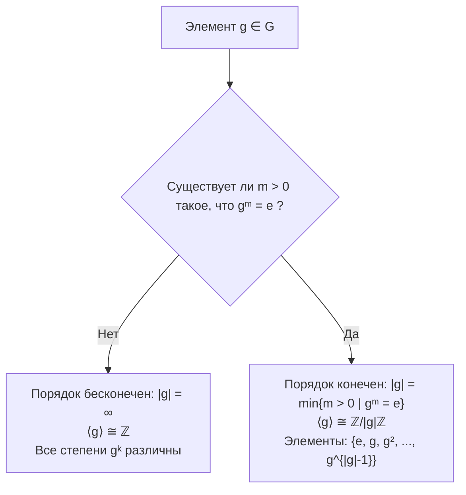
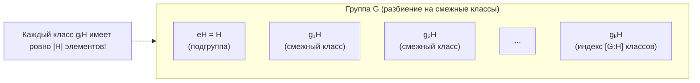
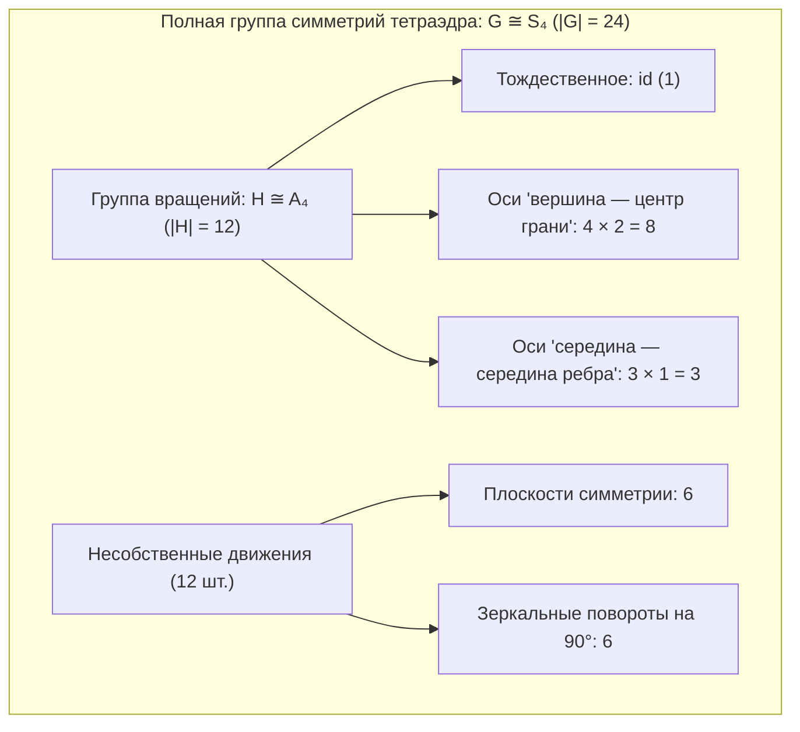
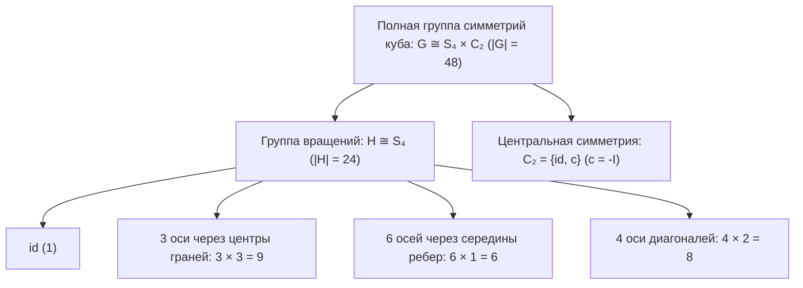
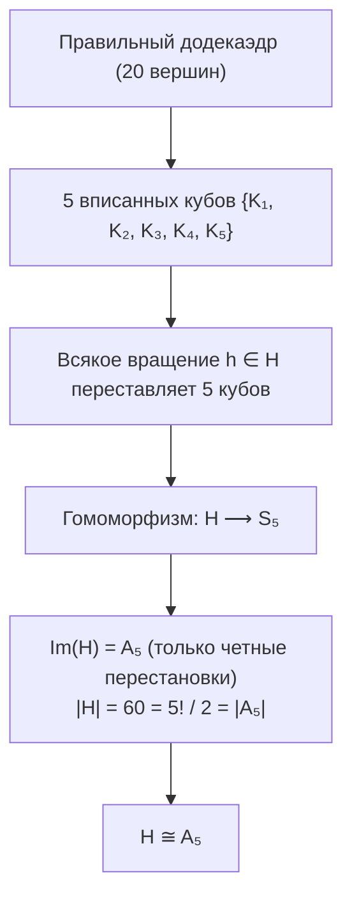

# 📝 Практика 4: Порядок элемента, теорема Лагранжа, конечное поле $\mathbb{F}_4$ и группы симметрий Платоновых тел

> [!abstract] О занятии
> - **Дисциплина:** [[Линейная алгебра]] (1 семестр)
> - **Дата проведения:** 25 сентября 2026 года (неделя 4, четная, пятница, 11:30 – 13:00)
> - **Аудитория:** 2133/1 (Кронверкский пр., д. 49, лит. А)
> - **Преподаватель практики:** Цветков Константин Борисович (ИТМО)
> - **Поток:** **Поток 2** (Software Engineering, Университет ИТМО)
> - **Первоисточники:** 7 фотоснимков аудиторной доски преподавателя Цветкова К.Б. (`temp/photo_1_2026-09-25_13-39-57.jpg` — `photo_7_2026-09-25_13-39-57.jpg`); академические монографии: Э. Б. Винберг («Курс алгебры», гл. 2 «Основы теории групп»), А. Л. Городенцев («Алгебра-1», гл. 2).
> - **Связанная лекция:** [[04. Лекция - Подгруппы, прямое произведение, гомоморфизмы и циклические группы (2026-09-24)|Лекция 4: Подгруппы, прямое произведение, гомоморфизмы и циклические группы (2026-09-24)]]
> - **Предыдущая практика:** [[03. Практика - Группы, гомоморфизмы, группа диэдра D3, подгруппы и кольца вычетов (2026-09-18)|Практика 3: Группы, гомоморфизмы, группа диэдра D3, подгруппы и кольца вычетов (2026-09-18)]]
> - **Хаб дисциплины:** [[Линейная алгебра]]
> - **Ключевые темы:** Теоретико-групповой порядок элемента $\operatorname{ord}(g) = |g| = |\langle g \rangle|$, минимальный положительный показатель $g^m = e$, деление с остатком и строгое доказательство теоремы о делимости $g^n = e \implies |g| \mid n$, изоморфизм циклических подгрупп $\langle g \rangle \cong \mathbb{Z}/|g|\mathbb{Z}$, формулировка и фундаментальное доказательство теоремы Лагранжа для подгрупп конечных групп $|G| = |H| \cdot [G : H]$, смежные классы и индекс подгруппы, теоретико-групповой вывод теоремы Эйлера и Малой теоремы Ферма, построение поля Галуа $\mathbb{F}_4$ ($\mathrm{GF}(4)$), доказательство невозможности изоморфизма с кольцом $\mathbb{Z}/4\mathbb{Z}$ через делители нуля, характеристика поля $\operatorname{char}(\mathbb{F}_4) = 2$, таблицы Кэли сложения и умножения поля $\mathbb{F}_4$, полиномиальная факторизация $\mathbb{F}_2[t] / (t^2 + t + 1)$, геометрический анализ собственных вращений и несобственных симметрий Платоновых тел: правильный тетраэдр ($H \cong A_4$, $G \cong S_4$), правильный куб ($H \cong S_4$, $G \cong S_4 \times C_2$), додекаэдр и икосаэдр ($H \cong A_5$, $G \cong A_5 \times C_2$).

---

## 📌 Краткое резюме (TL;DR)

1. **Порядок элемента ($\operatorname{ord}(g) = |g|$):**
   - Эквивалентно: мощность порожденной циклической подгруппы $|\langle g \rangle|$ или наименьшее натуральное $m \in \mathbb{N}_{>0}$ такое, что $g^m = e$ (если такого $m$ нет, то $|g| = \infty$).
   - **Теорема о делимости:** если $g^n = e$, то $|g|$ делит $n$ ($|g| \mid n$). Доказывается через деление с остатком: $n = |g| q + r$, где $0 \le r < |g|$, откуда $g^r = e \implies r = 0$.
   - **Классификация циклических подгрупп:** если $|g| < \infty$, то $\langle g \rangle = \{e, g, g^2, \dots, g^{|g|-1}\} \cong \mathbb{Z}/|g|\mathbb{Z}$ через $g^i \mapsto \bar{i}$; если $|g| = \infty$, то $\langle g \rangle \cong \mathbb{Z}$ через $g^i \mapsto i$.

2. **Теорема Лагранжа ($|G| = |H| \cdot [G : H]$):**
   - Для любой конечной группы $G$ и любой подгруппы $H \le G$ порядок подгруппы делит порядок группы: $|H| \mid |G|$.
   - Множество смежных классов $gH$ образует разбиение группы $G$ на непересекающиеся блоки одинаковой мощности $|H|$. Число этих блоков называется **индексом подгруппы** $[G : H]$.
   - **Следствия:**
     - Порядок любого элемента делит порядок группы: $\operatorname{ord}(g) \mid |G| \implies g^{|G|} = e$.
     - Для группы обратимых элементов $G = (\mathbb{Z}/n\mathbb{Z})^*$ мощности $\varphi(n)$ получаем **теорему Эйлера**: $a^{\varphi(n)} \equiv 1 \pmod n$.
     - Для простого модуля $p$ получаем **Малую теорему Ферма**: $a^{p-1} \equiv 1 \pmod p$.
     - Всякая группа простого порядка $p$ является циклической: $G \cong \mathbb{Z}/p\mathbb{Z}$.

3. **Конечное поле Галуа $\mathbb{F}_4$ ($\mathrm{GF}(4)$):**
   - Кольцо классов вычетов $\mathbb{Z}/4\mathbb{Z}$ **не является полем**, так как $2 \cdot 2 = 0 \pmod 4$ (содержит делители нуля).
   - Поле из 4 элементов строится как фактор-кольцо $\mathbb{F}_2[t] / (t^2 + t + 1)$ по неприводимому квадратичному многочлену над полем $\mathbb{F}_2$.
   - В поле $\mathbb{F}_4 = \{0, 1, x, x+1\}$ характеристика равна $2$ ($a + a = 0 \implies -a = a$), аддитивная группа изоморфна четверной группе Клейна $V_4 \cong \mathbb{Z}_2 \times \mathbb{Z}_2$, а мультипликативная группа $(\mathbb{F}_4)^*$ изоморфна циклической группе $C_3 = \{1, x, x^2\}$. Выполняются равенства: $x^2 = x + 1$ и $x(x+1) = 1$.

4. **Группы симметрий Платоновых тел (правильных многогранников):**
   - **Правильный тетраэдр:** $12$ вращений ($id$, $4 \times 2$ вокруг осей «вершина — грань», $3 \times 1$ вокруг осей через середины противоположных ребер). Группа вращений изоморфна знакопеременной группе $A_4$ (четные перестановки 4 вершин). Полная группа симметрий включает 12 несобственных симметрий (6 плоскостей отражения + 6 зеркальных поворотов на $90^\circ$) и изоморфна симметрической группе $S_4$ ($|S_4| = 24$).
   - **Правильный куб (гексаэдр):** $24$ вращения ($id$, $3 \times 3$ вокруг осей центров граней, $6 \times 1$ вокруг осей середин ребер, $4 \times 2$ вокруг пространственных диагоналей). Вращения взаимно однозначно соответствуют перестановкам 4 главных диагоналей $\implies H \cong S_4$. Куб обладает центром симметрии $c = -\mathbf{I}_3$, коммутирующим со всеми вращениями $\implies$ полная группа симметрий является прямым произведением $G \cong S_4 \times C_2$ ($|G| = 48$).
   - **Додекаэдр и икосаэдр (двойственные тела):** $60$ вращений ($id$, $4 \times 6 = 24$ вокруг осей противоположных вершин, $2 \times 10 = 20$ вокруг осей центров граней, $15$ вокруг осей середин ребер). В додекаэдр вписываются 5 кубов, и вращения индуцируют четные перестановки этих кубов $\implies H \cong A_5$ (простая знакопеременная группа). С учетом центральной инверсии полная группа симметрий равна $G \cong A_5 \times C_2$ ($|G| = 120$).

---

## 🧭 Навигация по конспекту

1. [Порядок элемента группы и циклические подгруппы](#1-порядок-элемента-группы-и-циклические-подгруппы)
   - [Определение и эквивалентность](#11-определение-порядка-элемента)
   - [Лемма о делении с остатком и делимость степени](#12-лемма-о-делении-с-остатком-и-делимость-степени)
   - [Изоморфизм циклических групп: классификация](#13-изоморфизм-циклических-групп-классификация)
2. [Теорема Лагранжа и смежные классы](#2-теорема-лагранжа-и-смежные-классы)
   - [Смежные классы и отношение эквивалентности](#21-смежные-классы-и-отношение-эквивалентности)
   - [Строгое доказательство теоремы Лагранжа](#22-строгое-доказательство-теоремы-лагранжа)
   - [Фундаментальные следствия: теоремы Эйлера и Ферма](#23-фундаментальные-следствия-теоремы-эйлера-и-ферма)
3. [Конечное поле Галуа F4: структура и таблицы Кэли](#3-конечное-поле-галуа-f4-структура-и-таблицы-кэли)
   - [Почему Z/4Z не поле? Проблема делителей нуля](#31-почему-z4z-не-поле-проблема-делителей- нуля)
   - [Построение F4 через фактор-кольцо многочленов](#32-построение-f4-через-фактор-кольцо-многочленов)
   - [Таблицы сложения и умножения Кэли для F4](#33-таблицы-сложения-и-умножения-кэли-для-f4)
4. [Геометрические симметрии правильного тетраэдра](#4-геометрические-симметрии-правильного-тетраэдра)
   - [Топология и оси вращения тетраэдра (12 элементов)](#41-топология-и-оси-вращения-тетраэдра-12-элементов)
   - [Изоморфизм группы вращений с знакопеременной группой A4](#42-изоморфизм-группы-вращений-с-знакопеременной-группой-a4)
   - [Несобственные симметрии и полная группа S4](#43-несобственные-симметрии-и-полная-группа-s4)
5. [Геометрические симметрии правильного куба](#5-геометрические-симметрии-правильного-куба)
   - [Классификация осей вращений куба (24 элемента)](#51-классификация-осей-вращений-куба-24-элемента)
   - [4 главные диагонали и изоморфизм группы вращений с S4](#52-4-главные-диагонали-и-изоморфизм-группы-вращений-с-s4)
   - [Центральная симметрия и прямое произведение S4 x C2](#53-центральная-симметрия-и-прямое-произведение-s4-x-c2)
6. [Геометрические симметрии додекаэдра и икосаэдра](#6-геометрические-симметрии-додекаэдра-и-икосаэдра)
   - [Двойственность и оси вращений (60 элементов)](#61-двойственность-и-оси-вращений-60-элементов)
   - [5 вписанных кубов и изоморфизм с простой группой A5](#62-5-вписанных-кубов-и-изоморфизм-с-простой-группой-a5)
   - [Полная группа симметрий A5 x C2 (120 элементов)](#63-полная-группа-симметрий-a5-x-c2-120-элементов)
7. [Сводная таблица симметрий всех тел Платона](#7-сводная-таблица-симметрий-всех-тел-платона)
8. [Предостережения и типовые ошибки на экзамене](#8-предостережения-и-типовые-ошибки-на-экзамене)
9. [Вопросы для самопроверки к экзамену](#9-вопросы-для-самопроверки-к-экзамену)

---

## 1. Порядок элемента группы и циклические подгруппы

### 1.1. Определение порядка элемента

Пусть $(G, \cdot)$ — произвольная группа с нейтральным элементом $e$, и $g \in G$.

Рассмотрим циклическую подгруппу $\langle g \rangle$, порожденную элементом $g$:
$$\langle g \rangle = \{g^k \mid k \in \mathbb{Z}\} = \{\dots, g^{-2}, g^{-1}, e, g, g^2, g^3, \dots\}$$

Существуют два эквивалентных определения порядка элемента:

> [!definition] Определение 1 (Теоретико-групповое)
> **Порядком элемента** $g \in G$ (обозначается $\operatorname{ord}(g)$ или $|g|$) называется мощность циклической подгруппы, порожденной элементом $g$:
> $$|g| \overset{\text{def}}{=} |\langle g \rangle|$$

> [!definition] Определение 2 (Арифметическое)
> Если существует натуральное число $m > 0$ такое, что $g^m = e$, то **порядком элемента** называется наименьшее такое натуральное число:
> $$|g| \overset{\text{def}}{=} \min \{m \in \mathbb{N}_{>0} \mid g^m = e\}$$
> Если такого натурального числа $m$ не существует (то есть $g^m \ne e$ для всех $m > 0$), то говорят, что элемент $g$ имеет **бесконечный порядок**: $|g| = \infty$.

---

### 1.2. Лемма о делении с остатком и делимость степени

На аудиторной доске (фото 1) преподаватель Цветков К.Б. выписал фундаментальный вывод: что происходит, если две степени элемента совпадают?

Пусть существуют такие целые показатели $k, l \in \mathbb{Z}$ ($k > l$), что:
$$g^k = g^l$$

Умножим обе части равенства справа на $g^{-l}$:
$$g^k \cdot g^{-l} = g^l \cdot g^{-l} \implies g^{k-l} = e$$
Так как $k > l$, показатель $m = k - l$ является строго положительным натуральным числом ($m > 0$), дающим нейтральный элемент $g^m = e$.

Отсюда следует, что непустое множество $\{m \in \mathbb{N}_{>0} \mid g^m = e\} \subseteq \mathbb{N}$ по принципу наименьшего элемента (аксиоме вполне упорядоченности $\mathbb{N}$) содержит минимальный элемент:
$$|g| = \min \{m > 0 \mid g^m = e\}$$

Сформулируем и докажем ключевую теорему о делимости:

> [!theorem] Теорема о делимости степени на порядок
> Пусть $g \in G$ — элемент конечного порядка $|g|$. Равенство $g^n = e$ для целого $n \in \mathbb{Z}$ выполняется тогда и только тогда, когда $n$ делится на $|g|$:
> $$g^n = e \iff |g| \mid n$$

> [!proof] Доказательство (по методу Цветкова К.Б. через деление с остатком)
> 1. $(\Leftarrow)$ Пусть $n$ делится на $|g|$, то есть $n = |g| \cdot q$ для некоторого $q \in \mathbb{Z}$. Тогда:
>    $$g^n = g^{|g| \cdot q} = \left(g^{|g|}\right)^q = e^q = e$$
> 
> 2. $(\Rightarrow)$ Пусть $g^n = e$. Разделим целое число $n$ на натуральное число $|g|$ с остатком по теореме о делении в кольце $\mathbb{Z}$:
>    $$n = |g| \cdot q + r, \quad \text{где } 0 \le r < |g|$$
>    Подставим это представление в выражение для степени элемента:
>    $$e = g^n = g^{|g| \cdot q + r} = \left(g^{|g|}\right)^q \cdot g^r = e^q \cdot g^r = e \cdot g^r = g^r$$
>    Получили, что $g^r = e$.
>    Однако по условию деления остаток строго меньше порядка: $0 \le r < |g|$.
>    Если бы $r > 0$, то $r$ было бы натуральным числом, строго меньшим $|g|$, удовлетворяющим условию $g^r = e$. Это прямо противоречит определению $|g|$ как **наименьшего** положительного показателя с таким свойством!
>    Следовательно, единственный возможный вариант:
>    $$r = 0 \implies n = |g| \cdot q \implies |g| \mid n$$
>    Теорема полностью доказана. $\blacksquare$

---

### 1.3. Изоморфизм циклических групп: классификация

Из теоремы о делимости вытекает исчерпывающее описание структуры порожденной циклической подгруппы $\langle g \rangle$:

1. **Случай $|g| = m < \infty$:**
   Все элементы множества:
   $$\{e, g, g^2, g^3, \dots, g^{m-1}\}$$
   попарно различны. Действительно, если бы $g^i = g^j$ при $0 \le j < i < m$, то $g^{i-j} = e$, где $0 < i - j < m$, что противоречит минимальности $m$.
   Любая другая степень $g^k$ ($k \in \mathbb{Z}$) представляется в виде $k = mq + r$ ($0 \le r < m$), откуда $g^k = g^r$.
   Следовательно:
   $$\langle g \rangle = \{e, g, g^2, \dots, g^{m-1}\}, \quad |\langle g \rangle| = m$$
   Отображение:
   $$\psi: \langle g \rangle \xrightarrow{\sim} \mathbb{Z}/m\mathbb{Z}, \quad g^i \mapsto \bar{i} = [i]_m$$
   является корректно определенным изоморфизмом групп:
   $$\psi(g^i \cdot g^j) = \psi(g^{i+j}) = \overline{i+j} = \bar{i} + \bar{j} = \psi(g^i) + \psi(g^j)$$

2. **Случай $|g| = \infty$:**
   Все степени $g^k$ ($k \in \mathbb{Z}$) попарно различны:
   $$\forall k \ne l \implies g^k \ne g^l$$
   Циклическая подгруппа бесконечна:
   $$\langle g \rangle = \{\dots, g^{-2}, g^{-1}, e, g, g^2, \dots\} \cong (\mathbb{Z}, +)$$
   посредством канонического изоморфизма $g^i \mapsto i$.

---

## 2. Теорема Лагранжа и смежные классы

### 2.1. Смежные классы и отношение эквивалентности

Пусть $G$ — группа, и $H \le G$ — ее подгруппа.

> [!definition] Левый смежный класс
> Для каждого фиксированного элемента $g \in G$ **левым смежным классом** группы $G$ по подгруппе $H$ называется подмножество:
> $$gH = \{g \cdot h \mid h \in H\}$$
> Аналогично определяется правый смежный класс $Hg = \{h \cdot g \mid h \in H\}$.

Введем на элементах группы $G$ бинарное отношение $\sim_L$:
$$x \sim_L y \overset{\text{def}}{\iff} x^{-1}y \in H$$

Проверим три аксиомы отношения эквивалентности:
1. **Рефлексивность:** $x^{-1}x = e \in H \implies x \sim_L x$.
2. **Симметричность:** если $x \sim_L y$, то $x^{-1}y \in H$. Так как $H$ — подгруппа, обратный элемент также принадлежит $H$:
   $$(x^{-1}y)^{-1} = y^{-1}(x^{-1})^{-1} = y^{-1}x \in H \implies y \sim_L x$$
3. **Транзитивность:** если $x \sim_L y$ и $y \sim_L z$, то $x^{-1}y \in H$ и $y^{-1}z \in H$. В силу замкнутости $H$ относительно умножения:
   $$(x^{-1}y) \cdot (y^{-1}z) = x^{-1}(y y^{-1})z = x^{-1} e z = x^{-1}z \in H \implies x \sim_L z$$

Следовательно, $\sim_L$ — отношение эквивалентности, а левые смежные классы $gH$ в точности являются **классами эквивалентности** этого отношения!

> [!property] Свойства смежных классов
> 1. Два левых смежных класса $xH$ и $yH$ либо не пересекаются, либо полностью совпадают:
>    $$xH \cap yH \ne \varnothing \iff xH = yH \iff x^{-1}y \in H$$
> 2. Каждый элемент $g \in G$ принадлежит своему классу: $g = g \cdot e \in gH$.
> 3. Вся группа $G$ распадается в дизъюнктное объединение попарно непересекающихся левых смежных классов:
>    $$G = \bigsqcup_{i \in I} g_i H$$

---

### 2.2. Строгое доказательство теоремы Лагранжа

> [!lemma] Равномощность смежных классов
> Для любого элемента $g \in G$ отображение сдвига:
> $$\lambda_g: H \to gH, \quad h \mapsto g \cdot h$$
> является биекцией. В частности, для любого $g \in G$:
> $$|gH| = |H|$$

> [!proof] Доказательство леммы
> - **Сюръективность:** по определению смежного класса $gH$, любой его элемент имеет вид $gh$ для некоторого $h \in H$, то есть является образом $\lambda_g(h)$.
> - **Инъективность:** пусть $\lambda_g(h_1) = \lambda_g(h_2)$, то есть $g h_1 = g h_2$. Умножая обе части слева на $g^{-1}$, получаем $h_1 = h_2$.
> Следовательно, $\lambda_g$ — биекция, и $|gH| = |H|$. $\blacksquare$

Теперь сформулируем главную теорему с доски занятия (фото 2):

> [!theorem] Теорема Лагранжа
> Пусть $G$ — конечная группа ($|G| < \infty$) и $H \le G$ — ее подгруппа. Тогда:
> 1. Порядок подгруппы $H$ делит порядок группы $G$:
>    $$|H| \mid |G|$$
> 2. Порядок группы равен произведению порядка подгруппы на индекс подгруппы:
>    $$|G| = |H| \cdot [G : H]$$
>    где $[G : H]$ — число различных левых смежных классов (индекс подгруппы $H$ в $G$).

> [!proof] Доказательство
> Так как отношение $\sim_L$ разбивает множество $G$ на попарно непересекающиеся классы эквивалентности $g_1 H, g_2 H, \dots, g_k H$, где $k = [G : H]$:
> $$G = g_1 H \sqcup g_2 H \sqcup \dots \sqcup g_k H$$
> Мощность дизъюнктного объединения конечных множеств равна сумме мощностей:
> $$|G| = \sum_{i=1}^k |g_i H|$$
> Но по доказанной лемме $|g_i H| = |H|$ для каждого $i \in \{1, \dots, k\}$. Следовательно:
> $$|G| = \sum_{i=1}^k |H| = k \cdot |H| = [G : H] \cdot |H|$$
> Так как $[G : H]$ — целое число, получаем $|H| \mid |G|$. $\blacksquare$

---

### 2.3. Фундаментальные следствия теоремы Лагранжа

Из теоремы Лагранжа немедленно вытекает каскад классических результатов теории групп и теории чисел (фото 2):

#### 1. Делимость порядка любого элемента
Для любого элемента $g \in G$ рассмотрим циклическую подгруппу $H = \langle g \rangle$.  
По определению порядка $|H| = |g|$. По теореме Лагранжа $|H|$ делит $|G|$, следовательно:
$$\forall g \in G \implies |g| \mid |G|$$

#### 2. Универсальное аннулирование степени $|G|$
Так как $|g|$ делит $|G|$, то $|G| = |g| \cdot q$. Возводя элемент $g$ в степень $|G|$:
$$g^{|G|} = g^{|g| \cdot q} = \left(g^{|g|}\right)^q = e^q = e$$

> [!corollary] Универсальное равенство
> В любой конечной группе $G$ для каждого элемента $g \in G$:
> $$g^{|G|} = e$$

#### 3. Теорема Эйлера в теории чисел
Рассмотрим мультипликативную группу обратимых элементов кольца вычетов:
$$G = (\mathbb{Z}/n\mathbb{Z})^* = \{[a]_n \in \mathbb{Z}/n\mathbb{Z} \mid \gcd(a, n) = 1\}$$
Порядок этой группы по определению функции Эйлера равен:
$$|G| = \varphi(n)$$
Применяя универсальное следствие теоремы Лагранжа к любому элементу $a \in (\mathbb{Z}/n\mathbb{Z})^*$:
$$a^{|G|} = a^{\varphi(n)} \equiv 1 \pmod n$$
что в точности дает классическую **теорему Эйлера**!

#### 4. Малая теорема Ферма
Если модуль $n = p$ — простое число, то все ненулевые вычеты обратимы:
$$(\mathbb{Z}/p\mathbb{Z})^* = \{1, 2, \dots, p-1\}, \quad \varphi(p) = p - 1$$
Для любого целого $a \not\equiv 0 \pmod p$:
$$a^{p-1} \equiv 1 \pmod p$$
что дает **Малую теорему Ферма**.

#### 5. Простота порядка влечет цикличность
Если порядок группы $|G| = p$ — простое число, то по теореме Лагранжа любая ее подгруппа $H \le G$ может иметь порядок только $1$ или $p$.  
Взяв любой элемент $g \ne e$, получаем $|\langle g \rangle| > 1 \implies |\langle g \rangle| = p \implies \langle g \rangle = G$.  
Следовательно:
$$|G| = p \implies G \cong \mathbb{Z}/p\mathbb{Z}$$
Всякая группа простого порядка циклическая, абелева и не содержит нетривиальных собственных подгрупп (является простой группой).

---

## 3. Конечное поле Галуа $\mathbb{F}_4$: структура и таблицы Кэли

### 3.1. Почему $\mathbb{Z}/4\mathbb{Z}$ не поле? Проблема делителей нуля

На фото 3 преподаватель Цветков К.Б. выписал заглавное предостережение:
$$\mathbb{Z}/4\mathbb{Z} \ne \mathbb{F}_4$$

Разберем математическую причину:

В кольце классов вычетов по составному модулю $4$:
$$\mathbb{Z}/4\mathbb{Z} = \{\bar{0}, \bar{1}, \bar{2}, \bar{3}\}$$
Вычислим произведение ненулевого элемента $\bar{2}$ самого на себя:
$$\bar{2} \cdot \bar{2} = \bar{4} \equiv \bar{0} \pmod 4$$
Мы получили, что произведение двух ненулевых элементов равно нулю! Элемент $\bar{2}$ является **делителем нуля**.

> [!warning] Принцип целостности поля
> В любом поле $F$ делители нуля отсутствуют: если $a \cdot b = 0$, то либо $a = 0$, либо $b = 0$.  
> Действительно, если $a \ne 0$, то существует обратный $a^{-1}$, умножив на который получаем:
> $$a^{-1} (a \cdot b) = a^{-1} \cdot 0 \implies (a^{-1} a) b = 0 \implies 1 \cdot b = 0 \implies b = 0$$
> Следовательно, **кольцо $\mathbb{Z}/4\mathbb{Z}$ полем быть не может**!

---

### 3.2. Построение $\mathbb{F}_4$ через фактор-кольцо многочленов

Как же устроено истинное поле из 4 элементов $\mathbb{F}_4$ (поле Галуа $\mathrm{GF}(4)$)?

По общей теории полей Галуа число элементов любого конечного поля обязано быть степенью простого числа: $|F| = p^k$. Здесь $p = 2$, $k = 2$.
Характеристика поля $\mathbb{F}_4$ равна $p = 2$. Это означает, что для любого элемента $z \in \mathbb{F}_4$:
$$z + z = (1 + 1) \cdot z = 0 \cdot z = 0 \implies -z = z$$
Каждый элемент поля в характеристике 2 противоположен сам себе!

Поле $\mathbb{F}_4$ строится как фактор-кольцо кольца многочленов $\mathbb{F}_2[t]$ по идеалу, порожденному неприводимым многочленом степени 2:
$$\mathbb{F}_4 \cong \mathbb{F}_2[t] / (t^2 + t + 1)$$

Проверим неприводимость квадратичного многочлена $P(t) = t^2 + t + 1$ над полем $\mathbb{F}_2 = \{0, 1\}$:
- $P(0) = 0^2 + 0 + 1 = 1 \ne 0$;
- $P(1) = 1^2 + 1 + 1 = 3 \equiv 1 \ne 0$.
Многочлен степени 2 не имеет корней в поле $\mathbb{F}_2$, следовательно, он **неприводим** над $\mathbb{F}_2$.

Обозначим класс переменной $[t]$ через $x$. Тогда в фактор-кольце выполняется определяющее соотношение:
$$x^2 + x + 1 = 0 \implies x^2 = -x - 1$$
Так как в поле характеристики 2 $-1 = 1$ и $-x = x$ (на доске выписано: $t^2 - t - 1 = t^2 + t + 1$), получаем:
$$x^2 = x + 1$$

Положив $y = x + 1$, получаем четыре элемента поля:
$$\mathbb{F}_4 = \{0, 1, x, y\} = \{0, 1, x, x+1\}$$

Вычислим степени элемента $x$:
- $x^0 = 1$
- $x^1 = x$
- $x^2 = y = x + 1$
- $x^3 = x \cdot x^2 = x(x+1) = x^2 + x = (x+1) + x = 2x + 1 = 0 \cdot x + 1 = 1$
- $y^2 = (x+1)^2 = x^2 + 2x + 1 = x^2 + 0 + 1 = (x+1) + 1 = x + 2 = x$
- $x \cdot y = x(x+1) = 1$

Мультипликативная группа ненулевых элементов $(\mathbb{F}_4)^* = \{1, x, y\}$ является циклической группой порядка 3, порожденной элементом $x$:
$$\langle x \rangle = \{1, x, x^2\} \cong C_3$$

---

### 3.3. Таблицы сложения и умножения Кэли для $\mathbb{F}_4$

Воспроизведем в точности полные таблицы операций с доски (фото 3):

#### Таблица сложения $(\mathbb{F}_4, +)$

Так как $\operatorname{char}(\mathbb{F}_4) = 2$, диагональ таблицы заполнена нулями ($a + a = 0$):

| $+$ | **0** | **1** | **$x$** | **$y$** |
| :---: | :---: | :---: | :---: | :---: |
| **0** | $0$ | $1$ | $x$ | $y$ |
| **1** | $1$ | $0$ | $y$ | $x$ |
| **$x$** | $x$ | $y$ | $0$ | $1$ |
| **$y$** | $y$ | $x$ | $1$ | $0$ |

> [!note] Структура аддитивной группы
> Аддитивная группа $(\mathbb{F}_4, +)$ изоморфна четверной группе Клейна:
> $$(\mathbb{F}_4, +) \cong V_4 \cong \mathbb{Z}/2\mathbb{Z} \times \mathbb{Z}/2\mathbb{Z}$$
> В ней каждый ненулевой элемент имеет порядок $2$.

#### Таблица умножения $(\mathbb{F}_4, \cdot)$

Ненулевые элементы образуют циклическую группу порядка 3: $x^2 = y$, $y^2 = x$, $xy = 1$:

| $\times$ | **0** | **1** | **$x$** | **$y$** |
| :---: | :---: | :---: | :---: | :---: |
| **0** | $0$ | $0$ | $0$ | $0$ |
| **1** | $0$ | $1$ | $x$ | $y$ |
| **$x$** | $0$ | $x$ | $y$ | $1$ |
| **$y$** | $0$ | $y$ | $1$ | $x$ |

Проверка ассоциативности и дистрибутивности гарантируется тем, что $\mathbb{F}_4$ построено как фактор-кольцо ассоциативно-коммутативного кольца многочленов $\mathbb{F}_2[t]$ по максимальному идеалу $(t^2+t+1)$.

---

## 4. Геометрические симметрии правильного тетраэдра

Правильный тетраэдр имеет $V = 4$ вершины, $F = 4$ грани (правильные треугольники) и $E = 6$ ребер.

### 4.1. Топология и оси вращения тетраэдра (12 элементов)

На фото 4 преподаватель Цветков К.Б. выписал классификацию $12$ собственных вращений тетраэдра:

1. **Тождественное преобразование:**
   $$id \quad (1 \text{ штука})$$

2. **Вращения вокруг осей «вершина — центр противоположной грани»:**
   - Тетраэдр имеет 4 вершины. Прямая, соединяющая вершину с центром противоположной грани, является осью симметрии порядка 3.
   - Вокруг каждой из 4 осей возможны два нетривиальных поворота: на угол $+120^\circ$ ($\frac{2\pi}{3}$) и $+240^\circ$ ($\frac{4\pi}{3}$).
   - Всего вращений:
     $$4 \cdot 2 = 8 \text{ элементов}$$

3. **Вращения вокруг осей, соединяющих середины противоположных скрещивающихся ребер:**
   - 6 ребер тетраэдра разбиваются на 3 пары скрещивающихся противоположных ребер.
   - Прямая, проходящая через их середины, перпендикулярна обоим ребрам и является осью симметрии порядка 2.
   - Вокруг каждой оси возможен поворот на угол $180^\circ$ ($\pi$).
   - Всего вращений:
     $$3 \cdot 1 = 3 \text{ элемента}$$

**Сумма вращений:**
$$|H| = 1 + 8 + 3 = 12$$

---

### 4.2. Изоморфизм группы вращений с знакопеременной группой $A_4$

Пронумеруем 4 вершины тетраэдра числами $\{1, 2, 3, 4\}$.
Любое движение тетраэдра сохраняет расстояния между вершинами, поэтому однозначно задается перестановкой множества вершин $\{1, 2, 3, 4\}$, то есть гомоморфизмом в симметрическую группу:
$$\Phi: H \hookrightarrow S_4$$

Проанализируем тип перестановок для каждого типа вращений:
1. $id \mapsto ()$ — четная перестановка (0 транспозиций).
2. Поворот вокруг оси «вершина $4$ — центр грани $(1\,2\,3)$» оставляет вершину $4$ на месте и циклически переставляет вершины грани $(1\,2\,3)$. Это 3-цикл:
   $$(1\,2\,3) = (1\,3)(1\,2)$$
   3-цикл раскладывается в 2 транспозиции, следовательно, это **четная перестановка**!  
   Всего существует $\binom{4}{3} \cdot 2 = 8$ таких 3-циклов в $S_4$.
3. Поворот на $180^\circ$ вокруг оси, соединяющей ребра $(1\,2)$ и $(3\,4)$, меняет местами вершины $1 \leftrightarrow 2$ и $3 \leftrightarrow 4$. Это произведение двух независимых транспозиций:
   $$(1\,2)(3\,4)$$
   Произведение двух транспозиций — **четная перестановка**!  
   Всего таких элементов в $S_4$ ровно 3: $(1\,2)(3\,4)$, $(1\,3)(2\,4)$, $(1\,4)(2\,3)$.

Все 12 вращений тетраэдра отображаются в **четные перестановки** 4 элементов:
$$\mathrm{Im}(\Phi) = A_4$$
Так как ядерных вращений нет ($\operatorname{Ker}\Phi = \{id\}$), отображение $\Phi$ инъективно, а в силу равенства мощностей $|H| = 12 = |A_4|$:
$$H \cong A_4$$

---

### 4.3. Несобственные симметрии и полная группа $S_4$

Всякое движение трехмерного пространства, переводящее тетраэдр в себя, имеет определитель матрицы перехода $\det M \in \{+1, -1\}$.
- Движения с $\det M = +1$ — это собственные вращения (группа $H \cong A_4$).
- Движения с $\det M = -1$ — это несобственные движения (отражения и зеркальные повороты).

На фото 4 детально зафиксированы $12$ несобственных симметрий тетраэдра:

1. **Плоскости симметрии (отражения):**
   - Плоскость проходит через одно ребро тетраэдра и делит пополам противоположное ребро (проходя через его середину и противоположные вершины).
   - Всего ребер 6 $\implies$ существует **6 плоскостей отражения**.
   - Отражение в плоскости, проходящей через ребро $(3\,4)$, оставляет вершины $3$ и $4$ неподвижными, а вершины $1$ и $2$ меняет местами. В терминах перестановок это транспозиция:
     $$(1\,2)$$
   - Транспозиция является **нечетной перестановкой**. Всего в $S_4$ ровно $\binom{4}{2} = 6$ транспозиций.

2. **Зеркальные повороты (композиция симметрии и поворота):**
   - Вокруг 3 осей, соединяющих середины противоположных ребер, можно выполнить поворот на угол $90^\circ$ с последующим отражением в плоскости, перпендикулярной этой оси.
   - Каждая из 3 осей дает 2 таких движения $\implies$ **6 зеркальных поворотов**.
   - В терминах перестановок это 4-циклы: $(1\,2\,3\,4)$, $(1\,4\,3\,2)$ и т.д.
   - 4-цикл раскладывается в 3 транспозиции: $(1\,2\,3\,4) = (1\,4)(1\,3)(1\,2)$, то есть является **нечетной перестановкой**. В $S_4$ ровно $3! = 6$ четырехэлементных циклов.

Полная группа симметрий правильного тетраэдра содержит:
$$|G| = 12 \text{ (вращения)} + 12 \text{ (симметрии)} = 24$$
Отображение $\Psi: G \to S_4$ устанавливает **изоморфизм полной группы симметрий тетраэдра с симметрической группой $S_4$**:
$$G \cong S_4$$
При этом подгруппа вращений $H \cong A_4$ является нормальной подгруппой индекса $[G : H] = 2$.

> [!tip] Закон сокращения
> На доске выписано соотношение:
> $$s r_1 = s r_2 \implies r_1 = r_2$$
> Если $s$ — любое фиксированное несобственное движение (например, плоскостное отражение), то левый сдвиг $r \mapsto s r$ осуществляет биекцию между множеством вращений $H$ и множеством несобственных симметрий $G \setminus H$.

---

## 5. Геометрические симметрии правильного куба

Правильный куб (гексаэдр) имеет $V = 8$ вершин, $F = 6$ квадратных граней и $E = 12$ ребер.

### 5.1. Классификация осей вращений куба (24 элемента)

На фото 5 и 6 преподаватель Цветков К.Б. зафиксировал полный перечень $24$ вращений куба:

1. **Тождественное преобразование:**
   $$id \quad (1 \text{ элемент})$$

2. **Оси, соединяющие центры противоположных граней:**
   - 6 граней куба образуют 3 пары противоположных граней $\implies$ **3 координатные оси**.
   - Вокруг каждой оси возможны повороты на углы $90^\circ, 180^\circ, 270^\circ$.
   - Число вращений:
     $$3 \cdot 3 = 9 \text{ элементов}$$

3. **Оси, соединяющие середины противоположных параллельных ребер:**
   - 12 ребер образуют 6 пар противоположных ребер $\implies$ **6 осей**.
   - Поворот вокруг каждой оси возможен на угол $180^\circ$.
   - Число вращений:
     $$6 \cdot 1 = 6 \text{ элементов}$$

4. **Оси, соединяющие противоположные вершины (пространственные диагонали):**
   - 8 вершин образуют 4 пары диаметрально противоположных вершин $\implies$ **4 главные диагонали**.
   - Вокруг каждой диагонали возможны повороты на углы $120^\circ$ и $240^\circ$.
   - Число вращений:
     $$4 \cdot 2 = 8 \text{ элементов}$$

**Итого число вращений:**
$$|H| = 1 + 9 + 6 + 8 = 24$$

---

### 5.2. 4 главные диагонали и изоморфизм группы вращений с $S_4$

Почему группа вращений куба $H$ изоморфна именно симметрической группе $S_4$, а не какой-либо другой группе порядка 24?

Куб имеет ровно 4 пространственные диагонали: $d_1, d_2, d_3, d_4$.
Всякое непрерывное вращение куба переводит вершины в вершины, а противоположные вершины — в противоположные. Следовательно, всякое вращение переводит главную диагональ в главную диагональ!

Это задает гомоморфизм:
$$\Theta: H \to S(\{d_1, d_2, d_3, d_4\}) \cong S_4$$

- **Проверка инъективности:**
  Если вращение куба оставляет на месте все 4 диагонали, то оно обязано оставлять на месте каждую пару противоположных вершин. Единственное собственное вращение пространства $\mathbb{R}^3$, фиксирующее 4 неколлинеарные прямые — это тождественное вращение $id$.  
  Значит, $\operatorname{Ker}\Theta = \{id\}$, и гомоморфизм $\Theta$ инъективен.
- **Сравнение порядков:**
  $$|H| = 24 = 4! = |S_4|$$

Следовательно, отображение $\Theta$ является изоморфизмом:
$$H \cong S_4$$

Каждое вращение куба взаимно однозначно соответствует перестановке 4 пространственных диагоналей куба:
- Повороты на $90^\circ$ вокруг осей граней соответствуют 4-циклам диагоналей (6 шт.);
- Повороты на $180^\circ$ вокруг осей граней соответствуют произведениям двух независимых транспозиций диагоналей (3 шт.);
- Повороты на $180^\circ$ вокруг осей ребер соответствуют транспозициям двух диагоналей (6 шт.);
- Повороты на $120^\circ$ вокруг самих диагоналей фиксируют одну диагональ и циклически переставляют три остальные — соответствуют 3-циклам (8 шт.).

---

### 5.3. Центральная симметрия и прямое произведение $S_4 \times C_2$

Куб обладает центром симметрии (началом координат при расположении куба $[-1, 1]^3$).
Оператор центральной инверсии задается матрицей:
$$c = -\mathbf{I}_3 = \begin{pmatrix} -1 & 0 & 0 \\ 0 & -1 & 0 \\ 0 & 0 & -1 \end{pmatrix}$$
Заметим свойства $c$:
1. $c^2 = (-\mathbf{I}_3)^2 = \mathbf{I}_3 = id$, поэтому порожденная циклическая подгруппа $C_2 = \{id, c\}$ имеет порядок 2.
2. $\det(c) = (-1)^3 = -1 \ne +1$, поэтому $c \notin H$ (инверсия меняет ориентацию пространства и не является вращением).
3. Матрица $c = -\mathbf{I}_3$ является скалярной и коммутирует с **любой** матрицей вращения $A \in \mathrm{SO}(3)$:
   $$\forall x \in H \implies c \cdot x = (-\mathbf{I}_3) A = -A = A (-\mathbf{I}_3) = x \cdot c$$

Следовательно, подгруппа $C_2$ лежит в центре полной группы симметрий $G$.

> [!theorem] Изоморфизм полной группы симметрий куба
> Отображение прямого произведения:
> $$\Phi: H \times C_2 \to G, \quad (x, y) \mapsto x \cdot y$$
> является изоморфизмом групп. Полная группа симметрий куба изоморфна:
> $$G \cong S_4 \times C_2 \cong S_4 \times \mathbb{Z}/2\mathbb{Z}$$
> Порядок полной группы равен:
> $$|G| = |S_4| \cdot |C_2| = 24 \cdot 2 = 48$$

Разбор 24 несобственных симметрий куба ($G \setminus H$):
- $1$ центральная симметрия $c$;
- $3$ плоскости отражения, параллельные граням куба (проходят через середины ребер параллельно граням);
- $6$ плоскостей диагонального отражения (проходят через противоположные ребра);
- $8$ зеркальных поворотов вокруг диагоналей куба на углы $60^\circ$ и $300^\circ$;
- $6$ зеркальных поворотов вокруг осей центров граней на углы $90^\circ$ и $270^\circ$.
Сумма: $1 + 3 + 6 + 8 + 6 = 24$ несобственных элемента.

---

## 6. Геометрические симметрии додекаэдра и икосаэдра

### 6.1. Двойственность и оси вращений (60 элементов)

Правильный додекаэдр имеет 12 пятиугольных граней, 20 вершин и 30 ребер.  
Правильный икосаэдр имеет 20 треугольных граней, 12 вершин и 30 ребер.

> [!note] Принцип двойственности
> Центры граней додекаэдра образуют вершины правильного икосаэдра, и наоборот.  
> Поэтому **группы собственных вращений и полные группы симметрий додекаэдра и икосаэдра совпадают**!

На фото 7 преподаватель Цветков К.Б. выписал точный баланс $60$ вращений:

1. **Тождественное вращение:**
   $$id \quad (1 \text{ элемент})$$

2. **Оси, проходящие через противоположные вершины икосаэдра (или центры граней додекаэдра):**
   - У икосаэдра 12 вершин $\implies$ **6 осей симметрии порядка 5**.
   - Вокруг каждой оси возможны 4 нетривиальных поворота: на $72^\circ, 144^\circ, 216^\circ, 288^\circ$ ($\frac{2\pi k}{5}$, $k=1,2,3,4$).
   - На доске зафиксировано:
     $$4 \cdot 6 = 24 \text{ элемента}$$

3. **Оси, проходящие через центры граней икосаэдра (или противоположные вершины додекаэдра):**
   - У икосаэдра 20 граней $\implies$ **10 осей симметрии порядка 3**.
   - Вокруг каждой оси возможны 2 нетривиальных поворота: на $120^\circ$ и $240^\circ$.
   - На доске зафиксировано:
     $$2 \cdot 10 = 20 \text{ элементов}$$

4. **Оси, проходящие через середины противоположных ребер:**
   - 30 ребер $\implies$ **15 осей симметрии порядка 2**.
   - Вокруг каждой оси возможен 1 поворот на $180^\circ$.
   - На доске зафиксировано:
     $$15 \text{ элементов}$$

**Сумма вращений:**
$$|H| = 1 + 24 + 20 + 15 = 60$$

---

### 6.2. 5 вписанных кубов и изоморфизм с простой группой $A_5$

Группа порядка 60 изоморфна знакопеременной группе $A_5$:
$$H \cong A_5$$

**Геометрическая конструкция 5 кубов Кеплера:**
В правильный додекаэдр с 20 вершинами можно вписать ровно **5 правильных кубов**, вершины которых лежат в вершинах додекаэдра (каждый куб использует 8 вершин из 20, причем каждое ребро куба является диагональю пятиугольной грани додекаэдра).

Всякое собственное вращение додекаэдра переводит вписанный куб во вписанный куб, индуцируя перестановку на множестве 5 кубов $\{K_1, K_2, K_3, K_4, K_5\}$.  
Так как повороты непрерывны, они сохраняют ориентацию и задают **только четные перестановки**.
Поскольку ядро гомоморфизма тривиально, получаем изоморфизм:
$$H \cong A_5$$

> [!important] Академическое значение группы $A_5$
> Знакопеременная группа $A_5$ является **наименьшей неабелевой простой группой** (в ней нет нетривиальных нормальных подгрупп).  
> Именно неразрешимость группы $A_5$ в радикалах лежит в основе знаменитой теоремы Абеля — Руффини о неразрешимости общего алгебраического уравнения 5-й степени в радикалах!

---

### 6.3. Полная группа симметрий $A_5 \times C_2$ (120 элементов)

И додекаэдр, и икосаэдр обладают центром симметрии $c = -\mathbf{I}_3$.  
Центральная инверсия коммутирует со всеми вращениями группы $H \cong A_5$.

Следовательно, полная группа симметрий (включая все плоскости отражения и зеркальные повороты) равна прямому произведению:
$$G \cong H \times C_2 \cong A_5 \times C_2 \cong A_5 \times \mathbb{Z}/2\mathbb{Z}$$
Порядок полной группы симметрий равен:
$$|G| = 60 \cdot 2 = 120$$

---

## 7. Сводная таблица симметрий всех тел Платона

Ниже приведена итоговая аналитическая таблица симметрий всех правильных многогранников трехмерного евклидова пространства:

| Многогранник | Вершины $V$ | Грани $F$ | Ребра $E$ | Двойственное тело | Группа вращений $H \le \mathrm{SO}(3)$ | Полная группа симметрий $G \le \mathrm{O}(3)$ | Порядок $\vert G \vert$ |
| :--- | :---: | :---: | :---: | :--- | :---: | :---: | :---: |
| **Тетраэдр** | 4 | 4 | 6 | Самодвойственен | **$A_4$** ($12$) | **$S_4$** | **$24$** |
| **Куб (гексаэдр)** | 8 | 6 | 12 | Октаэдр | **$S_4$** ($24$) | **$S_4 \times C_2$** | **$48$** |
| **Октаэдр** | 6 | 8 | 12 | Куб | **$S_4$** ($24$) | **$S_4 \times C_2$** | **$48$** |
| **Додекаэдр** | 20 | 12 | 30 | Икосаэдр | **$A_5$** ($60$) | **$A_5 \times C_2$** | **$120$** |
| **Икосаэдр** | 12 | 20 | 30 | Додекаэдр | **$A_5$** ($60$) | **$A_5 \times C_2$** | **$120$** |

---

## 8. Предостережения и типовые ошибки на экзамене

> [!caution] Топ-5 опасных ошибок студентов
> 1. **Путаница $\mathbb{Z}/4\mathbb{Z}$ и поля $\mathbb{F}_4$:**
>    - *Ошибка:* Называть $\mathbb{Z}/4\mathbb{Z}$ полем из 4 элементов.
>    - *Правильно:* $\mathbb{Z}/4\mathbb{Z}$ — кольцо с делителями нуля ($2 \cdot 2 = 0$). Поле $\mathbb{F}_4$ имеет характеристику 2, в нем $1+1=0$, а элементы представляются как $\{0, 1, x, x+1\}$ с соотношением $x^2 = x+1$.
> 
> 2. **Неверная формулировка обратной теоремы Лагранжа:**
>    - *Ошибка:* Утверждать, что если число $d$ делит $|G|$, то в группе $G$ обязательно есть подгруппа порядка $d$ (или элемент порядка $d$).
>    - *Контрпример:* В знакопеременной группе $A_4$ порядок равен $12$. Число $6$ делит $12$, однако в $A_4$ **нет ни одной подгруппы порядка 6**!
> 
> 3. **Неверный порядок полной группы симметрий тетраэдра:**
>    - *Ошибка:* Считать, что полная группа тетраэдра — это $A_4 \times C_2$ порядка 24.
>    - *Правильно:* Тетраэдр **не имеет центральной симметрии** (инверсия переводит вершину в противоположную сторону, где у тетраэдра находится плоскость грани, а не вершина). Полная группа симметрий тетраэдра изоморфна $S_4$, а не $A_4 \times C_2$.
> 
> 4. **Забывание делимости на порядок при равенстве степени единице:**
>    - *Ошибка:* Из $g^n = e$ делать вывод, что порядок $|g| = n$.
>    - *Правильно:* Из $g^n = e$ следует лишь, что порядок $|g|$ **делит** $n$ ($|g| \mid n$). Порядок — это *наименьшая* положительная степень.
> 
> 5. **Путаница порядка элемента в аддитивной и мультипликативной записи:**
>    - В мультипликативной группе: $g^m = e$.
>    - В аддитивной группе: $m \cdot g = 0$ (например, в $(\mathbb{Z}/n\mathbb{Z}, +)$ порядок единицы равен $n$, так как $n \cdot 1 \equiv 0$).

---

## 9. Вопросы для самопроверки к экзамену

- [ ] **1.** Сформулируйте два эквивалентных определения порядка элемента группы $\operatorname{ord}(g)$. Докажите их эквивалентность.
- [ ] **2.** Воспроизведите строгое доказательство теоремы: $g^n = e \implies |g| \mid n$ методом деления с остатком Цветкова К.Б.
- [ ] **3.** Докажите, что циклическая группа конечного порядка $m$ изоморфна кольцу вычетов $(\mathbb{Z}/m\mathbb{Z}, +)$.
- [ ] **4.** Сформулируйте определение левого смежного класса $gH$. Докажите, что отображение $h \mapsto gh$ является биекцией между $H$ и $gH$.
- [ ] **5.** Сформулируйте и докажите теорему Лагранжа для конечной группы $G$ и ее подгруппы $H$.
- [ ] **6.** Выведите теорему Эйлера и Малую теорему Ферма как прямое следствие теоремы Лагранжа для группы $(\mathbb{Z}/n\mathbb{Z})^*$.
- [ ] **7.** Почему кольцо $\mathbb{Z}/p^2\mathbb{Z}$ никогда не является полем при любом простом $p$? Укажите делитель нуля.
- [ ] **8.** Опишите конструкцию конечного поля $\mathbb{F}_4$ через фактор-кольцо $\mathbb{F}_2[t] / (t^2 + t + 1)$. Какова характеристика этого поля?
- [ ] **9.** Воспроизведите по памяти таблицы сложения и умножения Кэли для поля $\mathbb{F}_4 = \{0, 1, x, x+1\}$. Чему равны $x^2$, $y^2$ и $x \cdot y$?
- [ ] **10.** Перечислите все 12 собственных вращений правильного тетраэдра по типам геометрических осей. Докажите, что группа вращений изоморфна $A_4$.
- [ ] **11.** Какие несобственные движения переводят правильный тетраэдр в себя? Докажите, что полная группа симметрий тетраэдра изоморфна $S_4$.
- [ ] **12.** Докажите, что группа собственных вращений куба изоморфна $S_4$, указав 4 геометрических объекта, которые переставляются вращениями.
- [ ] **13.** Почему полная группа симметрий куба раскладывается в прямое произведение $S_4 \times C_2$? Обладает ли куб центральной инверсией?
- [ ] **14.** Поясните геометрический баланс $1 + 24 + 20 + 15 = 60$ для вращений икосаэдра и додекаэдра.
- [ ] **15.** Опишите конструкцию 5 вписанных кубов Кеплера в додекаэдр, доказывающую изоморфизм группы вращений додекаэдра с простой группой $A_5$.
