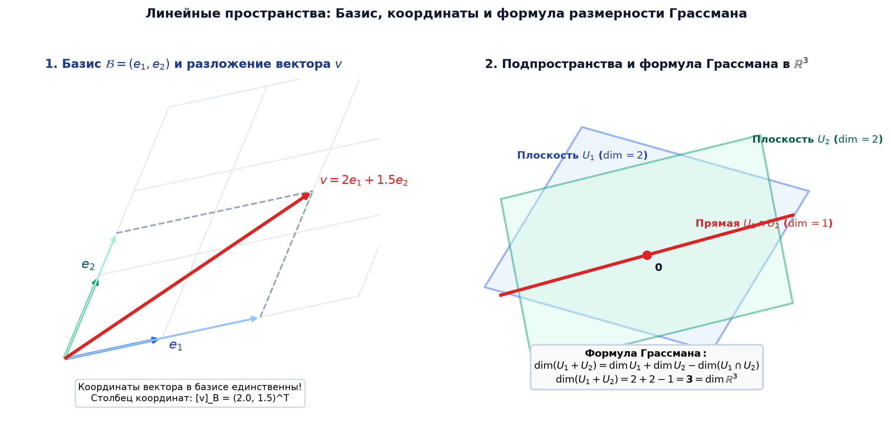

# 📌 Лекция 5: Векторные пространства, линейная независимость, базис и размерность

> [!abstract] О лекции
> - **Дисциплина:** [[Линейная алгебра]] (1 семестр)
> - **Ключевые концепции:** Аксиомы векторного (линейного) пространства $V$ над полем $K$, примеры пространств ($K^n$, $K[x]$, матрицы $M_{m \times n}$), линейная комбинация, линейная оболочка $\operatorname{span}(v_1, \dots, v_k)$, линейная зависимость и независимость системы векторов, критерий нетривиальной нулевой комбинации, базис пространства, координаты вектора в базисе, теорема о единственности координат, размерность пространства $\dim V$, подпространства, сумма и пересечение подпространств, формула Грассмана.

---

## 1. Определение векторного пространства

> [!info] Аксиомы векторного пространства
> Множество $V$ с операцией сложения $+: V \times V \to V$ и операцией умножения на скаляр $\cdot: K \times V \to V$ над полем $K$ называется **векторным пространством**, если выполнены 8 аксиом:
> 1. $u + v = v + u$ (коммутативность сложения)
> 2. $(u + v) + w = u + (v + w)$ (ассоциативность сложения)
> 3. $\exists \mathbf{0} \in V : v + \mathbf{0} = v$ (существование нуля)
> 4. $\forall v \in V \;\; \exists (-v) \in V : v + (-v) = \mathbf{0}$ (существование противоположного)
> 5. $1 \cdot v = v$ (унитарность)
> 6. $(\alpha \beta) \cdot v = \alpha \cdot (\beta v)$ (ассоциативность скаляров)
> 7. $(\alpha + \beta) \cdot v = \alpha v + \beta v$ (дистрибутивность по скалярам)
> 8. $\alpha \cdot (u + v) = \alpha u + \alpha v$ (дистрибутивность по векторам)

---

## 2. Линейная зависимость и независимость

Пусть $v_1, v_2, \dots, v_k \in V$. Выражение вида:
$$\alpha_1 v_1 + \alpha_2 v_2 + \dots + \alpha_k v_k \quad (\alpha_i \in K)$$
называется **линейной комбинацией** этих векторов.

> [!info] Линейная независимость
> Система векторов $\{v_1, \dots, v_k\}$ называется **линейно независимой**, если равенство линейной комбинации нулевому вектору:
> $$\alpha_1 v_1 + \alpha_2 v_2 + \dots + \alpha_k v_k = \mathbf{0}$$
> выполняется **тогда и только тогда, когда все коэффициенты тривиальны**:
> $$\alpha_1 = \alpha_2 = \dots = \alpha_k = 0$$
> Если же существуют коэффициенты, **не все равные нулю**, такие, что $\sum \alpha_i v_i = \mathbf{0}$, то система называется **линейно зависимой**.

### Критерий линейной зависимости:
> Система из двух и более векторов линейно зависима тогда и только тогда, когда хотя бы один из векторов системы выражается через линейную комбинацию остальных.

---

## 3. Базис и размерность пространства

> [!info] Определение базиса
> Упорядоченная система векторов $\mathcal{B} = (e_1, e_2, \dots, e_n)$ пространства $V$ называется **базисом**, если:
> 1. Система $\{e_1, \dots, e_n\}$ **линейно независима**.
> 2. Система является **порождающей**: любой вектор $v \in V$ раскладывается по этой системе:
>    $$v = x_1 e_1 + x_2 e_2 + \dots + x_n e_n = \sum_{i=1}^n x_i e_i$$

### Теорема о единственности координат:
> Разложение любого вектора $v \in V$ по базису $\mathcal{B}$ **единственно**:
> Набор чисел $(x_1, x_2, \dots, x_n)^T \in K^n$ называется **столбцом координат** вектора $v$ в базисе $\mathcal{B}$ и обозначается $[v]_\mathcal{B}$.

### Размерность векторного пространства:
> [!info] Размерность ($\dim V$)
> Количество векторов в базисе называется **размерностью векторного пространства** и обозначается $\dim V = n$.
> Если базис состоит из конечного числа векторов, пространство называется **конечномерным**.
> Все базисы одного и того же конечномерного пространства содержат строго одинаковое количество векторов!

---

## 4. Подпространства и формула Грассмана

Непустое подмножество $U \subseteq V$ называется **линейным подпространством** ($U \le V$), если оно замкнуто относительно сложения и умножения на скаляр:
$$\forall u_1, u_2 \in U \implies u_1 + u_2 \in U$$
$$\forall \alpha \in K, \forall u \in U \implies \alpha u \in U$$

### Сумма и пересечение подпространств:
- Пересечение $U_1 \cap U_2$ всегда является подпространством.
- Сумма $U_1 + U_2 = \{u_1 + u_2 \mid u_1 \in U_1, u_2 \in U_2\}$ является наименьшим подпространством, содержащим $U_1 \cup U_2$.

> [!important] Формула Грассмана
> Для любых двух конечномерных подпространств $U_1, U_2 \le V$:
> $$\dim(U_1 + U_2) = \dim(U_1) + \dim(U_2) - \dim(U_1 \cap U_2)$$

Если $U_1 \cap U_2 = \{\mathbf{0}\}$, то сумма называется **прямой суммой** ($U_1 \oplus U_2$), и $\dim(U_1 \oplus U_2) = \dim(U_1) + \dim(U_2)$.

---

## 5. 🔬 Лемма Штейница, формула Грассмана и спектральная теория

### Лемма Штейница о замене (Steinitz Exchange Lemma)
> [!theorem] Лемма Штейница о замене
> Пусть в векторном пространстве $V$ система векторов $S = \{v_1, \dots, v_n\}$ порождает $V$, а система $L = \{u_1, \dots, u_k\}$ линейно независима.  
> Тогда $k \le n$, и существуют $n - k$ векторов из $S$, которые вместе с $L$ порождают все пространство $V$.

---

### Формула размерности Грассмана
Для любых двух конечномерных подпространств $U, W \subseteq V$:
$$\dim(U + W) = \dim U + \dim W - \dim(U \cap W)$$

---

### 💡 Научный пример: Метод главных компонент (PCA) и SVD-разложение в машинном обучении
Ковариационная матрица $\Sigma = \frac{1}{m} X^T X$ симметрична и положительно полуопределена.  
По спектральной теореме ее собственные векторы образуют ортонормированный базис. Подпространство $W_k$, натянутое на $k$ собственных векторов с наибольшими собственными значениями, по теореме Эккарта-Янга является **наилучшим линейным $k$-мерным приближением данных** в смысле минимизации среднеквадратичной ошибки.

---

## 🚀 Фундаментальная связь с будущими дисциплинами и технологиями (ИТМО Curriculum)

1. **Машинное обучение и Data Science (Сем 5, 6):**
   - Эмбеддинги в современных языковых моделях (LLM / Transformers) представляют собой векторы размерности $\mathbb{R}^{4096}$ или $\mathbb{R}^{12288}$. Семантическая близость измеряется косинусом угла (скалярным произведением в унитарном пространстве).
2. **Компьютерная графика (Сем 4):**
   - Все 3D-преобразования (масштабирование, поворот, сдвиг) моделируются как линейные операторы в 4-мерном проективном пространстве с однородными координатами через матрицы $4 \times 4$ в OpenGL / Vulkan.

---

## 🔗 Связанные материалы
- [[Линейная алгебра]] — страница дисциплины
- [[01. Лекция - Введение, теория множеств и отображения (2026-09-03)]]
- [[03. Лекция - Теорема Ламе, диофантовы уравнения, ОТА, КТО и группы (2026-09-17)]]
- [[04. Лекция - Кольцо многочленов, теорема Безу, схема Горнера и Основная теорема алгебры (2026-09-24)]]
