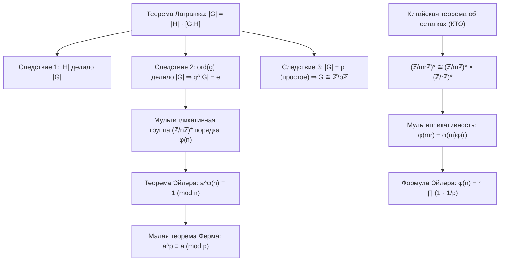
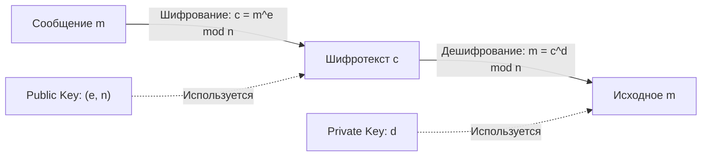
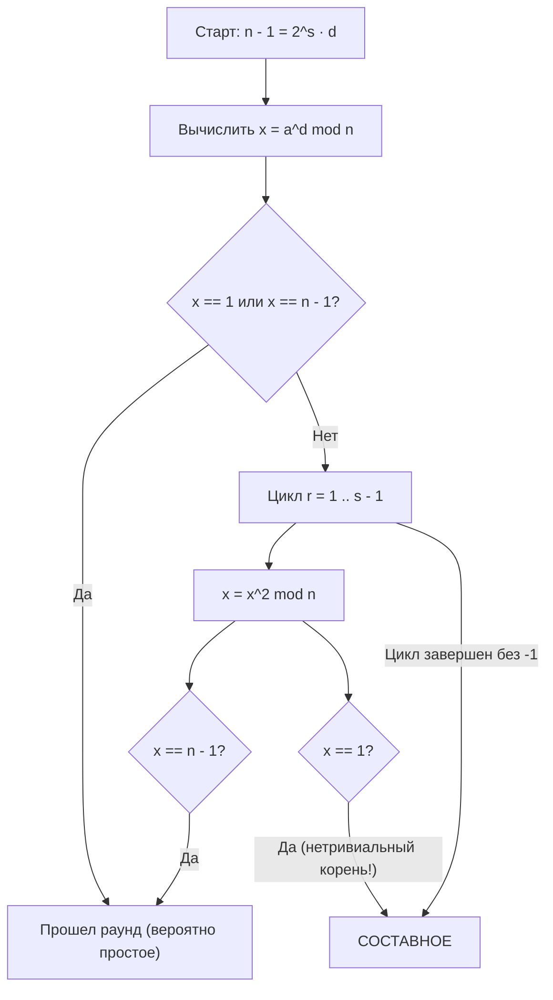

# 📐 Лекция 5: Свойства порядка элемента, подгруппы циклических групп, теорема Лагранжа, теорема Эйлера, RSA и тесты простоты

> [!abstract] О занятии
> - **Дисциплина:** [[Линейная алгебра]] (1 семестр)
> - **Дата проведения:** 01 октября 2026 года (неделя 5, нечетная, четверг, 08:10 – 09:40)
> - **Аудитория:** Orange Classroom 1229 (Кронверкский пр., д. 49, лит. А)
> - **Преподаватель (лектор):** Кумалагов Давид Заурович
> - **Поток:** **Поток 2** (Software Engineering, Университет ИТМО)
> - **Первоисточники:** Лекционный материал (Кумалагов Д.З., лекция от 01.10.2026); фундаментальные монографии: Э. Б. Винберг («Курс алгебры», гл. 2), А. И. Кострикин («Введение в алгебру. Часть I: Основы алгебры»). монографии: Э. Б. Винберг («Курс алгебры», гл. 2), А. И. Кострикин («Введение в алгебру. Часть I: Основы алгебры»).
> - **Ключевые концепции занятия:** 
>   1. Порядок элемента: $g^m = e \iff m \ \vdots \ \operatorname{ord}(g)$, формула порядка степени $\operatorname{ord}(g^k) = \frac{n}{\gcd(n, k)}$.
>   2. Теорема о подгруппах циклической группы: все подгруппы циклические; существование и единственность подгруппы порядка $d$ для каждого делителя $d \mid n$.
>   3. Классы смежности: отношение эквивалентности $g_1 \sim_H g_2 \iff g_1 = g_2 h$, дизъюнктное разбиение $G = \bigsqcup gH$.
>   4. Теорема Лагранжа: $|G| = |H| \cdot [G : H]$.
>   5. Три следствия Лагранжа: $|H| \mid |G|$, $g^{|G|} = e$, изоморфизм групп простого порядка $G \cong \mathbb{Z}/p\mathbb{Z}$.
>   6. Теорема Эйлера: $a^{\varphi(n)} \equiv 1 \pmod n$ при $\gcd(a, n) = 1$ как прямое следствие Лагранжа для группы $(\mathbb{Z}/n\mathbb{Z})^*$.
>   7. Малая теорема Ферма: $a^p \equiv a \pmod p$ для любого простого $p$.
>   8. Функция Эйлера: вывод формулы $\varphi(n) = n \prod_{p \mid n} (1 - 1/p)$ через Китайскую теорему об остатках (КТО).
>   9. Криптосистема RSA: асимметричное шифрование, открытый ключ $(e, n)$, секретный ключ $d$, строгое доказательство $m^{ed} \equiv m \pmod n$ через КТО для любых сообщений.
>   10. Детерминированный тест простоты Люка: критерий через первообразный корень в группе $(\mathbb{Z}/n\mathbb{Z})^*$.
>   11. Тест Ферма и числа Кармайкла: псевдопростые числа, критерий Корсельта, контрпример 561.
>   12. Вероятностный тест Миллера — Рабина: лемма о нетривиальных корнях из единицы, алгоритм и детерминированный базис для $n < 2^{64}$.

---

## 📌 Краткое резюме (TL;DR)

1. **Порядок степени элемента:** $\operatorname{ord}(g^k) = \frac{n}{\gcd(n, k)}$. Элемент $g^k$ является образующим $\iff \gcd(n, k) = 1$. Количество образующих равно $\varphi(n)$.
2. **Строение подгрупп циклической группы:** Всякая подгруппа циклической группы циклическая. Для конечной группы порядка $n$ для любого делителя $d \mid n$ существует **ровно одна** подгруппа порядка $d$, порожденная элементом $\left[\frac{n}{d}\right]_n$.
3. **Классы смежности и теорема Лагранжа:** Любая подгруппа $H \le G$ разбивает группу на дизъюнктные классы $gH = \{gh \mid h \in H\}$ мощности $|H|$. Для конечной группы:
   $$|G| = |H| \cdot [G : H]$$
4. **Три фундаментальных следствия теоремы Лагранжа:**
   - Порядок любой подгруппы делит порядок группы: $|H| \ \big|\ |G|$.
   - Для любого элемента $g \in G$ его порядок делит порядок группы, откуда $g^{|G|} = e$.
   - Всякая группа простого порядка $p$ циклическая и изоморфна канонической группе вычетов $(\mathbb{Z}/p\mathbb{Z}, +)$. У нее нет нетривиальных собственных подгрупп.
5. **Теорема Эйлера:** Мультипликативная группа вычетов $(\mathbb{Z}/n\mathbb{Z})^* = \{[a]_n \mid \gcd(a, n) = 1\}$ имеет порядок $\varphi(n)$. По следствию 2 теоремы Лагранжа:
   $$a^{\varphi(n)} \equiv 1 \pmod n \quad (\forall a : \gcd(a, n) = 1)$$
6. **Малая теорема Ферма (МТФ):** При простом $p$ значение $\varphi(p) = p - 1$, откуда $a^{p-1} \equiv 1 \pmod p$ (при $p \nmid a$) и $a^p \equiv a \pmod p$ для любого $a \in \mathbb{Z}$.
7. **Формула функции Эйлера через КТО:** Благодаря изоморфизму колец $\mathbb{Z}/(mr)\mathbb{Z} \cong \mathbb{Z}/m\mathbb{Z} \times \mathbb{Z}/r\mathbb{Z}$ при $\gcd(m, r) = 1$ мультипликативные группы также изоморфны, что дает мультипликативность $\varphi(m \cdot r) = \varphi(m) \cdot \varphi(r)$. Для канонического разложения $n = p_1^{\alpha_1} \dots p_s^{\alpha_s}$:
   $$\varphi(n) = n \prod_{i=1}^s \left(1 - \frac{1}{p_i}\right)$$
8. **Криптосистема RSA:** Ключи $n = pq$, $\varphi(n) = (p-1)(q-1)$, $ed \equiv 1 \pmod{\varphi(n)}$. Шифрование: $c = m^e \bmod n$, расшифрование: $m = c^d \bmod n$. Доказательство корректности $m^{ed} \equiv m \pmod n$ через КТО и МТФ строго охватывает как случай взаимно простого $m$, так и случай $p \mid m$ или $q \mid m$.
9. **Тест Люка:** Детерминированный критерий простоты: $n$ простое $\iff \exists a: a^{n-1} \equiv 1 \pmod n$ и $a^{(n-1)/q} \not\equiv 1 \pmod n$ для всех простых делителей $q \mid (n-1)$.
10. **Числа Кармайкла:** Составные числа, удовлетворяющие условию Ферма $a^{n-1} \equiv 1 \pmod n$ для всех $\gcd(a, n) = 1$. Минимальное число Кармайкла: $561 = 3 \cdot 11 \cdot 17$. По критерию Корсельта: свободно от квадратов и $(p - 1) \mid (n - 1)$ для всех простых $p \mid n$.
11. **Тест Миллера — Рабина:** Разложение $n - 1 = 2^s \cdot d$. Если $n$ простое, то в цепочке последовательных квадратов $a^d, a^{2d}, \dots, a^{2^s d}$ либо $a^d \equiv 1 \pmod n$, либо предшественник первой единицы равен $-1 \equiv n - 1 \pmod n$. Вероятность ошибки при $k$ раундах $\le (1/4)^k$. Для $n < 2^{64}$ детерминирован на 12 основаниях.

---



---

## 1. Свойства порядка элемента группы

Пусть $(G, \cdot)$ — группа с нейтральным элементом $e$. Напомним:
- **Теоретико-групповое определение:** $\operatorname{ord}(g) \overset{\text{def}}{=} |\langle g \rangle|$.
- **Арифметическое определение:** $\operatorname{ord}(g) \overset{\text{def}}{=} \min \{n \in \mathbb{N} \mid g^n = e\}$.

---

### 1.1. Свойство 1: Делимость показателя степени на порядок

> [!theorem] Свойство 1 (Критерий равенства степени единичному элементу)
> Пусть $\operatorname{ord}(g) = n$, и для некоторого $m \in \mathbb{Z}$ выполнено $g^m = e$. Тогда $m$ делится на $n$ ($m \ \vdots \ n$).

> [!proof] Доказательство (Свойства делимости порядка)
> По условию $g^m = e$. Рассмотрим $m \ge n$ (при $m < 0$ переходим к $g^{-m} = e$).  
> Разделим $m$ на $n$ с остатком:
> $$m = n \cdot s + r, \quad 0 \le r < n$$
> Возведем $g$ в степень $m$:
> $$e = g^m = g^{ns + r} = (g^n)^s \cdot g^r = e^s \cdot g^r = g^r \implies g^r = e$$
> Если бы $r > 0$, то нашлось бы натуральное число $r < n$ такое, что $g^r = e$, что противоречит минимальности порядка $n = \operatorname{ord}(g)$.  
> Следовательно, $r = 0$, то есть $m = n \cdot s$, и $m \ \vdots \ n$. $\blacksquare$

---

### 1.2. Свойство 2: Формула для порядка степени элемента

> [!theorem] Свойство 2 (Порядок элемента $g^k$)
> Пусть $\operatorname{ord}(g) = n$. Тогда для любого целого $k \in \mathbb{Z}$:
> $$\operatorname{ord}(g^k) = \frac{n}{\gcd(n, k)}$$

> [!proof] Доказательство через аддитивную группу вычетов $\mathbb{Z}/n\mathbb{Z}$
> Отождествим циклическую группу $\langle g \rangle$ с $(\mathbb{Z}/n\mathbb{Z}, +)$ посредством изоморфизма $g^k \mapsto [k]_n$.  
> Порядок вычета $[k]_n$ — это наименьшее натуральное число $x \in \mathbb{N}$ такое, что:
> $$x \cdot [k]_n = [0]_n \iff x \cdot k \equiv 0 \pmod n \iff x \cdot k = y \cdot n \quad (y \in \mathbb{Z})$$
> Разделим обе части на $\gcd(n, k)$:
> $$x \cdot \frac{k}{\gcd(n, k)} = y \cdot \frac{n}{\gcd(n, k)}$$
> Так как $\gcd\left(\frac{k}{\gcd(n, k)}, \frac{n}{\gcd(n, k)}\right) = 1$, по лемме Евклида число $x$ обязано делиться на $\frac{n}{\gcd(n, k)}$:
> $$x \ \vdots \ \frac{n}{\gcd(n, k)} \implies x = \frac{n}{\gcd(n, k)} \cdot t, \quad t \in \mathbb{Z}$$
> Наименьшее строго положительное натуральное значение достигается при $t = 1$:
> $$\operatorname{ord}(g^k) = \frac{n}{\gcd(n, k)} \qquad \blacksquare$$

---

## 2. Теорема о подгруппах циклических групп

> [!theorem] Фундаментальная теорема о подгруппах циклических групп
> 1. Всякая подгруппа циклической группы является **циклической**.
> 2. Если $|G| = n$, то для любого делителя $d \mid n$ существует **ровно одна** подгруппа $H \le G$ порядка $d$.

---

### 2.1. Доказательство: Случай 1 — Бесконечная группа $G \cong \mathbb{Z}$

> [!proof] Доказательство для $G \cong (\mathbb{Z}, +)$
> Пусть $H \le \mathbb{Z}$. Если $H = \{0\}$, то $H = 0\mathbb{Z} = \langle 0 \rangle$ — циклическая.  
> Если $H \ne \{0\}$, существует $s \in H \setminus \{0\}$. Так как $H$ — подгруппа, $-s \in H$, поэтому множество положительных элементов $H^+ = H \cap \mathbb{N}$ непусто.  
> По принципу наименьшего элемента существует:
> $$n = \min(H \cap \mathbb{N})$$
> Покажем, что $H = n\mathbb{Z}$:
> 1. $n\mathbb{Z} \subseteq H$: так как $n \in H$, любые кратные $n \cdot m \in H$ по определению подгруппы.
> 2. $H \subseteq n\mathbb{Z}$: пусть $t \in H$ — произвольный элемент. Разделим $t$ на $n$ с остатком:
>    $$t = n \cdot p + r, \quad 0 \le r < n$$
>    Тогда $r = t - n \cdot p \in H$ (как разность двух элементов из $H$).  
>    Если бы $r > 0$, то $r \in H \cap \mathbb{N}$ и $r < n$, что противоречит минимальности $n$.  
>    Значит, $r = 0 \implies t = n \cdot p \in n\mathbb{Z}$.  
> 
> Следовательно, $H = n\mathbb{Z} = \langle n \rangle$ — циклическая подгруппа. $\blacksquare$

---

### 2.2. Доказательство: Случай 2 — Конечная группа $G \cong \mathbb{Z}/n\mathbb{Z}$

> [!proof] Доказательство цикличности для $|G| = n$ через гомоморфизм проекции
> Пусть $H \le \mathbb{Z}/n\mathbb{Z}$.  
> Рассмотрим канонический сюръективный гомоморфизм проекции:
> $$\pi: \mathbb{Z} \to \mathbb{Z}/n\mathbb{Z}, \quad \pi(x) = [x]_n$$
> Прообраз подгруппы $\pi^{-1}(H) = \{x \in \mathbb{Z} \mid [x]_n \in H\}$ является подгруппой в $(\mathbb{Z}, +)$.  
> По доказанному в **Случае 1**, всякая подгруппа в $\mathbb{Z}$ имеет вид $k\mathbb{Z}$ для некоторого $k \in \mathbb{Z}$:
> $$\pi^{-1}(H) = k\mathbb{Z}$$
> Поскольку отображение $\pi$ сюръективно, образ прообраза совпадает с исходной подгруппой:
> $$H = \pi(\pi^{-1}(H)) = \pi(k\mathbb{Z}) = \{[k \cdot m]_n \mid m \in \mathbb{Z}\} = \langle [k]_n \rangle$$
> Таким образом, подгруппа $H$ порождается одним элементом $[k]_n$, то есть является **циклической**! $\blacksquare$

---

### 2.3. Существование и единственность подгруппы для делителя $d \mid n$

> [!proof] Доказательство существования и единственности подгруппы порядка $d$
> Пусть $d$ — произвольный натуральный делитель $n$ ($d \mid n$).
> 
> **1. Существование:**  
> Положим элемент $x = \frac{n}{d}$ и рассмотрим циклическую подгруппу:
> $$H = \left\langle \left[\frac{n}{d}\right]_n \right\rangle$$
> По формуле порядка степени:
> $$\operatorname{ord}\left(\left[\frac{n}{d}\right]_n\right) = \frac{n}{\gcd\left(n, \frac{n}{d}\right)} = \frac{n}{\frac{n}{d}} = d$$
> Следовательно, $|H| = d$, и подгруппа порядка $d$ всегда существует.
> 
> **2. Единственность:**  
> Пусть $H \le \mathbb{Z}/n\mathbb{Z}$ — произвольная подгруппа порядка $|H| = d$.  
> Так как $H$ циклическая, она порождается некоторым элементом $H = \langle [x]_n \rangle$.  
> Порядок порождающего элемента равен порядку группы:
> $$|H| = \operatorname{ord}([x]_n) = \frac{n}{\gcd(n, x)} = d \iff \gcd(n, x) = \frac{n}{d}$$
> Так как $\gcd(n, x)$ делит $x$, число $x$ обязано быть кратным $\frac{n}{d}$:
> $$x \ \vdots \ \frac{n}{d} \iff x = c \cdot \frac{n}{d}, \quad \text{где } \gcd(c, d) = 1$$
> Поскольку $\gcd(c, d) = 1$, в циклической группе $\left\langle \left[\frac{n}{d}\right]_n \right\rangle$ порядка $d$ элемент $[x]_n = c \cdot \left[\frac{n}{d}\right]_n$ сам является образующим:
> $$\langle [x]_n \rangle = \left\langle \left[\frac{n}{d}\right]_n \right\rangle$$
> Следовательно, подгруппа порядка $d$ **единственна**. $\blacksquare$

---

## 3. Классы смежности по подгруппе

### 3.1. Конструкция отношения эквивалентности

> [!definition] Отношение эквивалентности по подгруппе $H$
> На множестве элементов группы $G$ введем бинарное отношение $\sim_H$:
> $$g_1 \sim_H g_2 \overset{\text{def}}{\iff} \exists h \in H : g_1 = g_2 \cdot h \iff g_2^{-1} g_1 \in H$$

> [!theorem] Теорема об отношении эквивалентности по подгруппе
> Бинарное отношение $\sim_H$ является отношением эквивалентности на множестве $G$.

> [!proof] Проверка трех аксиом отношения эквивалентности
> 1. **Рефлексивность ($g \sim_H g$):** $g = g \cdot e$, где $e \in H$.
> 2. **Симметричность ($g_1 \sim_H g_2 \implies g_2 \sim_H g_1$):** $g_1 = g_2 h \iff g_2 = g_1 h^{-1}$, где $h^{-1} \in H$.
> 3. **Транзитивность ($g_1 \sim_H g_2 \ \land \ g_2 \sim_H g_3 \implies g_1 \sim_H g_3$):**  
>    $g_1 = g_2 h$ и $g_2 = g_3 k \implies g_1 = (g_3 k) h = g_3 (kh)$, где $kh \in H$. $\blacksquare$

---

### 3.2. Левые классы смежности и разбиение группы

> [!definition] Левый класс смежности (Left Coset)
> Класс эквивалентности элемента $g \in G$ по отношению $\sim_H$ называется **левым классом смежности** группы $G$ по подгруппе $H$ и обозначается:
> $$gH \overset{\text{def}}{=} \{g \cdot h \mid h \in H\}$$
> Множество всех левых классов смежности называется **фактор-множеством** и обозначается:
> $$G/H \overset{\text{def}}{=} \{gH \mid g \in G\}$$

> [!theorem] Фундаментальная теорема о разбиении группы
> Всякая группа $G$ распадается в дизъюнктное объединение своих левых классов смежности по подгруппе $H$:
> $$G = \bigsqcup_{gH \in G/H} gH$$

---

## 4. Теорема Лагранжа

> [!theorem] Теорема Лагранжа
> Пусть $G$ — группа, и $H \le G$ — её подгруппа.  
> Если подгруппа $H$ конечна ($|H| < \infty$) и число классов смежности конечно ($|G/H| < \infty$), то группа $G$ конечна и:
> $$|G| = |H| \cdot |G/H| = |H| \cdot [G : H]$$

> [!proof] Доказательство через биекцию левого сдвига
> Для любого $g \in G$ отображение $\phi_g: H \to gH$, $\phi_g(h) = gh$ является биекцией (обратное: $x \mapsto g^{-1}x$).  
> Следовательно, $|gH| = |H|$ для всех $g \in G$.  
> Так как $G = \bigsqcup_{i=1}^k g_i H$, где $k = [G : H]$, получаем:
> $$|G| = \sum_{i=1}^k |g_i H| = k \cdot |H| = [G : H] \cdot |H| \qquad \blacksquare$$

---

## 5. Три фундаментальных следствия теоремы Лагранжа

> [!theorem] Следствия теоремы Лагранжа
> Пусть $G$ — конечная группа порядка $|G| < \infty$. Тогда:
> 1. **Следствие 1 (Делимость порядка подгруппы):** Для любой подгруппы $H \le G$ её порядок делит порядок группы:
>    $$|H| \ \big|\ |G|, \quad \text{причем } [G : H] = \frac{|G|}{|H|}$$
> 2. **Следствие 2 (Порядок элемента и нейтральная степень):** Для любого элемента $g \in G$ его порядок делит порядок группы, и выполняется тождество:
>    $$\operatorname{ord}(g) \ \big|\ |G| \implies g^{|G|} = e$$
> 3. **Следствие 3 (Группы простого порядка):** Если порядок группы $|G| = p$ — простое число, то $G$ является циклической группой и изоморфна группе вычетов:
>    $$|G| = p \ (p \in \mathbb{P}) \implies G \cong (\mathbb{Z}/p\mathbb{Z}, +)$$

> [!proof] Доказательства следствий 1, 2 и 3
> 1. **Доказательство Следствия 1:** Непосредственно следует из формулы Лагранжа $|G| = |H| \cdot [G : H]$, где все сомножители — натуральные числа.
> 2. **Доказательство Следствия 2:** Рассмотрим циклическую подгруппу $\langle g \rangle \le G$. По определению порядка элемента, $|\langle g \rangle| = \operatorname{ord}(g)$. По Следствию 1 порядок подгруппы делит порядок группы:
>    $$|\langle g \rangle| \ \big|\ |G| \implies |G| = c \cdot \operatorname{ord}(g), \quad c \in \mathbb{N}$$
>    Возведем элемент $g$ в степень $|G|$:
>    $$g^{|G|} = g^{c \cdot \operatorname{ord}(g)} = \left(g^{\operatorname{ord}(g)}\right)^c = e^c = e \qquad \blacksquare$$
> 3. **Доказательство Следствия 3:** Пусть $g \in G$ — любой неединичный элемент ($g \ne e$).  
>    Рассмотрим подгруппу $\langle g \rangle \le G$. По Следствию 2 её порядок $\operatorname{ord}(g)$ делит $|G| = p$.  
>    Поскольку $p$ — простое число, делителями $p$ являются только $1$ и $p$.  
>    Так как $g \ne e$, $\operatorname{ord}(g) > 1$. Значит, обязательно $\operatorname{ord}(g) = p$.  
>    Это означает, что $|\langle g \rangle| = p = |G|$, то есть $\langle g \rangle = G$. Группа порождается одним элементом $g$, следовательно, она циклическая.  
>    По Фундаментальной теореме о классификации всякая конечная циклическая группа порядка $p$ изоморфна $\mathbb{Z}/p\mathbb{Z}$. $\blacksquare$

---

## 6. Теорема Эйлера и Малая теорема Ферма

### 6.1. Мультипликативная группа кольца вычетов

Рассмотрим множество обратимых элементов кольца вычетов по модулю $n$:
$$(\mathbb{Z}/n\mathbb{Z})^* \overset{\text{def}}{=} \{[a]_n \in \mathbb{Z}/n\mathbb{Z} \mid \gcd(a, n) = 1\}$$
Это множество образует абелеву группу относительно операции умножения вычетов.  
Нейтральным элементом группы является класс $[1]_n$.  
По определению функции Эйлера $\varphi(n)$, порядок этой группы равен:
$$|(\mathbb{Z}/n\mathbb{Z})^*| = \varphi(n)$$

---

### 6.2. Теорема Эйлера

> [!theorem] Теорема Эйлера
> Пусть $a \in \mathbb{Z}$ и $n \in \mathbb{N}$ взаимно просты, то есть $\gcd(a, n) = 1$ ($[a]_n \in (\mathbb{Z}/n\mathbb{Z})^*$).  
> Тогда выполняется сравнение:
> $$a^{\varphi(n)} \equiv 1 \pmod n$$
> где $\varphi(n) = |(\mathbb{Z}/n\mathbb{Z})^*|$ — функция Эйлера.

> [!proof] Доказательство через следствие теоремы Лагранжа
> Рассмотрим конечную группу $G = (\mathbb{Z}/n\mathbb{Z})^*$ относительно операции умножения.  
> Порядок группы равен $|G| = \varphi(n)$.  
> Поскольку $\gcd(a, n) = 1$, класс вычетов $[a]_n$ является элементом этой группы: $[a]_n \in G$.  
> Применим **Следствие 2 теоремы Лагранжа**: в любой конечной группе возведение любого элемента в степень, равную порядку группы, даёт нейтральный элемент:
> $$([a]_n)^{|G|} = [e]_G \iff ([a]_n)^{\varphi(n)} = [1]_n$$
> На языке сравнений по модулю $n$ это в точности означает:
> $$a^{\varphi(n)} \equiv 1 \pmod n \qquad \blacksquare$$

---

### 6.3. Следствие: Малая теорема Ферма

> [!theorem] Малая теорема Ферма (МТФ)
> Пусть $p$ — простое число. Тогда:
> 1. Для любого целого числа $a$, не делящегося на $p$ ($\gcd(a, p) = 1$):
>    $$a^{p-1} \equiv 1 \pmod p$$
> 2. Для любого целого числа $a \in \mathbb{Z}$:
>    $$a^p \equiv a \pmod p$$

> [!proof] Доказательство Малой теоремы Ферма
> Для простого числа $p$ все числа от $1$ до $p-1$ взаимно просты с $p$, поэтому:
> $$\varphi(p) = p - 1$$
> По теореме Эйлера для любого $a$ такого, что $p \nmid a$, получаем $a^{p-1} \equiv 1 \pmod p$.  
> Умножим обе части на $a$:
> $$a^p \equiv a \pmod p$$
> Если же $a \ \vdots \ p$, то $a \equiv 0 \pmod p$ и $a^p \equiv 0^p \equiv 0 \equiv a \pmod p$. Равенство верно всегда! $\blacksquare$

---

## 7. Вычисление функции Эйлера $\varphi(n)$ через КТО

Разберем три последовательных шага вывода общей формулы:

### 7.1. Шаг 1: Простое число и степень простого числа

- Если $p$ простое, то $\varphi(p) = p - 1$.
- Пусть $n = p^r$, где $p$ — простое, $r \in \mathbb{N}$.  
  Среди чисел от $1$ до $p^r$ взаимно просты с $p^r$ все числа, кроме кратных $p$.  
  Числа, кратные $p$, имеют вид:
  $$1 \cdot p, \ 2 \cdot p, \ 3 \cdot p, \ \dots, \ p^{r-1} \cdot p = p^r$$
  Их ровно $p^{r-1}$ штук.  
  Следовательно:
  $$\varphi(p^r) = p^r - p^{r-1} = p^r \left(1 - \frac{1}{p}\right) \qquad (\#)$$

---

### 7.2. Шаг 2: Мультипликативность функции Эйлера через КТО

> [!theorem] Мультипликативность функции Эйлера
> Если $\gcd(m, r) = 1$, то:
> $$\varphi(m \cdot r) = \varphi(m) \cdot \varphi(r) \qquad (*)$$

> [!proof] Доказательство через Китайскую теорему об остатках (КТО)
> По Китайской теореме об остатках (КТО), если $\gcd(m, r) = 1$, то каноническое отображение:
> $$\psi: \mathbb{Z}/(mr)\mathbb{Z} \to \mathbb{Z}/m\mathbb{Z} \times \mathbb{Z}/r\mathbb{Z}, \quad \psi([x]_{mr}) = ([x]_m, [x]_r)$$
> является **изоморфизмом колец**.  
> Изоморфизм колец переводит обратимые элементы в обратимые и индуцирует изоморфизм их мультипликативных групп:
> $$(\mathbb{Z}/(mr)\mathbb{Z})^* \cong (\mathbb{Z}/m\mathbb{Z})^* \times (\mathbb{Z}/r\mathbb{Z})^*$$
> Мощность прямого произведения двух конечных множеств равна произведению их мощностей:
> $$|(\mathbb{Z}/(mr)\mathbb{Z})^*| = |(\mathbb{Z}/m\mathbb{Z})^*| \cdot |(\mathbb{Z}/r\mathbb{Z})^*|$$
> По определению функции Эйлера:
> $$\varphi(m \cdot r) = \varphi(m) \cdot \varphi(r) \qquad \blacksquare$$

---

### 7.3. Шаг 3: Общая формула канонического разложения

Пусть натуральное число $n > 1$ имеет каноническое разложение на простые сомножители:
$$n = p_1^{\alpha_1} p_2^{\alpha_2} \dots p_s^{\alpha_s}, \quad p_i \ne p_j$$
Применяя последовательно мультипликативность $(*)$ и формулу для степени простого $(\#)$:
$$\begin{aligned}
\varphi(n) &= \varphi(p_1^{\alpha_1} p_2^{\alpha_2} \dots p_s^{\alpha_s}) \\
&\stackrel{(*)}{=} \varphi(p_1^{\alpha_1}) \cdot \varphi(p_2^{\alpha_2}) \dots \varphi(p_s^{\alpha_s}) \\
&\stackrel{(\#)}{=} (p_1^{\alpha_1} - p_1^{\alpha_1 - 1}) \cdot (p_2^{\alpha_2} - p_2^{\alpha_2 - 1}) \dots (p_s^{\alpha_s} - p_s^{\alpha_s - 1}) \\
&= p_1^{\alpha_1} \left(1 - \frac{1}{p_1}\right) \cdot p_2^{\alpha_2} \left(1 - \frac{1}{p_2}\right) \dots p_s^{\alpha_s} \left(1 - \frac{1}{p_s}\right) \\
&= n \prod_{i=1}^s \left(1 - \frac{1}{p_i}\right)
\end{aligned}$$

---

## 8. Алгоритмическая реализация на C++20: Функция Эйлера и теорема Эйлера

```cpp
#include <iostream>
#include <numeric>
#include <vector>
#include <concepts>
#include <cstdint>

/**
 * @brief Быстрое модульное возведение в степень (a^exp mod mod)
 */
template <std::integral T>
[[nodiscard]] constexpr T mod_pow(T base, T exp, T mod) noexcept {
    T res = 1 % mod;
    base %= mod;
    while (exp > 0) {
        if (exp % 2 == 1) {
            res = static_cast<T>((static_cast<__int128_t>(res) * base) % mod);
        }
        base = static_cast<T>((static_cast<__int128_t>(base) * base) % mod);
        exp /= 2;
    }
    return res;
}

/**
 * @brief Вычисление функции Эйлера phi(n) методом факторизации за O(sqrt(n))
 */
template <std::integral T>
[[nodiscard]] constexpr T compute_euler_phi(T n) noexcept {
    T result = n;
    for (T p = 2; p * p <= n; ++p) {
        if (n % p == 0) {
            while (n % p == 0) {
                n /= p;
            }
            result -= result / p; // Эквивалентно result * (1 - 1/p)
        }
    }
    if (n > 1) {
        result -= result / n;
    }
    return result;
}

int main() {
    constexpr uint64_t n = 360; // 360 = 2^3 * 3^2 * 5
    uint64_t phi_360 = compute_euler_phi(n);
    std::cout << "phi(" << n << ") = " << phi_360 << " (ожидалось: 360 * (1/2) * (2/3) * (4/5) = 96)\n";

    // Проверка теоремы Эйлера для a = 7: 7^phi(360) mod 360
    uint64_t a = 7;
    uint64_t rem = mod_pow(a, phi_360, n);
    std::cout << a << "^phi(" << n << ") mod " << n << " = " << rem << " (ожидалось 1)\n";

    return 0;
}
```

---

## 9. Асимметричная криптосистема RSA

### 9.1. Идея и математическая модель односторонней функции с лазейкой (Trapdoor)
В симметричной криптографии стороны обязаны иметь общий секретный ключ, переданный по защищенному каналу. Криптосистема **RSA** (Rivest, Shamir, Adleman, 1977) базируется на мультипликативной теории групп вычетов и вычислительной сложности задачи факторизации больших целых чисел:
- **Легкая операция (в прямом направлении):** перемножение двух больших простых чисел $p$ и $q$ длины 1024–2048 бит ($n = p \cdot q$) выполняется за доли миллисекунды $O(\log^2 n)$.
- **Трудная операция (обратное направление):** нахождение делителей $p$ и $q$ по известному открытому модулю $n$ современными субэкспоненциальными алгоритмами (Общий метод решета числового поля, GNFS) требует экспоненциальных временных затрат.

### 9.2. Алгоритм генерации ключей RSA
1. Генерируются два независимых больших случайных простых числа $p$ и $q$ ($p \ne q$).
2. Вычисляется открытый модуль системы:
   $$n = p \cdot q$$
3. Вычисляется значение функции Эйлера от составного модуля:
   $$\varphi(n) = \varphi(p \cdot q) = (p - 1)(q - 1)$$
4. Выбирается целое число $e$ (открытая экспонента шифрования), удовлетворяющее условиям:
   $$1 < e < \varphi(n), \quad \gcd(e, \varphi(n)) = 1$$
   *(На практике часто выбирается число Ферма $F_4 = 65537 = 2^{16} + 1$, содержащее всего две единицы в двоичной записи, что ускоряет возведение в степень).*
5. С помощью расширенного алгоритма Евклида вычисляется секретная экспонента дешифрования $d$ как мультипликативное обратное к $e$ по модулю $\varphi(n)$:
   $$e \cdot d \equiv 1 \pmod{\varphi(n)} \iff e \cdot d = 1 + k \cdot \varphi(n) \quad (k \in \mathbb{Z})$$

> [!important] Разделение ключей
> - **Открытый ключ (Public Key):** пара $(e, n)$ — публикуется в открытый доступ, используется любым отправителем для зашифрования.
> - **Закрытый ключ (Private Key):** число $d$ (а также исходные множители $p, q$ и $\varphi(n)$) — сохраняется в строгой тайне получателем.

### 9.3. Функции зашифрования и расшифрования
Пусть сообщение представлено целым числом $m \in \{0, 1, \dots, n - 1\}$:
- **Зашифрование (Encryption):**
  $$c = E(m) = m^e \bmod n$$
- **Расшифрование (Decryption):**
  $$m' = D(c) = c^d \bmod n = (m^e)^d \bmod n = m^{ed} \bmod n$$



### 9.4. Полное строгое доказательство корректности RSA ($m^{ed} \equiv m \pmod n$)
По построению ключей $e \cdot d \equiv 1 \pmod{\varphi(n)}$, следовательно, существует целое число $k \ge 1$ такое, что:
$$ed = 1 + k \cdot \varphi(n) = 1 + k(p - 1)(q - 1)$$
Нам необходимо доказать, что для **любого** $m \in \mathbb{Z}/n\mathbb{Z}$:
$$m^{ed} \equiv m \pmod n \iff m^{1 + k(p-1)(q-1)} \equiv m \pmod{pq}$$

Поскольку $p$ и $q$ — различные простые числа ($\gcd(p, q) = 1$), по Китайской теореме об остатках (КТО) сравнение по модулю $n = pq$ равносильно одновременному выполнению двух сравнений:
$$m^{ed} \equiv m \pmod p \quad \text{и} \quad m^{ed} \equiv m \pmod q$$

Докажем первое сравнение $m^{ed} \equiv m \pmod p$. Возможны ровно два взаимоисключающих случая:

1. **Случай 1: $m \ \vdots \ p$ ($m$ делится на $p$, т.е. $m \equiv 0 \pmod p$).**
   Тогда:
   $$m^{ed} \equiv 0^{ed} \equiv 0 \equiv m \pmod p$$
   Сравнение тривиально выполняется.

2. **Случай 2: $m \nmid p$ ($m$ не делится на $p$, т.е. $\gcd(m, p) = 1$).**
   Тогда по Малой теореме Ферма в группе $(\mathbb{Z}/p\mathbb{Z})^*$:
   $$m^{p-1} \equiv 1 \pmod p$$
   Возведем обе части в степень $k(q - 1)$:
   $$m^{ed} = m^{1 + k(p-1)(q-1)} = m \cdot \left(m^{p-1}\right)^{k(q-1)} \equiv m \cdot 1^{k(q-1)} \equiv m \pmod p$$

Аналогично, рассматривая делимость на $q$:
- Если $m \ \vdots \ q \implies m^{ed} \equiv 0 \equiv m \pmod q$.
- Если $m \nmid q \implies m^{q-1} \equiv 1 \pmod q \implies m^{ed} = m \cdot (m^{q-1})^{k(p-1)} \equiv m \cdot 1 \equiv m \pmod q$.

Так как $p \mid (m^{ed} - m)$ и $q \mid (m^{ed} - m)$ при взаимно простых $p$ и $q$:
$$pq \ \big|\ (m^{ed} - m) \implies m^{ed} \equiv m \pmod n$$
Корректность алгоритма RSA доказана для **всех** возможных сообщений $m$. $\blacksquare$

---

## 10. Тесты простоты (Primality Testing)

В криптосистемах (включая RSA) критически важно быстро генерировать простые числа порядка сотен цифр. Проверка делением на простые числа до $\sqrt{n}$ требует $O(\sqrt{n})$ операций, что при $n \approx 2^{2048}$ вычислительно невозможно ($\approx 2^{1024}$ шагов).

### 10.1. Детерминированный тест простоты Люка
Тест Люка обращает Малую теорему Ферма, опираясь на свойства циклических групп.

> [!theorem] Теорема Люка
> Нечетное целое число $n > 1$ является простым тогда и только тогда, когда существует такое целое число $a \in \{2, \dots, n-1\}$, что:
> 1. $a^{n-1} \equiv 1 \pmod n$;
> 2. Для каждого **простого делителя** $q$ числа $n - 1$ выполняется условие:
>    $$a^{\frac{n-1}{q}} \not\equiv 1 \pmod n$$

**Доказательство:**
- $(\implies)$ Если $n$ простое, то мультипликативная группа $(\mathbb{Z}/n\mathbb{Z})^*$ является циклической группой порядка $n - 1$. Следовательно, в ней существует хотя бы один образующий (первообразный корень) $a$, порядок которого в точности равен $\operatorname{ord}(a) = n - 1$. Для него $a^{n-1} \equiv 1$, а для любого собственного делителя $\frac{n-1}{q} < n - 1$ степень не может давать $1$.
- $(\impliedby)$ Пусть условия выполнены. Рассмотрим порядок элемента $a$ в мультипликативной группе обратимых элементов $G = (\mathbb{Z}/n\mathbb{Z})^*$. 
  - Из условия (1) $a^{n-1} \equiv 1 \implies \operatorname{ord}(a) \mid (n - 1)$.
  - Из условия (2) ни один собственный делитель числа $n - 1$ вида $\frac{n-1}{q}$ не аннулирует степень. Следовательно, порядок не может быть строго меньше $n - 1$, откуда:
    $$\operatorname{ord}(a) = n - 1$$
  - По следствию 1 теоремы Лагранжа порядок элемента делит порядок группы: $\operatorname{ord}(a) \ \big|\ |(\mathbb{Z}/n\mathbb{Z})^*|$.
  - Значит, $n - 1 \le |(\mathbb{Z}/n\mathbb{Z})^*| = \varphi(n)$.
  - Но для любого целого $n$ количество взаимно простых с ним чисел строго ограничено: $\varphi(n) \le n - 1$, причем равенство $\varphi(n) = n - 1$ достигается **тогда и только тогда, когда $n$ простое**.
  - Следовательно, $\varphi(n) = n - 1$, и число $n$ гарантированно простое. $\blacksquare$

*Ограничение теста Люка:* Требует знания полного разложения числа $n - 1$ на простые множители, что для произвольных чисел так же сложно, как факторизация $n$.

---

### 10.2. Тест Ферма и числа Кармайкла
По Малой теореме Ферма для простого $p$ и любого $\gcd(a, p) = 1$: $a^{p-1} \equiv 1 \pmod p$.
- **Тест Ферма по основанию $a$:** проверяет условие $a^{n-1} \equiv 1 \pmod n$.
- Если $a^{n-1} \not\equiv 1 \pmod n \implies n$ составное ($a$ называется *свидетелем составности*).
- Если $a^{n-1} \equiv 1 \pmod n$, число $n$ называют *псевдопростым Ферма по основанию $a$*.

> [!danger] Числа Кармайкла (Абсолютные псевдопростые)
> Составные числа $n$, которые удовлетворяют сравнению Ферма $a^{n-1} \equiv 1 \pmod n$ для **всех** взаимно простых с ними оснований $a$ ($\gcd(a, n) = 1$).
> Для таких чисел тест Ферма бессилен: он принимает их за простые при любой случайной проверке взаимно простого основания!

**Критерий Корсельта (1899):**
Составное целое число $n$ является числом Кармайкла $\iff$ оно свободно от квадратов (в разложении нет $p^2$) и для каждого его простого делителя $p \mid n$ выполнено:
$$(p - 1) \ \big|\ (n - 1)$$

**Минимальное число Кармайкла:**
$$561 = 3 \cdot 11 \cdot 17$$
Проверка делимости по Корсельту:
- $p_1 = 3 \implies (p_1 - 1) = 2 \mid 560$ (верно, $560 = 2 \cdot 280$);
- $p_2 = 11 \implies (p_2 - 1) = 10 \mid 560$ (верно, $560 = 10 \cdot 56$);
- $p_3 = 17 \implies (p_3 - 1) = 16 \mid 560$ (верно, $560 = 16 \cdot 35$).
Все делители делят $n - 1$, значит, $a^{560} \equiv 1 \pmod{561}$ для любого $\gcd(a, 561) = 1$.
*(Альфорд, Грэнвилл и Померанс в 1994 г. доказали, что чисел Кармайкла бесконечно много).*

---

### 10.3. Вероятностный тест простоты Миллера — Рабина
Тест Миллера — Рабина преодолевает проблему чисел Кармайкла за счет анализа квадратных корней из единицы.

> [!lemma] Лемма о нетривиальных корнях из единицы
> В поле вычетов по простому модулю $\mathbb{Z}/p\mathbb{Z}$ сравнение:
> $$x^2 \equiv 1 \pmod p \iff (x - 1)(x + 1) \equiv 0 \pmod p$$
> имеет **ровно два решения**: $x \equiv 1$ и $x \equiv -1 \equiv p - 1 \pmod p$.
> Если для составного числа $n$ найдется такое $x \not\equiv \pm 1 \pmod n$, что $x^2 \equiv 1 \pmod n$, то $x$ называется *нетривиальным корнем из единицы*, а число $n$ гарантированно составное.

**Алгоритм Миллера — Рабина:**
1. Представим нечетное число $n - 1$ в виде:
   $$n - 1 = 2^s \cdot d, \quad \text{где } d \text{ нечетно}, \ s \ge 1$$
2. Выбираем случайное основание $a \in [2, n - 2]$. Если $\gcd(a, n) > 1$, то $n$ составное.
3. Вычисляем начальный член последовательности $x_0 = a^d \bmod n$.
   - Если $x_0 \equiv 1 \pmod n$ или $x_0 \equiv -1 \pmod n \implies$ число $n$ проходит раунд теста по основанию $a$.
4. Иначе возводим последовательно в квадрат $s - 1$ раз:
   $$x_{r} = x_{r-1}^2 \bmod n = a^{2^r d} \bmod n \quad (r = 1, 2, \dots, s - 1)$$
   - Если для некоторого $r$ получаем $x_r \equiv -1 \equiv n - 1 \pmod n \implies n$ проходит раунд теста.
   - Если получаем $x_r \equiv 1$, но перед этим $x_{r-1} \not\equiv \pm 1 \implies$ найден нетривиальный корень из 1, число $n$ **гарантированно составное**.
5. Если ни один член цепочки не стал равен $-1$, то $a^{n-1} \not\equiv 1 \pmod n$, и число $n$ **составное**.



> [!tip] Оценка надежности и детерминированность
> - **Вероятность ошибки:** Если $n$ составное, то доля оснований $a$, на которых тест Миллера — Рабина ошибочно признает его простым, **строго меньше $1/4$**.
> - При проведении $k$ независимых случайных раундов вероятность ошибки не превышает:
>   $$P(\text{ошибка}) \le \left(\frac{1}{4}\right)^k$$
>   При $k = 40$ вероятность ложного срабатывания $\le 2^{-80} \approx 10^{-24}$, что надежнее вероятности аппаратного сбоя процессора.
> - **Детерминированный вариант для 64-битных чисел:** Для проверки любого $n < 2^{64}$ достаточно проверить тест ровно для 12 фиксированных простых оснований:
>   $$\{2, 3, 5, 7, 11, 13, 17, 19, 23, 29, 31, 37\}$$

---

## 11. Алгоритмическая реализация на C++20: RSA и тест Миллера — Рабина

```cpp
#include <iostream>
#include <numeric>
#include <concepts>
#include <tuple>
#include <vector>
#include <random>
#include <cstdint>

/**
 * @brief Расширенный алгоритм Евклида: находит gcd(a, b) и коэффициенты Безу x, y: a*x + b*y = gcd
 */
template <std::integral T>
[[nodiscard]] constexpr std::tuple<T, T, T> ext_gcd(T a, T b) noexcept {
    if (b == 0) {
        return {a, 1, 0};
    }
    auto [g, x1, y1] = ext_gcd(b, a % b);
    T x = y1;
    T y = x1 - (a / b) * y1;
    return {g, x, y};
}

/**
 * @brief Безопасное возведение в степень по модулю (a^exp mod mod) с защитой от переполнения
 */
[[nodiscard]] constexpr uint64_t mod_pow(uint64_t base, uint64_t exp, uint64_t mod) noexcept {
    uint64_t res = 1 % mod;
    base %= mod;
    while (exp > 0) {
        if (exp & 1) {
            res = static_cast<uint64_t>((static_cast<__int128_t>(res) * base) % mod);
        }
        base = static_cast<uint64_t>((static_cast<__int128_t>(base) * base) % mod);
        exp >>= 1;
    }
    return res;
}

/**
 * @brief Детерминированный тест Миллера — Рабина для всех n < 2^64
 */
[[nodiscard]] constexpr bool is_prime_miller_rabin(uint64_t n) noexcept {
    if (n < 2) return false;
    if (n == 2 || n == 3) return true;
    if (n % 2 == 0 || n % 3 == 0) return false;

    // Представление n - 1 = 2^s * d
    uint64_t d = n - 1;
    int s = 0;
    while ((d & 1) == 0) {
        d >>= 1;
        ++s;
    }

    // Детерминированный базис простых оснований для n < 2^64
    constexpr uint64_t bases[] = {2, 3, 5, 7, 11, 13, 17, 19, 23, 29, 31, 37};

    for (uint64_t a : bases) {
        if (n <= a) break;
        uint64_t x = mod_pow(a, d, n);
        if (x == 1 || x == n - 1) continue;

        bool composite = true;
        for (int r = 1; r < s; ++r) {
            x = static_cast<uint64_t>((static_cast<__int128_t>(x) * x) % n);
            if (x == n - 1) {
                composite = false;
                break;
            }
        }
        if (composite) return false;
    }
    return true;
}

/**
 * @brief Демонстрационная структура RSA для 64-битных чисел
 */
struct RSAKeyPair {
    uint64_t n; // Модуль
    uint64_t e; // Открытая экспонента
    uint64_t d; // Секретная экспонента
};

[[nodiscard]] RSAKeyPair generate_rsa_keys(uint64_t p, uint64_t q) {
    uint64_t n = p * q;
    uint64_t phi = (p - 1) * (q - 1);
    uint64_t e = 65537; // Стандартная открытая экспонента

    auto [g, x, y] = ext_gcd(static_cast<int64_t>(e), static_cast<int64_t>(phi));
    int64_t d = (x % static_cast<int64_t>(phi) + static_cast<int64_t>(phi)) % static_cast<int64_t>(phi);

    return {n, e, static_cast<uint64_t>(d)};
}

int main() {
    std::cout << "=== 1. Проверка простоты тестом Миллера — Рабина ===\n";
    constexpr uint64_t test_prime = 1000000007;
    constexpr uint64_t test_carmichael = 561; // Число Кармайкла

    std::cout << test_prime << " простое? " << (is_prime_miller_rabin(test_prime) ? "ДА" : "НЕТ") << "\n";
    std::cout << test_carmichael << " (Кармайкл 561) простое? " 
              << (is_prime_miller_rabin(test_carmichael) ? "ДА" : "НЕТ (тест разоблачил)") << "\n\n";

    std::cout << "=== 2. Демонстрация криптосистемы RSA ===\n";
    uint64_t p = 61, q = 53; // Небольшие простые числа для демонстрации
    auto keys = generate_rsa_keys(p, q);

    std::cout << "Модуль n = " << keys.n << ", phi(n) = " << (p - 1) * (q - 1) << "\n";
    std::cout << "Public key: e = " << keys.e << "\n";
    std::cout << "Private key: d = " << keys.d << "\n";

    uint64_t message = 65; // Символ 'A'
    uint64_t cipher = mod_pow(message, keys.e, keys.n);
    uint64_t decrypted = mod_pow(cipher, keys.d, keys.n);

    std::cout << "Исходное сообщение: m = " << message << "\n";
    std::cout << "Шифротекст: c = " << cipher << "\n";
    std::cout << "Расшифрованное: m' = " << decrypted << "\n";

    return 0;
}
```

---

## ❓ Вопросы для самопроверки к коллоквиуму / экзамену

- [ ] Почему в теореме о подгруппах циклической группы для каждого делителя $d \mid n$ подгруппа порядка $d$ единственна?
- [ ] Какое отношение эквивалентности задает правые (или левые) классы смежности $gH$? Почему мощности всех классов одинаковы?
- [ ] Докажите следствие теоремы Лагранжа: для конечной группы $G$ любого элемента $g^{|G|} = e$.
- [ ] Почему группа порядка $p$ (где $p$ — простое) не имеет нетривиальных собственных подгрупп и обязана быть циклической?
- [ ] Как теорема Эйлера $a^{\varphi(n)} \equiv 1 \pmod n$ выводится напрямую из теоремы Лагранжа?
- [ ] В чем заключается тонкость доказательства корректности RSA для случая $\gcd(m, n) > 1$, когда теорема Эйлера напрямую неприменима?
- [ ] Сформулируйте критерий Корсельта для чисел Кармайкла. Почему минимальное число Кармайкла — 561?
- [ ] Какова идея теста Миллера — Рабина? Почему в простом поле $\mathbb{Z}/p\mathbb{Z}$ не существует нетривиальных квадратных корней из 1?

---

## 🔗 Связанные материалы

- ⬅️ [[04. Лекция - Подгруппы, прямое произведение, гомоморфизмы и циклические группы (2026-09-24)]]
- 📐 [[Линейная алгебра]] — Главный предметный хаб курса
- 🎯 [[Экзаменационный трекер и банк тем I семестра]] — Вопросы 1–3
- 🏠 [[Конспекты/1 семестр/Поток 2/README|Оглавление 1 семестра (Поток 2)]]

