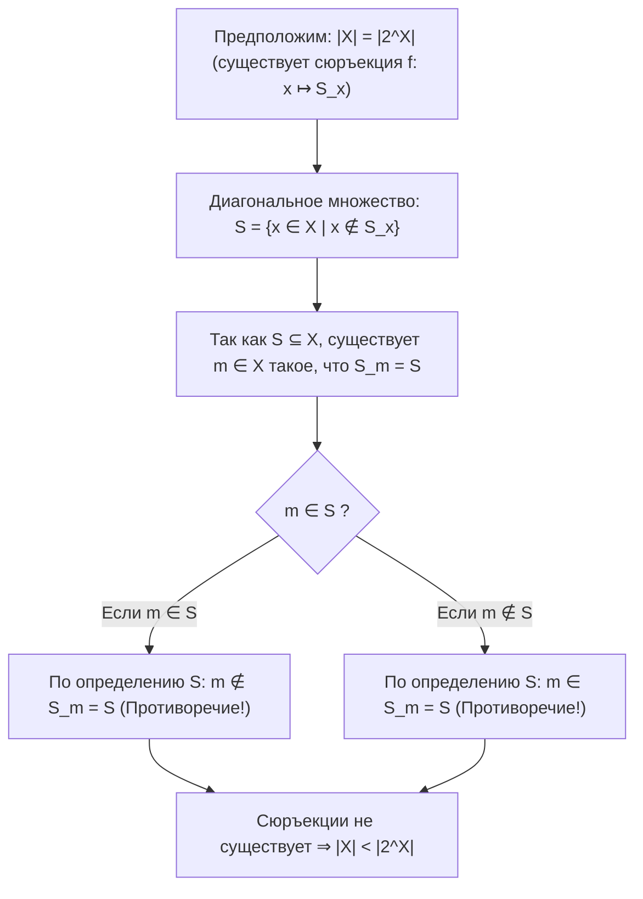
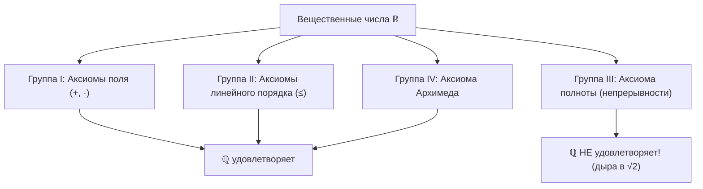

# 📈 Практика 2: Мощности множеств, диагональный процесс Кантора, аксиоматика $\mathbb{R}$ и сечения Дедекинда

> [!abstract] О занятии
> - **Дисциплина:** [[Математический анализ]] (1 семестр)
> - **Дата:** 17 сентября 2026 (неделя 2, четверг, 09:50)
> - **Поток:** **Поток 2** (Software Engineering, Университет ИТМО)
> - **Ключевые темы:** Сравнение мощностей множеств ($|X| \le |Y|$), характеристические функции подмножеств, теорема Кантора о мощности булеана ($|X| < |2^X|$) и ее строгое доказательство диагональным методом, несчетность континуума $|\mathbb{N}| < |\mathbb{R}|$, система аксиом поля вещественных чисел $\mathbb{R}$ (I. Поле, II. Порядок, III. Полнота, IV. Архимед), доказательство свойств упорядоченного поля ($xa \le ya$, $x^2 \ge 0$, $0 < 1$), теорема о невозможности введения согласованного порядка в поле $\mathbb{C}$, неполнота $\mathbb{Q}$, теория сечений Дедекинда в $\mathbb{Q}$, каноническое вложение $\mathbb{Q} \hookrightarrow \mathbb{R}$, иррациональное сечение $\sqrt{2}$, арифметика сечений (сложение и умножение).

---

## 1. Сравнение мощностей множеств и теорема Кантора

### 1.1. Отношение мощности
Пусть $X$ и $Y$ — произвольные множества.
1. Множества $X$ и $Y$ называются **равномощными** ($|X| = |Y|$), если существует биекция $f: X \to Y$.
2. Мощность $X$ **не превосходит** мощности $Y$ ($|X| \le |Y|$), если существует инъекция $f: X \hookrightarrow Y$.
3. Мощность $X$ **строго меньше** мощности $Y$ ($|X| < |Y|$), если $|X| \le |Y|$, но $|X| \ne |Y|$ (то есть инъекция существует, а биекции не существует).

### 1.2. Булеан и характеристические функции
Множество всех подмножеств множества $X$ (булеан) обозначается как $2^X$ или $\mathcal{P}(X)$.  
Каждому подмножеству $S \subseteq X$ взаимно однозначно соответствует его **характеристическая функция** $\chi_S: X \to \{0, 1\}$:
$$\chi_S(x) = \begin{cases} 1, & x \in S \\ 0, & x \notin S \end{cases}$$
Поэтому булеан $2^X$ естественным образом отождествляется со множеством функций $\{0, 1\}^X$.

Очевидно, что $|X| \le |2^X|$, так как отображение $f: X \to 2^X$, задаваемое формулой:
$$x \mapsto \{x\}$$
является инъекцией (синглтоны $\{x_1\}$ и $\{x_2\}$ не равны при $x_1 \ne x_2$).

---

### 1.3. Теорема Кантора о мощности булеана

> [!theorem] Теорема Кантора (1891)
> Для любого множества $X$ (как конечного, так и бесконечного) мощность булеана строго больше мощности самого множества:
> $$|X| < |2^X|$$

> [!proof] Доказательство диагональным методом Кантора
> Уже установлено, что $|X| \le |2^X|$. Осталось показать, что $|X| \ne |2^X|$, то есть **не существует сюръективного отображения** из $X$ в $2^X$.
> 
> Предположим противное: пусть существует сюръекция:
> $$f: X \to 2^X, \quad x \mapsto S_x \quad (S_x \subseteq X)$$
> 
> Построим контрпример — «диагональное» подмножество $S \subseteq X$:
> $$S = \{x \in X \mid x \notin S_x\}$$
> 
> Так как $S \subseteq X$, элемент $S$ принадлежит булеану $2^X$.  
> В силу предположенной сюръективности отображения $f$, для подмножества $S$ обязан найтись прообраз $m \in X$ такой, что:
> $$f(m) = S_m = S$$
> 
> Выясним, принадлежит ли элемент $m$ множеству $S$:
> 1. Если $m \in S$, то по определению множества $S$ должно выполняться $m \notin S_m$. Но $S_m = S$, то есть $m \notin S$ — **противоречие!**
> 2. Если $m \notin S$, то $m \notin S_m$, а значит, по определению множества $S$, элемент $m$ обязан принадлежать $S$ — **противоречие!**
> 
> В обоих случаях получаем логическое противоречие. Следовательно, наше предположение неверно: никакой сюръекции $f: X \to 2^X$ не существует, откуда:
> $$|X| < |2^X| \quad \blacksquare$$

---

### 1.4. Иллюстрация: счетный случай $X = \mathbb{N}$

Для $X = \mathbb{N}$ предположим, что все подмножества $\mathbb{N}$ удалось перенумеровать натуральными числами: $S_1, S_2, S_3, \dots$.  
Запишем бесконечную двоичную матрицу характеристических функций:

| Множество | Элемент $1$ | Элемент $2$ | Элемент $3$ | Элемент $4$ | $\dots$ |
| :---: | :---: | :---: | :---: | :---: | :---: |
| **$S_1$** | $\mathbf{\chi_{S_1}(1)}$ | $\chi_{S_1}(2)$ | $\chi_{S_1}(3)$ | $\chi_{S_1}(4)$ | $\dots$ |
| **$S_2$** | $\chi_{S_2}(1)$ | $\mathbf{\chi_{S_2}(2)}$ | $\chi_{S_2}(3)$ | $\chi_{S_2}(4)$ | $\dots$ |
| **$S_3$** | $\chi_{S_3}(1)$ | $\chi_{S_3}(2)$ | $\mathbf{\chi_{S_3}(3)}$ | $\chi_{S_3}(4)$ | $\dots$ |
| **$S_4$** | $\chi_{S_4}(1)$ | $\chi_{S_4}(2)$ | $\chi_{S_4}(3)$ | $\mathbf{\chi_{S_4}(4)}$ | $\dots$ |

Инвертируем элементы главной диагонали:
$$\chi_S(n) = 1 - \chi_{S_n}(n)$$
Множество $S$ отличается от $S_1$ по принадлежности элемента $1$, от $S_2$ — по принадлежности $2$, и в общем случае от любого $S_n$ — по принадлежности элемента $n$.  
Следовательно, подмножество $S$ **не может совпадать ни с одной строкой матрицы**, что доказывает несчетность $2^\mathbb{N}$:
$$|\mathbb{N}| < |2^\mathbb{N}| = \mathfrak{c}$$

> [!important] Несчетность множества вещественных чисел
> Поскольку каждое действительное число из отрезка $[0, 1)$ однозначно представимо бесконечной двоичной дробью (с запретом периода из единиц), мощность континуума $|\mathbb{R}| = |2^\mathbb{N}|$.  
> Отсюда непосредственно следует, что:
> $$|\mathbb{N}| < |\mathbb{R}|$$
> Множество вещественных чисел **несчётно**.

---

## 2. Аксиоматика вещественных чисел $\mathbb{R}$

Множество вещественных чисел $\mathbb{R}$ определяется как **полное линейно упорядоченное архимедово поле**.  
Система аксиом разбивается на четыре фундаментальные группы:

### Группа I. Аксиомы поля
На $\mathbb{R}$ заданы две бинарные операции: сложение $(+)$ и умножение $(\cdot)$:
1. $(\mathbb{R}, +)$ — абелева группа: ассоциативность, нейтральный элемент $0$, противоположный $-x$, коммутативность.
2. $(\mathbb{R} \setminus \{0\}, \cdot)$ — абелева группа: ассоциативность, нейтральный элемент $1 \ne 0$, обратный $x^{-1} = \frac{1}{x}$, коммутативность.
3. **Дистрибутивность:** умножение дистрибутивно относительно сложения:
   $$\forall x, y, z \in \mathbb{R}: x \cdot (y + z) = x \cdot y + x \cdot z$$

---

### Группа II. Аксиомы порядка
На $\mathbb{R}$ задано бинарное отношение $\le$ (линейный порядок):
1. **Линейность:** $\forall x, y \in \mathbb{R}: x \le y \lor y \le x$.
2. **Транзитивность:** $x \le y \land y \le z \implies x \le z$.
3. **Антисимметричность:** $x \le y \land y \le x \implies x = y$.
4. **Согласованность со сложением:**
   $$x \le y \implies x + z \le y + z \quad \forall z \in \mathbb{R}$$
5. **Согласованность с умножением:**
   $$0 < x \land 0 < y \implies 0 < x \cdot y$$

---

### Группа III. Аксиома полноты (непрерывности Дедекинда)
> [!theorem] Аксиома непрерывности Дедекинда
> Пусть непустые подмножества $A, B \subset \mathbb{R}$ таковы, что для любых $a \in A$ и $b \in B$ выполнено:
> $$a \le b$$
> Тогда существует хотя бы одно разделяющее число $c \in \mathbb{R}$ такое, что:
> $$\forall a \in A, \forall b \in B : a \le c \le b$$

*(Эквивалентна принципу существования точной верхней грани: любое непустое ограниченное сверху подмножество $\mathbb{R}$ имеет супремум $\sup A \in \mathbb{R}$)*.

---

### Группа IV. Аксиома Архимеда
> [!theorem] Принцип Архимеда
> Для любого действительного числа $x \in \mathbb{R}$ найдется такое натуральное число $n \in \mathbb{N}$, что:
> $$n > x$$

---

## 3. Вывод фундаментальных свойств упорядоченного поля

### 3.1. Умножение неравенства на положительное число

> [!theorem] Свойство
> Если $x \le y$ и $a > 0$, то $x \cdot a \le y \cdot a$.

> [!proof] Доказательство
> $x \le y \iff y - x \ge 0$.  
> Если $y - x = 0$, то $x = y$, и равенство $xa = ya$ тривиально.  
> Если $y - x > 0$, то по аксиоме согласованности умножения:
> $$0 < (y - x) \cdot a = y \cdot a - x \cdot a \implies x \cdot a < y \cdot a$$
> Объединяя случаи, получаем $x \cdot a \le y \cdot a$. $\blacksquare$

---

### 3.2. Умножение неравенства на отрицательное число (смена знака)

> [!theorem] Свойство
> Если $x \le y$ и $a < 0$, то $y \cdot a \le x \cdot a$.

> [!proof] Доказательство
> Так как $a < 0$, прибавив $-a$ к обеим частям, получаем $0 < -a$.  
> По свойству умножения на положительное число:
> $$(y - x) \cdot (-a) \ge 0 \implies -ya + xa \ge 0 \implies xa \ge ya \iff ya \le xa \quad \blacksquare$$

---

### 3.3. Неотрицательность квадрата любого вещественного числа

> [!theorem] Свойство
> Для любого $x \in \mathbb{R}$:
> $$x^2 \ge 0$$

> [!proof] Доказательство
> Рассмотрим три взаимоисключающих случая:
> 1. Если $x = 0$, то $x^2 = 0 \cdot 0 = 0 \ge 0$.
> 2. Если $x > 0$, то $x^2 = x \cdot x > 0$ по аксиоме согласованности умножения.
> 3. Если $x < 0$, то $-x > 0$. Тогда по правилам поля:
>    $$x^2 = (-x) \cdot (-x) > 0$$
> Во всех случаях $x^2 \ge 0$. $\blacksquare$

> [!important] Следствие 1: Положительность единицы
> $$0 < 1$$
> **Доказательство:** По аксиоме поля $1 \ne 0$. Поскольку $1 = 1^2$, по доказанной теореме $1 = 1^2 > 0$. $\blacksquare$

---

### 3.4. Теорема о невозможности упорядочения поля $\mathbb{C}$

> [!theorem] Неупорядочиваемость поля комплексных чисел
> В поле комплексных чисел $\mathbb{C}$ **не существует** отношения порядка, удовлетворяющего аксиомам группы II (согласованного упорядоченного поля).

> [!proof] Доказательство от противного
> Предположим, что такой линейный порядок в $\mathbb{C}$ существует.  
> Тогда для мнимой единицы $i \in \mathbb{C}$ по доказанной выше теореме о квадратах обязано выполняться:
> $$i^2 \ge 0$$
> Но по определению мнимой единицы $i^2 = -1$. Следовательно:
> $$-1 \ge 0$$
> Прибавим $1$ к обеим частям: $0 \ge 1$, то есть $1 \le 0$.  
> Однако ранее строго доказано, что $0 < 1$.  
> Полученное противоречие ($0 < 1$ и $1 \le 0$) доказывает, что поле комплексных чисел $\mathbb{C}$ **в принципе невозможно превратить в упорядоченное поле**! $\blacksquare$

---

### 3.5. Почему поле рациональных чисел $\mathbb{Q}$ не является $\mathbb{R}$?
Поле $\mathbb{Q}$ удовлетворяет:
- Аксиомам поля (I) ✅
- Аксиомам порядка (II) ✅
- Аксиоме Архимеда (IV) ✅

Однако поле $\mathbb{Q}$ **не удовлетворяет аксиоме непрерывности (III)**!  
Рассмотрим множества:
$$A = \{x \in \mathbb{Q} \mid x \le 0 \lor x^2 < 2\}, \quad B = \{x \in \mathbb{Q} \mid x > 0 \land x^2 > 2\}$$
Для любых $a \in A, b \in B$ верно $a < b$, однако **в $\mathbb{Q}$ не существует числа $c$**, разделяющего $A$ и $B$, так как $\sqrt{2} \notin \mathbb{Q}$.  
В числовой прямой $\mathbb{Q}$ есть «пустоты» (дыры). Для заполнения этих пустот строится пополнение — сечения Дедекинда.

---

## 4. Конструкция вещественных чисел через сечения Дедекинда в $\mathbb{Q}$

### 4.1. Определение сечения Дедекинда

> [!info] Определение нижнего класса сечения
> Подмножество $\alpha \subset \mathbb{Q}$ называется **дедекиндовым сечением** (нижним классом Дедекинда), если выполнены три условия:
> 1. **Нетривиальность:** $\alpha \ne \varnothing$ и $\alpha \ne \mathbb{Q}$.
> 2. **Замкнутость вниз:**
>    $$\forall x \in \alpha, \ \forall y \in \mathbb{Q} : y \le x \implies y \in \alpha$$
> 3. **Отсутствие наибольшего элемента (открытость справа):**
>    $$\forall x \in \alpha \ \exists y \in \alpha : x < y$$

Множество всех дедекиндовых сечений отождествляется с **полем вещественных чисел $\mathbb{R}$**.

---

### 4.2. Каноническое вложение $\mathbb{Q} \hookrightarrow \mathbb{R}$
Каждому рациональному числу $q \in \mathbb{Q}$ ставится в соответствие главное сечение:
$$q \leftrightarrow \alpha_q = \{x \in \mathbb{Q} \mid x < q\}$$
Это вложение сохраняет операции сложения, умножения и порядок:
$$q_1 < q_2 \iff \alpha_{q_1} \subset \alpha_{q_2}$$

---

### 4.3. Иррациональное сечение: число $\sqrt{2}$
Определим подмножество $\alpha \subset \mathbb{Q}$:
$$\alpha_{\sqrt{2}} = \{x \in \mathbb{Q} \mid x \le 0 \lor (x > 0 \land x^2 < 2)\}$$

Проверим выполнение условий сечения:
1. $\alpha \ne \varnothing$ (например, $0 \in \alpha$); $\alpha \ne \mathbb{Q}$ (например, $2 \notin \alpha$, так как $2^2 = 4 > 2$).
2. Если $x \in \alpha$ и $y < x$, то:
   - При $y \le 0$ сразу $y \in \alpha$.
   - При $0 < y < x$ имеем $y^2 < x^2 < 2 \implies y \in \alpha$.
3. Отсутствие наибольшего элемента: для любого $x \in \alpha$ ($x > 0, x^2 < 2$) можно взять рациональное:
   $$y = x + \frac{2 - x^2}{x + 2} = \frac{2x + 2}{x + 2} \in \mathbb{Q}$$
   Тогда $y > x$ и $y^2 < 2$, то есть $y \in \alpha$.

Данное сечение $\alpha_{\sqrt{2}}$ задает иррациональное вещественное число $\sqrt{2} \in \mathbb{R} \setminus \mathbb{Q}$.

---

### 4.4. Арифметика дедекиндовых сечений

#### 1. Сложение сечений:
Для любых сечений $\alpha, \beta \subset \mathbb{Q}$:
$$\alpha + \beta = \{z \in \mathbb{Q} \mid \exists x \in \alpha, \exists y \in \beta : z = x + y\}$$
- Нейтральный элемент по сложению — сечение $\mathbf{0}^* = \{x \in \mathbb{Q} \mid x < 0\}$.
- Противоположное сечение: $-\alpha = \{x \in \mathbb{Q} \mid \exists r > 0 : -x - r \notin \alpha\}$.

#### 2. Порядок сечений:
$$\alpha \le \beta \overset{\text{def}}{\iff} \alpha \subseteq \beta$$

#### 3. Умножение положительных сечений:
Сечение $\alpha$ называется положительным ($\alpha > \mathbf{0}^*$), если $\mathbf{0}^* \subsetneq \alpha$.  
Для положительных сечений $\alpha, \beta > \mathbf{0}^*$ произведение определяется как:
$$\alpha \cdot \beta = \{z \in \mathbb{Q} \mid z \le 0 \lor (\exists x \in \alpha, \exists y \in \beta : x > 0 \land y > 0 \land z = x \cdot y)\}$$

> [!tip] Итог конструкции Дедекинда
> Множество всех дедекиндовых сечений с определенными выше операциями образует непрерывное поле, удовлетворяющее **всем аксиомам I–IV**, тем самым строго математически доказывая существование и единственность (с точностью до изоморфизма) поля вещественных чисел $\mathbb{R}$.

---

## 🔗 Связанные материалы
- ⬅️ [[01. Практика - Отношения эквивалентности, фактор-множества и кольца вычетов (2026-09-10)|Практика 1: Отношения эквивалентности]]
- 📈 [[01. Лекция - Отношения, эквивалентность, порядок, индукция, мощности и счетность (2026-09-08)|Лекция 1: Теория множеств, мощности и счетность]]
- 📈 [[02. Лекция - Предел числовой последовательности, теорема Вейерштрасса и число e (2026-09-15)|Лекция 2: Пределы и теорема Вейерштрасса]]
- 📈 [[Математический анализ]] — главный хаб дисциплины
- 📐 [[03. Лекция - Теорема Ламе, диофантовы уравнения, ОТА, КТО и группы (2026-09-17)|Линейная алгебра: Лекция 3 (17.09.2026)]]
- 🏠 [[README|Главная страница базы знаний]]
