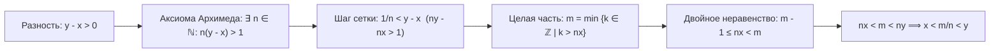
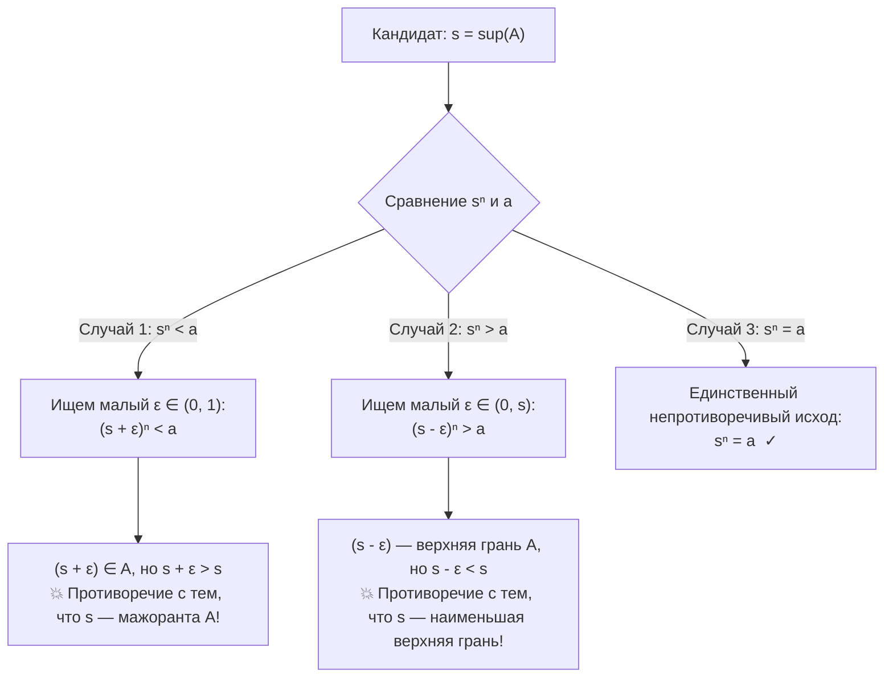
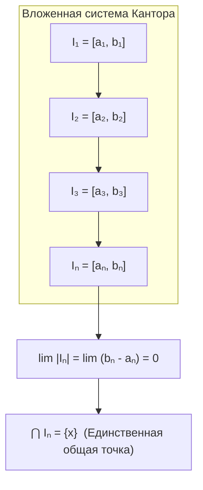
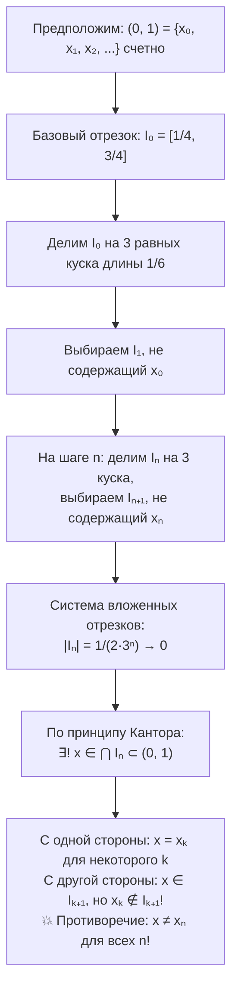
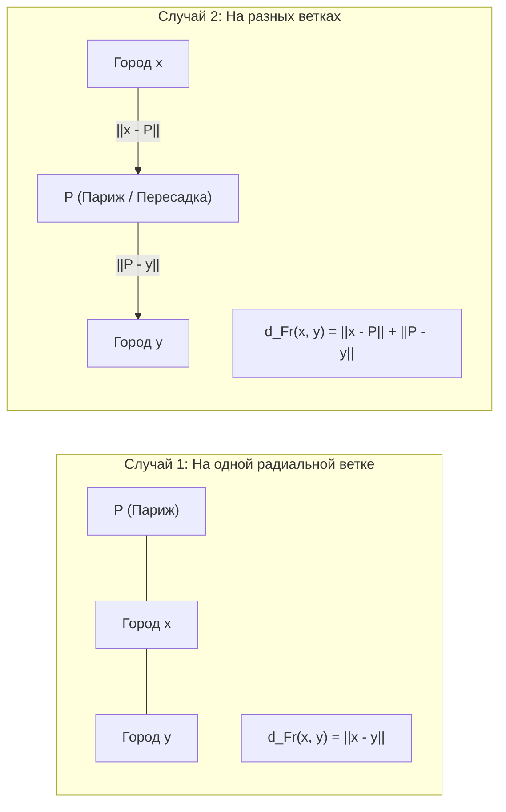
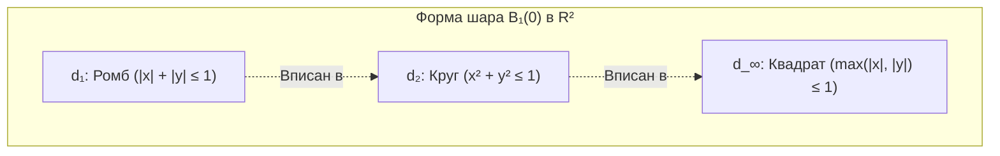
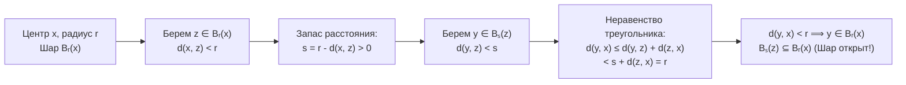

# 📈 Лекция 3: Плотность $\mathbb{Q}$ в $\mathbb{R}$, корни $n$-й степени, принцип Кантора, метрические пространства и основы топологии

> [!abstract] О занятии
> - **Дисциплина:** [[Математический анализ]] (1 семестр)
> - **Дата проведения:** 22 сентября 2026 г. (неделя 4, четная, вторник)
> - **Время:** сдвоенная лекция, пары `09:50 — 11:20` и `11:30 — 13:00`
> - **Аудитория:** Кронверкский пр., д. 49, ауд. 1405
> - **Лектор:** Кумалагов Давид Заурович
> - **Поток:** **Поток 2** (направление Software Engineering, ИТМО, группы M3101–M3109)
> - **Ключевые темы:**
>   1. Плотность множества рациональных чисел $\mathbb{Q}$ в поле вещественных чисел $\mathbb{R}$.
>   2. Существование и единственность корней $n$-й степени из неотрицательных чисел через дедекиндову полноту ($\sup A$), точные $\varepsilon$-оценки, конструкция степеней с рациональным показателем $x^{m/n}$.
>   3. Теорема Кантора о вложенных отрезках (принцип стягивающихся отрезков) и доказательство несчётности интервала $(0, 1)$.
>   4. Метрические пространства: аксиоматика функции расстояния, 7 канонических примеров ($\mathbb{R}, \mathbb{Q}$, дискретная, $p$-адическая ультраметрика, метрика Хэмминга, метрика французских железных дорог Парижа, пространства $\mathbb{R}^n$ с $\ell_1, \ell_2, \ell_\infty$, супремум-метрика $B(\mathbb{R})$).
>   5. Неравенство Коши-Буняковского-Шварца (КБШ), неравенство Минковского и корректность евклидовой метрики $d_2$.
>   6. Основы метрической топологии: открытые и замкнутые шары, геометрия единичных сфер в $\mathbb{R}^2$, открытые и замкнутые множества, их топологические свойства относительно объединений и пересечений, строгие доказательства открытости открытого шара и замкнутости замкнутого шара.

---

## 📌 Краткое резюме (TL;DR)

1. **Плотность $\mathbb{Q}$ в $\mathbb{R}$:** Между любыми двумя различными вещественными числами $x < y$ всегда найдется рациональное число $r \in \mathbb{Q}$, удовлетворяющее строгому неравенству $x < r < y$. Доказательство опирается на аксиому Архимеда $n(y - x) > 1$ и выбор наименьшего целого $m > nx$.
2. **Арифметический корень $n$-й степени:** Для любого $a \ge 0$ и любого $n \in \mathbb{N}$ существует единственное число $x \ge 0$ такое, что $x^n = a$. Единственность доказывается факторизацией $x_1^n - x_2^n = (x_1 - x_2)\sum x_1^{n-1-i} x_2^i$. Существование устанавливается через точную верхнюю грань $s = \sup\{t \ge 0 \mid t^n \le a\}$, а гипотезы $s^n < a$ и $s^n > a$ опровергаются явным подбором малых $\varepsilon > 0$.
3. **Принцип вложенных отрезков Кантора:** Для любой последовательности вложенных отрезков $I_1 \supseteq I_2 \supseteq \dots \supseteq I_n \supseteq \dots$ пересечение $\bigcap_{n=1}^\infty I_n$ непусто. Если дополнительно длины отрезков стремятся к нулю ($|I_n| \to 0$), пересечение состоит ровно из одной точки. *Замкнутость множеств принципиальна:* для открытых интервалов $\bigcap_{n=1}^\infty (0, 1/n) = \varnothing$.
4. **Несчётность континуума через отрезки:** Интервал $(0, 1)$ не является счетным множеством. Доказательство строится трихотомическим делением отрезка $[1/4, 3/4]$ на три части и индуктивным выбором вложенного отрезка, свободного от $n$-го элемента предполагаемой счетной нумерации.
5. **Метрическое пространство $(X, d)$:** Множество $X$, снабженное функцией $d: X \times X \to \mathbb{R}$, удовлетворяющей трем аксиомам: тождества ($d(x,y) \ge 0, d(x,y)=0 \iff x=y$), симметрии ($d(x,y) = d(y,x)$) и неравенства треугольника ($d(x,z) \le d(x,y) + d(y,z)$).
6. **КБШ и неравенство Минковского:** Неравенство Коши-Буняковского-Шварца $\left|\sum u_i v_i\right| \le \sqrt{\sum u_i^2}\sqrt{\sum v_i^2}$ строго доказывается через неотрицательность квадратного трехчлена $P(t) = \sum (u_i - t v_i)^2 \ge 0$ и неположительность его дискриминанта $D \le 0$. Из КБШ вытекает неравенство Минковского $\|u + v\|_2 \le \|u\|_2 + \|v\|_2$, гарантирующее выполнение аксиомы треугольника для евклидовой метрики $d_2$.
7. **Топология метрического пространства:**
   - Множество $U$ открыто $\iff \forall x \in U \; \exists r > 0 : B_r(x) \subseteq U$.
   - Множество $F$ замкнуто $\iff X \setminus F$ открыто.
   - Произвольное объединение открытых открыто; конечное пересечение открытых открыто (для бесконечных пересечений открытость может нарушаться: $\bigcap (-1/n, 1/n) = \{0\}$).
   - Любой открытый шар $B_r(x)$ открыт, любой замкнутый шар $\overline{B_r(x)}$ замкнут.

---

## 1. Плотность множества рациональных чисел $\mathbb{Q}$ в $\mathbb{R}$

Одной из важнейших связок между дискретной природой дробей и непрерывной моделью вещественной прямой является свойство всюду плотности: сколь бы близко ни располагались две вещественные точки, между ними гарантированно найдется дробь с целым числителем и натуральным знаменателем.

> [!important] Утверждение (Плотность $\mathbb{Q}$ в $\mathbb{R}$)
> Множество рациональных чисел $\mathbb{Q}$ всюду плотно на числовой прямой $\mathbb{R}$:
> $$\forall x, y \in \mathbb{R} \quad (x < y \implies \exists r \in \mathbb{Q} : x < r < y)$$

### Доказательство:

1. **Применение аксиомы Архимеда:**  
   Поскольку $x < y$, разность длин строго положительна:
   $$y - x > 0$$
   По аксиоме Архимеда для положительных чисел $1$ и $(y - x)$ существует натуральное число $n \in \mathbb{N}$ такое, что:
   $$n \cdot (y - x) > 1 \iff ny - nx > 1 \iff ny > nx + 1$$
   Геометрически это означает, что отрезок длины $(y - x)$ при масштабировании в $n$ раз превосходит единичный отрезок, а значит, в интервал $(nx, ny)$ обязательно попадет хотя бы одно целое число.

2. **Выбор целого числителя $m$ по принципу наименьшего элемента:**  
   Рассмотрим множество целых чисел, строго превосходящих вещественное число $nx$:
   $$K = \{k \in \mathbb{Z} \mid k > nx\}$$
   В силу свойства Архимедовости поле $\mathbb{R}$ множество $K$ непусто и ограничено снизу. Следовательно, в нем существует наименьший элемент:
   $$m := \min K = \min \{k \in \mathbb{Z} \mid k > nx\}$$

3. **Локализация числа $m$:**  
   Поскольку $m \in K$, выполняется строгое неравенство:
   $$nx < m$$
   Поскольку $m$ — наименьший элемент множества $K$, предыдущее целое число $(m - 1)$ уже не принадлежит $K$, что дает:
   $$m - 1 \le nx \iff m \le nx + 1$$

4. **Замыкание оценки:**  
   Объединим полученные соотношения:
   $$m \le nx + 1 < ny \implies m < ny$$
   Собирая левое и правое неравенства воедино, получаем:
   $$nx < m < ny$$
   Поскольку $n \in \mathbb{N}$ (и, следовательно, $n > 0$), разделим все части неравенства на $n$:
   $$x < \frac{m}{n} < y$$
   Полагая $r := \frac{m}{n}$, где $m \in \mathbb{Z}$ и $n \in \mathbb{N}$, получаем искомое рациональное число $r \in \mathbb{Q}$. $\blacksquare$

> [!tip] Следствие (Плотность иррациональных чисел $\mathbb{R} \setminus \mathbb{Q}$)
> Между любыми двумя вещественными числами $x < y$ содержится также бесконечно много иррациональных чисел.  
> *Обоснование:* применим доказанную теорему к точкам $x - \sqrt{2}$ и $y - \sqrt{2}$. Найдется $r \in \mathbb{Q}$ такое, что $x - \sqrt{2} < r < y - \sqrt{2} \iff x < r + \sqrt{2} < y$. Число $r + \sqrt{2}$ строго иррационально.

---

## 2. Существование и единственность корней $n$-й степени

На прошлой практике было показано, что уравнение $x^2 = 2$ не имеет решений в поле $\mathbb{Q}$, что иллюстрирует неполноту рациональных чисел (наличие «дыр» в сечениях Дедекинда). Теперь, опираясь на аксиому дедекиндовой полноты $\mathbb{R}$, мы строго обоснуем корректность извлечения корней произвольной натуральной степени.

> [!important] Теорема (Об арифметическом корне $n$-й степени)
> Для любого вещественного неотрицательного числа $a \ge 0$ и любого натурального показателя $n \in \mathbb{N}$ существует **единственное** вещественное неотрицательное число $x \ge 0$ такое, что:
> $$x^n = a$$
> Данное число обозначается символом $\sqrt[n]{a}$ или $a^{1/n}$ и называется **арифметическим корнем $n$-й степени** из числа $a$.

### Доказательство:

Разделим доказательство на две логические части: единственность и существование.

#### 1. Единственность корня:
Если $a = 0$, то из равенства $x^n = 0$ в силу отсутствия делителей нуля в поле $\mathbb{R}$ немедленно следует $x = 0$.

Пусть $a > 0$. Предположим от противного, что нашлись два различных неотрицательных значения $x_1, x_2 \ge 0$ ($x_1 \ne x_2$) такие, что:
$$x_1^n = a \quad \text{и} \quad x_2^n = a$$
Вычтем одно равенство из другого:
$$x_1^n - x_2^n = 0$$
Воспользуемся алгебраическим тождеством для разности $n$-х степеней:
$$x_1^n - x_2^n = (x_1 - x_2) \cdot \left( x_1^{n-1} + x_1^{n-2}x_2 + x_1^{n-3}x_2^2 + \dots + x_1 x_2^{n-2} + x_2^{n-1} \right) = 0$$
Компактная запись через знак суммы:
$$(x_1 - x_2) \sum_{i=0}^{n-1} x_1^{n-1-i} x_2^i = 0$$
Поскольку $a > 0$, числа $x_1$ и $x_2$ строго положительны ($x_1 > 0, x_2 > 0$). Следовательно, каждый член суммы $x_1^{n-1-i} x_2^i > 0$, откуда:
$$\sum_{i=0}^{n-1} x_1^{n-1-i} x_2^i > 0$$
Произведение двух сомножителей равно нулю, причем второй сомножитель строго положителен. Значит:
$$x_1 - x_2 = 0 \iff x_1 = x_2$$
Полученное противоречие с условием $x_1 \ne x_2$ доказывает единственность корня. $\blacksquare$

---

#### 2. Существование корня:
Построим число $x$ конструктивно с помощью аппарата точных граней.

Рассмотрим числовое множество:
$$A := \{t \in \mathbb{R} \mid t \ge 0 \text{ и } t^n \le a\}$$

1. **Непустота множества $A$:**  
   Значение $t = 0$ удовлетворяет условиям: $0 \ge 0$ и $0^n = 0 \le a$. Следовательно, $0 \in A \implies A \ne \varnothing$.

2. **Ограниченность множества $A$ сверху:**  
   Положим $M := \max\{a, 1\}$. Докажем, что $M$ является верхней гранью $A$.  
   Если $t > M$, то $t > 1$ и $t > a$. Тогда в силу монотонности умножения на положительные числа:
   $$t^n = t \cdot t^{n-1} > t \cdot 1^{n-1} = t > a \implies t^n > a$$
   Это означает, что ни одно число $t > M$ не может принадлежать $A$. Следовательно:
   $$\forall t \in A \implies t \le \max\{a, 1\}$$
   Множество $A$ ограничено сверху числом $\max\{a, 1\}$.

3. **Применение дедекиндовой полноты $\mathbb{R}$:**  
   По аксиоме полноты вещественных чисел всякое непустое ограниченное сверху подмножество $\mathbb{R}$ обладает точной верхней гранью:
   $$s := \sup(A)$$
   Утверждаем, что в точности:
   $$s^n = a$$

Докажем это равенство методом от противного. По закону трихотомии порядка в $\mathbb{R}$ возможны лишь три взаимоисключающих случая: $s^n < a$, $s^n > a$ или $s^n = a$.

---

##### 🔍 Анализ Случая 1: $s^n < a$
Попытаемся сдвинуться вправо от точки $s$, добавив столь малое возмущение $\varepsilon \in (0, 1)$, чтобы возведенная в $n$-ю степень сумма $(s + \varepsilon)^n$ не успела дорасти до $a$.

Оценим разность степеней, используя формулу $u^n - v^n$:
$$(s + \varepsilon)^n - s^n = \varepsilon \sum_{i=0}^{n-1} (s + \varepsilon)^{n-1-i} s^i$$
Поскольку мы ищем $\varepsilon$ в диапазоне $0 < \varepsilon < 1$, справедливы мажорантные неравенства:
$$s + \varepsilon < s + 1 \quad \text{и} \quad s < s + 1$$
Заменяя каждый множитель на $(s + 1)$, получаем:
$$(s + \varepsilon)^{n-1-i} s^i < (s + 1)^{n-1-i} (s + 1)^i = (s + 1)^{n-1}$$
Вся сумма содержит ровно $n$ слагаемых, поэтому:
$$(s + \varepsilon)^n - s^n < \varepsilon \cdot n (s + 1)^{n-1}$$
Следовательно:
$$(s + \varepsilon)^n < s^n + \varepsilon \cdot n (s + 1)^{n-1}$$
Мы хотим гарантировать, чтобы правая часть не превосходила $a$:
$$s^n + \varepsilon \cdot n (s + 1)^{n-1} \le a \iff \varepsilon \cdot n (s + 1)^{n-1} \le a - s^n \iff \varepsilon \le \frac{a - s^n}{n (s + 1)^{n-1}}$$
Поскольку по предположению Случая 1 величина $a - s^n > 0$, а знаменатель $n(s+1)^{n-1} > 0$, правая дробь строго положительна. Положим:
$$\varepsilon := \frac{1}{2} \min\left\{1, \; \frac{a - s^n}{n (s + 1)^{n-1}}\right\}$$
При таком выборе выполнены все условия:
1. $0 < \varepsilon < 1$;
2. $(s + \varepsilon)^n < s^n + (a - s^n) = a$.

Но неравенство $(s + \varepsilon)^n < a$ означает по определению множества $A$, что:
$$(s + \varepsilon) \in A$$
С другой стороны, $\varepsilon > 0 \implies s + \varepsilon > s$. Мы нашли элемент множества $A$, который строго больше супремума $s = \sup(A)$, что категорически невозможно по определению верхней грани! Противоречие.

---

##### 🔍 Анализ Случая 2: $s^n > a$
Теперь предположим, что $s^n > a$. Попытаемся сдвинуться влево на величину $\varepsilon \in (0, s)$ так, чтобы даже уменьшенное число $(s - \varepsilon)$ в $n$-й степени оставалось строго больше $a$.

Если мы сможем подобрать такое $\varepsilon > 0$, что:
$$(s - \varepsilon)^n > a$$
то для любого элемента $t \in A$ мы получим:
$$t^n \le a < (s - \varepsilon)^n$$
Так как для неотрицательных чисел операция возведения в натуральную степень строго монотонна ($u^n > v^n \iff u > v$), отсюда немедленно следует:
$$\forall t \in A \implies t < s - \varepsilon$$
Это означает, что число $(s - \varepsilon)$ является **верхней гранью** множества $A$.  
Однако $s - \varepsilon < s$, что означает существование верхней грани, строго меньшей, чем $\sup(A)$! Это противоречит определению супремума как *наименьшей* из всех верхних граней ($\sup(A) \le M'$ для любой мажоранты $M'$).

Осталось явно найти такое $\varepsilon$. Пусть $0 < \varepsilon < s$. Оценим разность $s^n - (s - \varepsilon)^n$:
$$s^n - (s - \varepsilon)^n = \varepsilon \sum_{i=0}^{n-1} s^{n-1-i} (s - \varepsilon)^i < \varepsilon \sum_{i=0}^{n-1} s^{n-1-i} s^i = \varepsilon \cdot n s^{n-1}$$
Отсюда:
$$(s - \varepsilon)^n > s^n - \varepsilon \cdot n s^{n-1}$$
Мы хотим потребовать, чтобы $s^n - \varepsilon \cdot n s^{n-1} \ge a$, то есть:
$$\varepsilon \cdot n s^{n-1} \le s^n - a \iff \varepsilon \le \frac{s^n - a}{n s^{n-1}}$$
Поскольку $s^n > a$, разность $s^n - a > 0$. Положим:
$$\varepsilon := \frac{1}{2} \min\left\{s, \; \frac{s^n - a}{n s^{n-1}}\right\}$$
При таком $\varepsilon$ гарантированно $(s - \varepsilon)^n > a$, что приводит к противоречию с определением супремума.

---

##### 🏁 Завершение доказательства:
Поскольку оба предположения $s^n < a$ и $s^n > a$ привели к строгим противоречиям с аксиоматикой супремума, остается единственно возможный исход:
$$s^n = a$$
Существование доказано: искомым числом является $x = s = \sup(A)$. $\blacksquare$

---

### Конструкция степеней с рациональным показателем $x^{m/n}$

Опираясь на доказанную теорему о корне, мы можем строго расширить операцию возведения в степень с целых чисел на всё поле рациональных чисел $\mathbb{Q}$.

> [!info] Определение (Рациональная степень)
> Для любого положительного вещественного числа $x > 0$ и любого рационального числа $r = \frac{m}{n} \in \mathbb{Q}$ ($n \in \mathbb{N}, m \in \mathbb{Z}$) степень $x^r$ определяется формулой:
> $$x^{\frac{m}{n}} := \left(x^{\frac{1}{n}}\right)^m = \left(\sqrt[n]{x}\right)^m$$

> [!tip] Корректность определения
> Значение $x^{m/n}$ не зависит от выбора конкретного представления дроби: если $\frac{m}{n} = \frac{km}{kn}$ ($k \in \mathbb{N}$), то:
> $$\left(x^{\frac{1}{kn}}\right)^{km} = \left(\left(x^{\frac{1}{kn}}\right)^k\right)^m = \left(x^{\frac{1}{n}}\right)^m$$
> Для всех $r_1, r_2 \in \mathbb{Q}$ сохраняются стандартные законы степеней:
> $$x^{r_1 + r_2} = x^{r_1} \cdot x^{r_2}, \qquad (x^{r_1})^{r_2} = x^{r_1 r_2}, \qquad (xy)^r = x^r y^r$$

---

## 3. Следствия полноты: Принцип Кантора о вложенных отрезках

Принцип вложенных отрезков — это топологический эквивалент аксиомы полноты вещественных чисел. Он утверждает, что система уменьшающихся и вложенных друг в друга замкнутых отрезков не может «схлопнуться в пустоту».

> [!important] Теорема (Принцип вложенных отрезков Кантора)
> Пусть $\{I_n\}_{n \in \mathbb{N}}$ — последовательность числовых отрезков $I_n = [a_n, b_n]$ ($a_n \le b_n$), образующих вложенную систему:
> $$I_1 \supseteq I_2 \supseteq I_3 \supseteq \dots \supseteq I_n \supseteq I_{n+1} \supseteq \dots$$
> Тогда их общее пересечение непусто:
> $$\bigcap_{n=1}^\infty I_n \ne \varnothing$$
> 
> **Дополнение о единственности:** Если, кроме того, последовательность длин отрезков стремится к нулю:
> $$|I_n| := b_n - a_n \xrightarrow[n \to \infty]{} 0$$
> то пересечение всех отрезков состоит **ровно из одной точки**:
> $$\exists! x \in \mathbb{R} : \bigcap_{n=1}^\infty I_n = \{x\}$$

### Доказательство непустоты пересечения:
1. **Соотношение концов отрезков:**  
   Условие вложенности $I_{n+1} \subseteq I_n$ означает, что:
   $$[a_{n+1}, b_{n+1}] \subseteq [a_n, b_n] \iff a_n \le a_{n+1} \le b_{n+1} \le b_n$$
   Следовательно, последовательность левых концов $\{a_n\}$ монотонно не убывает, а последовательность правых концов $\{b_n\}$ монотонно не возрастает:
   $$a_1 \le a_2 \le \dots \le a_n \le \dots \le b_m \le \dots \le b_2 \le b_1$$
   Покажем, что **любой левый конец не превосходит любого правого конца**: $\forall n, m \in \mathbb{N} \implies a_n \le b_m$.
   - Если $n \le m$, то $a_n \le a_m \le b_m$;
   - Если $n > m$, то $a_n \le b_n \le b_m$.  
   Неравенство доказано для всех $n, m$.

2. **Введение множества левых концов:**  
   Рассмотрим множество всех левых концов:
   $$L := \{a_n \mid n \in \mathbb{N}\} \subset \mathbb{R}$$
   Множество $L$ непусто ($a_1 \in L$).  
   Поскольку для любого фиксированного $m \in \mathbb{N}$ каждый элемент $a_n \in L$ удовлетворяет $a_n \le b_m$, любой правый конец $b_m$ является **верхней гранью** множества $L$.

3. **Существование супремума:**  
   По аксиоме дедекиндовой полноты $\mathbb{R}$ существует точная верхняя грань множества $L$:
   $$x := \sup(L)$$
   - Так как $x$ — верхняя грань множества $L$, то:
     $$a_n \le x \quad \forall n \in \mathbb{N}$$
   - Так как любой $b_n$ — верхняя грань множества $L$, а $x$ — *наименьшая* из верхних граней, то:
     $$x \le b_n \quad \forall n \in \mathbb{N}$$
   Объединяя оба неравенства, получаем:
   $$\forall n \in \mathbb{N} \implies a_n \le x \le b_n \iff x \in [a_n, b_n] = I_n$$
   Поскольку точка $x$ принадлежит каждому отрезку $I_n$, она принадлежит и их бесконечному пересечению:
   $$x \in \bigcap_{n=1}^\infty I_n \implies \bigcap_{n=1}^\infty I_n \ne \varnothing \quad \blacksquare$$

---

### Доказательство единственности при $|I_n| \to 0$:
Предположим от противного, что в пересечении $\bigcap_{n=1}^\infty I_n$ содержатся две различные точки $x$ и $y$ ($x \ne y$).  
Без ограничения общности положим $x < y$, тогда расстояние между ними строго положительно:
$$|x - y| = y - x > 0$$
Поскольку обе точки принадлежат каждому отрезку $I_n = [a_n, b_n]$, мы имеем:
$$a_n \le x < y \le b_n \implies |x - y| \le b_n - a_n \quad \forall n \in \mathbb{N}$$
По условию длина отрезка стремится к нулю: $b_n - a_n \to 0$ при $n \to \infty$.  
Зафиксируем положительное число:
$$\varepsilon := \frac{|x - y|}{2} > 0$$
По определению предела последовательности найдется такой номер $N \in \mathbb{N}$, что для всех $n \ge N$:
$$b_n - a_n < \varepsilon = \frac{|x - y|}{2}$$
Подставляя это в предыдущую оценку для номера $N$, получаем:
$$|x - y| \le b_N - a_N < \frac{|x - y|}{2} \implies |x - y| < \frac{|x - y|}{2}$$
Разделив строго положительную величину $|x - y|$ на саму себя, приходим к абсурдному неравенству $1 < \frac{1}{2}$.  
Следовательно, двух различных точек существовать не может: общая точка $x$ единственна. $\blacksquare$

---

> [!warning] Принципиальность замкнутости: контрпример для открытых интервалов
> Если заменить отрезки $[a_n, b_n]$ на открытые интервалы $(a_n, b_n)$, теорема Кантора перестает быть верной!  
> **Контрпример:** Рассмотрим последовательность вложенных интервалов:
> $$I_n = \left(0, \; \frac{1}{n}\right), \quad n \in \mathbb{N}$$
> Очевидно, что $I_1 \supset I_2 \supset I_3 \supset \dots$, а длины интервалов $|I_n| = \frac{1}{n} \to 0$.  
> Однако их общее пересечение пусто:
> $$\bigcap_{n=1}^\infty \left(0, \; \frac{1}{n}\right) = \varnothing$$
> *Доказательство пустоты:* допустим, существует точка $x \in \bigcap I_n$.
> 1. Если $x \le 0$, то $x \notin (0, 1) = I_1$, значит $x$ не входит в пересечение.
> 2. Если $x > 0$, то по аксиоме Архимеда найдется такое натуральное $n_0$, что $\frac{1}{n_0} < x$. Тогда $x \notin \left(0, \frac{1}{n_0}\right) = I_{n_0}$, и $x$ вновь не входит в пересечение.  
> Пустота доказана. Для справедливости принципа Кантора замкнутость отрезков строго необходима!

---

## 4. Несчётность интервала $(0, 1)$ и мощности континуума

На первой лекции несчётность множества вещественных чисел обосновывалась через диагональный процесс Кантора над десятичными/двоичными дробями. Теперь мы дадим абсолютно строгое топологическое доказательство несчётности интервала $(0, 1)$, целиком опирающееся на **принцип вложенных отрезков Кантора** и свободное от тонкостей с неоднозначностью записи чисел (периоды вида $0.999\dots$).

> [!theorem] Предложение (Несчётность интервала $(0, 1)$)
> Множество вещественных чисел интервала $(0, 1)$ является **несчётным**:
> $$|(0, 1)| > |\mathbb{N}| = \aleph_0$$

### Доказательство (Канторовский метод деления на три части):
Предположим от противного, что интервал $(0, 1)$ счетен. Тогда все его элементы можно выписать в виде упорядоченной последовательности (занумеровать натуральными индексами):
$$(0, 1) = \{x_0, x_1, x_2, \dots, x_n, \dots\}$$

1. **Базовый шаг ($n = 0$):**  
   Выберем начальный замкнутый отрезок, строго лежащий внутри $(0, 1)$:
   $$I_0 = \left[\frac{1}{4}, \; \frac{3}{4}\right] \subset (0, 1), \qquad |I_0| = \frac{3}{4} - \frac{1}{4} = \frac{1}{2}$$
   Разделим отрезок $I_0$ на три равные замкнутые части длины $\frac{1}{2 \cdot 3} = \frac{1}{6}$:
   $$J_1 = \left[\frac{1}{4}, \frac{5}{12}\right], \quad J_2 = \left[\frac{5}{12}, \frac{7}{12}\right], \quad J_3 = \left[\frac{7}{12}, \frac{3}{4}\right]$$
   Интервалы внутренних точек этих трех отрезков не пересекаются. Число $x_0$ может принадлежать максимум двум из этих отрезков (если попадает в общую границу), а значит, **хотя бы один из отрезков $J_1, J_2, J_3$ гарантированно не содержит точку $x_0$**.  
   Выберем такой отрезок и обозначим его через $I_1$. По построению:
   $$I_1 \subset I_0, \quad x_0 \notin I_1, \quad |I_1| = \frac{1}{2 \cdot 3^1}$$

2. **Индуктивный шаг перехода от $n$ к $n+1$:**  
   Пусть отрезок $I_n$ уже построен так, что:
   $$I_n \subset I_{n-1} \subset \dots \subset I_0, \qquad x_{n-1} \notin I_n, \qquad |I_n| = \frac{1}{2 \cdot 3^n}$$
   Разделим отрезок $I_n$ на три равные части длины $\frac{|I_n|}{3} = \frac{1}{2 \cdot 3^{n+1}}$.  
   Среди этих трех частей выбираем отрезок, который **не содержит точку $x_n$**, и обозначаем его $I_{n+1}$. По построению:
   $$I_{n+1} \subset I_n, \qquad x_n \notin I_{n+1}, \qquad |I_{n+1}| = \frac{1}{2 \cdot 3^{n+1}}$$

3. **Анализ стягивания и получение противоречия:**  
   Мы построили бесконечную последовательность вложенных отрезков:
   $$I_0 \supset I_1 \supset I_2 \supset \dots \supset I_n \supset I_{n+1} \supset \dots$$
   Длины отрезков стремятся к нулю:
   $$|I_n| = \frac{1}{2 \cdot 3^n} \xrightarrow[n \to \infty]{} 0$$
   По **теореме Кантора о вложенных отрезках** существует точка:
   $$x \in \bigcap_{n=0}^\infty I_n$$
   Так как $\bigcap_{n=0}^\infty I_n \subset I_0 = [1/4, 3/4] \subset (0, 1)$, точка $x$ гарантированно лежит в интервале $(0, 1)$.

   Следовательно, по нашему предположению о счетности, точка $x$ обязана входить в состав перечисления всех элементов интервала:
   $$\exists k \in \mathbb{N} : x = x_k$$
   Однако проинспектируем шаг построения номер $(k+1)$:
   - По определению точки пересечения: $x \in \bigcap_{n=0}^\infty I_n \implies x \in I_{k+1}$;
   - Но по алгоритму построения отрезка $I_{k+1}$ точка $x_k$ была явно исключена: $x_k \notin I_{k+1}$!

   Получаем одновременное выполнение:
   $$x \in I_{k+1} \quad \text{и} \quad x = x_k \notin I_{k+1}$$
   Это неразрешимое противоречие доказывает, что предположение о счетности интервала $(0, 1)$ ложно.  
   Интервал $(0, 1)$ несчётен! $\blacksquare$

> [!tip] Следствие (Мощность числовых множеств)
> Поскольку существует каноническая биекция между интервалом $(0, 1)$, любым другим интервалом $(a, b)$, отрезком $[a, b]$, полуинтервалом $[a, b)$ и всей прямой $\mathbb{R}$ (например, $f(x) = \operatorname{tg}(\pi(x - 1/2))$ переводит $(0, 1)$ на всю прямую $\mathbb{R}$), **все невырожденные промежутки числовой прямой несчётны и имеют мощность континуума**:
> $$|(a, b)| = |[a, b]| = |\mathbb{R}| = \mathfrak{c} = 2^{\aleph_0}$$

---

## 5. Метрические пространства: аксиоматика и 7 канонических примеров

До сих пор близость двух чисел $x, y \in \mathbb{R}$ измерялась абсолютной величиной разности $|x - y|$. Однако в анализе функций, теории рядов, линейной алгебре и компьютерных науках требуется измерять расстояние между векторами, непрерывными функциями, строками бит или графами. Для этого математический анализ вводит абстрактное понятие **метрического пространства**.

> [!important] Определение (Метрическое пространство)
> Пусть $X$ — произвольное непустое множество. Отображение $d: X \times X \to \mathbb{R}$ называется **метрикой** (или функцией расстояния) на $X$, а упорядоченная пара $(X, d)$ — **метрическим пространством**, если для любых элементов $x, y, z \in X$ выполнены три аксиомы:
> 
> 1. **Аксиома тождества (неотрицательность и невырожденность):**
>    $$d(x, y) \ge 0, \qquad d(x, y) = 0 \iff x = y$$
> 2. **Аксиома симметрии:**
>    $$d(x, y) = d(y, x)$$
> 3. **Аксиома неравенства треугольника:**
>    $$d(x, z) \le d(x, y) + d(y, z)$$

---

### Семь канонических примеров метрик

#### Пример 0. Стандартная метрика на $\mathbb{R}$ и $\mathbb{Q}$
На множестве вещественных или рациональных чисел расстояние задается модулем разности:
$$d(x, y) = |x - y|$$
Все три аксиомы тривиально следуют из элементарных свойств абсолютной величины:
- $|x - y| \ge 0$, равенство нулю $\iff x = y$;
- $|x - y| = |-(y - x)| = |y - x|$;
- $|x - z| = |(x - y) + (y - z)| \le |x - y| + |y - z|$.

---

#### Пример 1. Дискретная метрика на произвольном множестве $X$
Пусть $X$ — любое непустое множество (например, множество студентов, вершин графа или абстрактных символов). Определим расстояние правилом:
$$d_{\text{disc}}(x, y) = \begin{cases} 0, & x = y \\ 1, & x \ne y \end{cases}$$
- Аксиомы 1 и 2 тривиально выполнены.
- Для проверки неравенства треугольника $d(x, z) \le d(x, y) + d(y, z)$:
  - Если $x = z$, левая часть равна $0 \le d(x, y) + d(y, z)$, что верно при любых $d \ge 0$.
  - Если $x \ne z$, то левая часть равна $1$. При этом точка $y$ не может совпадать одновременно и с $x$, и с $z$. Следовательно, хотя бы одно из расстояний $d(x, y)$ или $d(y, z)$ равно 1, откуда $d(x, y) + d(y, z) \ge 1$. Неравенство треугольника соблюдено.

---

#### Пример 2. $p$-адическая метрика на поле рациональных чисел $\mathbb{Q}$
Пусть $p$ — фиксированное простое число (например, $p = 5$).  
Любое ненулевое рациональное число $q \in \mathbb{Q} \setminus \{0\}$ единственным образом представляется в виде произведения степени простого $p$ на несократимую дробь, взаимно простую с $p$:
$$q = p^m \cdot \frac{k}{n}, \quad m \in \mathbb{Z}, \quad k, n \in \mathbb{Z} \setminus \{0\}, \quad p \nmid k, \; p \nmid n$$
$p$-адическая норма числа $q$ определяется как $|q|_p := p^{-m}$, а $|0|_p := 0$.  
Расстояние между рациональными точками $x, y \in \mathbb{Q}$ задается формулой:
$$d_p(x, y) := |x - y|_p$$

> [!info] Смысл $p$-адической метрики
> Чем выше степень числа $p$, на которую делится разность $(x - y)$, тем ближе эти числа друг к другу!  
> *Пример:* в 5-адической метрике последовательность $x_n = 5^n$ стремится к нулю с колоссальной скоростью:
> $$d_5(5^n, 0) = |5^n - 0|_5 = |5^n|_5 = 5^{-n} = \frac{1}{5^n} \xrightarrow[n \to \infty]{} 0$$
> Более того, $p$-адическая метрика удовлетворяет **сильному неравенству треугольника (аксиоме ультраметрики)**:
> $$d_p(x, z) \le \max\{d_p(x, y), \; d_p(y, z)\}$$
> В ультраметрических пространствах каждый треугольник является равнобедренным, а любая точка внутри шара является его центром!

---

#### Пример 3. Метрика Хэмминга на пространстве двоичных последовательностей
Пусть $X = \{0, 1\}^N$ — множество двоичных кодовых слов длины $N$.  
Для двух векторов $x = (x_1, \dots, x_N)$ и $y = (y_1, \dots, y_N)$ расстояние Хэмминга определяется как число несовпадающих разрядов:
$$d_H(x, y) := \sum_{i=1}^N [x_i \ne y_i] = \sum_{i=1}^N |x_i - y_i|$$
Метрика Хэмминга лежит в основе теории помехоустойчивого кодирования и обнаружения ошибок при сетевой передаче данных.

---

#### Пример 4. Метрика французских железных дорог (Метрика Парижа / SNCF-метрика)
Пусть $X = \mathbb{R}^2$ — евклидова плоскость, на которой зафиксирована особая точка $P = (0, 0)$ («Париж»), представляющая собой радиальный центр железнодорожной сети Франции.  
Расстояние между городами $x$ и $y$ определяется следующим образом:
$$d_{\text{Fr}}(x, y) = \begin{cases} \|x - y\|, & \text{если точки } x, y \text{ и } P \text{ лежат на одной прямой (на одном луче)} \\ \|x - P\| + \|P - y\|, & \text{в противном случае} \end{cases}$$

*Интуиция:* чтобы добраться на поезде из Лиона в Марсель, если прямая ветка не проходит через Париж, пассажир обязан доехать до Парижа, совершить пересадку на вокзале и отправиться по радиальной ветке в пункт назначения.

---

#### Пример 5. Метрики в конечномерном векторном пространстве $\mathbb{R}^n$
Пусть $u = (u_1, \dots, u_n)$ и $v = (v_1, \dots, v_n)$ — векторы пространства $\mathbb{R}^n$. В зависимости от выбора нормы определяются три ключевые метрики:

1. **Манхэттенская метрика ($\ell_1$-метрика, метрика городских кварталов):**
   $$d_1(u, v) = \sum_{i=1}^n |u_i - v_i|$$
2. **Евклидова метрика ($\ell_2$-метрика, классическое расстояние Пифагора):**
   $$d_2(u, v) = \sqrt{\sum_{i=1}^n (u_i - v_i)^2} = \left( \sum_{i=1}^n |u_i - v_i|^2 \right)^{\frac{1}{2}}$$
3. **Чебышёвская метрика ($\ell_\infty$-метрика, метрика шахматного короля):**
   $$d_\infty(u, v) = \max_{1 \le i \le n} |u_i - v_i|$$

---

#### Пример 6. Супремум-метрика в функциональном пространстве $B(\mathbb{R})$
Рассмотрим множество всех ограниченных функций на числовой прямой:
$$B(\mathbb{R}) := \{f: \mathbb{R} \to \mathbb{R} \mid \exists M_f \in \mathbb{R} : |f(x)| \le M_f \; \forall x \in \mathbb{R}\}$$
Расстояние между двумя ограниченными функциями $f$ и $g$ определяется как точная верхняя грань модулей их поточечных отклонений:
$$d_\infty(f, g) := \sup_{x \in \mathbb{R}} |f(x) - g(x)|$$
Данная метрика задает **равномерную сходимость**: сходимость последовательности функций $f_n \to f$ по метрике $d_\infty$ эквивалентна тому, что графики функций целиком затягиваются в сколь угодно узкую полосу ширины $2\varepsilon$ вокруг графика $f$.

---

## 6. Неравенство Коши-Буняковского-Шварца и метрика $\ell_2$

Чтобы доказать, что евклидово расстояние $d_2(u, v)$ на $\mathbb{R}^n$ удовлетворяет аксиоме неравенства треугольника, необходимо доказать фундаментальное алгебраическое неравенство.

> [!important] Лемма (Неравенство Коши-Буняковского-Шварца / КБШ)
> Для любых двух векторов $u = (u_1, \dots, u_n)$ и $v = (v_1, \dots, v_n)$ пространства $\mathbb{R}^n$ справедливо неравенство:
> $$\left| \sum_{i=1}^n u_i v_i \right| \le \sqrt{\sum_{i=1}^n u_i^2} \cdot \sqrt{\sum_{i=1}^n v_i^2}$$
> В эквивалентной векторной форме скалярного произведения:
> $$|\langle u, v \rangle| \le \|u\|_2 \cdot \|v\|_2$$

### Доказательство:
1. **Тривиальный случай:**  
   Если $u = 0$ или $v = 0$, то левая и правая части равенства тождественно обращаются в ноль ($0 \le 0$), и неравенство тривиально верно.

2. **Основной случай ($v \ne 0$):**  
   Рассмотрим вспомогательную функцию вещественной переменной $t \in \mathbb{R}$, определенную как сумму квадратов:
   $$P(t) := \sum_{i=1}^n (u_i - t v_i)^2$$
   Поскольку каждый член суммы есть квадрат вещественного числа, значение функции $P(t)$ неотрицательно при всех значениях аргумента $t$:
   $$\forall t \in \mathbb{R} \implies P(t) \ge 0$$

3. **Раскрытие квадратов и формирование квадратного трехчлена:**
   $$P(t) = \sum_{i=1}^n \left( u_i^2 - 2t u_i v_i + t^2 v_i^2 \right) = \left( \sum_{i=1}^n v_i^2 \right) t^2 - 2 \left( \sum_{i=1}^n u_i v_i \right) t + \left( \sum_{i=1}^n u_i^2 \right)$$
   Мы получили квадратичную функцию относительно $t$:
   $$P(t) = A t^2 + B t + C$$
   где коэффициенты равны:
   $$A = \sum_{i=1}^n v_i^2 > 0 \quad (\text{так как } v \ne 0), \qquad B = -2 \sum_{i=1}^n u_i v_i, \qquad C = \sum_{i=1}^n u_i^2 \ge 0$$

4. **Анализ дискриминанта:**  
   Графиком функции $P(t)$ является парабола с ветвями, направленными строго вверх ($A > 0$).  
   Условие $P(t) \ge 0$ для всех $t \in \mathbb{R}$ означает, что парабола не опускается ниже оси абсцисс. Следовательно, квадратный трехчлен не может иметь двух различных вещественных корней, а значит, его четвертной дискриминант обязан быть **неположительным**:
   $$\frac{D}{4} \le 0$$
   Вычислим $\frac{D}{4}$:
   $$\frac{D}{4} = \left(\frac{B}{2}\right)^2 - A C = \left( \sum_{i=1}^n u_i v_i \right)^2 - \left( \sum_{i=1}^n v_i^2 \right) \left( \sum_{i=1}^n u_i^2 \right) \le 0$$
   Перенося произведение в правую часть:
   $$\left( \sum_{i=1}^n u_i v_i \right)^2 \le \left( \sum_{i=1}^n u_i^2 \right) \left( \sum_{i=1}^n v_i^2 \right)$$
   Извлекая квадратный корень из обеих частей неравенства, получаем:
   $$\left| \sum_{i=1}^n u_i v_i \right| \le \sqrt{\sum_{i=1}^n u_i^2} \cdot \sqrt{\sum_{i=1}^n v_i^2}$$
   Неравенство Коши-Буняковского-Шварца доказано! $\blacksquare$

---

### Следствие (Неравенство Минковского и корректность метрики $d_2$)

> [!important] Теорема (Неравенство Минковского)
> Для любых векторов $u, v \in \mathbb{R}^n$ выполняется:
> $$\|u + v\|_2 \le \|u\|_2 + \|v\|_2$$
> то есть:
> $$\sqrt{\sum_{i=1}^n (u_i + v_i)^2} \le \sqrt{\sum_{i=1}^n u_i^2} + \sqrt{\sum_{i=1}^n v_i^2}$$

#### Доказательство:
Распишем квадрат левой части:
$$\|u + v\|_2^2 = \sum_{i=1}^n (u_i + v_i)^2 = \sum_{i=1}^n u_i^2 + 2 \sum_{i=1}^n u_i v_i + \sum_{i=1}^n v_i^2$$
Применим неравенство КБШ к удвоенной сумме перекрестных произведений:
$$\sum_{i=1}^n u_i v_i \le \left| \sum_{i=1}^n u_i v_i \right| \le \sqrt{\sum_{i=1}^n u_i^2} \sqrt{\sum_{i=1}^n v_i^2} = \|u\|_2 \cdot \|v\|_2$$
Тогда:
$$\|u + v\|_2^2 \le \|u\|_2^2 + 2 \|u\|_2 \|v\|_2 + \|v\|_2^2 = \left( \|u\|_2 + \|v\|_2 \right)^2$$
Извлекая квадратный корень из обеих частей неотрицательных величин:
$$\|u + v\|_2 \le \|u\|_2 + \|v\|_2 \quad \blacksquare$$

#### Доказательство метрического неравенства треугольника для $d_2$:
Пусть $x, y, z \in \mathbb{R}^n$. Положим $u := x - y$ и $v := y - z$.  
Тогда их сумма равна:
$$u + v = (x - y) + (y - z) = x - z$$
Применяя неравенство Минковского к векторам $u$ и $v$:
$$d_2(x, z) = \|x - z\|_2 = \|(x - y) + (y - z)\|_2 \le \|x - y\|_2 + \|y - z\|_2 = d_2(x, y) + d_2(y, z)$$
Аксиома неравенства треугольника для евклидовой метрики $d_2$ доказана абсолютно строго. $\blacksquare$

---

## 7. Основы метрической топологии: открытые и замкнутые шары

Понятие окрестности на числовой прямой обобщается в метрических пространствах с помощью геометрических шаров.

> [!info] Определение (Метрические шары и ограниченность)
> Пусть $(X, d)$ — метрическое пространство, $x \in X$ — фиксированная точка (центр), $r > 0$ — вещественный радиус.
> 
> 1. **Открытым шаром** радиуса $r$ с центром в точке $x$ называется множество:
>    $$B_r(x) := \{y \in X \mid d(y, x) < r\}$$
> 2. **Замкнутым шаром** радиуса $r$ с центром в точке $x$ называется множество:
>    $$\overline{B_r(x)} := \{y \in X \mid d(y, x) \le r\}$$
> 3. **Сферой** радиуса $r$ называется граница шара:
>    $$S_r(x) := \{y \in X \mid d(y, x) = r\}$$
> 4. Множество $C \subseteq X$ называется **ограниченным**, если оно целиком помещается внутри некоторого шара:
>    $$\exists x_0 \in X, \; \exists r > 0 : C \subseteq B_r(x_0)$$

---

### Геометрия единичных замкнутых шаров $\overline{B_1(0)}$ на плоскости $\mathbb{R}^2$

Геометрическая форма «шара» кардинально зависит от выбора метрики $d$:

| Метрика | Аналитическое условие на шар $\overline{B_1(0)}$ | Геометрический вид в $\mathbb{R}^2$ |
| :--- | :--- | :--- |
| **Манхэттенская $d_1$** | $\|y\|_1 = \|y_1\| + \|y_2\| \le 1$ | **Ромб** (квадрат, повернутый на $45^\circ$, с вершинами $(\pm 1, 0), (0, \pm 1)$) |
| **Евклидова $d_2$** | $\|y\|_2 = \sqrt{y_1^2 + y_2^2} \le 1 \iff y_1^2 + y_2^2 \le 1$ | **Круг** единичного радиуса |
| **Чебышёвская $d_\infty$** | $\|y\|_\infty = \max(\|y_1\|, \|y_2\|) \le 1$ | **Квадрат** со сторонами длины 2, параллельными осям координат ($[-1, 1] \times [-1, 1]$) |
| **Дискретная $d_{\text{disc}}$** | $d_{\text{disc}}(y, 0) \le r$ | При $r < 1$: синглтон $\{0\}$; при $r \ge 1$: **вся плоскость $\mathbb{R}^2$** |

> [!example] Шары в дискретном пространстве $(X, d_{\text{disc}})$
> Для любой точки $x \in X$:
> - Если $r \le 1$, то $B_r(x) = \{y \in X \mid d(y, x) < r\} = \{x\}$ (открытый шар состоит из одной точки!);
> - Если $r > 1$ (например, $r = 2$), то для любого $y \in X$ расстояние $d(y, x) \le 1 < 2$, поэтому $B_2(x) = X$ (шар совпадает со всем пространством!).

---

## 8. Открытые и замкнутые множества в метрическом пространстве

Переход от метрики к топологии позволяет исследовать непрерывность и пределы на качественном структурном уровне.

> [!important] Определение (Открытые и замкнутые множества)
> Пусть $(X, d)$ — метрическое пространство.
> 1. Подмножество $U \subseteq X$ называется **открытым в $X$**, если каждая его точка входит в него вместе с некоторым открытым шаром положительного радиуса:
>    $$\forall x \in U \;\; \exists r > 0 : B_r(x) \subseteq U$$
>    *(Точка $x$ в этом случае называется внутренней точкой множества $U$, а открытое множество совпадает со своей внутренностью: $U = \operatorname{int}(U)$).*
> 2. Подмножество $F \subseteq X$ называется **замкнутым в $X$**, если его теоретико-множественное дополнение открыто в $X$:
>    $$F \text{ замкнуто} \iff X \setminus F \text{ открыто}$$

---

### Примеры на числовой прямой $\mathbb{R}$ (со стандартной метрикой)

1. **Множества $\mathbb{R}$ и $\varnothing$:**  
   - $\mathbb{R}$ открыто, так как для любой точки $x \in \mathbb{R}$ любой шар $B_r(x) = (x - r, x + r) \subset \mathbb{R}$.
   - $\varnothing$ открыто, так как кванторная посылка $x \in \varnothing$ ложна, и импликация истинна для любого радиуса.
   - Дополнение $\mathbb{R} \setminus \mathbb{R} = \varnothing$ открыто $\implies \mathbb{R}$ замкнуто.  
   - Дополнение $\mathbb{R} \setminus \varnothing = \mathbb{R}$ открыто $\implies \varnothing$ замкнуто.  
   *Вывод:* Множества $\mathbb{R}$ и $\varnothing$ являются **открыто-замкнутыми (clopen)**.

2. **Открытый интервал $(a, b)$:**  
   Является открытым множеством.  
   *Доказательство:* Пусть $x \in (a, b)$, тогда $a < x < b$. Выберем радиус как минимальное расстояние до краев:
   $$r := \min\{x - a, \; b - x\} > 0$$
   Тогда шар $B_r(x) = (x - r, x + r) \subseteq (a, b)$. Множество открыто.

3. **Отрезок $[a, b]$:**  
   Является замкнутым множеством.  
   *Доказательство:* Его дополнение $\mathbb{R} \setminus [a, b] = (-\infty, a) \cup (b, +\infty)$ представляет собой объединение двух открытых лучей, которое является открытым множеством. Следовательно, отрезок замкнут.

4. **Луч $[a, +\infty)$:**  
   Замкнут, так как его дополнение $\mathbb{R} \setminus [a, +\infty) = (-\infty, a)$ открыто.

5. **Полуинтервал $[a, b)$ ($a < b$):**  
   Является примером множества, которое **ни открыто, ни замкнуто**:
   - Он *не открыт*, так как точка $a \in [a, b)$, но для любого $r > 0$ окрестность $(a - r, a + r)$ содержит точки $x < a$, не входящие в $[a, b)$.
   - Он *не замкнут*, так как точка $b \notin [a, b)$, однако любая окрестность $(b - r, b + r)$ содержит точки $x \in (b - r, b) \subset [a, b)$, поэтому дополнение $\mathbb{R} \setminus [a, b) = (-\infty, a) \cup [b, +\infty)$ не является открытым (точка $b$ не входит в дополнение с окрестностью).

> [!info] Замечание о расширенной числовой прямой $\overline{\mathbb{R}}$
> Для удобства теории пределов прямую дополняют несобственными элементами:
> $$\overline{\mathbb{R}} := \mathbb{R} \cup \{-\infty, +\infty\}$$
> с расширенным отношением порядка: $-\infty < x < +\infty$ для любого $x \in \mathbb{R}$.

---

## 9. Топологические свойства открытых и замкнутых множеств

> [!important] Теорема (Свойства открытых множеств)
> В любом метрическом пространстве $(X, d)$:
> 1. Объединение **произвольного** (конечного, счетного или несчетного) семейства открытых множеств открыто:
>    $$\forall \{U_i\}_{i \in I}, \; U_i \text{ открыто} \implies \bigcup_{i \in I} U_i \text{ открыто}$$
> 2. Пересечение **конечного** числа открытых множеств открыто:
>    $$U_1, \dots, U_n \text{ открыты} \implies \bigcap_{k=1}^n U_k \text{ открыто}$$
> 3. Множества $\varnothing$ и $X$ открыты.

### Строгие доказательства:

1. **Доказательство открытости объединения:**  
   Пусть $x \in \bigcup_{i \in I} U_i$.  
   По определению объединения существует хотя бы один индекс $i_0 \in I$ такой, что $x \in U_{i_0}$.  
   Поскольку множество $U_{i_0}$ открыто, существует радиус $r > 0$ такой, что:
   $$B_r(x) \subseteq U_{i_0}$$
   Но по определению объединения $U_{i_0} \subseteq \bigcup_{i \in I} U_i$, откуда:
   $$B_r(x) \subseteq \bigcup_{i \in I} U_i$$
   Следовательно, точка $x$ входит в объединение вместе со своим открытым шаром, и объединение открыто. $\blacksquare$

2. **Доказательство открытости конечного пересечения:**  
   Пусть $x \in \bigcap_{k=1}^n U_k$.  
   Это означает, что точка $x$ одновременно принадлежит каждому множеству:
   $$x \in U_k \quad \forall k \in \{1, 2, \dots, n\}$$
   В силу открытости каждого множества $U_k$ для каждого индекса $k$ существует радиус $r_k > 0$ такой, что:
   $$B_{r_k}(x) \subseteq U_k$$
   Положим $r$ равным наименьшему из этих радиусов:
   $$r := \min\{r_1, r_2, \dots, r_n\}$$
   **Ключевой момент:** поскольку мы берем минимум из **конечного** набора строго положительных чисел, гарантированно выполняется:
   $$r > 0$$
   Тогда для каждого $k \in \{1, \dots, n\}$ открытый шар $B_r(x) \subseteq B_{r_k}(x) \subseteq U_k$.  
   Следовательно:
   $$B_r(x) \subseteq \bigcap_{k=1}^n U_k$$
   Точка $x$ входит в пересечение вместе с шаром $B_r(x)$, значит конечное пересечение открыто. $\blacksquare$

---

### Двойственные свойства замкнутых множеств (Законы де Моргана)

Используя законы де Моргана для дополнений:
$$X \setminus \bigcap_{i \in I} F_i = \bigcup_{i \in I} (X \setminus F_i), \qquad X \setminus \bigcup_{k=1}^n F_k = \bigcap_{k=1}^n (X \setminus F_k)$$
мы мгновенно получаем двойственные топологические свойства для замкнутых множеств:

> [!important] Следствие (Свойства замкнутых множеств)
> 1. Пересечение **произвольного** семейства замкнутых множеств замкнуто:
>    $$\forall \{F_i\}_{i \in I}, \; F_i \text{ замкнуто} \implies \bigcap_{i \in I} F_i \text{ замкнуто}$$
> 2. Объединение **конечного** семейства замкнутых множеств замкнуто:
>    $$F_1, \dots, F_n \text{ замкнуты} \implies \bigcup_{k=1}^n F_k \text{ замкнуто}$$

---

### Границы применимости и контрпримеры

> [!warning] Контрпример 1: Бесконечное пересечение открытых множеств может не быть открытым
> Рассмотрим счетное семейство открытых интервалов на $\mathbb{R}$:
> $$U_n = \left(-\frac{1}{n}, \; \frac{1}{n}\right), \quad n \in \mathbb{N}$$
> Каждый интервал $U_n$ открыт в $\mathbb{R}$. Однако их счетное пересечение равно:
> $$\bigcap_{n=1}^\infty \left(-\frac{1}{n}, \; \frac{1}{n}\right) = \{0\}$$
> Множество $\{0\}$ состоит из единственной изолированной точки. Ни один интервал положительного радиуса $(-r, r)$ не содержится в $\{0\}$. Следовательно, множество $\{0\}$ **не является открытым** (оно замкнуто)!  
> *Причина нарушения:* при бесконечном пересечении радиусы $r_n = \frac{1}{n} \to 0$, и точная нижняя грань радиусов $\inf_{n} r_n = 0$.

> [!warning] Контрпример 2: Бесконечное объединение замкнутых множеств может не быть замкнутым
> Рассмотрим счетное семейство замкнутых отрезков:
> $$F_n = \left[\frac{1}{n}, \; 1\right], \quad n \in \mathbb{N}$$
> Каждый отрезок $F_n$ замкнут в $\mathbb{R}$. Однако их счетное объединение дает полуинтервал:
> $$\bigcup_{n=1}^\infty \left[\frac{1}{n}, \; 1\right] = (0, 1]$$
> Множество $(0, 1]$ не содержит свою предельную точку $0$, и поэтому **не является замкнутым в $\mathbb{R}$**!

---

### Топология пространства с дискретной метрикой

> [!tip] Теорема (О дискретной топологии)
> В метрическом пространстве с дискретной метрикой $(X, d_{\text{disc}})$ **любое подмножество $S \subseteq X$ одновременно открыто и замкнуто (clopen)**.

*Доказательство:*
1. Для любой точки $x \in X$ открытый шар радиуса $1$ имеет вид:
   $$B_1(x) = \{y \in X \mid d_{\text{disc}}(y, x) < 1\} = \{x\}$$
   Следовательно, любой синглтон $\{x\}$ является открытым множеством.
2. Произвольное подмножество $S \subseteq X$ есть объединение своих точек:
   $$S = \bigcup_{x \in S} \{x\}$$
   Поскольку объединение любого семейства открытых множеств открыто, множество $S$ открыто.
3. Поскольку утверждение верно для *любого* множества, дополнение $X \setminus S$ также открыто, а значит, само множество $S$ замкнуто. $\blacksquare$

---

## 10. Топологическая природа метрических шаров

Чтобы математическая терминология была непротиворечивой, открытый шар обязан быть открытым множеством в топологическом смысле, а замкнутый шар — замкнутым множеством. Докажем эти два фундаментальных факта.

> [!important] Теорема (О топологической природе шаров)
> В любом метрическом пространстве $(X, d)$:
> 1. Всякий открытый шар $B_r(x)$ является **открытым множеством**.
> 2. Всякий замкнутый шар $\overline{B_r(x)}$ является **замкнутым множеством**.

### Доказательство пункта 1 (Открытый шар открыт):

1. Пусть $B_r(x)$ — открытый шар радиуса $r > 0$ с центром в $x$. Возьмем произвольную точку $z \in B_r(x)$.
2. По определению открытого шара расстояние от центра до точки $z$ строго меньше радиуса:
   $$d(x, z) < r$$
3. Определим величину запаса радиуса:
   $$s := r - d(x, z) > 0$$
4. Докажем, что открытый шар $B_s(z)$ целиком содержится внутри исходного шара:
   $$B_s(z) \subseteq B_r(x)$$
   Пусть $y \in B_s(z)$ — произвольная точка. Это означает, что:
   $$d(y, z) < s$$
5. Оценим расстояние от точки $y$ до центра $x$, применив аксиому неравенства треугольника:
   $$d(y, x) \le d(y, z) + d(z, x)$$
   Подставляя оценку для $d(y, z)$ и определение $s$:
   $$d(y, x) < s + d(z, x) = (r - d(x, z)) + d(z, x) = r$$
   Мы получили строгое неравенство:
   $$d(y, x) < r \iff y \in B_r(x)$$
   Следовательно, включение $B_s(z) \subseteq B_r(x)$ доказано.
6. Мы показали, что для любой точки $z \in B_r(x)$ нашелся шар $B_s(z) \subseteq B_r(x)$, что по определению означает, что открытый шар $B_r(x)$ является открытым множеством. $\blacksquare$

---

### Доказательство пункта 2 (Замкнутый шар замкнут):

Требуется доказать, что дополнение замкнутого шара:
$$U := X \setminus \overline{B_r(x)} = \{z \in X \mid d(z, x) > r\}$$
является **открытым множеством** в $X$.

1. Возьмем произвольную точку $z \in U$. По определению дополнения замкнутого шара:
   $$d(z, x) > r$$
2. Определим строго положительный радиус окрестности:
   $$s := d(z, x) - r > 0$$
3. Докажем, что открытый шар $B_s(z)$ не пересекается с $\overline{B_r(x)}$, то есть целиком лежит в $U$:
   $$B_s(z) \subseteq X \setminus \overline{B_r(x)}$$
   Пусть $y \in B_s(z)$ — произвольная точка. Это означает, что:
   $$d(y, z) < s = d(z, x) - r$$
4. Оценим расстояние от центра $x$ до точки $y$. Запишем неравенство треугольника:
   $$d(x, z) \le d(x, y) + d(y, z) \implies d(x, y) \ge d(x, z) - d(y, z)$$
   Подставляя строгое неравенство $-d(y, z) > -(d(z, x) - r) = r - d(z, x)$:
   $$d(x, y) > d(x, z) + (r - d(z, x)) = r$$
   Мы получили строгое неравенство:
   $$d(x, y) > r$$
   Это означает, что точка $y$ не принадлежит замкнутому шару:
   $$y \notin \overline{B_r(x)} \implies y \in X \setminus \overline{B_r(x)}$$
5. Включение $B_s(z) \subseteq X \setminus \overline{B_r(x)}$ доказано. Дополнение замкнутого шара открыто, следовательно, сам замкнутый шар $\overline{B_r(x)}$ замкнут. $\blacksquare$

---

## 🚀 Фундаментальная связь с будущими дисциплинами и IT-технологиями

1. **Машинное обучение и Data Science (Семестры 3–5):**
   - **Метрики расстояния в k-NN и кластеризации:** Алгоритм $k$-ближайших соседей и метод $k$-средних (k-Means) используют различные $L_p$-метрики. Манхэттенская метрика ($\ell_1$) устойчива к аномальным выбросам (outliers) в признаковом пространстве, а евклидова ($\ell_2$) оптимальна для гладких функций потерь.
   - **Регуляризация моделей (Lasso vs Ridge):** Векторная геометрия шаров объясняет разреженность моделей: единичный шар $\ell_1$ (ромб с острыми углами) касается контуров функции потерь в вершинах на координатных осях, обнуляя незначимые веса (отбор признаков). Гладкий шар $\ell_2$ (круг) равномерно сжимает веса к нулю без зануления.
   - **Векторные эмбеддинги в LLM (RAG и семантический поиск):** Поиск контекста в векторных базах данных (Pinecone, Chroma, Milvus) опирается на косинусное расстояние, которое на сфере единичного радиуса эквивалентно евклидовой метрике $d_2(u, v) = \sqrt{2(1 - \cos \theta)}$.

2. **Теория информации и криптография (Семестры 4–6):**
   - **Коды Хэмминга:** Минимальное расстояние Хэмминга $d_{\min}$ линейного кода определяет его корректирующую способность: код способен гарантированно обнаруживать до $d_{\min} - 1$ ошибок и исправлять до $\lfloor (d_{\min} - 1) / 2 \rfloor$ ошибок, упаковывая кодовые слова в непересекающиеся шары Хэмминга.
   - **$p$-адический анализ:** $p$-адические числа и ультраметрические пространства лежат в основе современной теоретико-числовой криптографии, эллиптических кривых и квантовых вычислений (ультраметрическая физика спиновых стекол).

3. **Функциональный анализ и дифференциальные уравнения (Семестры 4, 6):**
   - Пространства с супремум-метрикой $B(X)$ являются прототипами Банаховых пространств (полных нормированных пространств). Принцип сжимающих отображений Банаха в метрическом пространстве доказывает существование и единственность решений задач Коши для обыкновенных дифференциальных уравнений (теорема Пикара-Линделёфа).

---

## ❓ Вопросы для самопроверки к коллоквиуму / экзамену

- [ ] Сформулируйте свойство плотности $\mathbb{Q}$ в $\mathbb{R}$. Как в его доказательстве используется аксиома Архимеда и свойство существования целой части числа?
- [ ] Докажите единственность арифметического корня $n$-й степени из положительного числа $a > 0$ через факторизацию разности $x_1^n - x_2^n$.
- [ ] Опишите конструкцию доказательства существования корня $n$-й степени: какое множество $A$ рассматривается, почему оно ограничено и как опровергаются случаи $s^n < a$ и $s^n > a$?
- [ ] Сформулируйте теорему Кантора о вложенных отрезках. Какую роль играет условие стремления длин $|I_n| \to 0$?
- [ ] Приведите контрпример, показывающий, что теорема Кантора о вложенных промежутках нарушается для открытых интервалов.
- [ ] Изложите доказательство несчётности интервала $(0, 1)$ методом деления отрезка на три части и принципа Кантора.
- [ ] Перечислите три аксиомы метрического пространства. В чем заключается их содержательный геометрический смысл?
- [ ] Что такое $p$-адическая метрика на $\mathbb{Q}$? Чему равно расстояние $d_5(5^n, 0)$ при $n \to \infty$? Что такое ультраметрическое неравенство?
- [ ] Как определяется метрика французских железных дорог (метрика Парижа)? В каком случае расстояние совпадает со стандартным евклидовым?
- [ ] Докажите неравенство Коши-Буняковского-Шварца через исследование неотрицательного квадратного трехчлена и его дискриминанта.
- [ ] Выведите неравенство Минковского $\|u + v\|_2 \le \|u\|_2 + \|v\|_2$ из неравенства КБШ и докажите аксиому треугольника для $d_2$.
- [ ] Изобразите геометрическую форму единичного шара в $\mathbb{R}^2$ для метрик $d_1, d_2, d_\infty$ и дискретной метрики.
- [ ] Дайте строгое определение открытого и замкнутого множества в метрическом пространстве. Почему отрезок $[a, b]$ замкнут, а интервал $(a, b)$ открыт?
- [ ] Докажите, что объединение произвольного семейства открытых множеств открыто, а пересечение конечного числа открытых множеств открыто.
- [ ] Приведите пример бесконечного семейства открытых множеств, пересечение которых не является открытым.
- [ ] Докажите, что в любом метрическом пространстве открытый шар является открытым множеством, а замкнутый шар — замкнутым множеством.

---

## 🔗 Связанные материалы

- [[Математический анализ]] — Главный хаб дисциплины (1 семестр)
- [[02. Лекция - Предел числовой последовательности, теорема Вейерштрасса и число e (2026-09-15)]] — Предыдущая лекция (пределы числовых последовательностей и число $e$)
- [[02. Практика - Мощности множеств, диагональный процесс Кантора, аксиоматика R и сечения Дедекинда (2026-09-17)]] — Практическое занятие по аксиоматике вещественных чисел и сечениям Дедекинда
- [[04. Лекция - Предел функции в точке (Гейне и Коши), замечательные пределы и непрерывность (2026-09-29)]] — Следующая лекция (предел функции в точке, язык окрестностей $\varepsilon-\delta$, Гейне и Коши)
- [[Экзаменационный трекер и банк тем I семестра]] — Официальный банк экзаменационных вопросов с теоретико-логическим анализом
