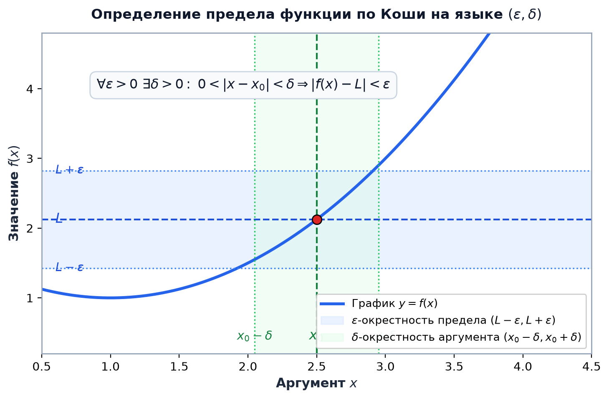
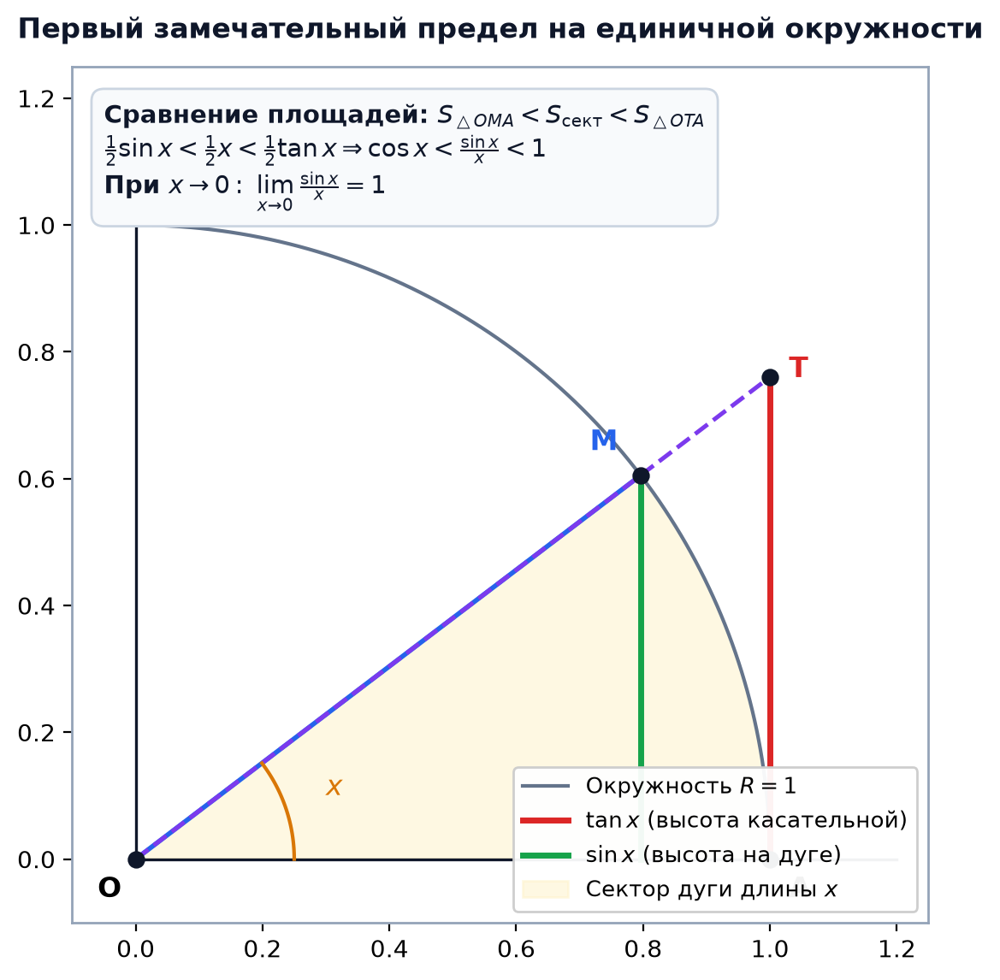
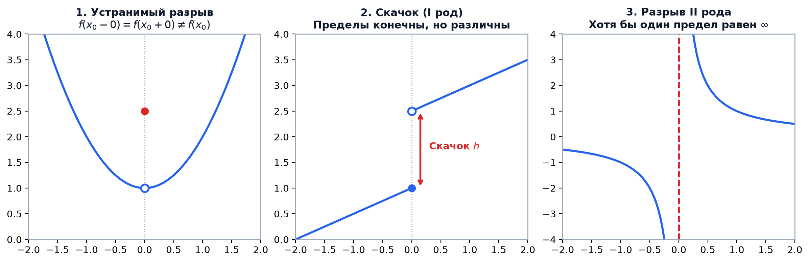

# 📌 Лекция 4: Предел функции в точке, замечательные пределы и непрерывность

> [!abstract] О лекции
> - **Дисциплина:** [[Математический анализ]] (1 семестр)
> - **Ключевые концепции:** Предельная точка множества, определение предела функции по Коши ($\varepsilon-\delta$) и по Гейне (на языке последовательностей), теорема об их эквивалентности, односторонние пределы, первый замечательный предел ($\lim \frac{\sin x}{x} = 1$), второй замечательный предел ($\lim (1 + x)^{1/x} = e$), асимптотическое сравнение $O$ и $o$-малое, непрерывность функции в точке и на отрезке, классификация точек разрыва.

---

## 1. Определение предела функции в точке

Пусть функция $f: X \to \mathbb{R}$ определена на множестве $X \subseteq \mathbb{R}$, и $x_0$ — предельная точка множества $X$.

### Определение по Коши ($\varepsilon-\delta$ язык окрестностей):
> Число $A \in \mathbb{R}$ называется **пределом функции $f(x)$ в точке $x_0$**, если для любого $\varepsilon > 0$ существует $\delta = \delta(\varepsilon) > 0$ такое, что для всех $x \in X$, удовлетворяющих условию $0 < |x - x_0| < \delta$, выполняется неравенство:
> $$|f(x) - A| < \varepsilon$$

$$\lim_{x \to x_0} f(x) = A \iff \forall \varepsilon > 0 \;\; \exists \delta > 0 : \forall x \in X \; (0 < |x - x_0| < \delta \implies |f(x) - A| < \varepsilon)$$

### Определение по Гейне (на языке последовательностей):
> Число $A$ называется пределом функции $f(x)$ в точке $x_0$, если для любой последовательности точек $\{x_n\} \subset X \setminus \{x_0\}$, сходящейся к $x_0$ ($x_n \to x_0$ при $n \to \infty$), соответствующая последовательность значений функции сходится к $A$:
> $$\lim_{n \to \infty} f(x_n) = A$$

> [!important] Теорема об эквивалентности
> Определение предела функции по Коши и определение предела по Гейне **эквивалентны**.

---

## 2. Замечательные пределы

### Первый замечательный предел:
$$\lim_{x \to 0} \frac{\sin x}{x} = 1$$
**Геометрическое обоснование:**
В единичной окружности для $x \in (0, \pi/2)$ справедливо двойное неравенство площадей:
$$S_{\triangle OMA} < S_{\text{сект } OMA} < S_{\triangle OTB} \implies \frac{1}{2} \sin x < \frac{1}{2} x < \frac{1}{2} \operatorname{tg} x$$
Разделив на $\frac{1}{2} \sin x > 0$:
$$1 < \frac{x}{\sin x} < \frac{1}{\cos x} \implies \cos x < \frac{\sin x}{x} < 1$$
Так как $\lim_{x \to 0} \cos x = 1$, по теореме о двух милиционерах предел равен 1. $\blacksquare$

**Важные следствия при $x \to 0$:**
- $\lim_{x \to 0} \frac{\operatorname{tg} x}{x} = 1$
- $\lim_{x \to 0} \frac{\arcsin x}{x} = 1$
- $\lim_{x \to 0} \frac{1 - \cos x}{x^2} = \frac{1}{2}$

---

### Второй замечательный предел:
$$\lim_{x \to 0} (1 + x)^{1/x} = e \quad \text{или} \quad \lim_{x \to \infty} \left(1 + \frac{1}{x}\right)^x = e$$

**Следствия (таблица эквивалентностей при $x \to 0$):**
- $\ln(1 + x) \sim x$
- $e^x - 1 \sim x$
- $a^x - 1 \sim x \ln a$
- $(1 + x)^\alpha - 1 \sim \alpha x$

---

## 3. Непрерывность функции и классификация разрывов

> [!info] Непрерывность в точке
> Функция $f(x)$ называется **непрерывной в точке $x_0$**, если:
> 1. Функция определена в точке $x_0$.
> 2. Существует конечный предел $\lim_{x \to x_0} f(x)$.
> 3. Этот предел совпадает со значением функции:
>    $$\lim_{x \to x_0} f(x) = f(x_0) \iff \lim_{\Delta x \to 0} \Delta f = 0$$

### Классификация точек разрыва:
Пусть $f(x_0+) = \lim_{x \to x_0^+} f(x)$ и $f(x_0-) = \lim_{x \to x_0^-} f(x)$ — односторонние пределы.

1. **Разрыв I рода (устранимый разрыв):**
   Односторонние пределы конечны и равны между собой, но функция в $x_0$ не определена или $f(x_0) \ne f(x_0 \pm)$.
   *Пример:* $f(x) = \frac{\sin x}{x}$ в точке $x = 0$.
2. **Разрыв I рода (скачок):**
   Односторонние пределы конечны, но не равны: $f(x_0+) \ne f(x_0-)$.
   Величина скачка: $h = |f(x_0+) - f(x_0-)|$.
   *Пример:* $f(x) = \operatorname{sgn}(x)$ в точке $x = 0$.
3. **Разрыв II рода (существенный разрыв):**
   Хотя бы один из односторонних пределов не существует или равен бесконечности ($\pm \infty$).
   *Пример:* $f(x) = \frac{1}{x}$ или $f(x) = \sin(1/x)$ в точке $x = 0$.

---

## 4. 🔬 Глубокий анализ непрерывности: Функция Томе и Аксиома Выбора

### Доказательство эквивалентности определений Коши и Гейне
> [!theorem] Теорема Гейне-Коши
> Определение предела функции по Коши (на языке $\varepsilon-\delta$) и по Гейне (на языке последовательностей) логически эквивалентны.  
> Доказательство импликации «Гейне $\implies$ Коши» от противного строго использует **Аксиому счетного выбора (Axiom of Countable Choice)** для построения последовательности контрпримеров $x_n \to x_0$ с $|f(x_n) - L| \ge \varepsilon_0$.

---

### 💡 Научный пример: Функция Римана / Томе (Thomae's Popcorn Function)
Рассмотрим функцию $T: [0, 1] \to \mathbb{R}$:
$$T(x) = \begin{cases} \frac{1}{q}, & x = \frac{p}{q} \in \mathbb{Q} \cap (0, 1], \; \gcd(p, q) = 1 \\ 0, & x \in [0, 1] \setminus \mathbb{Q} \end{cases}$$
1. **В рациональных точках $x_0 = p/q$:** Возьмем иррациональную последовательность $x_n \to x_0$. Тогда $T(x_n) = 0 \neq T(x_0) = 1/q$. Функция **разрывна во всех точках $\mathbb{Q}$**.
2. **В иррациональных точках $x_0 \notin \mathbb{Q}$:** Число дробей $p/q$ со знаменателем $q \le 1/\varepsilon$ на отрезке $[0, 1]$ конечно. Выбирая $\delta$ меньшим расстояния до ближайшей такой дроби, получаем $|T(x) - 0| < \varepsilon$. Функция **непрерывна во всех точках $\mathbb{R} \setminus \mathbb{Q}$**!

---

## 🚀 Фундаментальная связь с будущими дисциплинами и технологиями (ИТМО Curriculum)

1. **Машинное обучение и Глубокое обучение (Сем 5, 6):**
   - Условие Липшица $|f(x) - f(y)| \le L |x - y|$ является усилением равномерной непрерывности. Константа Липшица весовых матриц нейросети определяет устойчивость модели к состязательным атакам (Adversarial Robustness).
2. **Компьютерная графика (Сем 4):**
   - Непрерывность сплайнов Безье и поверхностей NURBS по классам гладкости $C^0, C^1, C^2$ опирается на строгую теорию пределов.

---

## 🔗 Связанные материалы
- [[Математический анализ]] — страница дисциплины
- [[02. Лекция - Предел числовой последовательности, теорема Вейерштрасса и число e (2026-09-15)]]
- [[03. Лекция - Критерий Коши, теорема Больцано-Вейерштрасса и частичные пределы (2026-09-22)]]
