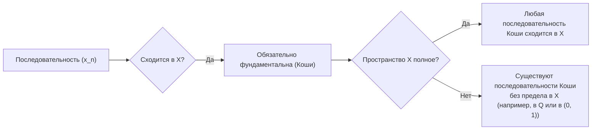
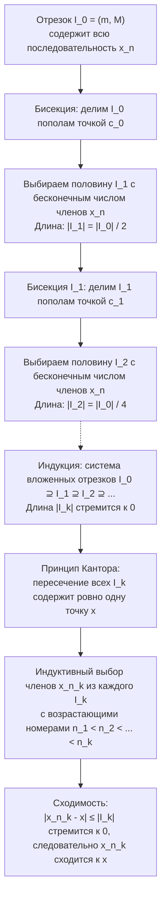
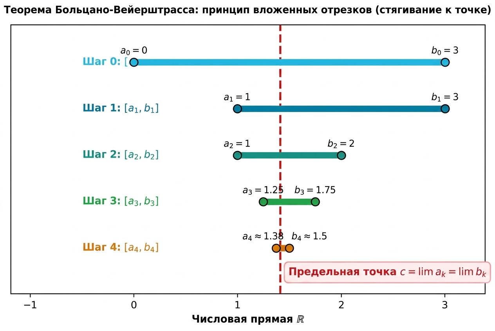

# 📐 Лекция 4: Топология метрических пространств, сходимость последовательностей, полнота по Коши и теорема Больцано — Вейерштрасса

> [!abstract] О занятии
> - **Дисциплина:** [[Математический анализ]] (1 семестр)
> - **Дата проведения:** 29 сентября 2026 г. (неделя 5, нечетная, вторник)
> - **Время:** пара `09:50 — 11:20`
> - **Аудитория:** Кронверкский пр., д. 49, ауд. 1405
> - **Лектор:** Кумалагов Давид Заурович
> - **Поток:** **Поток 2** (направление Software Engineering, ИТМО, группы M3101–M3109)
> - **Ключевые темы:**
>   1. Топологические операции над подмножествами метрического пространства: внутренность $\operatorname{Int}(A)$, замыкание $\operatorname{Cl}(A)$, граница $\operatorname{Fr}(A)$ (или $\partial A$), их эквивалентные характеризации на языке открытых шаров $B_r(x)$ и строгий вывод закона топологической двойственности $X \setminus \operatorname{Int}(A) = \operatorname{Cl}(X \setminus A)$ через два взаимных включения.
>   2. Канонические примеры топологических структур: полуинтервал $[0, 1) \subset \mathbb{R}$, замкнутый шар $\overline{B_R(x)}$ и сфера $S_R(x)$, дискретное пространство $(\mathbb{R}, d_{\text{disc}})$, множество рациональных чисел $\mathbb{Q} \subset \mathbb{R}$ с $\operatorname{Fr}(\mathbb{Q}) = \mathbb{R}$. Геометрия шаров («шар может быть квадратом»).
>   3. Сходимость последовательностей в метрическом пространстве: определение на языке $\varepsilon-N_\varepsilon$, лемма о единственности предела с оценкой $\varepsilon = \frac{d(x, y)}{10}$.
>   4. Секвенциальный критерий замыкания ($x \in \operatorname{Cl}(A) \iff \exists (a_n) \subset A : a_n \to x$) и критерий замкнутости множества через пределы последовательностей.
>   5. Полнота метрических пространств по Коши: фундаментальные последовательности, ограниченность последовательностей Коши, определение полноты и контрпримеры пространств, не полных по Коши ($(0, 1)$, $\mathbb{Q} \subset \mathbb{R}$).
>   6. Теорема (лемма) Больцано — Вейерштрасса в $\mathbb{R}$: строгое конструктивное доказательство методом бисекции (половинного деления) и принципа стягивающихся отрезков Кантора.
>   7. Исследование вопроса лектора: нарушение теоремы Больцано — Вейерштрасса в бесконечном дискретном пространстве $(X, d_{\text{disc}})$, связь с понятием секвенциальной компактности.

---

## 📌 Краткое резюме (TL;DR)

1. **Топологическая триада подмножества $A \subseteq X$:**
   - **Внутренность $\operatorname{Int}(A)$:** наибольшее открытое подмножество, содержащееся в $A$. Состоит из точек, входящих в $A$ вместе с некоторым шаром: $\exists r > 0 : B_r(x) \subseteq A$.
   - **Замыкание $\operatorname{Cl}(A)$:** наименьшее замкнутое надмножество, содержащее $A$. Состоит из точек прикосновения: $\forall r > 0 : B_r(x) \cap A \ne \varnothing$.
   - **Граница $\operatorname{Fr}(A) = \partial A = \operatorname{Cl}(A) \setminus \operatorname{Int}(A) = \operatorname{Cl}(A) \cap \operatorname{Cl}(X \setminus A)$:** точки, любой шар которых пересекает как $A$, так и дополнение $X \setminus A$.
   - Всегда выполнено фундаментальное включение: $\operatorname{Int}(A) \subseteq A \subseteq \operatorname{Cl}(A)$.
2. **Закон топологической двойственности:** $X \setminus \operatorname{Int}(A) = \operatorname{Cl}(X \setminus A)$ и $X \setminus \operatorname{Cl}(A) = \operatorname{Int}(X \setminus A)$. Граница множества совпадает с границей его дополнения: $\operatorname{Fr}(A) = \operatorname{Fr}(X \setminus A)$.
3. **Единственность предела в $(X, d)$:** Если последовательность сходится, её предел единственен ($\exists \le 1$ предела). Доказывается от противного: если $a_n \to x$ и $a_n \to y$ при $x \ne y$, то выбор $\varepsilon = \frac{d(x, y)}{10}$ приводит к противоречию $d(x, y) < \frac{d(x, y)}{5}$.
4. **Секвенциальная топология:** Точка $x \in \operatorname{Cl}(A) \iff$ существует последовательность $(a_n) \subseteq A$, сходящаяся к $x$. Множество $A$ замкнуто тогда и только тогда, когда оно содержит пределы всех своих сходящихся последовательностей.
5. **Последовательности Коши и полнота:**
   - Последовательность фундаментальна (Коши), если $\forall \varepsilon > 0 \; \exists N_\varepsilon : \forall m, n \ge N_\varepsilon \implies d(x_m, x_n) < \varepsilon$.
   - Всякая сходящаяся последовательность является фундаментальной; всякая фундаментальная последовательность ограничена.
   - Пространство называется полным по Коши, если любая последовательность Коши в нём сходится к точке этого же пространства. Интервал $(0, 1)$ и поле $\mathbb{Q}$ не полны по Коши.
6. **Теорема Больцано — Вейерштрасса:** Всякая ограниченная последовательность вещественных чисел $(x_n) \subset \mathbb{R}$ содержит сходящуюся подпоследовательность. Доказывается бисекцией исходного отрезка $I_0$ и выбором стягивающихся отрезков Кантора $|I_k| \to 0$.
7. **Контрпример лектора:** В бесконечном дискретном пространстве $(X, d_{\text{disc}})$ теорема Больцано — Вейерштрасса **не выполняется**: последовательность попарно различных элементов ограничена (диаметр пространства равен 1), но не имеет сходящихся подпоследовательностей, так как сходимость в дискретной метрике равносильна стационарности.

---

## 1. Топологические операции над множествами в метрическом пространстве

Пусть $(X, d)$ — произвольное метрическое пространство, и $A \subseteq X$ — его подмножество.

```mermaid
flowchart TD
    IntA["Внутренность Int(A)<br/>(наибольшее открытое в A)"] -->|Включение| SetA["Множество A"]
    SetA -->|Включение| ClA["Замыкание Cl(A)<br/>(наименьшее замкнутое над A)"]
    ClA -->|Разность Cl(A) без Int(A)| FrA["Граница Fr(A) = ∂A<br/>(точки прикосновения к A и к X без A)"]
    ExtA["Внешность Ext(A) = Int(X без A)<br/>(точки вне A с шаром)"] -->|Дополнение| ClA
```

### 1.1. Внутренность множества $\operatorname{Int}(A)$

> [!info] Определение (Внутренность множества)
> **Внутренностью множества $A$** (обозначается $\operatorname{Int}(A)$, $\operatorname{int}(A)$ или $A^\circ$) называется **наибольшее по включению открытое множество, содержащееся в $A$**.

Поскольку объединение любого семейства открытых множеств открыто, внутренность выражается конструктивно как объединение всех открытых подмножеств множества $A$:
$$\operatorname{Int}(A) = \bigcup_{\substack{U \subseteq A \\ U \text{ — открыто}}} U$$

Базовые свойства:
1. $\operatorname{Int}(A)$ открыто;
2. $\operatorname{Int}(A) \subseteq A$;
3. Если $U$ открыто и $U \subseteq A$, то $U \subseteq \operatorname{Int}(A)$;
4. $A$ открыто $\iff A = \operatorname{Int}(A)$.

> [!important] Характеристическое свойство внутренней точки
> Точка $x \in X$ принадлежит внутренности множества $A$ тогда и только тогда, когда она входит в $A$ вместе с некоторым открытым шаром положительного радиуса:
> $$x \in \operatorname{Int}(A) \iff \exists r > 0 : B_r(x) \subseteq A$$

**Доказательство:**
- $(\implies)$ Пусть $x \in \operatorname{Int}(A)$. Так как $\operatorname{Int}(A)$ открыто, по определению открытого множества существует $r > 0$ такое, что $B_r(x) \subseteq \operatorname{Int}(A)$. В силу включения $\operatorname{Int}(A) \subseteq A$ получаем $B_r(x) \subseteq A$.
- $(\impliedby)$ Пусть существует $r > 0$ такое, что $B_r(x) \subseteq A$. Открытый шар $B_r(x)$ открыт в $(X, d)$. Следовательно, $B_r(x)$ участвует в объединении всех открытых подмножеств множества $A$: $B_r(x) \subseteq \operatorname{Int}(A)$. Так как центр шара $x \in B_r(x)$, получаем $x \in \operatorname{Int}(A)$. $\blacksquare$

---

### 1.2. Замыкание множества $\operatorname{Cl}(A)$

> [!info] Определение (Замыкание множества)
> **Замыканием множества $A$** (обозначается $\operatorname{Cl}(A)$, $\operatorname{cl}(A)$ или $\overline{A}$) называется **наименьшее по включению замкнутое множество, содержащее $A$**.

Поскольку пересечение любого семейства замкнутых множеств замкнуто, замыкание выражается конструктивно как пересечение всех замкнутых надмножеств множества $A$:
$$\operatorname{Cl}(A) = \bigcap_{\substack{F \supseteq A \\ F \text{ — замкнуто}}} F$$

Свойства:
1. $\operatorname{Cl}(A)$ замкнуто;
2. $A \subseteq \operatorname{Cl}(A)$;
3. Если $F$ замкнуто и $F \supseteq A$, то $\operatorname{Cl}(A) \subseteq F$;
4. $A$ замкнуто $\iff A = \operatorname{Cl}(A)$.

> [!important] Характеристическое свойство точки прикосновения
> Точка $x \in X$ принадлежит замыканию множества $A$ тогда и только тогда, когда любой открытый шар положительного радиуса с центром в $x$ имеет непустое пересечение с $A$:
> $$x \in \operatorname{Cl}(A) \iff \forall r > 0 : B_r(x) \cap A \ne \varnothing$$
> Точки, удовлетворяющие этому условию, называются **точками прикосновения** множества $A$.

**Строгое доказательство:**
- $(\implies)$ Докажем методом от противного. Предположим, что $x \in \operatorname{Cl}(A)$, но существует радиус $r > 0$ такой, что:
  $$B_r(x) \cap A = \varnothing$$
  Это означает, что все точки множества $A$ лежат вне шара $B_r(x)$, то есть $A \subseteq X \setminus B_r(x)$.
  Шар $B_r(x)$ открыт, следовательно, его дополнение $F = X \setminus B_r(x)$ замкнуто.
  Таким образом, $F$ — замкнутое множество, содержащее $A$. По определению замыкания как наименьшего замкнутого надмножества:
  $$\operatorname{Cl}(A) \subseteq F = X \setminus B_r(x)$$
  Но точка $x$ лежит в шаре $B_r(x)$ ($d(x, x) = 0 < r$), следовательно, $x \notin X \setminus B_r(x)$.
  Отсюда $x \notin \operatorname{Cl}(A)$, что прямо противоречит условию $x \in \operatorname{Cl}(A)$. Противоречие доказывает, что $B_r(x) \cap A \ne \varnothing$ для всех $r > 0$.

- $(\impliedby)$ Докажем также от противного. Предположим, что для всех $r > 0$ выполнено $B_r(x) \cap A \ne \varnothing$, но $x \notin \operatorname{Cl}(A)$.
  Так как множество $\operatorname{Cl}(A)$ замкнуто, его дополнение $X \setminus \operatorname{Cl}(A)$ открыто в $X$.
  Так как $x \notin \operatorname{Cl}(A)$, точка $x$ принадлежит открытому дополнению: $x \in X \setminus \operatorname{Cl}(A)$.
  По определению открытого множества существует радиус $r > 0$ такой, что шар содержится в дополнении:
  $$B_r(x) \subseteq X \setminus \operatorname{Cl}(A)$$
  Поскольку $A \subseteq \operatorname{Cl}(A)$, дополнения связаны обратным включением:
  $$X \setminus \operatorname{Cl}(A) \subseteq X \setminus A \implies B_r(x) \subseteq X \setminus A$$
  Это означает, что шар $B_r(x)$ не пересекает множество $A$:
  $$B_r(x) \cap A = \varnothing$$
  что прямо противоречит условию, согласно которому любой шар пересекает $A$. Противоречие доказывает, что $x \in \operatorname{Cl}(A)$. $\blacksquare$

---

### 1.3. Граница множества $\operatorname{Fr}(A)$

> [!info] Определение (Граница множества)
> **Границей множества $A$** (обозначается $\operatorname{Fr}(A)$, $\operatorname{fr}(A)$ или $\partial A$, от франц. *Frontière*) называется разность между его замыканием и внутренностью:
> $$\operatorname{Fr}(A) = \partial A = \operatorname{Cl}(A) \setminus \operatorname{Int}(A)$$

Из определений внутренности и замыкания сразу следует базовое фундаментальное включение:
$$\operatorname{Int}(A) \subseteq A \subseteq \operatorname{Cl}(A)$$

> [!important] Характеристическое свойство граничной точки
> Точка $x \in X$ принадлежит границе множества $A$ тогда и только тогда, когда любой открытый шар с центром в $x$ содержит как точки множества $A$, так и точки его дополнения $X \setminus A$:
> $$x \in \operatorname{Fr}(A) \iff \forall r > 0 : \Big(B_r(x) \cap A \ne \varnothing \quad \text{и} \quad B_r(x) \cap (X \setminus A) \ne \varnothing\Big)$$

**Доказательство:**
По определению разности множеств, $x \in \operatorname{Fr}(A) \iff x \in \operatorname{Cl}(A)$ и $x \notin \operatorname{Int}(A)$.
1. Условие $x \in \operatorname{Cl}(A)$ равносильно тому, что $\forall r > 0 : B_r(x) \cap A \ne \varnothing$.
2. Условие $x \notin \operatorname{Int}(A)$ означает отрицание характеристического свойства внутренности:
   $$\neg (\exists r > 0 : B_r(x) \subseteq A) \iff \forall r > 0 : B_r(x) \not\subseteq A \iff \forall r > 0 : B_r(x) \cap (X \setminus A) \ne \varnothing.$$
Объединяя оба условия, получаем требуемую эквивалентность. $\blacksquare$

---

### 1.4. Строгое доказательство закона топологической двойственности

На лекции лектор разобрал эталонное доказательство через **два взаимных включения**, используя экстремальные свойства наибольшего открытого и наименьшего замкнутого множества.

> [!theorem] Теорема (Топологическая двойственность)
> Для любого подмножества $A \subseteq X$ метрического пространства справедливы тождества:
> 1. $X \setminus \operatorname{Int}(A) = \operatorname{Cl}(X \setminus A)$
> 2. $X \setminus \operatorname{Cl}(A) = \operatorname{Int}(X \setminus A)$

**Строгое доказательство:**

Докажем тождество $X \setminus \operatorname{Int}(A) = \operatorname{Cl}(X \setminus A)$ через два взаимных включения:

#### Часть 1: Доказательство включения $\operatorname{Cl}(X \setminus A) \subseteq X \setminus \operatorname{Int}(A)$
1. По базовому свойству внутренности, внутренность содержится в самом множестве:
   $$\operatorname{Int}(A) \subseteq A$$
2. Переходя к теоретико-множественным дополнениям в пространстве $X$, получаем обратное включение:
   $$X \setminus A \subseteq X \setminus \operatorname{Int}(A)$$
3. Так как множество $\operatorname{Int}(A)$ открыто, его дополнение $X \setminus \operatorname{Int}(A)$ является **замкнутым множеством**.
4. Таким образом, $X \setminus \operatorname{Int}(A)$ — это замкнутое множество, содержащее множество $X \setminus A$.
5. Но замыкание $\operatorname{Cl}(X \setminus A)$ по определению является **наименьшим** замкнутым множеством, содержащим $X \setminus A$.
6. Следовательно:
   $$\operatorname{Cl}(X \setminus A) \subseteq X \setminus \operatorname{Int}(A)$$

#### Часть 2: Доказательство включения $X \setminus \operatorname{Int}(A) \subseteq \operatorname{Cl}(X \setminus A)$
1. Пусть $F \subseteq X$ — произвольное замкнутое множество, содержащее дополнение множества $A$:
   $$X \setminus A \subseteq F$$
2. Переходя к дополнениям, получаем:
   $$X \setminus F \subseteq A$$
3. Так как $F$ замкнуто, множество $X \setminus F$ **открыто**.
4. Таким образом, $X \setminus F$ — это открытое множество, содержащееся в $A$.
5. Но внутренность $\operatorname{Int}(A)$ по определению является **наибольшим** открытым множеством, содержащимся в $A$.
6. Следовательно:
   $$X \setminus F \subseteq \operatorname{Int}(A)$$
7. Переходя снова к дополнениям, получаем обратное включение:
   $$X \setminus \operatorname{Int}(A) \subseteq F$$
8. Поскольку это включение выполняется для **любого** замкнутого множества $F$, содержащего $X \setminus A$, оно выполняется и для их пересечения:
   $$X \setminus \operatorname{Int}(A) \subseteq \bigcap_{\substack{F \supseteq X \setminus A \\ F \text{ — замкнуто}}} F$$
9. Но пересечение всех замкнутых надмножеств по определению есть в точности замыкание $\operatorname{Cl}(X \setminus A)$:
   $$X \setminus \operatorname{Int}(A) \subseteq \operatorname{Cl}(X \setminus A)$$

#### Вывод:
Из двух доказанных включений $\operatorname{Cl}(X \setminus A) \subseteq X \setminus \operatorname{Int}(A)$ и $X \setminus \operatorname{Int}(A) \subseteq \operatorname{Cl}(X \setminus A)$ следует строгое равенство:
$$X \setminus \operatorname{Int}(A) = \operatorname{Cl}(X \setminus A). \quad \blacksquare$$

> [!tip] Следствие (Симметричное представление границы)
> Граница множества выражается как пересечение замыкания самого множества и замыкания его дополнения:
> $$\operatorname{Fr}(A) = \operatorname{Cl}(A) \setminus \operatorname{Int}(A) = \operatorname{Cl}(A) \cap (X \setminus \operatorname{Int}(A)) = \operatorname{Cl}(A) \cap \operatorname{Cl}(X \setminus A)$$
> Отсюда немедленно следуют два фундаментальных вывода:
> 1. **Симметрия границы:** $\operatorname{Fr}(A) = \operatorname{Fr}(X \setminus A)$ — граница любого множества в точности совпадает с границей его дополнения!
> 2. **Замкнутость границы:** Граница $\operatorname{Fr}(A)$ замкнута в $X$ как пересечение двух замкнутых множеств $\operatorname{Cl}(A)$ и $\operatorname{Cl}(X \setminus A)$.

---

### 1.5. Канонические примеры топологических вычислений

#### Пример 0: Полуинтервал $A = [0, 1) \subset \mathbb{R}$ с евклидовой метрикой $d(x, y) = |x - y|$
- **Внутренность:** $\operatorname{Int}([0, 1)) = (0, 1)$.
  - Точка $0$ не является внутренней: любой интервал $(-\varepsilon, \varepsilon)$ содержит отрицательные числа $-\varepsilon/2 \notin [0, 1)$.
  - Для любой точки $x \in (0, 1)$ шар $B_r(x) = (x - r, x + r)$ при $r = \min(x, 1 - x) > 0$ целиком лежит в $[0, 1)$.
- **Замыкание:** $\operatorname{Cl}([0, 1)) = [0, 1]$.
  - Точка $1$ является точкой прикосновения: для любого $r > 0$ точка $1 - r/2 \in B_r(1) \cap [0, 1)$.
  - Отрезок $[0, 1]$ замкнут и содержит $[0, 1)$.
- **Граница:** $\operatorname{Fr}([0, 1)) = \operatorname{Cl}([0, 1)) \setminus \operatorname{Int}([0, 1)) = [0, 1] \setminus (0, 1) = \{0, 1\}$.
- **Цепочка включений:** $(0, 1) \subsetneq [0, 1) \subsetneq [0, 1]$.

#### Пример 1: Замкнутый шар $\overline{B_R(x)}$ в метрическом пространстве
Рассмотрим замкнутый шар $\overline{B_R(x)} = \{y \in X \mid d(y, x) \le R\}$ радиуса $R > 0$.
- В нормированных векторных пространствах (в частности, в $\mathbb{R}^n$):
  $$\operatorname{Int}\big(\overline{B_R(x)}\big) = B_R(x) = \{y \in X \mid d(y, x) < R\}$$
- Граница замкнутого шара совпадает со сферой радиуса $R$:
  $$\operatorname{Fr}\big(\overline{B_R(x)}\big) = S_R(x) = \{y \in X \mid d(y, x) = R\}$$

> [!note] Замечание лектора: «Шар — это может быть квадрат»
> На лекции Д.З. Кумалагов подчеркнул, что слово «шар» в метрической топологии — это условный термин для множества точек $\{y \in X \mid d(y, x) < r\}$. Геометрия шара всецело зависит от выбранной функции расстояния $d$:
> - В евклидовой метрике $\ell_2$ на плоскости шар — это круг: $\{x_1^2 + x_2^2 < r^2\}$;
> - В манхэттенской метрике $\ell_1$ шар — это повёрнутый на $45^\circ$ квадрат (ромб): $\{|x_1| + |x_2| < r\}$;
> - В метрике Чебышёва $\ell_\infty$ шар — это **квадрат** со сторонами, параллельными осям координат: $\{\max(|x_1|, |x_2|) < r\}$.

#### Пример 2: Одноточечное множество $\{x\}$ в дискретном пространстве $(\mathbb{R}, d_{\text{disc}})$
Метрика задана правилом:
$$d_{\text{disc}}(x, y) = \begin{cases} 0, & x = y \\ 1, & x \ne y \end{cases}$$
Исследуем множество $A = \{x\}$:
1. Рассмотрим открытый шар радиуса $r = 1/2$:
   $$B_{1/2}(x) = \{y \in \mathbb{R} \mid d_{\text{disc}}(y, x) < 1/2\} = \{x\}$$
   Поскольку открытый шар всегда открыт, одноточечное множество $\{x\}$ является открытым множеством!
   Следовательно, $\operatorname{Int}(\{x\}) = \{x\}$.
2. Дополнение $\mathbb{R} \setminus \{x\} = \bigcup_{y \ne x} \{y\}$ является объединением открытых множеств, то есть открыто.
   Следовательно, множество $\{x\}$ одновременно является замкнутым, откуда $\operatorname{Cl}(\{x\}) = \{x\}$.
3. Вычисляем границу:
   $$\operatorname{Fr}(\{x\}) = \operatorname{Cl}(\{x\}) \setminus \operatorname{Int}(\{x\}) = \{x\} \setminus \{x\} = \varnothing$$
   В дискретном пространстве граница любого множества пуста: $\operatorname{Fr}(A) = \varnothing$ для любого $A \subseteq X$.

#### Пример 3: Множество рациональных чисел $\mathbb{Q} \subset \mathbb{R}$
Рассмотрим множество рациональных чисел $\mathbb{Q}$ как подмножество вещественной прямой $\mathbb{R}$ со стандартной метрикой:
1. **Внутренность $\operatorname{Int}(\mathbb{Q}) = \varnothing$:**
   Пусть $q \in \mathbb{Q}$ — произвольная точка. Любой открытый шар $B_r(q) = (q - r, q + r)$ радиуса $r > 0$ содержит бесконечно много иррациональных чисел (например, $q + \frac{r}{\sqrt{2} \cdot n} \notin \mathbb{Q}$).
   Следовательно, ни один шар не содержится целиком в $\mathbb{Q}$: $B_r(q) \not\subseteq \mathbb{Q}$.
   Значит, у множества $\mathbb{Q}$ **нет ни одной внутренней точки**:
   $$\operatorname{Int}(\mathbb{Q}) = \varnothing$$
2. **Замыкание $\operatorname{Cl}(\mathbb{Q}) = \mathbb{R}$:**
   По теореме о плотности рациональных чисел в $\mathbb{R}$ (доказанной на Лекции 3), между любыми двумя различными вещественными числами всегда найдётся рациональное число.
   Следовательно, для любой вещественной точки $x \in \mathbb{R}$ и любого радиуса $r > 0$ интервал $(x - r, x + r)$ содержит рациональные точки: $B_r(x) \cap \mathbb{Q} \ne \varnothing$.
   Значит, каждая точка вещественной прямой является точкой прикосновения множества $\mathbb{Q}$:
   $$\operatorname{Cl}(\mathbb{Q}) = \mathbb{R}$$
3. **Граница $\operatorname{Fr}(\mathbb{Q}) = \mathbb{R}$:**
   $$\operatorname{Fr}(\mathbb{Q}) = \operatorname{Cl}(\mathbb{Q}) \setminus \operatorname{Int}(\mathbb{Q}) = \mathbb{R} \setminus \varnothing = \mathbb{R}$$
   **Граница множества рациональных чисел совпадает со всей числовой прямой $\mathbb{R}$!**
   По свойству симметрии границы то же самое верно для иррациональных чисел:
   $$\operatorname{Fr}(\mathbb{R} \setminus \mathbb{Q}) = \mathbb{R}, \quad \operatorname{Int}(\mathbb{R} \setminus \mathbb{Q}) = \varnothing, \quad \operatorname{Cl}(\mathbb{R} \setminus \mathbb{Q}) = \mathbb{R}.$$

---

## 2. Сходимость последовательностей в метрическом пространстве

### 2.1. Определение сходимости и геометрический смысл

> [!info] Определение (Последовательность в метрическом пространстве)
> **Последовательностью** в метрическом пространстве $(X, d)$ называется отображение множества натуральных чисел в пространство $X$:
> $$a: \mathbb{N} \to X, \quad n \mapsto a(n)$$
> Значение $a(n)$ обозначают как $a_n$, а саму последовательность записывают как $(a_n)_{n=1}^\infty$ или $(a_n)$.

> [!info] Определение (Предел последовательности)
> Пусть $(a_n)$ — последовательность в $(X, d)$, и $x \in X$. Говорят, что **последовательность $(a_n)$ сходится к точке $x$** (пишут $a_n \xrightarrow{d} x$, $a_n \to x$ при $n \to \infty$ или $\lim_{n \to \infty} a_n = x$), если:
> $$\forall \varepsilon > 0 \quad \exists N_\varepsilon \in \mathbb{N} : \forall n \ge N_\varepsilon \implies d(a_n, x) < \varepsilon$$

**Геометрическая интерпретация:**
Неравенство $d(a_n, x) < \varepsilon$ равносильно включению $a_n \in B_\varepsilon(x)$.
Последовательность сходится к $x$ тогда и только тогда, когда в любой открытый шар $B_\varepsilon(x)$ с центром в $x$ попадают все члены последовательности, начиная с некоторого номера $N_\varepsilon$ (вне шара $B_\varepsilon(x)$ остаётся не более чем конечное число членов последовательности).

---

### 2.2. Лемма о единственности предела

> [!theorem] Лемма (Единственность предела последовательности)
> Сходящаяся последовательность в метрическом пространстве имеет не более одного предела:
> $$(a_n \to x \quad \text{и} \quad a_n \to y) \implies x = y$$

**Строгое доказательство:**
Докажем методом от противного. Предположим, что последовательность $(a_n)$ сходится к двум различным пределам:
$$a_n \to x \quad \text{и} \quad a_n \to y, \quad \text{где } x \ne y$$
По первой аксиоме метрики (аксиоме тождества), раз $x \ne y$, то расстояние между ними строго положительно:
$$d(x, y) > 0$$
Положим:
$$\varepsilon = \frac{d(x, y)}{10} > 0$$
*(Примечание лектора: знаменатель 10 выбран для наглядности; годится любой знаменатель $C > 2$, например 2 или 10).*

1. Так как $a_n \to x$, по определению предела для числа $\varepsilon$ найдется номер $N_1 \in \mathbb{N}$ такой, что:
   $$\forall n \ge N_1 \implies d(a_n, x) < \varepsilon = \frac{d(x, y)}{10}$$
2. Так как $a_n \to y$, по определению предела для того же числа $\varepsilon$ найдется номер $N_2 \in \mathbb{N}$ такой, что:
   $$\forall n \ge N_2 \implies d(a_n, y) < \varepsilon = \frac{d(x, y)}{10}$$

Выберем номер $N_\varepsilon = \max(N_1, N_2) \in \mathbb{N}$.
Тогда для любого фиксированного индекса $n \ge N_\varepsilon$ одновременно выполняются оба строгих неравенства:
$$d(a_n, x) < \frac{d(x, y)}{10} \quad \text{и} \quad d(a_n, y) < \frac{d(x, y)}{10}$$
Применим третью аксиому метрики — неравенство треугольника:
$$d(x, y) \le d(x, a_n) + d(a_n, y) = d(a_n, x) + d(a_n, y)$$
Подставляя оценки, получаем:
$$d(x, y) < \frac{d(x, y)}{10} + \frac{d(x, y)}{10} = \frac{2\,d(x, y)}{10} = \frac{d(x, y)}{5}$$
Итак, получено строгое числовое неравенство:
$$d(x, y) < \frac{d(x, y)}{5}$$
Поскольку $d(x, y) > 0$, разделим обе части на $d(x, y)$:
$$1 < \frac{1}{5} = 0.2$$
Полученное противоречие ($1 < 0.2$) доказывает ложность исходного предположения.
Следовательно, $x = y$, и предел единственен. $\blacksquare$

---

### 2.3. Секвенциальный критерий замыкания и замкнутости множества

> [!theorem] Утверждение (Секвенциальный критерий замыкания)
> Пусть $(X, d)$ — метрическое пространство, и $A \subseteq X$.
> 1. Точка $x$ принадлежит замыканию множества $A$ тогда и только тогда, когда существует последовательность элементов множества $A$, сходящаяся к $x$:
>    $$x \in \operatorname{Cl}(A) \iff \exists (a_n)_{n=1}^\infty \subseteq A : a_n \to x$$
> 2. Множество $A$ замкнуто ($A = \operatorname{Cl}(A)$) тогда и только тогда, когда для любой последовательности $(a_n) \subseteq A$, если она сходится в $X$, её предел обязательно принадлежит $A$:
>    $$A \text{ замкнуто} \iff \forall (a_n) \subseteq A \quad \left(a_n \to x \implies x \in A\right)$$

**Строгое доказательство:**

**Доказательство пункта 1:**
- $(\implies)$ Пусть $x \in \operatorname{Cl}(A)$.
  По характеристическому свойству точек прикосновения, для любого $r > 0$ открытый шар $B_r(x)$ непусто пересекается с множеством $A$:
  $$B_r(x) \cap A \ne \varnothing$$
  Зададим последовательность радиусов $r_n = \frac{1}{n} > 0$ для каждого $n \in \mathbb{N}$.
  Для каждого $n \in \mathbb{N}$ пересечение $B_{1/n}(x) \cap A$ непусто. Выберем по одной точке:
  $$a_n \in B_{1/n}(x) \cap A$$
  По построению:
  1. $a_n \in A$ для всех $n \in \mathbb{N}$;
  2. $d(a_n, x) < \frac{1}{n}$.
  Для любого $\varepsilon > 0$ по аксиоме Архимеда найдётся натуральное число $N_\varepsilon \in \mathbb{N}$ такое, что $\frac{1}{N_\varepsilon} < \varepsilon$.
  Тогда для всех $n \ge N_\varepsilon$:
  $$d(a_n, x) < \frac{1}{n} \le \frac{1}{N_\varepsilon} < \varepsilon$$
  Это означает, что $a_n \to x$.

- $(\impliedby)$ Пусть существует последовательность $(a_n) \subseteq A$ такая, что $a_n \to x$.
  Зафиксируем произвольный радиус $r > 0$.
  По определению предела последовательности (при $\varepsilon = r$) существует номер $N_r \in \mathbb{N}$ такой, что:
  $$\forall n \ge N_r \implies d(a_n, x) < r \iff a_n \in B_r(x)$$
  В частности, элемент $a_{N_r} \in B_r(x)$. Но $a_{N_r} \in A$. Следовательно:
  $$a_{N_r} \in B_r(x) \cap A \implies B_r(x) \cap A \ne \varnothing$$
  Поскольку радиус $r > 0$ произволен, $x \in \operatorname{Cl}(A)$. Пункт 1 доказан. $\blacksquare$

**Доказательство пункта 2:**
Множество $A$ замкнуто $\iff A = \operatorname{Cl}(A) \iff \operatorname{Cl}(A) \subseteq A$. В силу пункта 1 это равносильно тому, что предел любой сходящейся последовательности точек из $A$ лежит в $A$. $\blacksquare$

> [!example] Иллюстрация: выход предела за границы множества
> Рассмотрим интервал $A = (0, 1) \subset \mathbb{R}$.
> 1. Последовательность $a_n = 1 - \frac{1}{n}$ состоит из элементов множества $A$:
>    $$a_1 = 0, \quad a_2 = \frac{1}{2}, \quad a_3 = \frac{2}{3}, \quad \dots \in (0, 1)$$
>    Ее предел $\lim_{n \to \infty} a_n = 1$. Но $1 \notin (0, 1)$! При этом $1 \in \operatorname{Cl}(A) = [0, 1]$.
> 2. Последовательность $b_n = \frac{1}{n} \in (0, 1)$ сходится к $0 \notin (0, 1)$, при этом $0 \in \operatorname{Cl}(A) = [0, 1]$.
> Это наглядно демонстрирует, почему интервал $(0, 1)$ не замкнут: он не содержит пределов своих сходящихся последовательностей.

---

## 3. Полнота метрических пространств по Коши

### 3.1. Фундаментальные последовательности (последовательности Коши)

> [!info] Определение (Последовательность Коши)
> Последовательность $(x_n)_{n=1}^\infty$ в метрическом пространстве $(X, d)$ называется **последовательностью Коши (или фундаментальной последовательностью)**, если расстояния между её членами стремятся к нулю при росте их номеров:
> $$\forall \varepsilon > 0 \quad \exists N_\varepsilon \in \mathbb{N} : \forall m, n \ge N_\varepsilon \implies d(x_m, x_n) < \varepsilon$$

---

### 3.2. Лемма о свойствах фундаментальных последовательностей

> [!theorem] Лемма (Свойства последовательностей Коши)
> 1. Всякая сходящаяся последовательность в метрическом пространстве является последовательностью Коши.
> 2. Всякая последовательность Коши в метрическом пространстве ограничена.

**Строгое доказательство:**

#### Доказательство свойства 1 (Сходимость $\implies$ Фундаментальность):
Пусть последовательность $(x_n)$ сходится к точке $x \in X$:
$$x_n \to x \iff \forall \varepsilon > 0 \; \exists N_\varepsilon : \forall n \ge N_\varepsilon \implies d(x_n, x) < \varepsilon$$
Тогда для любых двух индексов $m, n \ge N_\varepsilon$, применяя неравенство треугольника:
$$d(x_m, x_n) \le d(x_m, x) + d(x, x_n) = d(x_m, x) + d(x_n, x) < \varepsilon + \varepsilon = 2\varepsilon$$
Поскольку $\varepsilon > 0$ произвольно, это доказывает фундаментальность. $\blacksquare$

#### Доказательство свойства 2 (Ограниченность последовательности Коши):

> [!info] Определение ограниченности множества
> Множество $M \subseteq X$ в метрическом пространстве называется **ограниченным**, если оно целиком содержится в некотором открытом шаре конечного радиуса:
> $$\exists x_0 \in X, \; R > 0 : M \subseteq B_R(x_0)$$

Пусть $(x_n)$ — последовательность Коши.
Зафиксируем число $\varepsilon = 1 > 0$.
По определению фундаментальности для $\varepsilon = 1$ найдется номер $N_1 \in \mathbb{N}$ такой, что:
$$\forall m, n \ge N_1 \implies d(x_m, x_n) < 1$$
Зафиксируем индекс $m = N_1$. Тогда:
$$\forall n \ge N_1 \implies d(x_n, x_{N_1}) < 1 \iff x_n \in B_1(x_{N_1})$$
Все члены последовательности с номерами $n \ge N_1$ («хвост» последовательности) содержатся в открытом шаре единичного радиуса с центром в $x_{N_1}$.

Разобьем множество значений всей последовательности $\{x_n\}_{n=1}^\infty$ на две части:
$$\{x_n\}_{n=1}^\infty = \{x_1, x_2, \dots, x_{N_1-1}\} \cup \{x_n\}_{n \ge N_1}$$
Вычислим максимальное расстояние от начальных точек до центра $x_{N_1}$:
$$M = \max_{1 \le i \le N_1-1} d(x_i, x_{N_1})$$
Определим радиус:
$$R = 1 + M = 1 + \max_{1 \le i \le N_1-1} d(x_i, x_{N_1})$$
Тогда для всех $n \in \mathbb{N}$ выполнено $d(x_n, x_{N_1}) < R$, то есть:
$$\{x_n\}_{n=1}^\infty \subset B_R(x_{N_1})$$
Последовательность ограничена. $\blacksquare$

---

### 3.3. Полнота метрического пространства

> [!important] Определение (Полное метрическое пространство / Полнота по Коши)
> Метрическое пространство $(X, d)$ называется **полным (полным по Коши)**, если **всякая последовательность Коши в нём сходится к некоторому элементу этого же пространства**:
> $$\Big((x_n) \text{ — последовательность Коши в } X\Big) \implies \exists x \in X : x_n \xrightarrow{d} x$$



### 3.4. Контрпримеры пространств, не полных по Коши

#### Контрпример 1: Интервал $X = (0, 1)$ со стандартной метрикой $d(x, y) = |x - y|$
Рассмотрим последовательность:
$$a_n = \frac{1}{n}, \quad n \in \mathbb{N}, \quad a_n \in (0, 1)$$
1. **Фундаментальность:** Для любых $m, n \in \mathbb{N}$ расстояние $|a_m - a_n| \to 0$ при $m, n \to \infty$. Значит, $(a_n)$ — последовательность Коши в пространстве $(0, 1)$.
2. **Отсутствие предела в $(0, 1)$:**
   В $\mathbb{R}$ последовательность $a_n = 1/n$ сходится к $0$.
   Если бы в $(0, 1)$ существовал предел $x_0 \in (0, 1)$, то по единственности предела в $\mathbb{R}$ выполнялось бы $x_0 = 0$.
   Но $0 \notin (0, 1)$.
   Следовательно, в пространстве $X = (0, 1)$ данная фундаментальная последовательность **не имеет предела**.
   Пространство $(0, 1)$ **не полно по Коши**.

#### Контрпример 2: Поле рациональных чисел $\mathbb{Q} \subset \mathbb{R}$ с метрикой $d(x, y) = |x - y|$
Рассмотрим последовательность десятичных рациональных приближений к числу $\sqrt{2}$:
$$q_1 = 1.4 = \frac{7}{5}, \quad q_2 = 1.41 = \frac{141}{100}, \quad q_3 = 1.414 = \frac{707}{500}, \quad \dots \in \mathbb{Q}$$
1. В $\mathbb{R}$ эта последовательность сходится к числу $\sqrt{2}$.
2. Будучи сходящейся в $\mathbb{R}$, она фундаментальна в $\mathbb{R}$, а значит, и в подпространстве $\mathbb{Q}$.
3. Однако ее предел $\sqrt{2}$ иррационален: $\sqrt{2} \notin \mathbb{Q}$.
4. Следовательно, в пространстве $(\mathbb{Q}, d)$ последовательность $(q_n)$ **не сходится**.
Пространство рациональных чисел $\mathbb{Q}$ **не полно по Коши**.

---

## 4. Теорема Больцано — Вейерштрасса в $\mathbb{R}$

### 4.1. Понятие подпоследовательности

> [!info] Определение (Подпоследовательность)
> Пусть $x: \mathbb{N} \to \mathbb{R}$ — числовая последовательность, заданная формулой $n \mapsto x_n$.
> Пусть $n_1 < n_2 < n_3 < \dots < n_k < \dots$ — строго возрастающая последовательность натуральных чисел.
> Отображение:
> $$k \mapsto x(n_k) = x_{n_k}$$
> называется **подпоследовательностью** последовательности $(x_n)$ и обозначается $(x_{n_k})_{k=1}^\infty$.
>
> Теоретико-множественно: подпоследовательность представляет собой сужение $x|_A$ исходного отображения $x$ на бесконечное подмножество индексов $A = \{n_1, n_2, \dots\} \subset \mathbb{N}$.

---

### 4.2. Формулировка и доказательство теоремы

> [!theorem] Теорема (Больцано — Вейерштрасса о предельной точке последовательности)
> Всякая ограниченная последовательность вещественных чисел $(x_n)_{n=1}^\infty \subset \mathbb{R}$ содержит хотя бы одну сходящуюся подпоследовательность:
> $$\exists (n_k)_{k=1}^\infty \quad (n_1 < n_2 < \dots < n_k < \dots) : \exists x \in \mathbb{R} \quad \left(x_{n_k} \xrightarrow{k \to \infty} x\right)$$



**Строгое математическое доказательство (метод бисекции и принцип Кантора):**

#### Шаг 1: Ограниченность и начальный отрезок $I_0$
Так как последовательность $(x_n)$ ограничена, существуют константы $m, M \in \mathbb{R}$ такие, что:
$$\forall n \in \mathbb{N} \implies m \le x_n \le M$$
Положим $a_0 = m$ и $b_0 = M$. Отрезок:
$$I_0 = [a_0, b_0] = [m, M]$$
имеет конечную длину $|I_0| = b_0 - a_0 \ge 0$.
Все члены последовательности $(x_n)$ лежат в отрезке $I_0$. Значит, отрезок $I_0$ содержит бесконечно много членов последовательности.

#### Шаг 2: Шаг бисекции (половинного деления)
Разделим отрезок $I_0$ серединой $c_0 = \frac{a_0 + b_0}{2}$ на два равных отрезка:
$$[a_0, c_0] \quad \text{и} \quad [c_0, b_0]$$
Множество номеров $\mathbb{N}$ бесконечно. Каждый член $x_n$ попадает либо в левый, либо в правый отрезок (или в их общую точку $c_0$).
По принципу Дирихле для бесконечных множеств: если бесконечное множество элементов распределено по двум ящикам, то **хотя бы в одном из них лежит бесконечно много элементов**!

Выберем тот из двух отрезков, который содержит бесконечно много членов последовательности $(x_n)$ (если оба содержат бесконечно много — выберем левый).
Обозначим выбранный отрезок через:
$$I_1 = [a_1, b_1] \subset I_0$$
По построению:
1. $I_1$ содержит бесконечно много членов последовательности $(x_n)$;
2. Длина отрезка: $|I_1| = b_1 - a_1 = \frac{b_0 - a_0}{2} = \frac{|I_0|}{2}$.

#### Шаг 3: Индуктивное построение стягивающихся отрезков
Предположим, что уже построены вложенные отрезки:
$$I_0 \supset I_1 \supset I_2 \supset \dots \supset I_k$$
такие, что каждый $I_j$ содержит бесконечно много членов $(x_n)$, и $|I_j| = \frac{|I_0|}{2^j}$.
Разделим отрезок $I_k$ пополам. По принципу Дирихле хотя бы одна из его половин содержит бесконечно много членов последовательности $(x_n)$.
Выбираем эту половину и обозначаем её через $I_{k+1} = [a_{k+1}, b_{k+1}]$.

В результате получаем бесконечную последовательность вложенных замкнутых отрезков:
$$I_0 \supset I_1 \supset I_2 \supset \dots \supset I_k \supset I_{k+1} \supset \dots$$
Длины отрезков стремятся к нулю:
$$|I_k| = b_k - a_k = \frac{|I_0|}{2^k} \xrightarrow{k \to \infty} 0$$

#### Шаг 4: Применение принципа стягивающихся отрезков Кантора
По теореме Кантора о вложенных отрезках:
1. Пересечение замкнутых вложенных отрезков непусто: $\bigcap_{k=0}^\infty I_k \ne \varnothing$;
2. Так как $|I_k| \to 0$, пересечение состоит **ровно из одной точки**:
   $$\exists! \, x \in \mathbb{R} : \bigcap_{k=0}^\infty I_k = \{x\}$$

#### Шаг 5: Построение подпоследовательности $(x_{n_k})$
Построим подпоследовательность по индукции:
1. **База ($k = 1$):** Отрезок $I_1$ содержит бесконечно много членов последовательности. Выберем любой член $x_{n_1} \in I_1$ с номером $n_1 \ge 1$.
2. **Шаг ($k \to k+1$):** Пусть уже выбраны члены $x_{n_1}, x_{n_2}, \dots, x_{n_k}$ такие, что:
   $$n_1 < n_2 < \dots < n_k \quad \text{и} \quad x_{n_j} \in I_j \quad \forall j \le k$$
   Рассмотрим отрезок $I_{k+1}$. Он содержит бесконечно много членов последовательности $(x_n)$.
   Множество номеров $\{1, 2, \dots, n_k\}$ конечно.
   Следовательно, в $I_{k+1}$ заведомо существуют члены последовательности с номерами, строго большими $n_k$.
   Выберем любой такой член $x_{n_{k+1}} \in I_{k+1}$ с номером $n_{k+1} > n_k$.

Таким образом, построена строго возрастающая последовательность индексов $n_1 < n_2 < \dots < n_k < \dots$ и соответствующая подпоследовательность $(x_{n_k})_{k=1}^\infty$.

#### Шаг 6: Доказательство сходимости $x_{n_k} \to x$
Для каждого $k \ge 1$:
- Точка $x \in I_k = [a_k, b_k]$;
- Член подпоследовательности $x_{n_k} \in I_k = [a_k, b_k]$.
Поскольку обе точки лежат в одном замкнутом отрезке $I_k$, расстояние между ними не превосходит длины отрезка:
$$|x_{n_k} - x| \le |I_k| = \frac{|I_0|}{2^k} = \frac{b_0 - a_0}{2^k}$$
Зафиксируем произвольное $\varepsilon > 0$.
Так как $\lim_{k \to \infty} \frac{|I_0|}{2^k} = 0$, существует номер $K_\varepsilon \in \mathbb{N}$ такой, что:
$$\forall k \ge K_\varepsilon \implies \frac{|I_0|}{2^k} < \varepsilon \implies |x_{n_k} - x| < \varepsilon$$
По определению предела последовательности это означает:
$$\lim_{k \to \infty} x_{n_k} = x$$
Теорема Больцано — Вейерштрасса полностью доказана! $\blacksquare$



---

## 5. Исследование вопроса лектора: Нарушение Больцано — Вейерштрасса в $(X, d_{\text{disc}})$

Контрольный вопрос:
> **«Придумайте пример не Б-В в $(X, d_{\text{disc}})$ — ?»**

### 5.1. Анализ вопроса
Теорема Больцано — Вейерштрасса утверждает: «всякая ограниченная последовательность содержит сходящуюся подпоследовательность».
Верно ли это утверждение в **произвольном** метрическом пространстве?
**Ответ: НЕТ, в произвольном метрическом пространстве это неверно!**

### 5.2. Точный контрпример в дискретном пространстве
Пусть $X = \mathbb{N}$ (или любое бесконечное множество) с дискретной метрикой:
$$d_{\text{disc}}(x, y) = \begin{cases} 0, & x = y \\ 1, & x \ne y \end{cases}$$

1. **Ограниченность пространства:** Для любых двух точек $x, y \in X$ расстояние $d_{\text{disc}}(x, y) \le 1$. Следовательно, для фиксированной точки $x_0 \in X$ все пространство содержится в шаре $B_2(x_0)$. Значит, **любая последовательность в $(X, d_{\text{disc}})$ автоматически является ограниченной**!
2. **Последовательность:** Рассмотрим последовательность натуральных чисел $x_n = n$ ($x_1 = 1, x_2 = 2, x_3 = 3, \dots$). Все члены попарно различны: $d_{\text{disc}}(x_i, x_j) = 1$ при всех $i \ne j$.
3. **Критерий сходимости в дискретной метрике:** Пусть последовательность $(y_k)$ сходится к $y$. Для $\varepsilon = 1/2$ существует номер $K$ такой, что для всех $k \ge K$: $d_{\text{disc}}(y_k, y) < 1/2$. Но функция $d_{\text{disc}}$ принимает только значения $0$ и $1$. Неравенство $d_{\text{disc}}(y_k, y) < 1/2$ означает, что $d_{\text{disc}}(y_k, y) = 0$, то есть $y_k = y$!
   > [!important] Критерий сходимости в дискретном пространстве
   > Последовательность в дискретном пространстве сходится тогда и только тогда, когда она **стационарна (начиная с некоторого номера постоянна)**!
4. **Анализ подпоследовательностей:** Возьмём любую подпоследовательность $(x_{n_k})_{k=1}^\infty$. Так как индексы строго возрастают, все члены подпоследовательности попарно различны: $x_{n_k} = n_k \ne n_m = x_{n_m}$ при $k \ne m$. Такая подпоследовательность не может быть стационарной. Значит, подпоследовательность $(x_{n_k})$ **не сходится**.

**Итог:** Последовательность $x_n = n$ в $(\mathbb{N}, d_{\text{disc}})$ ограничена, но **не содержит ни одной сходящейся подпоследовательности**. Теорема Больцано — Вейерштрасса нарушена!

### 5.3. Концептуальный вывод: Компактность и бесконечномерность
- В пространствах конечной размерности $\mathbb{R}^n$ ограниченность и замкнутость равносильны компактности (**теорема Гейне — Бореля**). Поэтому в $\mathbb{R}^n$ теорема Больцано — Вейерштрасса верна.
- В бесконечномерных нормированных пространствах (например, в гильбертовом пространстве $\ell_2$) теорема Больцано — Вейерштрасса для ограниченных множеств **неверна**: ортонормированный базис $e_n = (0, \dots, 0, 1, 0, \dots)$ ограничен ($\|e_n\|_2 = 1$), но $\Vert e_n - e_m \Vert_2 = \sqrt{2}$ при $n \ne m$, поэтому сходящихся подпоследовательностей нет.

---

## 6. Сводная аналитическая таблица метрических пространств

| Метрическое пространство $(X, d)$ | Описание метрики $d(x, y)$ | Полнота по Коши | Выполнимость теоремы Больцано — Вейерштрасса | Свойство шаров и сходимости |
| :--- | :--- | :--- | :--- | :--- |
| $\mathbb{R}$ (числовая прямая) | $d(x, y) = \vert x - y \vert$ | **Полное** (аксиома Дедекинда / принцип Кантора) | **Выполняется** (любая ограниченная имеет сходящуюся подпоследовательность) | Шары $B_r(x) = (x - r, x + r)$ — открытые интервалы; $x_n \to x \iff \vert x_n - x \vert \to 0$ |
| $(0, 1) \subset \mathbb{R}$ | Индуцированная метрика $d(x, y) = \vert x - y \vert$ | **Не полное** ($a_n = 1/n$ фундаментальна, но $0 \notin (0, 1)$) | **Не выполняется** ($a_n = 1/n$ ограничена, но все подпоследовательности сходятся к $0 \notin (0, 1)$) | Шары являются интервалами, урезанными границами $(0, 1)$; замкнутость нарушена |
| $\mathbb{Q}$ (рациональные числа) | Индуцированная метрика $d(x, y) = \vert x - y \vert$ | **Не полное** (рациональные приближения $\sqrt{2}$ сходятся к $\sqrt{2} \notin \mathbb{Q}$) | **Не выполняется** (приближения $\sqrt{2}$ ограничены, но в $\mathbb{Q}$ пределов нет) | Внутренность пуста $\operatorname{Int}(\mathbb{Q}) = \varnothing$, граница $\operatorname{Fr}(\mathbb{Q}) = \mathbb{R}$ |
| $(\mathbb{N}, d_{\text{disc}})$ (дискретное бесконечное) | $d_{\text{disc}}(x, y) = 1$ при $x \ne y$, $0$ при $x = y$ | **Полное** (любая последовательность Коши стационарна, значит, сходится) | **Не выполняется** ($x_n = n$ ограничена, но сходящихся подпоследовательностей нет) | Все подмножества открыто-замкнуты; шары радиуса $r \le 1$ состоят из одной точки |
| $\ell_2$ (бесконечномерное гильбертово) | $d_2(x, y) = \sqrt{\sum_{i=1}^\infty \vert x_i - y_i \vert^2}$ | **Полное** (пространство Гильберта) | **Не выполняется** на единичной сфере (базис $e_n$ ограничен, но $\Vert e_n - e_m \Vert_2 = \sqrt{2}$) | Замкнутый единичный шар не является компактным множеством |

---

## 7. Чек-листы и типичные экзаменационные ловушки

> [!danger] Экзаменационные ловушки
> 1. **Путаница открытого шара и внутренности замкнутого шара:**
>    В евклидовом пространстве $\operatorname{Int}(\overline{B_R(x)}) = B_R(x)$. Но в дискретном пространстве для $R = 1$: $\overline{B_1(x)} = X$, поэтому $\operatorname{Int}(\overline{B_1(x)}) = X$, в то время как $B_1(x) = \{x\}$. Никогда не заменяйте топологическое определение формальным стиранием знака неравенства!
> 2. **Ограниченность $\ne$ сходимость:**
>    Последовательность $(-1)^n$ ограничена в $\mathbb{R}$, но не сходится. Теорема Больцано — Вейерштрасса гарантирует наличие сходящейся **подпоследовательности** ($x_{2k} = 1 \to 1$), а не сходимость всей последовательности.
> 3. **Условие полноты принципиально для критерия Коши:**
>    Критерий Коши («последовательность сходится $\iff$ она фундаментальна») справедлив **только в полных метрических пространствах**. В пространствах $(0, 1)$ и $\mathbb{Q}$ фундаментальность не гарантирует сходимости!
> 4. **Бисекция в Больцано — Вейерштрассе требует принципа Дирихле:**
>    При делении отрезка пополам важно явно сослаться на то, что множество номеров бесконечно, поэтому хотя бы в одной половине лежит бесконечно много элементов. Если выбрать половину, где лежит конечное число элементов, подпоследовательность построить не удастся.

---

## ❓ Вопросы для самопроверки к коллоквиуму / экзамену

- [ ] Дайте определение внутренности множества $\operatorname{Int}(A)$ через открытые множества и сформулируйте эквивалентное определение на языке шаров.
- [ ] Дайте определение замыкания множества $\operatorname{Cl}(A)$ через замкнутые множества и докажите, что $x \in \operatorname{Cl}(A) \iff \forall r > 0 : B_r(x) \cap A \ne \varnothing$.
- [ ] Воспроизведите доказательство закона топологической двойственности $X \setminus \operatorname{Int}(A) = \operatorname{Cl}(X \setminus A)$ через два взаимных включения ($\subseteq$ и $\supseteq$).
- [ ] Докажите, что $\operatorname{Int}(\mathbb{Q}) = \varnothing$, $\operatorname{Cl}(\mathbb{Q}) = \mathbb{R}$ и $\operatorname{Fr}(\mathbb{Q}) = \mathbb{R}$ на вещественной прямой $\mathbb{R}$.
- [ ] Почему в дискретном метрическом пространстве граница любого подмножества пуста: $\operatorname{Fr}(A) = \varnothing$?
- [ ] Докажите лемму о единственности предела сходящейся последовательности в метрическом пространстве (воспроизведите оценку с $\varepsilon = \frac{d(x, y)}{10}$).
- [ ] Докажите секвенциальный критерий замкнутости: множество замкнуто тогда и только тогда, когда оно содержит пределы всех своих сходящихся последовательностей.
- [ ] Сформулируйте определение фундаментальной последовательности (последовательности Коши). Докажите, что всякая сходящаяся последовательность фундаментальна.
- [ ] Докажите, что всякая фундаментальная последовательность ограничена. Как строится шар, содержащий всю последовательность?
- [ ] Приведите два примера метрических пространств, не являющихся полными по Коши, и укажите соответствующие не сходящиеся фундаментальные последовательности.
- [ ] Подробно воспроизведите доказательство теоремы Больцано — Вейерштрасса методом бисекции. В какой момент применяется принцип стягивающихся отрезков Кантора?
- [ ] Разберите вопрос лектора: почему теорема Больцано — Вейерштрасса неверна в бесконечном пространстве с дискретной метрикой $(X, d_{\text{disc}})$?

---

## 🔗 Связанные материалы

- [[Математический анализ]] — Главный навигационный хаб дисциплины
- [[02. Лекция - Предел числовой последовательности, теорема Вейерштрасса и число e (2026-09-15)]] — Предел числовой последовательности, теорема Вейерштрасса о монотонной ограниченной последовательности
- [[03. Лекция - Плотность Q, корни n-й степени, принцип Кантора, метрические пространства и основы топологии (2026-09-22)]] — Введение в метрические пространства, открытые и замкнутые шары, принцип вложенных отрезков Кантора
- [[Экзаменационный трекер и банк тем I семестра]] — Официальный банк тем к экзамену и коллоквиумам
