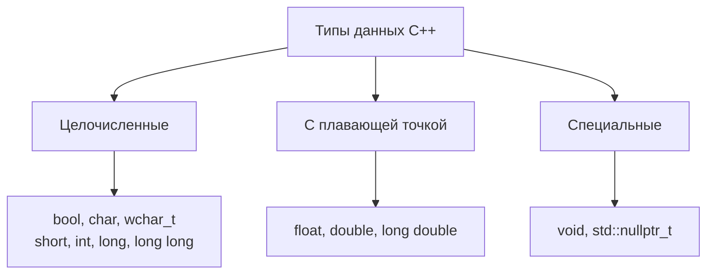
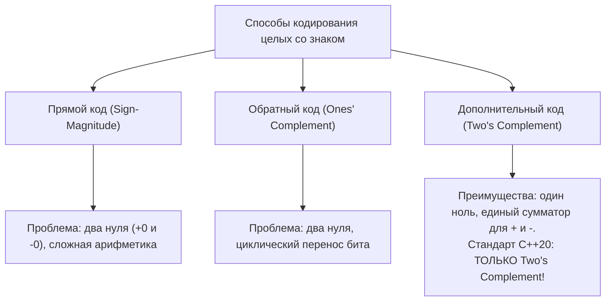
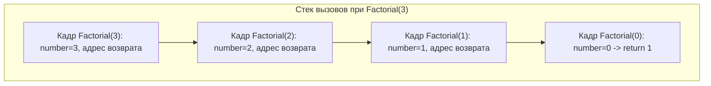

# 📝 Лекция 1: Типы данных, представление чисел, операторы и функции

> [!info] Метаданные лекции
> **Дата лекции:** `2026-09-05`  
> **Предмет:** [[Основы программирования]] (1 семестр: C / C++)  
> **Преподаватели:** Хвастунов Александр Павлович, Фадеев Сергей Викторович  
> **Официальный портал курса:** [is-itmo-c-26.github.io/lectures/lectures/01-types-operators-functions.html](https://is-itmo-c-26.github.io/lectures/lectures/01-types-operators-functions.html)  
> **Исходный код примеров:** [github.com/is-itmo-c-26/lectures/tree/main/examples/01-types-operators-functions](https://github.com/is-itmo-c-26/lectures/tree/main/examples/01-types-operators-functions)  
> **Теги:** #основы_программирования #c_cpp #типы_данных #дополнительный_код #ieee754 #операторы #функции #ub #1_семестр #итмо

---

## 🧭 Навигация по конспекту
1. [Краткое резюме (TL;DR)](#краткое-резюме-tldr)
2. [Идентификаторы и Google C++ Style Guide](#1-идентификаторы-и-google-c-style-guide)
   - [Правила именования идентификаторов](#11-правила-именования-идентификаторов)
   - [Стандарт оформления кода курса](#12-стандарт-оформления-кода-курса)
3. [Система типов данных в C++](#2-система-типов-данных-в-c)
   - [Встроенные фундаментальные типы](#21-встроенные-фундаментальные-типы)
   - [Модификаторы целочисленных типов](#22-модификаторы-целочисленных-типов)
   - [Модели памяти (ABI): LP64 vs LLP64](#23-модели-памяти-abi-lp64-vs-llp64)
   - [Оператор sizeof и CHAR_BIT](#24-оператор-sizeof-и-char_bit)
   - [Типы точной ширины `<cstdint>`](#25-типы-точной-ширины)
   - [Пределы типов: `<limits>` и нюансы min/lowest](#26-пределы-типов-и-нюансы-minlowest)
4. [Беззнаковая арифметика и ее ловушки](#3-беззнаковая-арифметика-и-ее-ловушки)
   - [Арифметика по модулю $2^N$](#31-арифметика-по-модулю)
   - [Коварство сравнения со знаковыми типами (`-1 < 10U`)](#32-коварство-сравнения-со-знаковыми-типами-1-10u)
5. [Машинное представление целых чисел в памяти](#4-машинное-представление-целых-чисел-в-памяти)
   - [Прямой код (Sign-Magnitude)](#41-прямой-код-sign-magnitude)
   - [Обратный код (Ones' Complement)](#42-обратный-код-ones-complement)
   - [Дополнительный код (Two's Complement)](#43-дополнительный-код-twos-complement)
   - [Undefined Behavior при знаковом переполнении и кейс `-INT_MIN`](#44-undefined-behavior-при-знаковом-переполнении-и-кейс-int_min)
6. [Представление вещественных чисел (IEEE 754)](#5-представление-вещественных-чисел-ieee-754)
   - [Структура формата float binary32](#51-структура-формата-float-binary32)
   - [Пошаговый разбор числа $5.75_{10}$ в двоичном виде](#52-пошаговый-разбор-числа-в-двоичном-виде)
   - [Ошибки округления и правильное сравнение чисел с плавающей точкой](#53-ошибки-округления-и-правильное-сравнение-чисел-с-плавающей-точкой)
7. [Литералы, логический тип, перечисления и переменные](#6-литералы-логический-тип-перечисления-и-переменные)
   - [Целочисленные и вещественные литералы](#61-целочисленные-и-вещественные-литералы)
   - [Символьные и строковые литералы](#62-символьные-и-строковые-литералы)
   - [Тип bool](#63-тип-bool)
   - [Перечисления: классический enum vs enum class](#64-перечисления-классический-enum-vs-enum-class)
   - [Объявление vs Определение переменных](#65-объявление-vs-определение-переменных)
   - [Опасность неинициализированных локальных переменных (UB)](#66-опасность-неинициализированных-локальных-переменных-ub)
8. [Операторы, выражения и приоритеты](#7-операторы-выражения-и-приоритеты)
   - [Классификация операторов C++](#71-классификация-операторов-c)
   - [Преобразования типов (Type Promotions & Conversions)](#72-преобразования-типов-type-promotions-conversions)
   - [Таблица 15 уровней приоритетов операторов](#73-таблица-15-уровней-приоритетов-операторов)
   - [Разбор сложного выражения: пошаговое дерево](#74-разбор-сложного-выражения-пошаговое-дерево)
9. [Управляющие конструкции (ветвления и циклы)](#8-управляющие-конструкции-ветвления-и-циклы)
   - [Условный оператор if-else и цепочки else-if](#81-условный-оператор-if-else-и-цепочки-else-if)
   - [Проблема висячего else (Dangling Else)](#82-проблема-висячего-else-dangling-else)
   - [Цикл while](#83-цикл-while)
   - [Цикл do-while](#84-цикл-do-while)
   - [Цикл for и критический нюанс оператора continue](#85-цикл-for-и-критический-нюанс-оператора-continue)
   - [Диапазонный цикл Range-based for](#86-диапазонный-цикл-range-based-for)
   - [Операторы break и continue](#87-операторы-break-и-continue)
   - [Оператор switch-case и устройство jump table](#88-оператор-switch-case-и-устройство-jump-table)
10. [Функции](#9-функции)
    - [Анатомия функции: сигнатура, параметры и возврат](#91-анатомия-функции-сигнатура-параметры-и-возврат)
    - [Объявление (прототип) и определение функции](#92-объявление-прототип-и-определение-функции)
    - [Функции без возвращаемого значения (void)](#93-функции-без-возвращаемого-значения-void)
    - [Функция main и аргументы командной строки (argc, argv)](#94-функция-main-и-аргументы-командной-строки-argc-argv)
    - [Рекурсия против итерации: механизм стековых кадров](#95-рекурсия-против-итерации-механизм-стековых-кадров)
    - [Сокрытие имен (Name Shadowing) и области видимости](#96-сокрытие-имен-name-shadowing-и-области-видимости)
11. [Каталог программ лекции с подробным разбором](#10-каталог-программ-лекции-с-подробным-разбором)
12. [Вопросы для самопроверки к экзамену и зачету](#11-вопросы-для-самопроверки-к-экзамену-и-зачету)

---

## 📌 Краткое резюме (TL;DR)

1. **Модели памяти:** Размер `long` зависит от ОС: на Linux/macOS 64-bit (LP64) `sizeof(long) == 8`, а на Windows x64 (LLP64) `sizeof(long) == 4`! Для фиксированных битовых структур всегда используйте `<cstdint>` (`int32_t`, `uint64_t`).
2. **Беззнаковые ловушки:** Арифметика `unsigned` не переполняется, а вычисляется строго по модулю $2^N$ (`0U - 1U == 4294967295U`). При сравнении `int` с `unsigned` знаковое число неявно приводится к беззнаковому, поэтому `-1 < 10U` возвращает `false`!
3. **Представление целых чисел:** С C++20 стандартом официально закреплен **дополнительный код (Two's Complement)**. В нем нет проблемы двух нулей, а сложение положительных и отрицательных чисел выполняется одним сумматором.
4. **Знаковое переполнение — строго UB:** В C++ переполнение `signed int` является **неопределенным поведением (Undefined Behavior)**. Компилятор вправе считать, что переполнения не бывает, и удалять ваши проверки на ошибки. Крайний случай `-INT_MIN` — это UB.
5. **Вещественные числа IEEE 754:** Число `float` (32 бита) делится на знак (1 бит), смещенную экспоненту (8 бит, bias=127) и мантиссу (23 бита). Никогда не сравнивайте `float` через `==`, используйте эпсилон-окрестность `std::abs(a - b) < eps`.
6. **Scoped Enums (`enum class`):** Всегда предпочитайте `enum class` обычному `enum`. Он не загрязняет пространство имен и запрещает неявные опасные преобразования в `int`.
7. **Dangling Else:** Конструкция `else` в C++ всегда грамматически привязывается к **ближайшему предшествующему незакрытому `if`**. Чтобы избежать логических дыр, всегда ставьте фигурные скобки `{}`.
8. **Continue в `for` vs `while`:** В цикле `for` вызов `continue` передает управление на шаг инкремента (`step`), а в цикле `while` пропускает его до конца тела. Наивный перевод `for` в `while` с `continue` приводит к зависанию программы.
9. **Функция `main`:** Единственная функция в C++, где можно опустить `return 0;` — компилятор добавит его автоматически. Параметры `int argc, char* argv[]` содержат количество аргументов и массив строк, при этом `argv[argc] == nullptr`.

---

## 1. Идентификаторы и Google C++ Style Guide

### 1.1. Правила именования идентификаторов

**Идентификатор** — это имя, присваиваемое переменным, типам, функциям, константам и пространствам имен.

По стандарту ISO C++:
- Может состоять из латинских букв (`a-z`, `A-Z`), цифр (`0-9`), символа подчеркивания `_`, а также разрешенных стандартом символов Unicode (начиная с C++11/C++23).
- **Не может начинаться с цифры** (иначе лексический анализатор путает имя с числовым литералом).
- Язык C++ чувствителен к регистру (case-sensitive): `result`, `Result` и `RESULT` — это три абсолютно разные сущности.
- Имя не может совпадать с зарезервированными ключевыми словами языка (`int`, `for`, `class`, `return`, `co_await` и др.).
- **Зарезервированные имена компилятора:** Имена, начинающиеся с символа подчеркивания и заглавной буквы (например, `_Count`), или содержащие два подчеркивания подряд (`__value`), зарезервированы для стандартной библиотеки и компилятора. Программисту создавать такие идентификаторы запрещено!

### 1.2. Стандарт оформления кода курса

На курсе используется адаптация **Google C++ Style Guide** со следующими жесткими требованиями:

| Элемент кода | Соглашение регистра | Пример |
| :--- | :--- | :--- |
| Локальные переменные, поля структур | `snake_case` | `student_count`, `buffer_size` |
| Пространства имен (namespaces) | `snake_case` | `math_utils`, `parser` |
| Функции и методы | `PascalCase` | `CalculateSum()`, `PrintReport()` |
| Типы данных, структуры, классы, enum | `PascalCase` | `Matrix3x3`, `UserProfile` |
| Константы времени компиляции, constexpr | `kPascalCase` | `kMaxRetries`, `kDefaultTimeout` |

#### Форматирование и фигурные скобки:
- Отступ — строго **4 пробела** (табуляция запрещена).
- Стиль открывающей фигурной скобки — **1TBS / K&R (на той же строке)**:
  ```cpp
  // Корректно по правилам курса:
  void ProcessData(int value) {
      if (value > 0) {
          std::cout << value << '\n';
      }
  }
  ```
- **Все тела ветвлений и циклов обязаны быть в фигурных скобках `{}`**, даже если тело состоит из единственной инструкции:
  ```cpp
  // ЗАПРЕЩЕНО (плохой стиль):
  if (is_valid) count++;

  // ОБЯЗАТЕЛЬНО:
  if (is_valid) {
      ++count;
  }
  ```

---

## 2. Система типов данных в C++

C++ является **статически типизированным** языком: тип каждого выражения и переменной известен на этапе компиляции и не может меняться во время выполнения.



### 2.1. Встроенные фундаментальные типы

1. **Целочисленные типы:**
   - `bool` — логический тип (`true` или `false`, размер обычно 1 байт).
   - `char` — минимальная адресуемая единица памяти (гарантированно 1 байт). Используется для символов ASCII.
   - `char8_t` (C++20, UTF-8), `char16_t` (UTF-16), `char32_t` (UTF-32), `wchar_t` (широкий символ).
   - `short` (или `short int`) — короткое целое (не менее 16 бит).
   - `int` — базовое целое число (обычно 32 бита, регистр процессора).
   - `long` (или `long int`) — длинное целое (не менее 32 бит).
   - `long long` (C++11) — расширенное целое (не менее 64 бит).
2. **Вещественные типы:**
   - `float` — одинарная точность (обычно 32 бита IEEE 754).
   - `double` — двойная точность (обычно 64 бита IEEE 754).
   - `long double` — расширенная точность (80 или 128 бит в зависимости от платформы).
3. **Специальные типы:**
   - `void` — неполный тип, обозначающий отсутствие значения (возврат функций, нетипизированный указатель `void*`).
   - `std::nullptr_t` (C++11) — тип константы нулевого указателя `nullptr`.

> [!important] Что гарантирует стандарт ISO C++ по размерам?
> Стандарт **не фиксирует точное число байт** для большинства типов. Он гарантирует только относительный порядок:
> $$1 = \text{sizeof(char)} \le \text{sizeof(short)} \le \text{sizeof(int)} \le \text{sizeof(long)} \le \text{sizeof(long long)}$$
> И минимальные диапазоны разрядности: `char` $\ge 8$ бит, `short` $\ge 16$ бит, `int` $\ge 16$ бит, `long` $\ge 32$ бит, `long long` $\ge 64$ бит.

### 2.2. Модификаторы целочисленных типов

Целые типы можно модифицировать ключевыми словами:
- `signed` — знаковый тип (может хранить как положительные, так и отрицательные числа).
- `unsigned` — беззнаковый тип (хранит только неотрицательные значения от $0$ до $2^N - 1$).
- Слово `int` в объявлениях можно опускать: `unsigned` эквивалентно `unsigned int`, `long` — `long int`.

```cpp
short int small_value = -10;
long int large_value = 1'000'000L;
long long very_large_value = 9'000'000'000LL;

signed int temperature = -20;
unsigned int student_count = 30U;
unsigned long file_size = 4'000'000UL;
```

> [!note] Особенность типа `char`
> `char`, `signed char` и `unsigned char` — это **три разных типа** по системе типов C++! Является ли голый `char` знаковым или беззнаковым по умолчанию, зависит от компилятора и архитектуры (на x86 `char` обычно знаковый, на ARM — часто беззнаковый).

### 2.3. Модели памяти (ABI): LP64 vs LLP64

Почему программы, написанные под Linux, могут неожиданно ломаться при компиляции под Windows? Причина — различие в моделях данных (Data Model / ABI) 64-битных систем:

| Тип данных | 32-bit (ILP32) | Linux / macOS 64-bit (LP64) | Windows 64-bit (LLP64) |
| :--- | :---: | :---: | :---: |
| `char` | 1 байт | 1 байт | 1 байт |
| `short` | 2 байта | 2 байта | 2 байта |
| `int` | 4 байта | 4 байта | 4 байта |
| **`long`** | **4 байта** | **8 байт** | **4 байта (ВНИМАНИЕ!)** |
| `long long` | 8 байт | 8 байт | 8 байт |
| Указатели (`void*`) | 4 байта | 8 байт | 8 байт |

> [!warning] Главная ловушка переносимости `long`
> На 64-битном Linux `sizeof(long) == 8` (в него безопасно помещается указатель). На 64-битной Windows `sizeof(long) == 4`! Если вы сохраните указатель в `long`, под Windows произойдет усечение старших 32 бит и программа упадет.

### 2.4. Оператор `sizeof` и `CHAR_BIT`

Оператор `sizeof` вычисляет размер типа или объекта в **байтах платформы**:
- Применяется к имени типа: `sizeof(int)`, `sizeof(double)`.
- Применяется к выражению: `sizeof(variable)` (скобки вокруг выражения не обязательны: `sizeof variable`).
- Выражение внутри `sizeof` **не вычисляется в рантайме** (unevaluated operand).
- Возвращает значение типа `std::size_t` (беззнаковый целочисленный тип из `<cstddef>`).
- Константа `CHAR_BIT` из заголовочного файла `<climits>` определяет число бит в байте (на современных платформах всегда 8).

Пример из репозитория курса (`examples/01-types-operators-functions/type-sizes.cpp`):
```cpp
#include <cstdint>
#include <iostream>

int main() {
    std::cout << "sizeof(char) = " << sizeof(char) << '\n';              // 1
    std::cout << "sizeof(short) = " << sizeof(short) << '\n';            // 2
    std::cout << "sizeof(int) = " << sizeof(int) << '\n';                // 4
    std::cout << "sizeof(long) = " << sizeof(long) << '\n';              // 4 (Win) или 8 (Linux)
    std::cout << "sizeof(long long) = " << sizeof(long long) << '\n';    // 8
    std::cout << "sizeof(std::int32_t) = " << sizeof(std::int32_t) << '\n'; // 4

    return 0;
}
```

### 2.5. Типы точной ширины `<cstdint>`

Когда размер типа является частью контракта (сетевой пакет, бинарный формат файла на диске, регистр микроконтроллера), встроенные типы `int` и `long` использовать нельзя.

Стандарт C++11 (унаследовав C99) предоставляет заголовок `<cstdint>` с типами фиксированной разрядности:

| Знаковый тип | Беззнаковый тип | Точная ширина | Диапазон значений |
| :--- | :--- | :---: | :--- |
| `std::int8_t` | `std::uint8_t` | 8 бит | от $-128$ до $127$ / от $0$ до $255$ |
| `std::int16_t` | `std::uint16_t` | 16 бит | от $-32\,768$ до $32\,767$ / от $0$ до $65\,535$ |
| `std::int32_t` | `std::uint32_t` | 32 бита | от $-2 \cdot 10^9$ до $2 \cdot 10^9$ / от $0$ до $4.29 \cdot 10^9$ |
| `std::int64_t` | `std::uint64_t` | 64 бита | от $-9 \cdot 10^{18}$ до $9 \cdot 10^{18}$ / от $0$ до $1.8 \cdot 10^{19}$ |

### 2.6. Пределы типов: `<limits>` и нюансы min/lowest

Шаблонный класс `std::numeric_limits<T>` из заголовка `<limits>` дает доступ к свойствам любого типа во время компиляции:

```cpp
#include <iostream>
#include <limits>

int main() {
    std::cout << "long: [" << std::numeric_limits<long>::lowest() << ", "
              << std::numeric_limits<long>::max() << "]\n";

    std::cout << "double: [" << std::numeric_limits<double>::lowest() << ", "
              << std::numeric_limits<double>::max() << "]\n";

    std::cout << "smallest positive normalized double: " 
              << std::numeric_limits<double>::min() << '\n';

    std::cout << "char is signed: " << std::numeric_limits<char>::is_signed << '\n';

    return 0;
}
```

> [!danger] Критическая разница между `min()` и `lowest()` для вещественных чисел!
> - Для целых чисел (`int`, `long`): `min()` и `lowest()` возвращают одно и то же — наименьшее отрицательное число.
> - **Для вещественных чисел (`double`, `float`):**
>   - `max()` возвращает максимальное конечное положительное число ($\approx 1.79 \cdot 10^{308}$).
>   - `lowest()` возвращает **наименьшее конечное отрицательное число** ($\approx -1.79 \cdot 10^{308}$).
>   - `min()` возвращает **наименьшее положительное нормализованное число** ($\approx 2.22 \cdot 10^{-308}$, близкое к нулю)!
> Если для поиска минимума в массиве `double` вы инициализируете переменную вызовом `min()`, ваш алгоритм будет ошибочным для отрицательных чисел. Всегда используйте `lowest()`.

---

## 3. Беззнаковая арифметика и ее ловушки

### 3.1. Арифметика по модулю $2^N$

По стандарту языка C++, операции над беззнаковыми целыми числами (`unsigned`) **никогда не приводят к переполнению (overflow)** в математическом смысле. Они строго подчиняются законам кольца вычетов по модулю $2^N$:

$$\text{Result} = (A \text{ op } B) \pmod{2^N}$$

где $N$ — число бит типа (например, 32).

Рассмотрим пример `examples/01-types-operators-functions/unsigned-arithmetic.cpp`:
```cpp
#include <iostream>

int main() {
    unsigned int zero = 0U;
    unsigned int underflow = zero - 1U;
    std::cout << "0U - 1U = " << underflow << '\n'; // Выведет 4294967295

    int negative = -1;
    unsigned int ten = 10U;
    std::cout << "-1 < 10U is " << (negative < ten) << '\n'; // Выведет 0 (false)!

    return 0;
}
```

- Выражение `0U - 1U` вычисляется как $(0 - 1) \pmod{2^{32}} = -1 \equiv 4294967295$.
- Значение циклически «заворачивается» на верхнюю границу `UINT_MAX`. Это полностью легальное и определенное поведение (Well-defined behavior).

### 3.2. Коварство сравнения со знаковыми типами (`-1 < 10U`)

Почему выражение `-1 < 10U` возвращает ложь (`0`), хотя математически $-1 < 10$?

**Механизм обычных арифметических преобразований (Usual Arithmetic Conversions):**
1. В бинарном операторе `<` участвуют `int` (знаковый) и `unsigned int` (беззнаковый) одинакового ранга.
2. По правилам стандарта C++, значение типа `int` неявно приводится к типу `unsigned int`.
3. Битовый шаблон числа `-1` (в дополнительном коде `0xFFFFFFFF`) интерпретируется как беззнаковое число:
   $$-1 \implies 4294967295\text{U}$$
4. Выражение превращается в:
   $$4294967295\text{U} < 10\text{U} \implies \mathbf{false}$$

> [!danger] Правило безопасного кода
> Беззнаковые типы **не защищают** от логических ошибок со знаком. Никогда не смешивайте в одном сравнении знаковые и беззнаковые переменные без явного приведения. В C++20 для безопасного сравнения добавлена функция `std::cmp_less(a, b)` из заголовка `<utility>`.

---

## 4. Машинное представление целых чисел в памяти

Компьютер оперирует исключительно битами (`0` и `1`). Исторически существовало три основных способа кодирования отрицательных чисел в $N$ битах:



### 4.1. Прямой код (Sign-Magnitude)
- Старший бит отводится под знак ($0$ — плюс, $1$ — минус), остальные $N-1$ бит содержат двоичный модуль числа.
- Для 8 бит:
  $$+5_{10} = 0000\,0101_2, \quad -5_{10} = 1000\,0101_2$$
  $$+0_{10} = 0000\,0000_2, \quad -0_{10} = 1000\,0000_2$$
- **Недостатки:**
  - Два представления нуля ($+0$ и $-0$), что усложняет логику сравнения.
  - Обычное двоичное сложение не работает:
    $$\begin{array}{r@{\quad}l}
      0000\,0101_2 & (+5) \\
    + 1000\,0101_2 & (-5) \\
    \hline
      1000\,1010_2 & (-10_{10} \ne 0)
    \end{array}$$

### 4.2. Обратный код (Ones' Complement)
- Положительные числа записываются как обычно. Для получения отрицательного числа все биты положительного инвертируются (побитовое НЕ):
  $$+5_{10} = 0000\,0101_2, \quad -5_{10} = 1111\,1010_2$$
  $$+0_{10} = 0000\,0000_2, \quad -0_{10} = 1111\,1111_2$$
- **Недостатки:** Сохраняются два нуля; при сложении чисел перенос из старшего разряда требует циклического прибавления единицы к младшему разряду (end-around carry).

### 4.3. Дополнительный код (Two's Complement)

**Алгоритм получения отрицательного числа:**
1. Записать модуль числа в двоичном виде.
2. Побитово инвертировать все биты ($0 \leftrightarrow 1$).
3. Прибавить $1$ к полученному результату.

Для числа $-5$ (в 8 битах):
$$+5 = 0000\,0101_2 \xrightarrow{\text{инверсия}} 1111\,1010_2 \xrightarrow{+1} 1111\,1011_2 = -5$$

Проверим сложение $5 + (-5)$:
$$\begin{array}{r@{\quad}l}
  0000\,0101_2 & (+5) \\
+ 1111\,1011_2 & (-5) \\
\hline
1\,0000\,0000_2 & (\text{перенос в 9-й бит отбрасывается}) \implies 0000\,0000_2 = 0
\end{array}$$

**Фундаментальные достоинства:**
1. **Ноль единственен:** $0000\,0000_2$.
2. **Аппаратная простота:** Для сложения и вычитания используется одна и та же схема цифрового сумматора (вычитание $A - B$ заменяется на $A + (-B)$).
3. **Асимметричный диапазон:** Для $N$ бит диапазон составляет от $-2^{N-1}$ до $2^{N-1} - 1$. Для 8 бит: $[-128, +127]$. Число $-128$ представляется как $1000\,0000_2$.
4. **Стандарт C++20:** Обязал абсолютно все компиляторы представлять знаковые целые числа исключительно в дополнительном коде (ранее стандарт допускал и обратный код, и прямой).

### 4.4. Undefined Behavior при знаковом переполнении и кейс `-INT_MIN`

> [!danger] Переполнение знаковых целых чисел — это строго Undefined Behavior (UB)!
> В отличие от `unsigned`, переполнение `signed int` в C++ **не является** переносом по модулю $2^N$. Стандарт декларирует это как неопределенное поведение.

**Последствия в оптимизирующем компиляторе:**
Поскольку стандарт гарантирует, что в корректной программе UB не наступает, оптимизатор компилятора Clang/GCC вправе сделать допущение: *«Знаковое переполнение никогда не происходит»*.

Пример:
```cpp
bool CheckOverflow(int x) {
    // Программист наивно пытается проверить, переполнится ли x + 1:
    return (x + 1 > x);
}
```
Компилятор оптимизирует эту функцию в безусловный возврат:
```asm
mov al, 1
ret
```
Потому что $x + 1 > x$ истинно для всех математических чисел, а случай $x = \text{INT\_MAX}$ компилятор игнорирует как UB! Проверка полностью исчезает из бинарника.

**Кейс `-INT_MIN`:**
Для 32-битного знакового типа:
$$\text{INT\_MIN} = -2\,147\,483\,648, \quad \text{INT\_MAX} = +2\,147\,483\,647$$
Операция унарного минуса `-INT_MIN` пытается вычислить $+2\,147\,483\,648$, которого нет в диапазоне положительных значений. Это приводит к знаковому переполнению и мгновенному **Undefined Behavior**!

---

## 5. Представление вещественных чисел (IEEE 754)

Вещественные типы (`float`, `double`) представляются в памяти в соответствии со стандартом **IEEE 754** (двоичный формат с плавающей точкой).

### 5.1. Структура формата `float` (binary32)

32-битное число `float` разделено на три поля:

> [!info] Битовая структура `float` (IEEE 754 Binary32, 32 бита)
> 
> | Бит `31` (1 бит) | Биты `30 .. 23` (8 бит) | Биты `22 .. 0` (23 бита) |
> | :---: | :---: | :---: |
> | **Знак ($s$)** | **Смещенная экспонента ($e$)** | **Дробная часть мантиссы ($f$)** |
> 
> | Поле | Бит(ы) | Разрядность | Название | Назначение и формула |
> | :---: | :---: | :---: | :--- | :--- |
> | **$s$** | `[31]` | 1 бит | Знак (Sign) | $s=0 \implies (+)$, $s=1 \implies (-)$ (множитель $(-1)^s$) |
> | **$e$** | `[30..23]` | 8 бит | Экспонента (Exponent) | Смещение $\text{bias} = 127$. Истинный порядок: $E = e - 127$ |
> | **$f$** | `[22..0]` | 23 бита | Мантисса (Fraction) | Дробная часть нормализованной мантиссы: $(1.f)_2$ |

1. **Знак $s$ (Sign, 1 бит):** $0$ — положительное число, $1$ — отрицательное.
2. **Смещенная экспонента $e$ (Biased Exponent, 8 бит):** Диапазон от $0$ до $255$. Смещение (bias) для single precision составляет $127$. Истинный порядок: $E = e - 127$.
3. **Дробная часть мантиссы $f$ (Fraction, 23 бита):** Число нормализовано, поэтому старшая единица перед запятой всегда равна $1$ и явно в памяти не хранится (т. н. *скрытая единица* / implicit leading bit).

Математическая формула нормализованного числа:
$$\text{Value} = (-1)^s \cdot (1.f)_2 \cdot 2^{e - 127}$$

### 5.2. Пошаговый разбор числа $5.75_{10}$ в двоичном виде

Разберем пример из лекции шаг за шагом:

1. **Перевод в двоичную систему счисления:**
   - Целая часть: $5_{10} = 4 + 1 = 101_2$.
   - Дробная часть: $0.75_{10} = \frac{1}{2} + \frac{1}{4} = 0.11_2$.
   - Итог: $5.75_{10} = 101.11_2$.

2. **Нормализация двоичной записи:**
   Сдвигаем запятую влево так, чтобы перед ней осталась ровно одна единица:
   $$101.11_2 = 1.0111_2 \times 2^2$$

3. **Формирование полей IEEE 754:**
   - **Знак $s$:** Число положительное $\implies s = 0$.
   - **Порядок $E = 2$:** Добавляем смещение $127$:
     $$e = E + 127 = 2 + 127 = 129_{10} = 1000\,0001_2$$
   - **Мантисса $f$:** Отбрасываем скрытую ведущую единицу $1.$, остается дробная часть $.0111_2$. Дополняем нулями справа до 23 бит:
     $$f = 01110000000000000000000_2$$

4. **Итоговое бинарное представление в памяти:**
   ```text
   0 | 10000001 | 01110000000000000000000
   ```
   В шестнадцатеричном виде (Hex): `0x40B80000`.

### 5.3. Ошибки округления и правильное сравнение чисел с плавающей точкой

Большинство десятичных дробей (например, $0.1_{10}$ или $0.2_{10}$) при переводе в двоичную систему превращаются в **бесконечные периодические дроби**:
$$0.1_{10} = 0.0001100110011..._2$$
Поскольку мантисса ограничена 23 битами (или 52 битами для `double`), число округляется.

```cpp
double a = 0.1 + 0.2;
double b = 0.3;
if (a == b) { // ПОЧТИ НАВЕРНЯКА FALSE!
    // Этот код не выполнится
}
```

> [!tip] Канонический способ сравнения вещественных чисел
> Сравнивать вещественные числа на равенство оператором `==` запрещено. Всегда сравнивайте разность чисел с допустимой погрешностью (машинным эпсилон):
> ```cpp
> #include <cmath>
> #include <limits>
> 
> bool AreEqual(double x, double y, double epsilon = 1e-9) {
>     return std::abs(x - y) < epsilon;
> }
> ```

---

## 6. Литералы, логический тип, перечисления и переменные

### 6.1. Целочисленные и вещественные литералы

Литерал — это константное значение, явно записанное в тексте программы.

```cpp
// Целочисленные литералы:
int decimal = 162;              // Десятичная система
int octal = 0242;                // Ведущий ноль '0' -> ВОСЬМЕРИЧНАЯ система (0242_8 = 162_10)
int hex = 0xA2;                  // Префикс '0x' -> шестнадцатеричная система
int binary = 0b1010'0010;        // Префикс '0b' -> двоичная система (C++14)
unsigned long pop = 1'000'000UL; // Апостроф как разделитель тысяч (C++14)
```

> [!danger] Опасность ведущего нуля!
> Запись `int month = 09;` вызовет **ошибку компиляции**, так как ведущий `0` указывает компилятору на восьмеричную систему, в которой цифры `9` не существует! А `int day = 08;` не скомпилируется по той же причине.

**Суффиксы литералов:**
- `u` или `U` — `unsigned int`.
- `l` или `L` — `long`.
- `ll` или `LL` — `long long`.
- `f` или `F` — `float` (по умолчанию вещественный литерал с точкой `0.15` имеет тип `double`!).
- `1.5E6` — экспоненциальная форма: $1.5 \cdot 10^6 = 1\,500\,000.0$.

### 6.2. Символьные и строковые литералы

- **Символьный литерал:** заключается в **одинарные кавычки**: `'x'`, `'\n'`, `'\\'`, `'\''`. Имеет тип `char` (1 байт).
- **Строковый литерал:** заключается в **двойные кавычки**: `"Hello, world!\n"`.
  - Имеет тип `const char[N]` — массив неизменяемых символов.
  - Компилятор автоматически добавляет в конец невидимый нулевой символ-терминатор `'\0'`.
  - Длина `"Hello"` в памяти равна **6 байт** (5 букв + `'\0'`).

### 6.3. Тип `bool`
- Принимает два значения: `true` (истина, $1$) и `false` (ложь, $0$).
- В условных операторах любое числовое значение неявно приводится к `bool`: `0` дает `false`, **любое ненулевое число** (включая отрицательные) дает `true`.

### 6.4. Перечисления: классический `enum` vs `enum class`

Рассмотрим пример `examples/01-types-operators-functions/enum-kinds.cpp`:

```cpp
enum Color { kRed, kGreen, kBlue };
enum class Direction { kLeft, kRight, kUp, kDown };

int main() {
    Color classic_color = kRed;
    Direction scoped_direction = Direction::kLeft;

    int color_code = classic_color;                      // Неявно превращается в 0
    // int direction_code = scoped_direction;          // ОШИБКА КОМПИЛЯЦИИ!
    int direction_code = static_cast<int>(scoped_direction); // Только явное приведение

    return 0;
}
```

| Характеристика | Классический `enum Color` | Scoped enum: `enum class Direction` |
| :--- | :--- | :--- |
| **Область видимости** | Имена меток выпадают в окружающую область видимости (`kRed` виден везде) | Метки скрыты внутри перечисления (`Direction::kLeft`) |
| **Неявное приведение к `int`** | Разрешено (опасно: можно случайно сложить цвет с числом) | **Запрещено** (требуется явный `static_cast<int>`) |
| **Рекомендация курса** | Устарело, избегать | **Всегда использовать `enum class`** |

### 6.5. Объявление vs Определение переменных

- **Объявление (Declaration):** Сообщает компилятору тип и имя переменной, не выделяя под нее память:
  ```cpp
  extern int global_count; // Объявление
  ```
- **Определение (Definition):** Создает объект и выделяет под него память в стеке, куче или секции данных:
  ```cpp
  int global_count = 0;   // Определение
  double radius = 1.23;   // Определение
  ```
- *Правило:* Каждое определение является объявлением, но не каждое объявление является определением.

### 6.6. Опасность неинициализированных локальных переменных (UB)

Пример `examples/01-types-operators-functions/uninitialized-local.cpp`:
```cpp
#include <iostream>

int main() {
    int value; // Локальная переменная НЕ инициализирована!

    // Чтение неинициализированного значения:
    std::cout << "value = " << value << '\n'; // UNDEFINED BEHAVIOR!

    return 0;
}
```

> [!danger] Стек содержит остаточный мусор
> Локальные переменные создаются на стеке функции. Если вы не указали начальное значение, переменная будет содержать случайные биты («мусор»), оставшиеся от предыдущих вызовов функций. Чтение такого значения приводит к **Undefined Behavior**.
> **Всегда инициализируйте переменные при объявлении:** `int value = 0;` или `int value{};`.

---

## 7. Операторы, выражения и приоритеты

### 7.1. Классификация операторов C++

1. **Арифметические:** `+`, `-`, `*`, `/`, `%` (остаток от деления целых чисел).
2. **Сравнения:** `==`, `!=`, `<`, `<=`, `>`, `>=`.
3. **Логические:** `&&` (И), `||` (ИЛИ), `!` (НЕ). Реализуют *короткое замыкание (short-circuit evaluation)*: второй операнд не вычисляется, если результат ясен по первому.
4. **Побитовые:** `&` (побитовое И), `|` (побитовое ИЛИ), `^` (XOR), `~` (инверсия), `<<` (сдвиг влево), `>>` (сдвиг вправо).
5. **Присваивания:** `=`, `+=`, `-=`, `*=`, `/=`, `%=`, `&=`, `|=`, `^=`, `<<=`, `>>=`.
6. **Тернарный условный оператор:** `условие ? выражение1 : выражение2`.
7. **Инкремент и декремент:**
   - Префиксный `++i`: увеличивает значение и возвращает **ссылку на измененную переменную (lvalue)**.
   - Постфиксный `i++`: создает временную копию старого значения, увеличивает переменную и возвращает **старую копию (rvalue)**.
   - *Совет по стилю:* Всегда предпочитайте префиксный `++i`, так как он не создает лишних копий.

### 7.2. Преобразования типов (Type Promotions & Conversions)

1. **Целочисленное продвижение (Integral Promotion):** Типы размером меньше `int` (`bool`, `char`, `short`) перед выполнением любой арифметической операции автоматически продвигаются до `int`.
2. **Приведение к общему типу:** Если в операции участвуют целый и вещественный тип (`int` + `double`), целый тип приводится к вещественному (`double`).
3. **Явное приведение типов:**
   - C-style: `(int)3.14` (не рекомендуется, подавляет все проверки).
   - В современном C++ применяются специальные именованные операторы приведения: `static_cast<int>(3.14)`.

### 7.3. Таблица 15 уровней приоритетов операторов

Чем меньше номер уровня, тем выше приоритет:

| Уровень | Категория | Операторы | Ассоциативность |
| :---: | :--- | :--- | :---: |
| **1** | Постфиксные | Вызов `f()`, индексация `a[i]`, доступ к полям `.`, `->`, постфиксные `a++`, `a--` | Слева направо |
| **2** | Унарные | Префиксные `++a`, `--a`, `!`, `~`, унарный плюс/минус `+a`, `-a`, разыменование `*p`, взятие адреса `&a`, `sizeof` | Справа налево |
| **3** | Мультипликативные | Умножение `*`, деление `/`, остаток `%` | Слева направо |
| **4** | Аддитивные | Сложение `+`, вычитание `-` | Слева направо |
| **5** | Побитовые сдвиги | Сдвиг влево `<<`, сдвиг вправо `>>` | Слева направо |
| **6** | Отношения | Меньше `<`, меньше или равно `<=`, больше `>`, больше или равно `>=` | Слева направо |
| **7** | Равенство | Равно `==`, не равно `!=` | Слева направо |
| **8** | Побитовое И | `&` | Слева направо |
| **9** | Побитовый XOR | `^` | Слева направо |
| **10** | Побитовое ИЛИ | `\|` | Слева направо |
| **11** | Логическое И | `&&` | Слева направо |
| **12** | Логическое ИЛИ | `\|\|` | Слева направо |
| **13** | Тернарный условный | `?:` | Справа налево |
| **14** | Присваивание | `=`, `+=`, `-=`, `*=`, `/=` и т. д. | Справа налево |
| **15** | Запятая | `,` | Слева направо |

### 7.4. Разбор сложного выражения: пошаговое дерево

Разберем пример из слайдов лектора:
```cpp
a + b * c << d || 25 != 32 && !c++
```

Расставим скобки по уровням приоритетов операторов:
1. Наивысший приоритет — постфиксный инкремент `c++` (уровень 1) $\implies$ `(c++)`.
2. Затем унарное логическое отрицание `!` (уровень 2) $\implies$ `(!(c++))`.
3. Затем умножение `b * c` (уровень 3) $\implies$ `(b * c)`.
4. Затем сложение `a + ...` (уровень 4) $\implies$ `(a + (b * c))`.
5. Затем сдвиг `<< d` (уровень 5) $\implies$ `((a + (b * c)) << d)`.
6. Затем проверка неравенства `25 != 32` (уровень 7) $\implies$ `(25 != 32)`.
7. Затем логическое И `&&` (уровень 11) $\implies$ `((25 != 32) && (!(c++)))`.
8. Наконец, логическое ИЛИ `||` (уровень 12) объединяет левую и правую части.

Итоговая эквивалентная запись со скобками:
```cpp
((a + (b * c)) << d) || ((25 != 32) && (!(c++)))
```

> [!tip] Практический вывод
> Никогда не пишите подобные выражения без скобок в промышленном коде! Скобки явно документируют намерения автора и защищают от ошибок восприятия.

---

## 8. Управляющие конструкции (ветвления и циклы)

### 8.1. Условный оператор `if-else` и цепочки `else-if`

```cpp
if (score >= 90) {
    grade = 'A';
} else if (score >= 75) {
    grade = 'B';
} else if (score >= 60) {
    grade = 'C';
} else {
    grade = 'F';
}
```
Проверки выполняются сверху вниз. Как только одно из условий оказывается истинным, выполняется соответствующий блок, а остальные ветви пропускаются.

### 8.2. Проблема висячего else (Dangling Else)

Классический подводный камень грамматики языков C и C++:

```cpp
// examples/01-types-operators-functions/dangling-else.cpp
bool outer_condition = false;
bool inner_condition = false;
int result = 0;

if (outer_condition)
    if (inner_condition)
        result = 1;
else
    result = 2; // К какому if относится этот else?!
```

Что напечатает программа? Вопреки зрительному отступу, программа напечатает `result = 0`!

**Почему?**
По правилам стандарта C++ ветвь `else` **всегда привязывается к ближайшему предшествующему незакрытому `if`**.
Следовательно, компилятор видит этот код так:
```cpp
if (outer_condition) {
    if (inner_condition) {
        result = 1;
    } else {
        result = 2; // Принадлежит внутреннему if!
    }
}
```
Поскольку `outer_condition == false`, внешний `if` не выполняется вовсе, и переменная `result` остается равной $0$.

**Исправление («dangling-else-fixed.cpp»):**
Явное обрамление тела фигурной скобкой решает проблему однозначно:
```cpp
if (outer_condition) {
    if (inner_condition) {
        result = 1;
    }
} else {
    result = 2; // Теперь относится к внешнему if
}
```

### 8.3. Цикл `while`
Условие проверяется **до** выполнения тела. Если изначально условие ложно, тело не выполнится ни разу:
```cpp
int number = 5;
while (number > 0) {
    std::cout << number << '\n';
    --number;
}
```

### 8.4. Цикл `do-while`
Условие проверяется **после** выполнения тела. Тело гарантированно выполнится **хотя бы один раз**:
```cpp
unsigned long number = 0;
do {
    std::cout << "Enter number (0 to end): ";
    std::cin >> number;
    std::cout << "You entered: " << number << '\n';
} while (number != 0);
```

### 8.5. Цикл `for` и критический нюанс оператора `continue`

Каноническая структура:
```cpp
for (initialization; condition; step) {
    statements();
}
```

Рассмотрим программу `examples/01-types-operators-functions/for-continue.cpp`:
```cpp
#include <iostream>

int main() {
    for (int i = 0; i < 3; ++i) {
        if (i == 1) {
            continue; // Пропускаем печать для i == 1
        }
        std::cout << i << ' ';
    }
    std::cout << '\n'; // Выведет: 0 2

    return 0;
}
```

> [!important] Различие поведения `continue` в `for` и `while`
> - В цикле `for`: выполнение `continue` завершает тело текущей итерации и **сразу передает управление выражению шага (`step`, здесь `++i`)**, после чего проверяется условие. Цикл корректно продолжается.
> - В цикле `while`: если переписать этот код наивно:
>   ```cpp
>   int i = 0;
>   while (i < 3) {
>       if (i == 1) {
>           continue; // ПЕРЕХОДИТ К УСЛОВИЮ while (i < 3)!
>       }
>       std::cout << i << ' ';
>       ++i; // ЭТА СТРОЧКА ПРОПУСКАЕТСЯ!
>   }
>   ```
>   При `i == 1` оператор `continue` перепрыгнет через `++i`, значение `i` навсегда останется равным $1$, и программа **зациклится навечно (infinite loop)**!

### 8.6. Диапазонный цикл Range-based `for`

Начиная с C++11 для обхода массивов и контейнеров используется лаконичный синтаксис:
```cpp
int values[] = {0, 1, 2, 3, 4, 5};

for (int value : values) {
    std::cout << value << ' ';
}
std::cout << '\n';
```

### 8.7. Операторы `break` и `continue`
- `break`: немедленно прерывает выполнение самого вложенного цикла (`for`, `while`, `do-while`) или блока `switch`.
- `continue`: немедленно завершает текущую итерацию цикла и переходит к следующей.

### 8.8. Оператор `switch-case` и устройство jump table

```cpp
switch (value) {
    case 1:
        HandleOne();
        break;
    case 2:
    case 3:
        HandleTwoOrThree(); // Группировка меток
        break;
    default:
        HandleOther();
        break;
}
```

**Правила работы:**
1. Выражение селектора обязано иметь **целочисленный тип** или тип `enum`. Использовать строки или вещественные числа (`float`) в `switch` запрещено!
2. Метки `case` обязаны быть константами времени компиляции (constant expressions).
3. **Проваливание (Fallthrough):** Если опустить оператор `break`, управление беспрепятственно провалится в следующий `case`. Если такое поведение задумано, в современном C++ указывают атрибут `\[\[fallthrough\]\];`.
4. **Ассемблерная оптимизация (Jump Table):** Если значения меток `case` расположены плотно, компилятор генерирует не цепочку последовательных сравнений, а **таблицу адресов переходов (Jump Table)**. Выбор нужной ветки выполняется за константное время $O(1)$ по индексу массива адресов в памяти.

---

## 9. Функции

Функция — базовый строительный блок процедурной декомпозиции программы.

### 9.1. Анатомия функции: сигнатура, параметры и возврат

```cpp
return_type FunctionName(parameter_type1 param1, parameter_type2 param2) {
    // Тело функции
    return result;
}
```
- Передача параметров по значению создает локальную копию переданного аргумента.
- Инструкция `return` немедленно прекращает выполнение функции и возвращает значение в точку вызова.

### 9.2. Объявление (прототип) и определение функции

Пример `examples/01-types-operators-functions/function-declaration-definition.cpp`:
```cpp
#include <iostream>

// 1. Объявление (Forward declaration / Прототип):
int Maximum(int left, int right);

int main() {
    // Компилятор уже знает сигнатуру и разрешает вызов:
    int result = Maximum(10, 2);
    std::cout << result << '\n';

    return 0;
}

// 2. Определение (Definition):
int Maximum(int left, int right) {
    return left > right ? left : right;
}
```
Благодаря прототипам программы на C++ разделяются на **заголовочные файлы** (`.h` / `.hpp`, где лежат объявления интерфейсов) и **файлы реализации** (`.cpp`, где лежит код функций).

### 9.3. Функции без возвращаемого значения (`void`)

```cpp
void PrintMessage() {
    std::cout << "I'm a function!\n";
    // return; // Опционально в конце функции
}
```
Тип `void` указывает на то, что функция выполняет побочные эффекты (вывод на экран, запись в файл) и не возвращает значения.

### 9.4. Функция `main` и аргументы командной строки (`argc`, `argv`)

Стандарт допускает две базовые формы:
```cpp
int main() { ... }
int main(int argc, char* argv[]) { ... }
```

Разбор аргументов командной строки (`command-line-arguments.cpp`):
```cpp
#include <iostream>

int main(int argc, char* argv[]) {
    for (int index = 0; index < argc; ++index) {
        std::cout << argv[index] << '\n';
    }

    return 0;
}
```
- `argc` (Argument Count) — количество аргументов, переданных программе. Всегда $\ge 1$.
- `argv` (Argument Vector) — массив указателей на C-строки.
- `argv[0]` — путь или имя исполняемого файла программы.
- `argv[1] ... argv[argc - 1]` — параметры, введенные пользователем в терминале.
- **Гарантия стандарта:** `argv[argc] == nullptr`.

### 9.5. Рекурсия против итерации: механизм стековых кадров

Сравним рекурсивный и итеративный расчет факториала:

**Рекурсивная версия (`factorial-recursive.cpp`):**
```cpp
unsigned long long Factorial(unsigned int number) {
    if (number == 0) {
        return 1; // Базовый случай (останов)
    }
    return number * Factorial(number - 1); // Рекурсивный шаг
}
```

**Итеративная версия (`factorial-iterative.cpp`):**
```cpp
unsigned long long Factorial(unsigned int number) {
    unsigned long long result = 1;
    for (unsigned int factor = 2; factor <= number; ++factor) {
        result *= factor;
    }
    return result;
}
```



| Критерий | Рекурсия | Итерация (цикл) |
| :--- | :--- | :--- |
| **Память** | $O(N)$ памяти в стеке под каждый вызов функции (Stack Frame) | $O(1)$ дополнительной памяти |
| **Быстродействие** | Накладные расходы на сохранение регистров и инструкции `call`/`ret` | Высокая скорость, регистровая оптимизация |
| **Опасность** | При большой глубине рекурсии наступает **Stack Overflow** (аварийное падение ОС) | Отсутствует риск переполнения стека |
| **Ограничение типа** | Для $N \ge 21$ обе версии переполняют `unsigned long long` ($21! > 2^{64}-1$) | То же самое (вычисления по модулю $2^{64}$) |

### 9.6. Сокрытие имен (Name Shadowing) и области видимости

Область видимости (Scope) переменной ограничена блоком `{ ... }`, в котором она объявлена.

Пример `examples/01-types-operators-functions/name-shadowing.cpp`:
```cpp
#include <iostream>

int x = 0;   // Глобальные переменные
int y = 0;

void PrintLocalValues(double x) {
    double y = 3.14;
    std::cout << "local: x = " << x << ", y = " << y << '\n';
}

int main() {
    x = 21;
    y = 239;

    {
        int x = 10; // Внутренняя переменная x СКРЫВАЕТ глобальную x!
        std::cout << "block: x = " << x << ", y = " << y << '\n'; // x=10, y=239
        PrintLocalValues(y); // local: x=239, y=3.14
    }

    std::cout << "global: x = " << x << ", y = " << y << '\n'; // x=21, y=239

    return 0;
}
```

> [!warning] Name Shadowing — источник коварных багов
> Сокрытие имен скрывает внешние переменные и делает код трудночитаемым. Флаг компилятора `-Wshadow` предупреждает о наличии сокрытия. В качественном коде следует давать переменным уникальные осмысленные имена.

---

## 10. Каталог программ лекции с подробным разбором

Все 20 примеров из репозитория курса систематизированы и прокомментированы:

1. **`hello-world.cpp`** — Базовая структура программы, потоковый вывод `std::cout`, код возврата `0`.
2. **`bad-code-style.cpp`** — Пример антипаттерна: слитный код, отсутствие отступов, неинформативные имена `a`, `b`, нарушение Google C++ Style Guide.
3. **`type-sizes.cpp`** — Исследование размеров базовых типов платформы оператором `sizeof`.
4. **`numeric-limits.cpp`** — Пределы типов через `std::numeric_limits<T>`, различие `lowest()` и `min()`.
5. **`unsigned-arithmetic.cpp`** — Переполнение беззнаковых чисел по модулю $2^N$ и коварство `-1 < 10U`.
6. **`integer-literals.cpp`** — Запись констант в 10-й, 8-й (`0`), 16-й (`0x`) и 2-й (`0b`) системах; разделитель `'`.
7. **`floating-point-literals.cpp`** — Суффиксы вещественных чисел (`F`, `L`), научная нотация `1.5E6`.
8. **`enum-kinds.cpp`** — Сравнение unscoped `enum` и scoped `enum class`, строгая типизация.
9. **`uninitialized-local.cpp`** — Демонстрация UB: чтение неинициализированной локальной переменной.
10. **`type-conversions.cpp`** — Неявные приведения типов операндов и явное C-style приведение `(double)a`.
11. **`dangling-else.cpp`** — Логический баг «висячего else» из-за отсутствия обязательных фигурных скобок `{}`.
12. **`dangling-else-fixed.cpp`** — Корректная структура `if-else` с явным разбиением блоков фигурными скобками.
13. **`for-continue.cpp`** — Специфика оператора `continue` в цикле `for`: шаг `++i` гарантированно выполняется.
14. **`addition-function.cpp`** — Простая функция сложения двух `int`, передача параметров по значению.
15. **`function-declaration-definition.cpp`** — Разделение интерфейса (прототип функции) и реализации (тело).
16. **`void-function.cpp`** — Функция с типом возврата `void`, выполняющая только вывод строки.
17. **`command-line-arguments.cpp`** — Обработка параметров терминала через `argc` и `argv`, контракт `argv[argc] == nullptr`.
18. **`factorial-recursive.cpp`** — Рекурсивное вычисление $N!$, базовый случай и стек вызовов.
19. **`factorial-iterative.cpp`** — Итеративное вычисление $N!$ в цикле без накладных расходов на стек.
20. **`name-shadowing.cpp`** — Перекрытие глобальных переменных одноименными локальными в блоках видимости.

---

## 11. Вопросы для самопроверки к экзамену и зачету

- [ ] В чем разница между моделями данных LP64 (Linux) и LLP64 (Windows)? Какой размер имеет тип `long` в каждой из них?
- [ ] Почему в коде не следует полагаться на размер `long`, а для сетевых протоколов нужно использовать `<cstdint>`?
- [ ] Чему равно значение выражения `0U - 1U` на 32-битной архитектуре и почему это определенное поведение?
- [ ] Почему выражение `-1 < 10U` оценивается как `false`? Какие неявные преобразования при этом происходят?
- [ ] Чем дополнительный код (Two's Complement) принципиально превосходит прямой и обратный коды?
- [ ] Почему знаковое переполнение (`signed overflow`) в C++ является Undefined Behavior, и как компилятор этим пользуется при оптимизации?
- [ ] Чему равно значение выражения `-INT_MIN` и почему оно приводит к UB?
- [ ] Опишите структуру формата числа `float` по стандарту IEEE 754 (длина полей знака, порядка, мантиссы).
- [ ] Как представить число $5.75_{10}$ в двоичном виде IEEE 754? Чему равны смещенный порядок и мантисса?
- [ ] Почему нельзя сравнивать вещественные числа на точное равенство `a == b`? Как правильно написать функцию сравнения?
- [ ] Чем `enum class` отличается от обычного `enum`? Назовите два ключевых преимущества.
- [ ] К какому `if` компилятор C++ привязывает ветвь `else` при отсутствии фигурных скобок?
- [ ] Что произойдет, если в цикле `while` с шагом `++i` в конце тела вызвать `continue`? Как поведет себя цикл `for`?
- [ ] Как устроен оператор `switch` на уровне ассемблера (концепция Jump Table)?
- [ ] Что содержат аргументы `argc` и `argv` функции `main`? Чему всегда равен элемент `argv[argc]`?
- [ ] Почему итеративная версия факториала предпочтительнее рекурсивной при больших входных данных?
- [ ] Что такое «сокрытие имен» (Name Shadowing) и какой флаг компилятора Clang/GCC позволяет его обнаружить?


---

## 7. 🔬 Стандарт IEEE 754, потеря точности и переполнение в C++

### IEEE 754: Денормализованные числа и алгоритм Кэхэна
При денормализованных числах ($e=0, m \neq 0$) порядок равен $2^{-126}$, что обеспечивает плавное исчезновение порядка ценой падения скорости вычислений.  
При вычитании близких чисел старшие разряды теряются (Catastrophic Cancellation). Алгоритм суммирования Кэхэна хранит переменную компенсации `c`, снижая ошибку до $O(\varepsilon_{\text{mach}} + N \varepsilon_{\text{mach}}^2)$.

---

### Статус переполнения: UB против Well-defined
- **Signed Overflow:** строго Undefined Behavior (UB). Компилятор вправе оптимизировать `if (x + 1 > x)` в `true`.
- **Unsigned Overflow:** строго определенная арифметика по модулю $2^w$.

---

## 🚀 Фундаментальная связь с будущими дисциплинами и технологиями (ИТМО Curriculum)

1. **Аппаратное обеспечение ЭВМ (Сем 2):**
   - Сумматоры АЛУ с ускоренным переносом и векторные регистры AVX-512 для параллельной обработки 16 чисел `float` за такт.
2. **Высоконагруженные системы (Сем 6):**
   - Проблема 2038 года: переполнение 32-битного счетчика UNIX-time требует перехода на `int64_t` во всех базах данных.