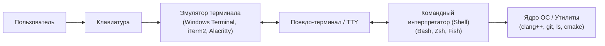

# 💻 Семинар: Работа с консолью и Linux-окружение для C++

> [!info] Метаданные семинара
> **Дата проведения:** `2026-09-07`  
> **Предмет:** [[Основы программирования]] (1 семестр: C / C++)  
> **Ведущий семинара:** Лиунша Арсений Максимович (ментор курса)  
> **Куратор курса:** Хвастунов Александр Павлович  
> **Видеозапись семинара:** [YouTube: Семинар "Работа с консолью" 2026.09.07](https://www.youtube.com/watch?v=GD0xgxxIOqY) *(50 мин 42 сек)*  
> **Канал курса:** [YouTube @hvastunovalexandr](https://www.youtube.com/@hvastunovalexandr)  
> **Официальный портал курса:** [is-itmo-c-26.github.io/lectures](https://is-itmo-c-26.github.io/lectures/)  
> **Теги:** #основы_программирования #c_cpp #linux #bash #терминал #cli #компиляция #clang #1_семестр #итмо

---

## 🧭 Навигация по конспекту
1. [Краткое резюме (TL;DR)](#краткое-резюме-tldr)
2. [Зачем C++ разработчику командная строка?](#1-зачем-c-разработчику-командная-строка)
3. [Терминология: Терминал, Эмулятор, Shell и TTY](#2-терминология-терминал-эмулятор-shell-и-tty)
4. [Устройство командной строки и приглашение Shell](#3-устройство-командной-строки-и-приглашение-shell)
5. [Файловая система Unix и навигация](#4-файловая-система-unix-и-навигация)
6. [Базовые операции с файлами и директориями](#5-базовые-операции-с-файлами-и-директориями)
7. [Просмотр и анализ содержимого файлов](#6-просмотр-и-анализ-содержимого-файлов)
8. [Стандартные потоки ввода-вывода (I/O Streams) и перенаправление](#7-стандартные-потоки-ввода-вывода-io-streams-и-перенаправление)
9. [Конвейеры (Pipes `|`) и фильтрация данных](#8-конвейеры-pipes-и-фильтрация-данных)
10. [Права доступа к файлам (Permissions) и sudo](#9-права-доступа-к-файлам-permissions-и-sudo)
11. [Пакетный менеджер и инструментарий разработчика](#10-пакетный-менеджер-и-инструментарий-разработчика)
12. [Компиляция первой C++ программы в консоли через Clang](#11-компиляция-первой-c-программы-в-консоли-через-clang)
13. [Коды возврата (Exit Status) и переменные окружения](#12-коды-возврата-exit-status-и-переменные-окружения)
14. [Шпаргалка горячих клавиш терминала](#13-шпаргалка-горячих-клавиш-терминала)
15. [Чек-лист для самопроверки](#чек-лист-для-самопроверки)

---

## 📌 Краткое резюме (TL;DR)

1. **Консоль — фундамент сборки и CI/CD:** Графические IDE (VS Code, CLion) лишь вызывают под капотом консольные утилиты (`clang++`, `cmake`, `ninja`, `git`, `lldb`). На серверах, в Docker-контейнерах и в тестирующих системах (CI GitHub Actions) графического интерфейса нет.
2. **Философия Unix:** «Всё есть файл», программы делают одну вещь хорошо и взаимодействуют через текстовые потоки с помощью конвейеров (`pipe` `|`).
3. **Стандартные потоки (дескрипторы):**
   - `0` (`stdin`) — стандартный ввод (по умолчанию клавиатура);
   - `1` (`stdout`) — стандартный вывод (по умолчанию экран);
   - `2` (`stderr`) — стандартный поток ошибок (всегда небуферизованный, для логов и диагностик).
4. **Перенаправления:** `>` (перезапись файла), `>>` (дозапись в конец), `<` (чтение из файла), `2>&1` (объединение `stderr` в `stdout`).
5. **Компиляция C++ напрямую:**
   ```bash
   clang++ -std=c++20 -Wall -Wextra -Werror -pedantic main.cpp -o main
   ./main
   echo $? # Проверка кода возврата (0 = SUCCESS)
   ```
6. **Права доступа:** `rwx` для владельца (`u`), группы (`g`) и остальных (`o`). `chmod 755 script.sh` делает скрипт исполняемым.

---

> [!tip] Междисциплинарная связь с курсом ИСРПО
> Навыки работы в терминале Unix (навигация `cd`/`ls`, перенаправления потоков, конвейеры `|` и компиляция через Clang) напрямую требуются и развиваются в параллельном курсе [[Инструментальные средства разработки ПО]] при работе с распределенной системой контроля версий Git.

## 1. Зачем C++ разработчику командная строка?

На курсе программирования ИТМО отказ от понимания терминала приводит к трудностям при сдаче первых же лабораторных работ:
- **Автоматизированное тестирование:** Все лабораторные работы проверяются ботами и тестами в Linux-контейнерах через GitHub Actions.
- **Инструменты профилирования и отладки:** ASan (AddressSanitizer), UBSan (UndefinedBehaviorSanitizer), Valgrind и GDB запускаются и настраиваются через параметры командной строки.
- **Воспроизводимость сборки:** Системы сборки (CMake, Make, Ninja) генерируют воспроизводимые артефакты независимо от установленной у вас IDE.
- **Производительность:** Автоматизация рутинных задач с помощью bash-скриптов экономит часы времени при выполнении серий тестов.

---

## 2. Терминология: Терминал, Эмулятор, Shell и TTY



- **Терминал (Hardware Terminal):** Исторически физическое устройство (телетайп, телемонитор с клавиатурой, напр. DEC VT100), подключавшееся к мейнфрейму по проводу.
- **Эмулятор терминала (Terminal Emulator):** Графическая программа в современной ОС (Windows Terminal, Alacritty, Kitty, GNOME Terminal), которая рисует окно, перехватывает нажатия клавиш и выводит символы.
- **Shell (Оболочка / Командный интерпретатор):** Программа, которая считывает команды пользователя, интерпретирует их, раскрывает переменные и шаблоны, а затем запускает бинарные файлы. Самые популярные: `bash` (Bourne Again Shell), `zsh`, `fish`.
- **CLI (Command Line Interface):** Текстовый интерфейс взаимодействия с программами в противоположность GUI (Graphical User Interface).

---

## 3. Устройство командной строки и приглашение Shell

При запуске оболочки отображается строка приглашения (**Prompt**):

> [!info] Анатомия строки приглашения (Prompt): `student@itmo-laptop:~/projects/lab1$`
> 
> | Элемент | Пример | Описание и назначение |
> | :--- | :--- | :--- |
> | **Username** | `student` | Имя текущего пользователя в системе |
> | **Hostname** | `itmo-laptop` | Сетевое имя рабочей станции или сервера |
> | **Directory** | `~/projects/lab1` | Текущий каталог (`~` — домашняя директория `/home/student`) |
> | **Prompt char** | `$` | Уровень привилегий: `$` — обычный пользователь, `#` — root (суперпользователь) |

### Синтаксис любой команды
Любая команда в командной строке подчиняется единой структуре:
$$\text{command} \quad [-\text{options}] \quad [--\text{long-options}] \quad [\text{arguments}]$$

```bash
ls -la /home/student/projects
```
- `command` — исполняемый файл или встроенная команда шелла (`cd`, `echo`).
- `options` (флаги) — модифицируют поведение программы:
  - Короткие: начинаются с одного дефиса `-l`, `-a` (можно объединять: `-la`);
  - Длинные: начинаются с двух дефисов `--all`, `--color=always`.
- `arguments` — цели действия (пути к файлам, строки поиска, числа).

---

## 4. Файловая система Unix и навигация

В Linux/Unix в отличие от Windows нет букв дисков (`C:`, `D:`). Все файлы и устройства объединены в **единое иерархическое дерево**, начинающееся с корневой директории `/` (**Root**).

> [!example] Иерархия стандартных директорий Unix (Filesystem Hierarchy Standard)
> - 📁 `/` *(Корень файловой системы)*
>   - 📁 `bin -> usr/bin` — основные бинарные исполняемые файлы (`ls`, `bash`, `cp`)
>   - 📁 `etc/` — общесистемные конфигурационные файлы
>   - 📁 `home/` — домашние каталоги пользователей (`/home/student`)
>     - 📁 `student/`
>       - 📄 `.bashrc` — конфигурационный скрипт оболочки пользователя
>       - 📁 `projects/` — рабочие проекты студента
>   - 📁 `tmp/` — временные файлы (автоматически очищаются при перезагрузке)
>   - 📁 `usr/` — пользовательские программы и компиляторы (`/usr/bin/clang++`)
>   - 📁 `var/` — переменные данные (системные журналы, базы данных, кэши)

### Ключевые обозначения путей
- `/` — корневая директория (в начале пути);
- `~` — домашняя директория текущего пользователя (эквивалентно `/home/<username>`);
- `.` — текущая директория;
- `..` — родительская директория (на уровень выше).

### Команды навигации
| Команда | Описание | Пример |
| :--- | :--- | :--- |
| `pwd` | *Print Working Directory* — напечатать полный абсолютный путь к текущему каталогу | `pwd` $\to$ `/home/student/cpp-course` |
| `cd <path>` | *Change Directory* — перейти в указанный каталог | `cd projects/lab1` |
| `cd` или `cd ~` | Перейти в домашний каталог пользователя | `cd ~` |
| `cd ..` | Подняться на одну директорию выше | `cd ..` |
| `cd ../..` | Подняться на две директории выше | `cd ../..` |
| `cd -` | Вернуться в предыдущую директорию (аналог кнопки Back) | `cd -` |

> [!tip] Автодополнение по клавише Tab
> Никогда не вводите пути руками целиком! Нажимайте `Tab` — терминал сам дополнит имя файла или покажет доступные варианты при двойном нажатии.

---

## 5. Базовые операции с файлами и директориями

### Создание, копирование и перемещение

```bash
# 1. Просмотр файлов в директории
ls           # Простой список файлов
ls -l        # Подробный список: права, владелец, размер, дата изменения
ls -la       # Включая скрытые файлы (начинающиеся с точки, напр. .git, .clang-format)
ls -lh       # Размер файлов в человекочитаемом виде (KB, MB, GB)

# 2. Создание каталогов
mkdir my_project          # Создать папку
mkdir -p src/utils/core   # Создать цепочку вложенных папок (-p = parents)

# 3. Создание пустых файлов
touch main.cpp            # Создает пустой файл или обновляет timestamp существующего

# 4. Копирование
cp main.cpp main_backup.cpp   # Скопировать файл
cp -r src/ src_backup/        # Рекурсивное копирование директории (-r обязателен для папок!)

# 5. Перемещение и переименование
mv main.cpp app.cpp           # Переименовать файл
mv app.cpp src/               # Переместить файл в папку src/

# 6. Удаление (ВНИМАНИЕ: в терминале корзины нет!)
rm test.txt                   # Удалить файл
rm -r old_dir/                # Удалить директорию рекурсивно со всем содержимым
rm -rf build/                 # Принудительное рекурсивное удаление без подтверждений
```

> [!danger] Команда `rm -rf` необратима!
> Файлы, удалённые через `rm`, стираются навсегда. Команда `rm -rf /` способна полностью уничтожить операционную систему. Всегда внимательно проверяйте путь перед нажатием `Enter`!

---

## 6. Просмотр и анализ содержимого файлов

| Команда | Назначение | Пример использования |
| :--- | :--- | :--- |
| `cat <file>` | Вывести весь файл целиком в терминал | `cat main.cpp` |
| `less <file>` | Постраничный просмотр длинных файлов (выход по `q`, поиск по `/pattern`) | `less CMakeLists.txt` |
| `head -n N <file>` | Вывести первые $N$ строк файла | `head -n 20 main.cpp` |
| `tail -n N <file>` | Вывести последние $N$ строк файла | `tail -n 15 build.log` |
| `tail -f <file>` | Следить за дописыванием файла в реальном времени (отлично для логов сборщика) | `tail -f test_run.log` |
| `wc -l <file>` | Подсчитать количество строк (*word count -lines*) | `wc -l main.cpp` |

---

## 7. Стандартные потоки ввода-вывода (I/O Streams) и перенаправление

В Unix у каждого процесса при старте открыты три стандартных файловых дескриптора:

```mermaid
graph TD
  KBD["Клавиатура / Файл"] -->|дескриптор 0 (stdin)| PROC["Ваш C++ процесс (main)"]
  PROC -->|дескриптор 1 (stdout)| DISP["Экран / Терминал / Файл"]
  PROC -->|дескриптор 2 (stderr)| ERR["Логи / Ошибки (stderr)"]
```

В коде на C++ они соответствуют объектам `<iostream>`:
- `stdin` $\longleftrightarrow$ `std::cin`
- `stdout` $\longleftrightarrow$ `std::cout`
- `stderr` $\longleftrightarrow$ `std::cerr` / `std::clog`

### Операторы перенаправления
```bash
# 1. Перенаправление stdout в файл (с перезаписью)
echo "Hello, ITMO!" > output.txt

# 2. Перенаправление stdout в файл (дозапись в конец файла)
echo "Second line" >> output.txt

# 3. Перенаправление stdin (чтение данных из файла в программу)
./solution < test_input.txt

# 4. Перенаправление только ошибок (stderr, дескриптор 2)
clang++ main.cpp 2> errors.log

# 5. Разделение потоков: нормальный вывод в out.txt, ошибки в err.txt
./my_program > out.txt 2> err.txt

# 6. Объединение stdout и stderr в один общий файл:
./my_program > all_output.txt 2>&1
# или в современном синтаксисе bash:
./my_program &> all_output.txt

# 7. Заглушить вывод (отправить в чёрную дыру /dev/null):
./noisy_tool > /dev/null 2>&1
```

---

## 8. Конвейеры (Pipes `|`) и фильтрация данных

Конвейер (**Pipe**, символ `|`) связывает поток `stdout` первой программы напрямую с потоком `stdin` второй программы **без создания промежуточных файлов на диске**:

$$\text{Программа 1} \xrightarrow{\quad\text{stdout}\quad} \left[ \quad | \quad \right] \xrightarrow{\quad\text{stdin}\quad} \text{Программа 2}$$

### Мощные практические примеры
```bash
# Поиск подстроки в выводе (grep)
ls -la | grep "\.cpp$"

# Подсчет количества строк исходного кода в проекте
cat main.cpp utils.cpp | wc -l

# Поиск всех ошибок компилятора clang
clang++ -Wall main.cpp 2>&1 | grep "error:"

# Сортировка уникальных записей
cat students.txt | sort | uniq -c
```

---

## 9. Права доступа к файлам (Permissions) и sudo

При вызове `ls -l` первая колонка показывает права доступа:
> [!info] Анатомия строки прав доступа: `-rwxr-xr--`
> 
> | Позиция | Значение | Класс субъекта | Расшифровка прав | Восьмеричный вес |
> | :---: | :---: | :--- | :--- | :---: |
> | `0` | `-` | **Тип объекта** | Обычный файл (`-`), каталог (`d`), ссылка (`l`) | — |
> | `1..3` | `rwx` | **User (u)** / Владелец | Чтение ($4$) + Запись ($2$) + Выполнение ($1$) | **$7$** ($4+2+1$) |
> | `4..6` | `r-x` | **Group (g)** / Группа | Чтение ($4$) + Выполнение ($1$) | **$5$** ($4+0+1$) |
> | `7..9` | `r--` | **Others (o)** / Остальные | Только чтение ($4$) | **$4$** ($4+0+0$) |

- `r` (*read*) — чтение (4);
- `w` (*write*) — запись / удаление (2);
- `x` (*execute*) — исполнение (1). Для папок `x` означает право зайти внутрь (`cd`).

### Назначение прав через `chmod`
```bash
# Символьный режим:
chmod +x run_tests.sh        # Добавить право на выполнение всем
chmod u+x,go-w script.sh     # Владельцу разрешить запуск, группе и другим запретить запись

# Числовой (восьмеричный) режим:
chmod 755 main               # rwxr-xr-x (владелец: 4+2+1=7; группа: 4+0+1=5; остальные: 5)
chmod 644 README.md          # rw-r--r-- (стандарт для обычных текстовых файлов)
```

### Привилегии администратора (`sudo`)
Команда `sudo` (*Superuser Do*) позволяет выполнить разовую операцию с правами суперпользователя `root`:
```bash
sudo apt update              # Требует прав root
```

---

## 10. Пакетный менеджер и инструментарий разработчика

В Ubuntu / Debian базовые инструменты для C++ ставятся через менеджер пакетов `apt`:

```bash
# Обновление индекса доступных пакетов
sudo apt update

# Установка необходимого стека для курса ITMO C++
sudo apt install -y \
    build-essential \
    clang \
    clang-format \
    clang-tidy \
    cmake \
    ninja-build \
    git \
    gdb \
    lldb \
    valgrind
```

Проверка версий:
```bash
clang++ --version
cmake --version
git --version
```

---

## 11. Компиляция первой C++ программы в консоли через Clang

Создадим файл `main.cpp`:
```cpp
#include <iostream>

int main(int argc, char* argv[]) {
    std::cout << "Hello from ITMO C++ Course!\n";
    std::cout << "Number of arguments: " << argc << "\n";
    for (int i = 0; i < argc; ++i) {
        std::cout << "  argv[" << i << "] = " << argv[i] << "\n";
    }
    return 0;
}
```

### Запуск компилятора со строгими флагами курса
```bash
clang++ -std=c++20 -Wall -Wextra -Wpedantic -Werror main.cpp -o main
```
- `-std=c++20` — стандарт C++20;
- `-Wall -Wextra` — включение максимального количества предупреждений компилятора;
- `-Wpedantic` — требование строгого соответствия стандарту ISO C++;
- `-Werror` — превращать предупреждения в фатальные ошибки (золотой стандарт курса!);
- `-o main` — имя выходного бинарного файла (иначе по умолчанию будет `a.out`).

### Запуск с аргументами:
```bash
./main --debug --port=8080 input.txt
```
Вывод:
```console
Hello from ITMO C++ Course!
Number of arguments: 4
argv[0] = ./main
argv[1] = --debug
argv[2] = --port=8080
argv[3] = input.txt
```

---

## 12. Коды возврата (Exit Status) и переменные окружения

Каждая программа при завершении возвращает операционной системе целое число от 0 до 255:
- `0` — успешное завершение (**Success**);
- Не `0` (1, 2, 127, 139 и т.д.) — ошибка (**Error**).

В Shell код возврата последней команды хранится в специальной переменной `$?`:
```bash
./main
echo $?
# Выведет: 0

ls non_existing_file
echo $?
# Выведет: 2 (ошибка отсутствия файла)
```

### Условные операторы в Shell: `&&` и `||`
- `cmd1 && cmd2` — выполнить `cmd2` **только если** `cmd1` завершилась успешно (`exit code == 0`);
- `cmd1 || cmd2` — выполнить `cmd2` **только если** `cmd1` упала с ошибкой (`exit code != 0`).

```bash
# Сборка и запуск только в случае успешной компиляции:
clang++ -std=c++20 main.cpp -o main && ./main
```

---

## 13. Шпаргалка горячих клавиш терминала

| Сочетание клавиш | Действие |
| :--- | :--- |
| `Ctrl + C` | Послать сигнал `SIGINT` (прервать выполнение текущей программы) |
| `Ctrl + D` | Послать `EOF` (End Of File) / закрыть текущий терминал |
| `Ctrl + L` | Очистить экран (аналог команды `clear`) |
| `Ctrl + R` | Обратный интерактивный поиск по истории команд |
| `Ctrl + A` | Переместить курсор в начало строки |
| `Ctrl + E` | Переместить курсор в конец строки |
| `Ctrl + U` | Стереть строку от курсора до начала |
| `Ctrl + K` | Стереть строку от курсора до конца |
| `Tab` / `Tab Tab` | Автодополнение имени команды / файла |
| `Стрелки Вверх / Вниз` | Навигация по истории команд |

---

## ❓ Чек-лист для самопроверки

- [ ] Могу объяснить разницу между эмулятором терминала, TTY и оболочкой (Shell).
- [ ] Знаю, что означают символы `.`, `..`, `~` и `/`.
- [ ] Понимаю, чем отличается относительный путь от абсолютного.
- [ ] Умею создавать вложенные папки командой `mkdir -p`.
- [ ] Понимаю назначение потоков `stdin` (0), `stdout` (1), `stderr` (2).
- [ ] Знаю, как перенаправить вывод в файл (`>`), дописать в конец (`>>`) и прочитать из файла (`<`).
- [ ] Могу объяснить, как объединить `stderr` и `stdout` (`2>&1`).
- [ ] Умею связывать программы в конвейер через `|` (pipe).
- [ ] Понимаю структуру прав доступа `rwxrwxrwx` и умею делать файл исполняемым (`chmod +x`).
- [ ] Умею вручную скомпилировать файл C++ через `clang++` со флагами `-std=c++20 -Wall -Wextra -Werror`.
- [ ] Знаю, как проверить код возврата программы через `echo $?`.
- [ ] Умею собирать и запускать программу одной строкой через цепочку `&&`.
