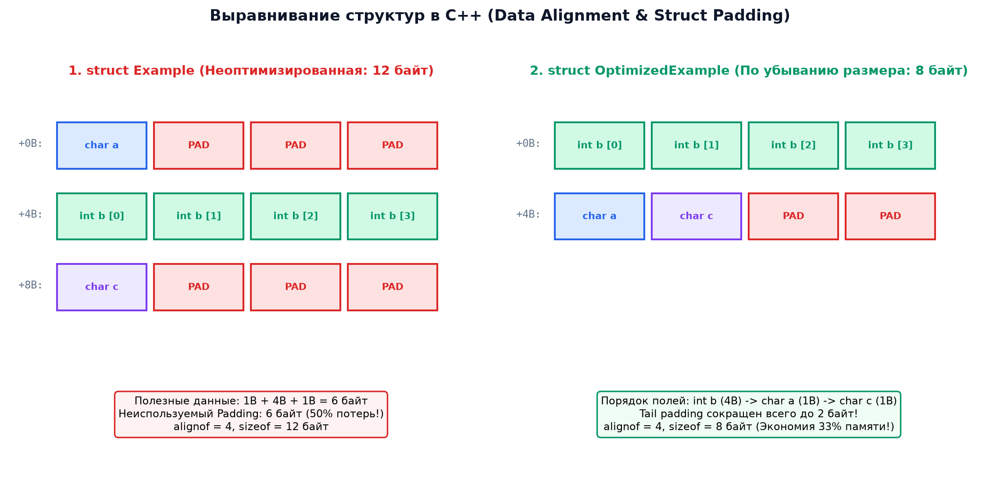

# 📌 Лекция 3: Структуры, объединения, выравнивание в памяти (padding) и побитовые поля

> [!abstract] О лекции
> - **Дисциплина:** [[Основы программирования]] (1 семестр)
> - **Преподаватели:** Александр Хвастунов / Александр Фадеев
> - **Ключевые концепции:** Пользовательские типы данных `struct`, синтаксис определения и доступа (`.` и `->`), выравнивание данных (Data Alignment) и требование кратности адресов, дополнение структуры байтами (Padding), оператор `alignof` и спецификатор `alignas`, объединения `union` и их отличие от структур, побитовые поля (Bit Fields).

---

## 1. Пользовательские типы: Структуры (`struct`)

Структура — это составной тип данных, группирующий под одним именем несколько переменных (называемых **полями** или **членами структуры**), возможно, различных типов:

```cpp
struct Student {
    uint32_t id;
    char name[32];
    double gpa;
    bool is_active;
};
```

### Инициализация структур
1. **Агрегатная инициализация (Aggregate Initialization):**
   ```cpp
   Student s1 = {101, "Ivan Petrov", 4.85, true};
   ```
2. **Инициализация с назначенными именами (Designated Initializers, C++20):**
   ```cpp
   Student s2 = {
       .id = 102,
       .gpa = 5.0,
       .is_active = true
   }; // Поле name заполнится нулями по умолчанию
   ```

### Доступ к полям
- Через lvalue объекта: оператор **точка (`.`)**:
  ```cpp
  s1.gpa = 4.90;
  ```
- Через указатель на структуру: оператор **стрелка (`->`)**:
  ```cpp
  Student* ptr = &s1;
  ptr->gpa = 4.95; // Эквивалентно (*ptr).gpa = 4.95
  ```

---

## 2. Выравнивание данных (Data Alignment) и Padding

Центральный процессор (CPU) читает память не по отдельным байтам, а машинными словами (словами по 4 или 8 байт). Обращение к данным по невыровненным адресам на x86/x64 приводит к существенной деградации производительности, а на архитектурах ARM или MIPS может вызывать аппаратное прерывание `Bus Error`.

### Правила выравнивания
> [!important] Основное правило выравнивания
> Переменная типа $T$ с естественным выравниванием $A = \operatorname{alignof}(T)$ должна размещаться по адресу, кратному $A$:
> $$	ext{Address} \equiv 0 \pmod A$$
> Для базовых типов естественное выравнивание обычно равно их размеру:
> - `char`: 1 байт
> - `short`: 2 байта
> - `int`, `float`: 4 байта
> - `double`, указатели (`T*`), `uint64_t`: 8 байт

### Дополнение байтами (Padding) в структурах
Чтобы гарантировать правильное выравнивание каждого члена, компилятор вынужден вставлять между полями пустые неиспользуемые байты (**padding**):

Рассмотрим пример:
```cpp
struct Example {
    char a;     // 1 байт
                // 3 байта padding (для выравнивания b по адресу, кратному 4)
    int b;      // 4 байта
    char c;     // 1 байт
                // 3 байта tail padding (для выравнивания всей структуры по максимальному alignof = 4)
};
```
$$\operatorname{sizeof}(	ext{Example}) = 1 + 3 + 4 + 1 + 3 = 12 	ext{ байт} \quad (	ext{хотя полезных данных всего } 1+4+1=6 	ext{ байт!})$$



### Оптимизация порядка полей структуры
Размещая поля в порядке **убывания их размера**, можно минимизировать padding:

```cpp
struct OptimizedExample {
    int b;      // 4 байта (offset 0..3)
    char a;     // 1 байт (offset 4)
    char c;     // 1 байт (offset 5)
                // 2 байта tail padding
};
// sizeof(OptimizedExample) = 8 байт (вместо 12!)
```

### Ключевые слова `alignof` и `alignas`
- `alignof(T)` — возвращает требуемое выравнивание типа $T$ в байтах:
  ```cpp
  static_assert(alignof(double) == 8);
  ```
- `alignas(N)` — принудительно задает выравнивание переменной или структуры:
  ```cpp
  struct alignas(64) CacheAlignedData {
      int x;
  }; // Размер будет увеличен до 64 байт под размер кэш-линии CPU
  ```

---

## 3. Объединения (`union`)

`union` — это специальный тип данных, все члены которого располагаются по **одному и тому же адресу в памяти**:
$$\&u.	ext{field1} == \&u.	ext{field2} == \&u.	ext{field3}$$

Размер объединения равен размеру его наибольшего поля (с учетом требований выравнивания):
$$\operatorname{sizeof}(	ext{union}) = \max_{i} \operatorname{sizeof}(field_i) + 	ext{tail padding}$$

```cpp
union DataPacket {
    uint32_t raw_value;
    uint8_t  bytes[4];
    float    float_val;
};

DataPacket p;
p.raw_value = 0xAABBCCDD;
// Доступ к p.bytes[0] прочитает младший байт (0xDD на Little-Endian)
```

> [!warning] Type Punning и Undefined Behavior
> В стандарте C++ чтение поля объединения, отличного от того, в которое производилась последняя запись, формально является **Undefined Behavior** (в отличие от стандарта языка C99).
> В современном C++20 для безопасного переинтерпретирования байтов памяти используется функция `std::bit_cast<To>(from)` из заголовка `<bit>`.

---

## 4. Побитовые поля (Bit Fields)

Побитовые поля позволяют упаковывать переменные с точностью до отдельных битов внутри целочисленных полей структуры:

```cpp
struct PacketHeader {
    uint16_t version     : 4;  // 4 бита: [0..15]
    uint16_t priority    : 2;  // 2 бита: [0..3]
    uint16_t is_ack      : 1;  // 1 бит: [0..1]
    uint16_t is_syn      : 1;  // 1 бит: [0..1]
    uint16_t packet_len  : 8;  // 8 бит: [0..255]
};
// Итого: 4 + 2 + 1 + 1 + 8 = 16 бит = 2 байта!
static_assert(sizeof(PacketHeader) == 2);
```

### Ограничения побитовых полей:
1. К побитовому полю **нельзя применить оператор взятия адреса `&`** (так как адресация в архитектуре x86/ARM побайтовая, а не побитовая).
2. Порядок размещения битов внутри байта (от младшего к старшему или наоборот) зависит от компилятора и платформы (Implementation-Defined).

---

## 5. 🔬 Кэш-линии процессора, False Sharing и выравнивание

### Механика 64-байтных кэш-линий
Процессор x86_64 загружает память блоками по 64 байта. Невыровненный доступ (Unaligned Access), пересекающий границу кэш-линии, требует двух циклов шины памяти.

---

### Ложное разделение (False Sharing) в многопоточности
Когда две независимые переменные разных потоков попадают в одну 64-байтную кэш-линию, запись одним ядром инвалидирует кэш второго ядра по протоколу MESI, замедляя программу в 50 раз.  
**Решение:** использование директивы выравнивания:
```cpp
struct alignas(std::hardware_destructive_interference_size) ThreadSafeCounter {
    uint64_t val;
};
```

---

## 🚀 Фундаментальная связь с будущими дисциплинами и технологиями (ИТМО Curriculum)

1. **Многопоточное программирование (Сем 6):**
   - Lock-Free кольцевые буферы (Disruptor LMAX) требуют изоляции указателей головы и хвоста очереди в отдельных кэш-линиях.
2. **Сетевые протоколы (Сем 5):**
   - Бинарные заголовки TCP/IP требуют явной упаковки `#pragma pack(push, 1)` для исключения padding-байтов при сериализации.

---

## 🔗 Связанные материалы
- [[Основы программирования]] — страница дисциплины
- [[02. Лекция - Указатели, массивы, арифметика указателей, строки и константность (2026-09-18)]]
- [[04. Лекция - Управление памятью, стек и куча, malloc, free, new и delete (2026-10-02)]]
