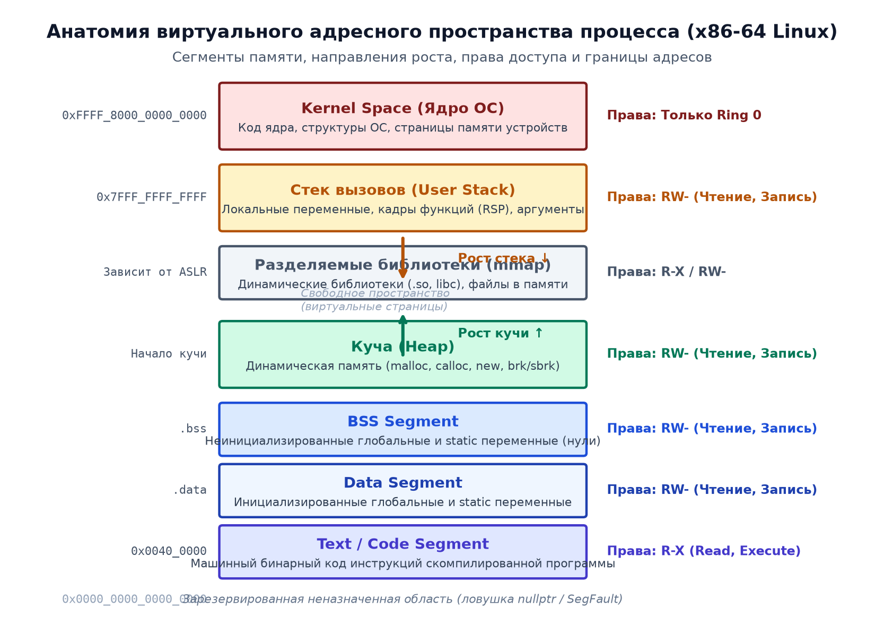

# 📌 Лекция 4: Управление памятью, сегменты, стек и куча, динамическое выделение malloc/free и new/delete

> [!abstract] О лекции
> - **Дисциплина:** [[Основы программирования]] (1 семестр)
> - **Преподаватели:** Александр Хвастунов / Александр Фадеев
> - **Ключевые концепции:** Виртуальное адресное пространство процесса, сегменты памяти (Text/Code, Data, BSS, Stack, Heap), кадр стека (Stack Frame), переполнение стека (Stack Overflow), динамическая память (куча), функции Си `malloc`, `calloc`, `realloc`, `free`, операторы C++ `new`, `delete`, `new[]`, `delete[]`, утечки памяти (Memory Leaks), двойное освобождение (Double Free).

---

## 1. Модель памяти процесса: Сегменты

Каждый запущенный процесс операционной системы функционирует в собственном изолированном виртуальном адресном пространстве (обычно объемом до $128 	ext{ ТБ}$ в 64-битном режиме x86-64). Пространство делится на несколько функциональных сегментов:



| Сегмент | Содержимое | Время жизни | Права доступа |
| :--- | :--- | :--- | :--- |
| **Text (Code)** | Машинный бинарный код программы | Все время работы процесса | `R-X` (Read, Execute) |
| **Data** | Инициализированные глобальные и статические переменные | Все время работы процесса | `RW-` (Read, Write) |
| **BSS** | Неинициализированные глобальные/static переменные (заполняются нулями при старте) | Все время работы процесса | `RW-` (Read, Write) |
| **Heap (Куча)** | Динамически выделяемая память (`malloc`, `new`) | До явного вызова `free`/`delete` | `RW-` (Read, Write) |
| **Stack (Стек)** | Локальные переменные, аргументы функций, адреса возврата | До выхода из блока `{}` / функции | `RW-` (Read, Write) |

---

## 2. Стек вызовов (Call Stack)

Стек — это сверхбыстрая область памяти, управляемая аппаратным указателем стека (регистр `RSP` в x86-64).
Выделение памяти на стеке заключается в простом сдвиге указателя:
$$	ext{sub rsp, N}$$
Освобождение памяти происходит автоматически при завершении функции путем возвращения указателя:
$$	ext{add rsp, N}$$

### Кадр стека (Stack Frame)
При каждом вызове функции на стеке создается новый фрейм, содержащий:
1. Аргументы функции (если они не поместились в регистры).
2. Адрес возврата (Instruction Pointer `RIP`), куда управление должно вернуться после `ret`.
3. Сохраненный адрес предыдущего базового регистра `RBP`.
4. Локальные переменные функции.

> [!danger] Переполнение стека (Stack Overflow)
> Размер стека по умолчанию ограничен ОС (обычно 1–8 МБ).
> Причины переполнения стека:
> 1. Бесконечная или слишком глубокая рекурсия (без базового случая).
> 2. Выделение огромных локальных массивов:
>    ```cpp
>    void bad() {
>        int huge_array[10'000'000]; // 40 МБ на стеке -> мгновенный Crash (Stack Overflow)!
>    }
>    ```

---

## 3. Куча (Heap) и динамическая память

Куча — это область памяти, предназначенная для объектов, размер которых неизвестен на этапе компиляции или время жизни которых должно превышать время жизни функции, их создавшей.

### Выделение памяти в стиле Си (`<cstdlib>`)
1. **`malloc(size)`** — выделяет непрерывный блок памяти заданного размера в байтах. Память **не инициализируется** (содержит мусор):
   ```cpp
   int* arr = (int*)malloc(n * sizeof(int));
   if (arr == nullptr) { /* Обработка ошибки нехватки памяти */ }
   ```
2. **`calloc(count, size)`** — выделяет память и **обнуляет** все байты:
   ```cpp
   int* zeros = (int*)calloc(n, sizeof(int));
   ```
3. **`realloc(ptr, new_size)`** — изменяет размер ранее выделенного блока памяти. При необходимости переносит данные в новое место и освобождает старый блок:
   ```cpp
   arr = (int*)realloc(arr, new_n * sizeof(int));
   ```
4. **`free(ptr)`** — возвращает блок памяти операционной системе:
   ```cpp
   free(arr);
   arr = nullptr; // Защита от dangling pointer
   ```

---

## 4. Операторы C++: `new` и `delete`

В C++ вместо функций Си используются типобезопасные операторы `new` и `delete`:

| Критерий | `malloc` / `free` | `new` / `delete` |
| :--- | :--- | :--- |
| **Природа** | Библиотечные функции Си | Встроенные операторы языка C++ |
| **Конструкторы/деструкторы** | **Не вызывают** конструкторы и деструкторы | **Обязательно вызывают** конструкторы при выделении и деструкторы при удалении |
| **Вычисление размера** | Вручную в байтах: `n * sizeof(T)` | Автоматически компилятором: `new T[n]` |
| **Возвращаемый тип** | `void*` (требует приведения типов) | Строго типизированный `T*` |
| **Реакция на ошибку** | Возвращает `nullptr` | Выбрасывает исключение `std::bad_alloc` |

### Синтаксис: одиночные объекты vs массивы
```cpp
// Одиночный объект:
int* p = new int(42); // Выделение памяти + инициализация значением 42
delete p;             // Вызов деструктора + освобождение памяти

// Массив объектов:
int* arr = new int[100]; // Выделение памяти под 100 элементов
delete[] arr;            // КРИТИЧНО: удаление через delete[], а не delete!
```

> [!danger] Фатальная ошибка парности: `new[]` и `delete`
> Вызов `delete ptr` вместо `delete[] ptr` для массива приводит к **Undefined Behavior**: деструктор вызовется только для первого элемента, а метаинформация менеджера кучи о размере блока будет повреждена.

---

## 5. Типичные ошибки работы с памятью

1. **Утечка памяти (Memory Leak):**
   Потеря указателя на выделенную область в куче без ее предварительного освобождения:
   ```cpp
   void leak() {
       int* p = new int[1000];
       // Забыли delete[] p; при выходе из функции указатель p уничтожается, память остается занятой!
   }
   ```
2. **Двойное освобождение (Double Free):**
   Попытка освободить один и тот же адрес дважды:
   ```cpp
   delete p;
   delete p; // Аварийная остановка менеджера памяти (Aborted / Heap corruption)
   ```
3. **Использование после освобождения (Use-After-Free):**
   Обращение к памяти через указатель после вызова `delete`:
   ```cpp
   delete p;
   *p = 10; // UB: память уже может быть отдана другому объекту
   ```

---

## 6. 🔬 Архитектура виртуальной памяти, кастомные аллокаторы и AddressSanitizer

### Виртуальная страничная память и регистр CR3
Процесс оперирует виртуальным адресным пространством.
1. Память разбита на **страницы (Pages)** по 4 Кб (или Huge Pages 2 Мб).
2. Трансляция виртуального адреса в физический выполняется аппаратно блоком MMU через 4-уровневые таблицы страниц, базовый адрес которых хранится в регистре `CR3`.
3. Для кэширования трансляций используется аппаратный буфер **TLB (Translation Lookaside Buffer)**.

---

### Архитектура кастомных аллокаторов памяти

| Тип аллокатора | Принцип работы | Сложность `alloc` | Сложность `free` | Применение |
| :--- | :--- | :---: | :---: | :--- |
| **Arena (Linear)** | Инкремент указателя в фиксированном буфере | $\Theta(1)$ | $\Theta(1)$ (пакетом) | Запросы веб-сервера, рендеринг кадра |
| **Pool (Fixed-Size)** | Связный список свободных слотов одного размера | $\Theta(1)$ | $\Theta(1)$ | Узлы деревьев, сетевые пакеты |
| **Buddy Allocator** | Деление блоков на степени двойки слиянием с XOR | $O(\log N)$ | $O(\log N)$ | Страничный аллокатор ядра Linux |

---

### Механика детекции утечек: AddressSanitizer (ASan)
AddressSanitizer использует технику **теневой памяти (Shadow Memory)**:
1. Каждые 8 байт виртуальной памяти процесса отображаются в 1 байт тени по формуле: `shadow_addr = (addr >> 3) + 0x7fff8000`.
2. Значение $0$ означает доступность всех 8 байт. Значения $< 0$ кодируют красные зоны (`0xFD` — Heap Use-After-Free, `0xFA` — Heap Buffer Overflow).

---

## 🚀 Фундаментальная связь с будущими дисциплинами и технологиями (ИТМО Curriculum)

1. **Операционные системы и Разработка ядра (Сем 4, 6):**
   - Диспетчер виртуальной памяти ядра Linux использует аллокатор страниц Buddy Allocator и аллокатор мелких объектов Slab Allocator (кэши `inode`, `dentry`).
2. **Языки со сборкой мусора (Java / Go) (Сем 3, 4, 5):**
   - Понимание ручного управления памятью необходимо для профилирования GC (ZGC, Go GC) и минимизации Stop-The-World пауз в High-Load микросервисах.

---

## 🔗 Связанные материалы
- [[Основы программирования]] — страница дисциплины
- [[02. Лекция - Указатели, массивы, арифметика указателей, строки и константность (2026-09-18)]]
- [[03. Лекция - Структуры, объединения, выравнивание в памяти (padding) и побитовые поля (2026-09-25)]]
- [[Экзаменационный трекер и банк тем I семестра]]
