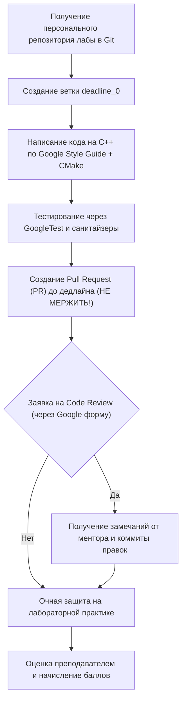
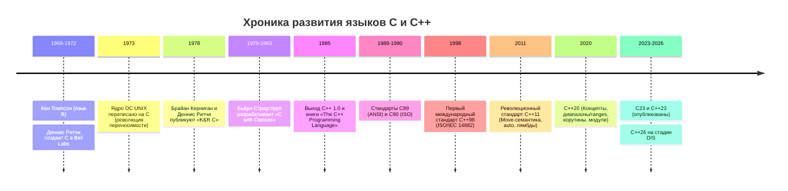
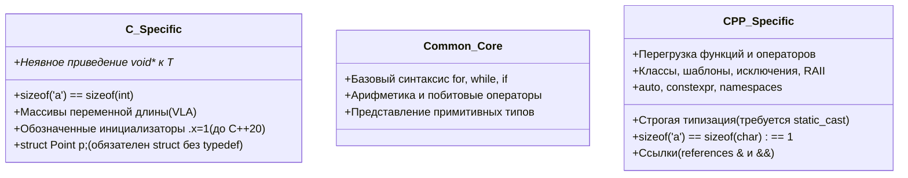
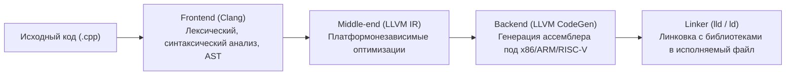

# 📝 Вводная лекция: организация курса, история и стандарты языков C и C++

> [!info] Метаданные курса
> **Дата лекции:** `2026-09-02`  
> **Предмет:** [[Программирование]] (Основы программирования на C/C++, 1 семестр)  
> **Преподаватели:** Хвастунов Александр Павлович, Фадеев Сергей Викторович  
> **Команда курса:** ~30 человек (лекторы, семинаристы, практики, менторы)  
> **Официальный портал курса:** [is-itmo-c-26.github.io/lectures](https://is-itmo-c-26.github.io/lectures/)  
> **Репозиторий материалов:** [github.com/is-itmo-c-26/lectures](https://github.com/is-itmo-c-26/lectures)  
> **Теги:** #программирование #c_cpp #стандарты #история #cmake #git #1_семестр #итмо

---

## 🧭 Навигация по конспекту
1. [Краткое резюме (TL;DR)](#-краткое-резюме-tldr)
2. [Организация учебного процесса и балльно-рейтинговая система (БРС)](#1-организация-учебного-процесса-и-брс)
   - [Формула оценки (100 баллов)](#11-формула-оценки-100-баллов)
   - [Регламент выполнения и сдачи лабораторных работ](#12-регламент-выполнения-и-сдачи-лабораторных-работ)
   - [Мягкие дедлайны (Soft Deadlines) и коэффициенты](#13-мягкие-дедлайны-soft-deadlines-и-коэффициенты)
   - [Семинары и консультации](#14-семинары-и-консультации)
3. [Эволюция и история языков C и C++](#2-эволюция-и-история-языков-c-и-c)
   - [От Bell Labs и UNIX к языку C (1969–1978)](#21-от-bell-labs-и-unix-к-языку-c-19691978)
   - [Зарождение C++: Бьёрн Страуструп и «C with Classes» (1979–1985)](#22-зарождение-c-бьёрн-страуструп-и-c-with-classes-19791985)
   - [Хронология стандартизации C (C89 $\to$ C23)](#23-хронология-стандартизации-c-c89-to-c23)
   - [Хронология стандартизации C++ (C++98 $\to$ C++26)](#24-хронология-стандартизации-c-c98-to-c26)
4. [Философия и фундаментальные различия C и C++](#3-философия-и-фундаментальные-различия-c-и-c)
   - [Язык C: минимализм и максимальный контроль](#31-язык-c-минимализм-и-максимальный-контроль)
   - [Язык C++: абстракции без накладных расходов](#32-язык-c-абстракции-без-накладных-расходов-zero-overhead)
   - [Почему C — не строгое подмножество C++](#33-почему-современный-c--не-строгое-подмножество-c)
5. [Области промышленного применения C и C++](#4-области-промышленного-применения-c-и-c)
6. [Инструментарий и культура разработки](#5-инструментарий-и-культура-разработки)
   - [Компиляторы и инструментальные цепочки (Clang, GCC, MSVC)](#51-компиляторы-и-инструментальные-цепочки)
   - [Система автоматизации сборки CMake](#52-система-автоматизации-сборки-cmake)
   - [Среда разработки и расширения (VS Code)](#53-среда-разработки-и-расширения)
   - [Качество кода, санитайзеры и Google C++ Style Guide](#54-качество-кода-санитайзеры-и-google-c-style-guide)
7. [Разбор первой программы: «Hello, world!»](#6-разбор-первой-программы-hello-world)
8. [Рекомендуемая литература и ресурсы](#7-рекомендуемая-литература-и-ресурсы)
9. [Полезные ссылки, каналы и формы курса](#8-полезные-ссылки-каналы-и-формы-курса)
10. [Вопросы для самопроверки к зачету](#9-вопросы-для-самопроверки-к-зачету)

---

## 📌 Краткое резюме (TL;DR)

1. **Цель курса:** Освоить профессиональную «культуру программирования», научиться низкоуровневому контролю ресурсов и модели памяти, процедурному программированию, ООП и проектированию на современных стандартах (C++20/C++23).
2. **Аттестация:** Максимум — 100 баллов (порог зачета — 60 баллов). Лабораторные дают 60 баллов (5 работ), Live Coding — 10 баллов, дифференцированный зачет — 30 баллов.
3. **Строгий пайплайн сдачи:** Для каждого студента генерируется отдельный Git-репозиторий на каждую лабу. Сдача идет строго через Pull Request в ветку `deadline_N` (не мержить!). Доступно предварительное Code Review от менторов через Google Forms.
4. **Сроки имеют значение:** Soft deadline наступает через 2 недели после выдачи. Каждая неделя просрочки срезает коэффициент: $1.0 \to 0.8 \to 0.65 \to 0.5$.
5. **C и C++ — разные языки:** C++ произошел от C, но развивается независимо. C++ реализует принцип *Zero-Overhead Abstractions* («вы не платите за то, что не используете»), в то время как C сохраняет компактность и прозрачность ассемблера. Современный C не является строгим подмножеством C++.
6. **Основной тулчейн:** Компилятор **Clang** (LLVM), сборщик **CMake**, редактор **VS Code**, фреймворк тестирования **GoogleTest**, проверка стиля **Google C++ Style Guide** (`clang-format`), санитайзеры памяти и поведения (**ASan**, **UBSan**).

---

## 1. Организация учебного процесса и БРС

### 1.1. Формула оценки (100 баллов)

Аттестация по курсу построена на непрерывной практической работе студента в течение семестра. Зачет проводится в форме дифференцированного зачета (с выставлением оценки в ведомость):

$$\text{Итоговый балл} = \text{Лабораторные (до 60)} + \text{Live Coding (до 10)} + \text{ДифЗачет (до 30)} + \text{Bonus}$$

> [!important] Пороговые значения
> - **Минимум для получения зачета:** `60 баллов`.
> - **Максимум по базовой программе:** `100 баллов`.
> - Дифференцированный зачет проходит в **декабре** (1 семестр) и **июне** (2 семестр).
> - Все задачи, материалы лекций, требования к лабам и вопросы к зачету открыто публикуются в Git.

### 1.2. Регламент выполнения и сдачи лабораторных работ

В течение семестра выдается **5 лабораторных работ**. Выполнение и проверка максимально приближены к коммерческой разработке в IT-компаниях:



1. **Персональные репозитории:** Для каждой лабораторной работы система курса автоматически генерирует индивидуальный Git-репозиторий для каждого студента.
2. **Ветвление:** Каждая попытка/дедлайн привязывается к ветке вида `deadline_N` (начиная с `deadline_0` для первого дедлайна).
3. **Сдача через Pull Request:** Студент пушит решение в свою ветку и открывает Pull Request в ветку `main`. **Мержить PR самостоятельно строго запрещено!**
4. **Code Review:** До очной сдачи можно отправить заявку через специальную форму курса. Менторы просмотрят код, укажут на архитектурные ошибки, утечки ресурсов и нарушения кодстайла.
5. **Очная защита:** Окончательное начисление баллов происходит на практических занятиях при личном собеседовании с преподавателем по написанному коду.

> [!danger] Антиплагиат и правила честной игры
> Все сдаваемые работы автоматически проходят проверку через систему анализа сходства кода на предмет плагиата и использования генеративных ИИ без понимания. Студент обязан уметь подробно объяснить каждую строчку и архитектурное решение своего кода.

### 1.3. Мягкие дедлайны (Soft Deadlines) и коэффициенты

На каждую лабораторную работу устанавливается **мягкий дедлайн (Soft Deadline)** — обычно **2 недели** с момента выдачи задания.

Если студент не успевает сдать работу к первому дедлайну, баллы умножаются на понижающий коэффициент в зависимости от недели сдачи:

| Срок сдачи лабораторной | Ветка в Git | Коэффициент баллов | Процент от максимума |
| :--- | :---: | :---: | :---: |
| **До 2 недель (в срок)** | `deadline_0` | **$1.0$** | $100\%$ |
| **Просрочка на 1 неделю** | `deadline_1` | **$0.8$** | $80\%$ |
| **Просрочка на 2 недели** | `deadline_2` | **$0.65$** | $65\%$ |
| **Просрочка на 3+ недели** | `deadline_3+`| **$0.5$** | $50\%$ |

### 1.4. Семинары и консультации

- **Семинары:** Проводятся регулярно в дополнение к лекциям. Посещение необязательное, но на них подробно разбираются тонкости языка, типовые задачи лабораторных и вопросы проектирования.
- **Консультации:** Студенты могут запрашивать индивидуальные или групповые консультации с менторами через Google-форму записи.

---

## 2. Эволюция и история языков C и C++



### 2.1. От Bell Labs и UNIX к языку C (1969–1978)

- **1969–1972 гг.:** В стенах Bell Labs Кен Томпсон разработал язык **B** (упрощенный потомок языка BCPL Мартина Ричардса) для первой версии операционной системы UNIX на компьютере PDP-7. Язык B был бестиповым (word-oriented).
- **1972–1973 гг.:** Деннис Ритчи (Dennis Ritchie) существенно переработал язык B, добавив систему типов (включая структуры данных и явные типы для символов и чисел), создав язык **C**.
- **Лето 1973 г.:** Произошло историческое событие: **ядро UNIX было полностью переписано на языке C**. До этого практически все операционные системы писались исключительно на ассемблере под конкретный процессор. Переписывание ядра на C обеспечило беспрецедентную переносимость (portability) UNIX на различные аппаратные платформы.
- **1978 г.:** Брайан Керниган и Деннис Ритчи выпустили легендарную книгу *«The C Programming Language»*, закрепив неофициальный стандарт **K&R C**.

### 2.2. Зарождение C++: Бьёрн Страуструп и «C with Classes» (1979–1985)

- **1979 г.:** Датский ученый Бьёрн Страуструп (Bjarne Stroustrup) в Bell Labs исследовал распределенные системы и моделирование очередей. Язык Simula-67 обладал великолепными средствами структурирования программ (классы, корутины), но был слишком медленным. Язык BCPL и C были быстрыми, но не имели высокоуровневых абстракций.
- **1979–1983 гг.:** Страуструп начал разработку надстройки над C, названной **«C with Classes»** (C с классами), добавляя классы, наследование, строгий контроль типов аргументов функций и встраиваемые (inline) функции.
- **1983 г.:** Рик Масситти предложил название **C++** (оператор инкремента `++` в C означает шаг вперед, символизируя эволюционное развитие).
- **1985 г.:** Состоялся первый коммерческий релиз C++ и вышла классическая монография Бьёрна Страуструпа *«The C++ Programming Language»*.

### 2.3. Хронология стандартизации C (C89 $\to$ C23)

1. **C89 / C90 (ANSI X3.159-1989 / ISO/IEC 9899:1990):** Первый официальный стандарт. Введены прототипы функций, квалификаторы `const` и `volatile`, заголовочные файлы стандартной библиотеки.
2. **C99 (ISO/IEC 9899:1999):** Масштабное обновление: однострочные комментарии `//`, типы точной ширины в `<stdint.h>`, логический тип `<stdbool.h>`, тип `long long`, массивы переменной длины (VLA — Variable Length Arrays), функции `inline`.
3. **C11 (ISO/IEC 9899:2011):** Поддержка многопоточности (`<threads.h>`), атомарные операции (`<stdatomic.h>`), выравнивание (`_Alignas`), анонимные структуры. VLA переведены в статус опциональных.
4. **C17 (ISO/IEC 9899:2018):** Корректирующий стандарт, исправляющий неточности и баги C11 без добавления новых возможностей.
5. **C23 (ISO/IEC 9899:2024):** Текущий опубликованный стандарт: ключевые слова `true`, `false`, `bool`, `nullptr`, атрибуты `[[nodiscard]]`, директива `#embed` для внедрения бинарных данных, улучшенная поддержка UTF-8.

### 2.4. Хронология стандартизации C++ (C++98 $\to$ C++26)

Комитет ISO стандартизирует C++ трехлетним циклом (начиная с 2011 года):

- **C++98 (ISO/IEC 14882:1998):** Первый международный стандарт. Включение библиотеки шаблонов STL (Containers, Iterators, Algorithms Алекса Степанова), пространств имен (`namespace`), RTTI, исключений и шаблонов.
- **C++03:** Техническая ревизия, исправление ошибок стандарта C++98.
- **C++11 («Modern C++»):** Революция в языке. Семантика перемещения (`std::move`, rvalue-ссылки `&&`), автоматический вывод типов (`auto`), лямбда-выражения, `nullptr`, потоки (`<thread>`, `<atomic>`), `constexpr`, умные указатели (`std::unique_ptr`, `std::shared_ptr`).
- **C++14:** Обобщенные лямбды, возвращаемый тип `auto` для функций, двоичные литералы, апостроф-разделитель цифр (`1'000'000`).
- **C++17:** Структурное связывание (structured bindings), `std::optional`, `std::variant`, `std::string_view`, `constexpr if`, параллельные алгоритмы STL, `std::filesystem`.
- **C++20 («Тектонический сдвиг»):** Четыре фундаментальных новшества:
  1. **Концепты (Concepts):** Ограничение параметров шаблонов и понятные ошибки компиляции.
  2. **Диапазоны (Ranges):** Ленивая функциональная композиция алгоритмов через пайплайн (`|`).
  3. **Корутины (Coroutines):** Асинхронные генераторы и сопрограммы (`co_await`, `co_yield`).
  4. **Модули (Modules):** Замена текстового включения `#include` быстрой модульной сборкой `import`.
  5. *Также:* Обязательное представление знаковых целых в дополнительном коде (Two's Complement).
- **C++23:** Форматирование `std::print` / `std::println`, дедупликация `this` (Deducing this), плоские ассоциативные контейнеры (`std::flat_map`), монадические операции для `std::optional`.
- **C++26:** Текущая разрабатываемая версия (достигла стадии DIS — Draft International Standard). Ожидается: статическая рефлексия (Reflection), контракты (Contracts), `std::execution` (P2300 Sender/Receiver).

---

## 3. Философия и фундаментальные различия C и C++

### 3.1. Язык C: минимализм и максимальный контроль

- **Парадигма:** Процедурное программирование.
- **Принцип:** Прозрачность для программиста. Код на C транслируется в машинные инструкции практически напрямую, без скрытых прологов/эпилогов и неявных вызовов конструкторов/деструкторов.
- **Управление ресурсами:** Полностью ручное выделение и освобождение динамической памяти (`malloc` / `free`).
- **Сложность языка:** Компактная грамматика, маленькая библиотека времени выполнения (libc).

### 3.2. Язык C++: абстракции без накладных расходов (Zero-Overhead)

Бьёрн Страуструп сформулировал принцип **Zero-Overhead Principle**:
1. *То, чем вы не пользуетесь, не стоит вам ничего (нет накладных расходов в рантайме).*
2. *То, чем вы пользуетесь, вы не смогли бы написать вручную эффективнее, чем это генерирует компилятор.*

- **Парадигмы:** Мультипарадигменный язык — процедурное, объектно-ориентированное (классы, полиморфизм) и обобщенное программирование (templates, metaprogramming).
- **Безопасность ресурсов:** Идиома **RAII** (Resource Acquisition Is Initialization) — автоматическое освобождение памяти, сокетов и мьютексов в деструкторах объектов при выходе из области видимости.
- **Богатая стандартная библиотека (STL):** Эффективные контейнеры (`std::vector`, `std::unordered_map`), алгоритмы сортировки и поиска, умные указатели.

### 3.3. Почему современный C — не строгое подмножество C++

Распространенное заблуждение: *«C++ — это просто C с классами, любой C-код компилируется C++ компилятором»*. Это неверно! Языки развиваются независимо, и между ними существуют принципиальные расхождения:



Ключевые примеры различий в коде:

1. **Неявное преобразование `void*`:**
   ```c
   // В языке C — абсолютно валидно:
   int* ptr = malloc(sizeof(int) * 10);
   ```
   ```cpp
   // В языке C++ — ОШИБКА компиляции! Требуется явное приведение типов:
   int* ptr = static_cast<int*>(malloc(sizeof(int) * 10));
   // А в идиоматическом C++ используется оператор new или std::vector:
   auto buffer = std::vector<int>(10);
   ```

2. **Тип символьного литерала:**
   - В C литерал `'a'` имеет тип `int` $\implies$ `sizeof('a') == sizeof(int)` (обычно 4 байта).
   - В C++ литерал `'a'` имеет тип `char` $\implies$ `sizeof('a') == 1` байт.

3. **Имена структур в типах:**
   - В C для объявления переменной структуры нужно писать `struct Point pt;` (либо использовать `typedef struct { ... } Point;`).
   - В C++ объявление `struct Point { ... };` автоматически вводит тип `Point` в текущую область видимости: `Point pt;`.

---

## 4. Области промышленного применения C и C++

Почему в эпоху Python, JavaScript и Rust языки C и C++ остаются фундаментом мирового IT:

| Отрасль | Роль C и C++ | Примеры продуктов / проектов |
| :--- | :--- | :--- |
| **Системное ПО и ОС** | Ядра операционных систем, драйверы устройств, подсистемы виртуализации | Ядро Linux (C), ядро Windows NT (C/C++), ядро macOS/iOS XNU (C/C++) |
| **Встраиваемые системы (Embedded / IoT)** | Прошивки микроконтроллеров с жесткими ограничениями по памяти (RAM от 2 КБ) | STM32, ESP32, автомобильные системы AUTOSAR, авионика, робототехника |
| **Браузерные движки** | Быстрый парсинг DOM, CSS и JIT-компиляция JavaScript | V8 (Google Chrome), SpiderMonkey (Firefox), WebKit (Safari) |
| **Высокопроизводительные СУБД** | Максимальная пропускная способность ввода-вывода и низкие задержки | ClickHouse, PostgreSQL (C), MySQL, Redis (C), RocksDB |
| **Игровые движки (Gamedev)** | Рендеринг в реальном времени (60–144+ FPS), физические движки | Unreal Engine 5, Unity runtime, CryEngine, PhysX |
| **Финансы и HFT (High-Frequency Trading)** | Микросекундные задержки при биржевой торговле, отсутствие пауз сборщика мусора (GC) | Биржевые шлюзы NASDAQ, системы маркетмейкинга Jane Street, Citadel |
| **Машинное обучение (AI / ML)** | Вычислительные тензорные ядра, низкоуровневые бекенды библиотек | C++/CUDA бекенды PyTorch, TensorFlow, GGML, TensorRT, llama.cpp |
| **Инструменты разработки** | Компиляторы, линкеры, отладчики и интерпретаторы других языков | LLVM / Clang, GCC, CPython (C), Node.js (V8 на C++) |

---

## 5. Инструментарий и культура разработки

### 5.1. Компиляторы и инструментальные цепочки

На курсе приоритетным является компилятор **Clang** (проект LLVM). Архитектура современных компиляторов состоит из трех ключевых стадий:



- **Clang:** Обеспечивает детальные, понятные сообщения об ошибках, быструю компиляцию и глубокую интеграцию со статическими анализаторами.
- **GCC (GNU Compiler Collection):** Классический компилятор мира Linux.
- **MSVC (Microsoft Visual C++):** Стандартный компилятор под платформу Windows в составе Visual Studio.

### 5.2. Система автоматизации сборки CMake

Начиная с первой лабораторной работы сборка всех проектов выполняется исключительно через **CMake** ([cmake.org](https://cmake.org/)).

CMake не компилирует код сам — он генерирует конфигурации для конкретных систем сборки (Ninja, Make, MSBuild).

Базовые команды сборки в терминале:
```bash
# 1. Генерация файлов сборки во вспомогательную папку build:
cmake -B build -DCMAKE_BUILD_TYPE=Debug

# 2. Компиляция и линковка исполняемого файла:
cmake --build build

# 3. Запуск тестов (если настроен CTest):
ctest --test-dir build --output-on-failure
```

Минимальный файл `CMakeLists.txt` проекта:
```cmake
cmake_minimum_required(VERSION 3.20)
project(CourseProject LANGUAGES CXX)

# Задаем современный стандарт C++:
set(CMAKE_CXX_STANDARD 20)
set(CMAKE_CXX_STANDARD_REQUIRED ON)

# Добавляем исполняемый файл из исходников:
add_executable(app src/main.cpp)
```

### 5.3. Среда разработки и расширения

Рекомендуемый редактор курса — **Visual Studio Code (VS Code)**. Для комфортной работы требуются следующие расширения:
- **C/C++** (от Microsoft) или **clangd** (от LLVM, работает быстрее и точнее на больших проектах).
- **CMake Tools** — интеграция CMake, управление таргетами и кнопка сборки/запуска в один клик.
- **CodeLLDB** — графический интерактивный отладчик с поддержкой точек останова (breakpoints) и инспекции памяти.

### 5.4. Качество кода, санитайзеры и Google C++ Style Guide

На курсе действует стандарт оформления кода **Google C++ Style Guide**:
- `snake_case` для переменных, полей структур и пространств имен (`student_count`, `local_cache`).
- `PascalCase` для типов, классов и функций (`CalculateTotal()`, `Matrix3x3`).
- `kPascalCase` для именованных констант (`kMaxBufferSize`, `kDefaultTimeout`).
- Отступ — ровно **4 пробела** (без символов табуляции).
- Фигурная скобка открывается на той же строке (стиль K&R / OTBS):
  ```cpp
  if (condition) {
      DoSomething();
  }
  ```
- **Все блоки управляющих инструкций обязаны обрамляться в `{}`**, даже если тело состоит из одной строки.

> [!tip] Автоматическое форматирование: clang-format
> Чтобы не проверять пробелы вручную, в проект добавляется конфигурация `.clang-format`. Запуск форматирования:
> ```bash
> clang-format -i src/*.cpp include/*.h
> ```

> [!warning] Санитайзеры (Sanitizers) — главные друзья студента
> Современные компиляторы умеют встраивать проверки прямо в исполняемый бинарник:
> - **AddressSanitizer (ASan):** мгновенно ловит выходы за границы массивов, утечки памяти (memory leaks) и обращение к памяти после освобождения (use-after-free).
>   Флаг компилятора: `-fsanitize=address`.
> - **UndefinedBehaviorSanitizer (UBSan):** ловит переполнение знаковых целых, деление на ноль, разыменование nullptr.
>   Флаг компилятора: `-fsanitize=undefined`.

---

## 6. Разбор первой программы: «Hello, world!»

Исходный файл `examples/00-introduction/hello-world.cpp`:

```cpp
#include <iostream>

int main() {
    std::cout << "Hello world!!\n";

    return 0;
}
```

> [!example] Интерактивный запуск в Compiler Explorer
> Код доступен для экспериментов и исследования ассемблерного вывода на [Godbolt Compiler Explorer](https://godbolt.org/#g:!((g:!((h:codeEditor,i:(j:1,lang:c%2B%2B,options:(compileOnChange:'0'),source:'%23include+%3Ciostream%3E%0A%0Aint+main()+%7B%0A++++std::cout+%3C%3C+%22Hello+world!!%5Cn%22%3B%0A%0A++++return+0%3B%0A%7D%0A'),l:'5'),(h:executor,i:(compilationPanelShown:'0',compiler:clang2310,compilerOutShown:'0',lang:c%2B%2B,libs:!(),options:'-std%3Dc%2B%2B20+-O0',source:1,tree:0),l:'5')),l:'2')),version:4).

### Построчный анатомический разбор:

1. `#include <iostream>`:
   - Символ `#` указывает на директиву **препроцессора**.
   - Препроцессор до этапа компиляции находит заголовочный файл `iostream` (Input/Output Stream) и текстово подставляет его содержимое в текущий файл.
   - Этот заголовок объявляет стандартные потоки: `std::cout` (вывод), `std::cin` (ввод), `std::cerr` (ошибки).

2. `int main()`:
   - Главная точка входа (entry point) в любую C++ программу.
   - `int` означает, что функция возвращает операционной системе целочисленный код завершения (Exit Status).
   - Скобки `()` без аргументов означают, что программа запускается без обработки параметров командной строки.

3. `{ ... }`:
   - Тело функции — блок инструкций. По соглашению курса открывающая скобка `{` пишется на той же строке.

4. `std::cout << "Hello world!!\n";`:
   - `std` — стандартное пространство имен (namespace). Предотвращает конфликты имен глобальных сущностей.
   - `::` — оператор разрешения области видимости (scope resolution operator).
   - `cout` (Character Output) — глобальный потоковый объект вывода, ассоциированный со стандартным потоком `stdout`.
   - `<<` — перегруженный оператор вставки в поток (stream insertion operator). Передает строковый литерал в поток вывода.
   - `\n` — escape-последовательность символа перевода строки.
   - `;` — точка с запятой завершает выражение.

> [!note] Почему `\n`, а не `std::endl`?
> Идиоматичный выбор в современном C++ — символ `\n`. Манипулятор `std::endl` не только переводит строку, но и принудительно сбрасывает буфер вывода (`flush`), что в циклах может приводить к катастрофическому падению производительности ввода-вывода в сотни раз!

5. `return 0;`:
   - Инструкция возврата значения из функции.
   - Код `0` по стандарту POSIX и C++ означает успешное завершение программы (`EXIT_SUCCESS`).
   - *Примечание:* Для функции `main` стандарт C++ делает уникальное исключение: если программист забыл написать `return 0;`, компилятор неявно подставит его при достижении закрывающей фигурной скобки `}`. Однако явное написание `return 0;` считается хорошим тоном.

---

## 7. Рекомендуемая литература и ресурсы

### Фундаментальные основы
- **Брайан Керниган, Деннис Ритчи** — *«Язык программирования C»* (Классика, необходимая для понимания низкоуровневой природы C).
- **Бьёрн Страуструп** — *«Язык программирования C++»* (Фундаментальный труд от создателя языка).
- **Стенли Липпман, Жози Лажойе, Барбара Му** — *«C++ Primer» (5-е издание)* (Лучший учебник для последовательного академического изучения).
- **Николай Джосаттис** — *«Стандартная библиотека C++»* (Полный справочник по контейнерам и алгоритмам STL).
- **Главный онлайн-справочник:** [en.cppreference.com](https://en.cppreference.com/) (Актуальная спецификация языка и стандартной библиотеки).

### Профессиональное мастерство и проектирование
- **Скотт Мейерс** — *«Эффективный и современный С++ (42 практических правила)»*.
- **Герб Саттер** — *«Exceptional C++»* (Написание надежного кода, безопасность исключений).
- **Андрей Александреску** — *«Современное проектирование на C++»* (Обобщенное программирование и метапрограммирование).
- **Эрих Гамма, Ричард Хелм, Ральф Джонсон, Джон Влиссидес (GoF)** — *«Паттерны объектно-ориентированного проектирования»*.
- **Гради Буч** — *«Объектно-ориентированный анализ и проектирование»*.

---

## 8. Полезные ссылки, каналы и формы курса

- 💬 **Telegram-чат курса (вопросы преподавателям и обсуждения):** [t.me/+KC_tNYHlmLBhNWFi](https://t.me/+KC_tNYHlmLBhNWFi)
- 📢 **Telegram-канал с новостями курса:** [t.me/+FbV6Q3VFRZYxNDky](https://t.me/+FbV6Q3VFRZYxNDky)
- 🎥 **YouTube-канал Александра Хвастунова (записи лекций):** [youtube.com/@hvastunovalexandr](https://www.youtube.com/@hvastunovalexandr)
- 📝 **Форма подачи заявки на Code Review:** [forms.gle/tY6c57sx6D3QYksc9](https://forms.gle/tY6c57sx6D3QYksc9)
- 🔗 **Форма привязки личного GitHub аккаунта к курсу:** [forms.gle/FyCJrUG8osRhVTj7A](https://forms.gle/FyCJrUG8osRhVTj7A)
- 💡 **Форма обратной связи по курсу:** [forms.gle/1orSnnzC1SQ2NWVRA](https://forms.gle/1orSnnzC1SQ2NWVRA)
- 🤝 **Форма записи на индивидуальные консультации:** [forms.gle/m3qovxRWC8vu7RJU9](https://forms.gle/m3qovxRWC8vu7RJU9)

---

## 9. Вопросы для самопроверки к зачету

- [ ] Из каких компонентов складываются 100 баллов по БРС в данном семестре? Каков минимальный порог сдачи?
- [ ] Каков порядок сдачи лабораторных работ? Почему запрещено самостоятельно нажимать кнопку Merge в Pull Request?
- [ ] Как работают понижающие коэффициенты за нарушение сроков сдачи (Soft Deadlines)?
- [ ] Какое ключевое историческое событие произошло летом 1973 года с операционной системой UNIX?
- [ ] В чем заключается фундаментальный принцип *Zero-Overhead Abstractions* в C++?
- [ ] Приведите не менее трех примеров, почему язык C не является строгим подмножеством C++.
- [ ] Какой тип имеет символьный литерал `'x'` в языке C, а какой — в языке C++? Каковы их размеры `sizeof`?
- [ ] Что делает директива `#include <iostream>` и на каком этапе обработки программы она выполняется?
- [ ] Зачем нужен CMake, если код можно компилировать напрямую через `clang++ main.cpp -o app`?
- [ ] Что такое санитайзеры AddressSanitizer (ASan) и UndefinedBehaviorSanitizer (UBSan), и какие ошибки они диагностируют?
- [ ] Почему в коде вывода на экран рекомендуется использовать символ `\n` вместо манипулятора `std::endl`?
