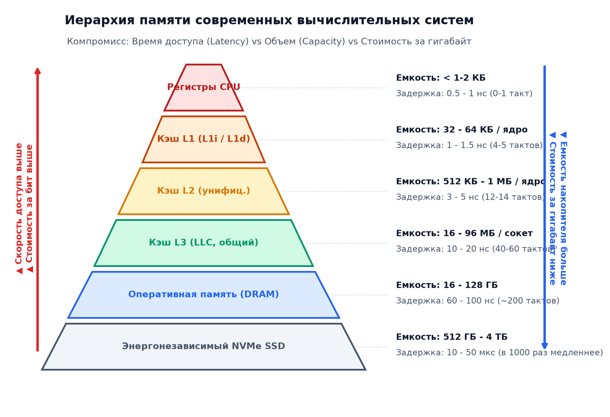
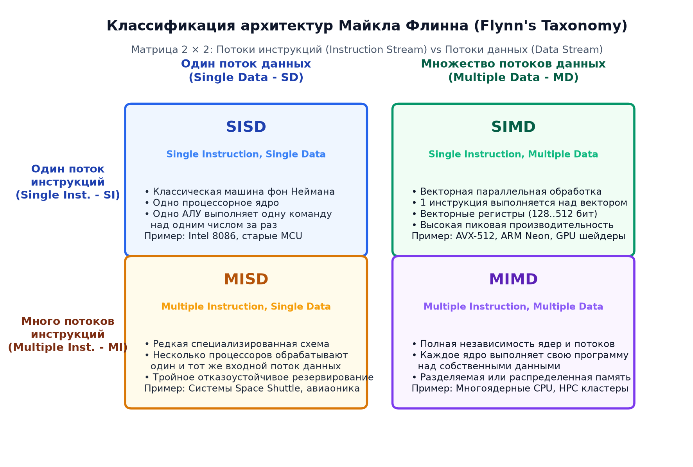
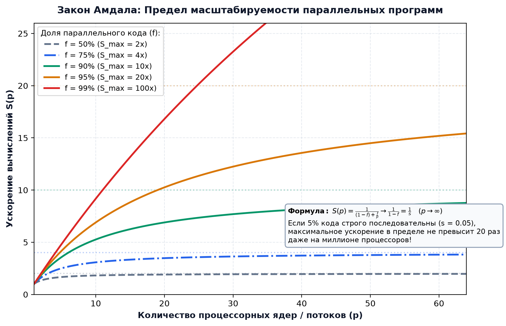

# 🖥️ Аппаратное обеспечение ВС (Архитектура ЭВМ): Экзаменационный банк тем и полный конспект билетов (2 семестр)

> [!abstract] О материале
> Настоящий конспект представляет собой исчерпывающее систематизированное руководство по дисциплине **«Аппаратное обеспечение вычислительных систем / Архитектура ЭВМ» (2 семестр ИТМО)**, составленное на базе официальных кафедральных билетов, лекционных материалов и классических академических источников (Д. Паттерсон, Д. Хеннесси, Э. Таненбаум).
> Охватывает путь от физических полупроводниковых структур и логических вентилей до современных многоядерных суперскалярных конвейерных систем с внеочередным исполнением инструкций и иерархией памяти.

---

## 📋 1. Физические основы цифровой техники

### 1.1. Аналоговые и цифровые сигналы
В физическом мире все электрические процессы непрерывны во времени и по амплитуде — это **аналоговые сигналы**. Однако бесконечное число состояний делает обработку аналоговых сигналов подверженной шумам, искажениям и накоплению погрешностей.

Для надежной обработки вводится абстракция **дискретных (цифровых) сигналов**, где диапазон напряжений разбивается на дискретные уровни с использованием пороговых констант:
1. $V_{\text{gnd}}$ — напряжение «земли» (номинальный ноль, обычно $0\,\text{В}$).
2. $V_{\text{dd}}$ — напряжение источника питания (логическая единица, $1.2\,\text{В} - 5.0\,\text{В}$ в зависимости от техпроцесса).
3. $V_l$ — верхняя граница напряжения, гарантированно интерпретируемого схемой как логический ноль ($V \in [0, V_l] \implies 0$).
4. $V_h$ — нижняя граница напряжения, гарантированно интерпретируемого как логическая единица ($V \in [V_h, V_{\text{dd}}] \implies 1$).
5. **Запрещенная зона (Noise Margin):** диапазон $(V_l, V_h)$ является зоной неопределенности. Разница $V_h - V_l$ обеспечивает помехоустойчивость схемы к наведенным электромагнитным шумам.

### 1.2. Полупроводники и легирование ($n$- и $p$-типы)
Основой современной микроэлектроники является **кремний ($\text{Si}$)** — четырехвалентный химический элемент, образующий ковалентную кристаллическую решетку, в которой при абсолютном нуле нет свободных носителей заряда (чистый кремний — изолятор).

Проводимость кремния радикально изменяется путем внедрения атомов примесей (**легирования**):
- **Полупроводники $n$-типа (Negative):** кремний легируется пятивалентной примесью (**донором**, например, фосфором $\text{P}$ или мышьяком $\text{As}$). Четыре электрона образуют ковалентные связи с кремнием, а пятый становится свободным электроном проводимости. Основные носители заряда — **электроны**.
- **Полупроводники $p$-типа (Positive):** кремний легируется трехвалентной примесью (**акцептором**, например, бором $\text{B}$ или индием $\text{In}$). Трех электронов недостаточно для завершения связей, в результате чего образуется вакантное квантовое состояние — **«дырка»** с эффективным положительным зарядом. Основные носители заряда — **дырки**.

### 1.3. $p$-$n$ переход и полупроводниковый диод
При контакте полупроводников $p$- и $n$-типов в зоне границы электроны из $n$-области диффундируют в $p$-область, рекомбинируя с дырками. В результате в $n$-области вблизи границы образуется нескомпенсированный объемный заряд положительных ионов доноров, а в $p$-области — отрицательных ионов акцепторов. Возникает внутреннее электрическое поле, препятствующее дальнейшей диффузии — формируется **обедненный слой (запирающий слой)** с контактной разностью потенциалов (около $0.7\,\text{В}$ для кремния).

- **Прямое включение:** положительный потенциал приложен к $p$-области, отрицательный — к $n$-области. Внешнее поле компенсирует барьер, обедненный слой сужается, через переход течет экспоненциально растущий прямой ток.
- **Обратное включение:** положительный потенциал приложен к $n$-области, отрицательный — к $p$-области. Внешнее поле суммируется с внутренним, барьер расширяется, ток через переход практически равен нулю (пренебрежимо малый обратный ток утечки).
- Таким образом, $p$-$n$ переход реализует функцию **диода** — одностороннего проводника тока.

### 1.4. Конденсаторы и емкостные эффекты в микросхемах
Конденсатор состоит из двух проводящих обкладок, разделенных диэлектриком, и накапливает электрический заряд:
$$q = C \cdot U, \quad I(t) = C \frac{dU(t)}{dt}$$
Время перезаряда емкости через сопротивление цепи определяется постоянной времени $\tau = R \cdot C$. В интегральных микросхемах паразитная емкость проводников и затворов транзисторов является главным физическим фактором, ограничивающим максимальную тактовую частоту процессора.

### 1.5. Полевые МОП-транзисторы (MOSFET: NMOS и PMOS)
Полевой транзистор металл-оксид-полупроводник (MOSFET) — ключевой переключательный элемент цифровых схем. Транзистор имеет 4 вывода: **Затвор (Gate)**, **Исток (Source)**, **Сток (Drain)** и **Подложку (Body)**. Затвор отделен от проводящего канала тончайшим слоем диэлектрика ($SiO_2$ или high-k диэлектрики).

1. **NMOS-транзистор:** исток и сток легированы примесью $n$-типа, подложка — $p$-типа.
   - При нулевом напряжении на затворе ($V_{gs} = 0$) канал между истоком и стоком закрыт (ток не течет, ключ разомкнут).
   - При подаче положительного напряжения $V_{gs} > V_{\text{th}}$ (пороговое напряжение) электрическое поле притягивает электроны к поверхности диэлектрика под затвором, формируя инверсионный проводящий $n$-канал. Ключ **замкнут**.
2. **PMOS-транзистор:** исток и сток легированы $p$-типом, подложка — $n$-типа.
   - Работает комплементарно к NMOS. При высоком напряжении на затворе заперт; при подаче низкого потенциала ($V_{gs} < -V_{\text{th}}$) под затвором индуцируется проводящий $p$-канал. Ключ **замкнут** при низком сигнале.

### 1.6. Комплементарная логика CMOS (КМОП) и логические вентили
В современной микроэлектронике используется **CMOS-архитектура (Complementary Metal-Oxide-Semiconductor)**, где логические элементы строятся из пар транзисторов NMOS (Pull-Down сеть, соединяющая выход с землей $V_{\text{gnd}}$) и PMOS (Pull-Up сеть, соединяющая выход с питанием $V_{\text{dd}}$).

**Преимущество CMOS:** В статическом состоянии (когда на входе стабильный 0 или 1) один из транзисторов всегда заперт. Сквозной ток от источника питания к земле отсутствует! Энергия потребляется схемой **только в моменты переключения** на перезаряд паразитных емкостей затворов:
$$P_{\text{dynamic}} = \alpha \cdot C \cdot V_{\text{dd}}^2 \cdot f$$

- **Инвертор NOT (НЕ):** состоит из 1 PMOS (сверху) и 1 NMOS (снизу). При $In=1$ NMOS открыт, выход соединен с $V_{\text{gnd}}$ ($Out=0$). При $In=0$ PMOS открыт, выход соединен с $V_{\text{dd}}$ ($Out=1$).
- **Вентиль NAND (И-НЕ):** 2 параллельных PMOS сверху и 2 последовательных NMOS снизу. Выход равен 0 тогда и только тогда, когда оба входа равны 1.
- **Вентиль NOR (ИЛИ-НЕ):** 2 последовательных PMOS сверху и 2 параллельных NMOS снизу. Выход равен 1 только если оба входа равны 0.
- Базис NAND или NOR является функционально полным (схемным базисом Пирса и Шеффера), позволяя построить вычислительное устройство любой сложности.

---

## 🔢 2. Представление чисел в памяти ЭВМ

### 2.1. Хранение целых чисел
1. **Прямой код (Sign-Magnitude):** старший бит выделяется под знак ($0$ — плюс, $1$ — минус), остальные биты хранят абсолютное значение. Недостатки: наличие двух нулей ($+0$ и $-0$), сложность аппаратной реализации вычитания.
2. **Обратный код (Ones' Complement):** положительные числа совпадают с прямым кодом; для отрицательных все биты модуля инвертируются. Также имеет проблему двух нулей.
3. **Дополнительный код (Two's Complement):** мировой стандарт целочисленной арифметики. Отрицательное число $X$ в $n$-битном представлении хранится как:
   $$X_{\text{доп}} = 2^n - |X| = \overline{|X|} + 1$$
   - **Преимущества:**
     - Единственное представление нуля ($0000_2$).
     - Сложение и вычитание выполняются на одном и том же аппаратном сумматоре без анализа знаков операндов: $A - B = A + B_{\text{доп}}$.
     - Диапазон для $n$ бит: $[-2^{n-1}, 2^{n-1}-1]$ (асимметрия: отрицательных чисел на 1 больше).
   - **Знаковое переполнение (Overflow):** возникает, когда сложение двух чисел одного знака дает результат противоположного знака. Аппаратный признак переполнения: перенос в знаковый бит не равен переносу из знакового бита ($V = C_{\text{in}} \oplus C_{\text{out}}$ для старшего разряда).

### 2.2. Хранение нецелых чисел
1. **Числа с фиксированной точкой (Fixed-Point):** фиксированное количество бит отводится под целую часть и под дробную часть. Арифметика быстрая (совпадает с целочисленной), но диапазон представимых величин жестко ограничен.
2. **Числа с плавающей точкой (IEEE 754):**
   Число представляется в нормализованном виде:
   $$X = (-1)^s \times (1.M) \times 2^{E - \text{bias}}$$
   - **Одинарная точность (Single Precision, `float`, 32 бита):**
     - Знак $s$: 1 бит.
     - Экспонента $E$: 8 бит, смещение (bias) $= 127$.
     - Мантисса $M$: 23 бита (нормализованная скрытая единица перед запятой не хранится, давая 24 бита фактической точности).
   - **Двойная точность (Double Precision, `double`, 64 бита):**
     - Знак $s$: 1 бит.
     - Экспонента $E$: 11 бит, смещение $= 1023$.
     - Мантисса $M$: 52 бита (53 бита точности).

#### Специальные значения стандарта IEEE 754:
- **Нормализованные числа:** $0 < E < 2^k - 1$. Скрытая единица присутствует ($1.M$).
- **Субнормальные (денормализованные) числа:** $E = 0, M \ne 0$. Скрытая единица равна нулю ($0.M$), порядок фиксируется как $1 - \text{bias}$. Позволяют реализовать **постепенное исчезновение порядка (Gradual Underflow)** при приближении к абсолютному нулю.
- **Машинный ноль:** $E = 0, M = 0$. Имеет два знака: $+0$ и $-0$.
- **Бесконечность ($\pm \infty$):** $E = 255$ (или $2047$), $M = 0$. Возникает при делении на ноль или переполнении порядка.
- **Не-число (NaN — Not a Number):** $E = 255$ (или $2047$), $M \ne 0$.
  - *Quiet NaN (qNaN):* старший бит мантиссы равен 1; спокойно распространяется по вычислительному графу без аппаратных исключений.
  - *Signaling NaN (sNaN):* старший бит равен 0; вызывает немедленное аппаратное прерывание процессора (FPE trap).

---

## ⚙️ 3. Функциональные логические схемы

### 3.1. Комбинационные схемы
Схемы без обратных связей и элементов памяти, где значение выходов в любой момент времени однозначно определяется текущей комбинацией входных сигналов.
- **Мультиплексор (MUX):** схема с $2^k$ информационными входами, $k$ адресными линиями и 1 выходом. Коммутирует выбранный вход на выход.
- **Демультиплексор (DEMUX):** распределяет данные с 1 входа на один из $2^k$ выходов в зависимости от адреса.
- **Дешифратор (Decoder):** преобразует $k$-битный код в активный сигнал на одной из $2^k$ выходных линий (используется для адресации памяти).

### 3.2. Арифметические сумматоры
- **Полусумматор (Half Adder):** суммирует два бита $A, B$. Выходы: сумма $S = A \oplus B$ и перенос $C = A \cdot B$.
- **Полный сумматор (Full Adder):** суммирует три бита: $A, B$ и перенос с предыдущего разряда $C_{\text{in}}$.
  $$S = A \oplus B \oplus C_{\text{in}}, \quad C_{\text{out}} = A \cdot B + C_{\text{in}} \cdot (A \oplus B)$$
- **Каскадный сумматор (Ripple Carry Adder, RCA):** цепочка из $n$ полных сумматоров. Перенос последовательно распространяется от младшего разряда к старшему. Задержка распространения растет линейно: $T_{\text{delay}} = O(n)$, что критически медленно для 32- и 64-битных АЛУ.
- **Сумматор с ускоренным переносом (Carry-Lookahead Adder, CLA):** для каждого разряда вычисляются функции:
  - Генерация переноса: $G_i = A_i \cdot B_i$ (перенос возникает независимо от $C_{\text{in}}$).
  - Распространение переноса: $P_i = A_i \oplus B_i$ (перенос с входа передается на выход).
  Тогда переносы выражаются параллельно:
  $$C_1 = G_0 + P_0 C_0, \quad C_2 = G_1 + P_1 G_0 + P_1 P_0 C_0, \quad \dots$$
  Задержка вычисления сокращается до $O(\log n)$ уровней вентилей.

### 3.3. Последовательностные схемы (Элементы памяти и триггеры)
Схемы с обратными связями, состояние выходов которых зависит не только от текущих входов, но и от предыстории работы схемы (внутреннего состояния).
1. **RS-защелка (SR Latch):** схема на двух перекрестно связанных вентилях NOR или NAND. Входы Set ($S$) и Reset ($R$). Состояние $S=1, R=1$ для схемы на NOR является запрещенным.
2. **D-защелка (D Latch, Transparent Latch):** имеет информационный вход $D$ и разрешающий вход $Enable$. При $E=1$ прозрачна ($Q = D$), при $E=0$ хранит предыдущее значение.
3. **D-триггер (D Flip-Flop):** Master-Slave конструкция, срабатывающая строго по **фронту тактового сигнала (Clock Edge)**. Базовый элемент регистров процессора и синхронных автоматов.
4. **JK-триггер:** универсальный триггер без запрещенных состояний. При $J=1, K=1$ инвертирует свое состояние (режим Toggle).
5. **Т-триггер (Toggle Flip-Flop):** счетный триггер; переключает значение на каждом такте при $T=1$. Используется в двоичных счетчиках и делителях частоты.

### 3.4. Конечные автоматы (FSM) и структура АЛУ
- **Автомат Мура:** выходные сигналы зависят исключительно от текущего состояния автомата: $Y(t) = \lambda(S(t))$. Более стабилен к гонкам сигналов.
- **Автомат Мили:** выходные сигналы зависят как от текущего состояния, так и от текущих входных воздействий: $Y(t) = \lambda(S(t), X(t))$. Часто требует меньшего числа состояний.
- **Арифметико-логическое устройство (АЛУ / ALU):** центральный исполнительный узел процессора. Содержит параллельный сумматор/вычитатель, логические блоки (AND, OR, XOR, NOT), блок битовых сдвигов (Barrel Shifter) и мультиплексор выбора операции. Формирует флаги состояния: $Z$ (Zero), $N$ (Negative), $C$ (Carry), $V$ (Overflow).

---

## 💾 4. Архитектура памяти: SRAM и DRAM

### 4.1. Статическая память (SRAM — Static RAM)
- **Ячейка:** состоит из **6 транзисторов (6T)** — два перекрестно включенных CMOS-инвертора, образующих бистабильный триггер, и два транзистора доступа к шинам данных $Bit$ и $\overline{Bit}$.
- **Свойства:** данные хранятся стабильно все время, пока подано питание. Чтение не разрушает данные. Быстродействие экстремально высокое ($0.5 - 2\,\text{нс}$, 1 такт CPU).
- **Применение:** регистровые файлы процессора, кэш-память уровней L1, L2, L3. Недостаток — низкая плотность (6 транзисторов на бит) и высокая себестоимость.

### 4.2. Динамическая память (DRAM — Dynamic RAM)
- **Ячейка:** состоит всего из **1 транзистора и 1 конденсатора (1T1C)**. Логическая единица хранится в виде заряда на миниатюрном конденсаторе емкостью порядка десятков фемтофарад ($10^{-15}\,\text{Ф}$).
- **Деструктивное считывание (Destructive Read):** при открытии транзистора заряд конденсатора перетекает на длинную разрядную шину, изменяя ее потенциал на доли вольта. Усилитель считывания (Sense Amplifier) улавливает изменение, фиксирует бит и обязан **немедленно перезарядить конденсатор обратно**.
- **Цикл регенерации (Refresh Cycle):** из-за токов утечки заряд конденсатора исчезает за десятки миллисекунд. Контроллер памяти обязан принудительно периодически считывать и перезаписывать каждую строку памяти каждые $32 - 64\,\text{мс}$.
- **Матричная адресация:** память организована в виде двумерной матрицы строк (Word Lines) и столбцов (Bit Lines). Для сокращения числа контактов микросхемы адрес мультиплексируется: сначала по шине передается адрес строки и строб **RAS# (Row Address Strobe)**, затем адрес столбца и строб **CAS# (Column Address Strobe)**.

---

## 🎛️ 5. Организация чипсетов и моделей разделения памяти

### 5.1. Эволюция системной логики (Чипсетов)
- **Классическая двухмостовая архитектура:**
  - **Северный мост (Northbridge / MCH — Memory Controller Hub):** высокоскоростной хаб, соединенный с CPU системной шиной **FSB (Front Side Bus)**. Управлял оперативной памятью RAM и графической шиной AGP / PCI Express.
  - **Южный мост (Southbridge / ICH — I/O Controller Hub):** соединялся с Северным мостом внутренней шиной и управлял медленной периферией: шинами PCI, контроллерами накопителей SATA/IDE, портами USB, звуковым трактом, сетевой картой и энергонезависимой памятью BIOS/UEFI.
- **Современная архитектура:**
  - Контроллер оперативной памяти (Integrated Memory Controller, **IMC**) и линии PCI Express для дискретной графики и NVMe-накопителей интегрированы **непосредственно в кристалл процессора**.
  - Южный мост эволюционировал в единый чипсет (Intel PCH / AMD Promontory), соединенный с CPU высокоскоростным интерфейсом point-to-point (Intel DMI, AMD PCIe link).

### 5.2. Мультипроцессорные архитектуры: UMA vs NUMA
- **Симметричная мультипроцессорность (SMP):** несколько одинаковых процессорных ядер разделяют общее физическое пространство памяти.
- **UMA (Uniform Memory Access):** время доступа к любому участку памяти одинаково для всех процессоров. Процессоры подключаются к памяти через общую шину или кроссбар. Недостаток: жесткая конкуренция за шину памяти при увеличении числа ядер (плохая масштабируемость выше 4–8 сокетов).
- **NUMA (Non-Uniform Memory Access):** архитектура с неоднородной памятью. Система разбивается на узлы (**NUMA nodes**). Каждый узел содержит несколько ядер процессора и свой локальный контроллер оперативной памяти:
  - *Локальная память:* доступ ядер к памяти своего NUMA-узла происходит с минимальной задержкой (например, $60\,\text{нс}$).
  - *Удаленная память:* доступ к памяти чужого узла идет через специализированную межпроцессорную шину когерентных соединений (Intel UPI / QPI, AMD Infinity Fabric) с существенно большей задержкой ($120 - 180\,\text{нс}$) и меньшей пропускной способностью.
  - **Значение для разработки:** в высоконагруженных системах (High-Load, СУБД PostgreSQL/ClickHouse) критически важно привязывать потоки выполнения к локальным NUMA-узлам (`numactl`, CPU pinning), избегая межсокетовой деградации производительности.

---

## ⚡ 6. Оперативная память DRAM и стандарты DDR

### 6.1. Фазы доступа к DRAM и тайминги
Чтение строки из DRAM выполняется по строгому временному протоколу:
1. **Precharge (tRP — Row Precharge Time):** выравнивание потенциалов разрядных линий матрицы, подготовка банка к открытию новой строки.
2. **Activate (tRCD — RAS to CAS Delay):** подача строба RAS, дешифрация адреса строки, перенос заряда конденсаторов всей строки (тысячи бит) в буфер усилителей считывания (Row Buffer).
3. **Column Access (tCL — CAS Latency):** подача строба CAS, выбор нужного столбца из Row Buffer и передача данных на внешнюю шину.
4. **Row Active Time (tRAS):** минимальное время, в течение которого строка обязана оставаться активной для корректного восстановления заряда ячеек.
- Паспортная формула таймингов оперативной памяти (например, DDR4-3200 `16-18-18-36`):
  $$t_{\text{CL}} - t_{\text{RCD}} - t_{\text{RP}} - t_{\text{RAS}}$$

### 6.2. Эволюция стандартов оперативной памяти
- **SDRAM (Synchronous DRAM):** шина синхронизирована с тактовым генератором, данные передаются один раз за такт.
- **DDR SDRAM (Double Data Rate):** передача данных осуществляется по **обоим фронтам тактового импульса** (по нарастающему и спадающему), удваивая эффективную скорость передачи при той же тактовой частоте шины.
- **Механизм Prefetch:** внутренняя матрица DRAM работает медленно, поэтому за один такт ядро считывает широкий блок данных (Prefetch buffer), который затем на высокой частоте последовательно прокачивается через внешнюю шину:
  - DDR1: 2n-prefetch;
  - DDR2: 4n-prefetch;
  - DDR3: 8n-prefetch;
  - DDR4: 8n-prefetch с механизмом групп банков (Bank Groups);
  - DDR5: 16n-prefetch, разделение стандартного 64-битного модуля на два независимых 32-битных подканала данных (Dual Sub-channels), встроенный модуль управления питанием (PMIC) на планке и аппаратная коррекция ошибок на кристалле (On-Die ECC).
- **Многоканальный режим (Dual/Quad Channel):** одновременная параллельная работа нескольких независимых 64-битных контроллеров памяти, кратно умножающая суммарную пропускную способность шины памяти.

---

## 🚀 7. Иерархия и организация кэш-памяти

### 7.1. Принцип локальности
Кэширование базируется на фундаментальном эмпирическом свойстве программного кода:
1. **Временная локальность (Temporal Locality):** если программа обратилась к адресу памяти $A$, с высокой вероятностью она обратится к нему повторно в ближайшее время (переменные циклов, тело функций, вершины стека).
2. **Пространственная локальность (Spatial Locality):** если программа обратилась к адресу $A$, с высокой вероятностью следующие обращения произойдут к соседним адресам $A+1, A+2$ (последовательное чтение массивов, векторных структур, инструкций кода).

### 7.2. Иерархия уровней кэш-памяти
Память организуется пирамидально по компромиссу «скорость vs объем vs цена»:
- **Регистры процессора:** $\sim 1\,\text{КБ}$, 0–1 такт.
- **Кэш L1 (Instruction L1i / Data L1d):** раздельный для команд и данных, $32 - 64\,\text{КБ}$ на ядро, $1 - 4$ такта.
- **Кэш L2:** унифицированный, $512\,\text{КБ} - 1\,\text{МБ}$ на ядро, $10 - 14$ тактов.
- **Кэш L3 (Last Level Cache, LLC):** разделяемый всеми ядрами сокета, $16 - 96\,\text{МБ}$, $30 - 50$ тактов.
- **Оперативная память RAM:** десятки гигабайт, $100 - 200$ тактов (Memory Wall).



### 7.3. Способы отображения и структура адреса кэша
Данные переносятся между RAM и кэшем неделимыми блоками — **кэш-линиями (Cache Lines)** фиксированного размера (в современной архитектуре x86/ARM всегда **64 байта**).

Физический адрес памяти разбивается на три битовых поля:
$$\text{Address} = [\text{Tag} \mid \text{Index} \mid \text{Offset}]$$
- **Offset (Смещение):** младшие $\log_2(64) = 6$ бит определяют байт внутри 64-байтной строки.
- **Index (Индекс набора):** определяет строку/набор кэша, в который может быть помещен блок.
- **Tag (Тэг):** старшие биты адреса, сохраняемые в специальной памяти тэгов для проверки совпадения.

#### Топологии кэш-памяти:
1. **Прямое отображение (Direct Mapped):** каждый блок памяти однозначно отображается ровно в одну строку кэша ($\text{Index} = \text{Address} \pmod N$). Простая и быстрая схема, но подвержена постоянным конфликтам вытеснения (Conflict Misses), если программа попеременно обращается к адресам с одинаковым индексом.
2. **Наборно-ассоциативный кэш (N-Way Set Associative):** строки кэша сгруппированы в наборы (Sets), каждый из которых содержит $N$ линий (Ways). Адрес указывает на конкретный набор, а внутри набора блок может лечь в любую из $N$ свободных линий. Тэги всех $N$ линий сравниваются компараторами параллельно за 1 такт. Золотой стандарт процессоростроения (обычно 8-way L1, 16-way L3).
3. **Полностью ассоциативный кэш (Fully Associative):** индекс отсутствует. Блок памяти может быть помещен абсолютно в любую строку кэша. Исключает конфликты вытеснения, но требует сложнейших аппаратных параллельных компараторов по всей емкости (применяется в буферах TLB малого объема).

### 7.4. Политики записи и замещения данных
- **Write-Through (Сквозная запись):** данные пишутся одновременно в кэш и на следующий уровень памяти. Просто, гарантирует актуальность, но перегружает шину памяти.
- **Write-Back (Отложенная запись):** данные записываются только в кэш-линию, которая помечается специальным битом модификации (**Dirty Bit**). Запись в оперативную память откладывается до момента, пока эта строка не будет вытеснена другой.
- **Write-Allocate:** при промахе записи строка сначала считывается из памяти в кэш, затем модифицируется.
- **Алгоритмы замещения (Eviction Policies):** LRU (Least Recently Used — вытеснение дольше всего не использовавшейся строки), Pseudo-LRU (аппроксимация через двоичные деревья битов), FIFO, Random.

### 7.5. Когерентность кэш-памяти и протокол MESI
В многоядерных процессорах каждое ядро имеет свой локальный кэш L1/L2. Если несколько ядер одновременно считывают и модифицируют одну и ту же переменную, возникает проблема рассогласования копий данных (**нарушение когерентности**).

Для аппаратной синхронизации используется механизм отслеживания общей шины (**Bus Snooping**) и протокол **MESI**, где каждая кэш-линия находится в одном из 4 состояний:
- **Modified (M):** строка изменена (Dirty), присутствует *только* в кэше данного ядра; копия в оперативной памяти устарела. Ядро имеет эксклюзивные права на запись.
- **Exclusive (E):** строка совпадает с памятью (Clean) и присутствует *только* в кэше данного ядра.
- **Shared (S):** строка совпадает с памятью и может присутствовать в кэшах *нескольких* ядер одновременно в режиме только для чтения.
- **Invalid (I):** данные в строке недействительны (устарели в результате записи другим ядром); обращение к ней вызывает Cache Miss.

> [!warning] Проблема ложного разделения данных (False Sharing)
> Если две независимые переменные, изменяемые потоками на разных ядрах процессора, случайно расположены компилятором в пределах одной 64-байтной строки кэша, ядра будут непрерывно инвалидировать кэш-линии друг друга через протокол MESI, генерируя гигантский паразитный трафик по межъядерной шине.
> **Решение:** принудительное выравнивание структур данных по границе кэш-линии:
> `alignas(std::hardware_destructive_interference_size) struct ThreadData { ... };`

---

## 🛡️ 8. Архитектура виртуальной памяти

### 8.1. Концепция и назначение
Виртуальная память абстрагирует физическую RAM, предоставляя каждому процессу собственное изолированное, непрерывное виртуальное адресное пространство ($2^{64}$ байт в 64-битных системах).
- **Ключевые функции:**
  - Полная аппаратная изоляция памяти процессов друг от друга (безопасность).
  - Защита областей памяти ядра ОС от пользовательского кода (User / Supervisor modes).
  - Преодоление фрагментации физической памяти.
  - Механизм прозрачной подкачки (Swapping / Paging) на диск при нехватке физической памяти.
  - Отображение файлов в память (Memory-Mapped Files, системный вызов `mmap`).

### 8.2. Страничная адресация (Paging) и структура PTE
Память разбивается на блоки фиксированного размера — **страницы (Pages)** в виртуальной памяти и **фреймы (Page Frames)** в физической памяти (базовый размер страницы в x86-64 — **4 КБ** $= 4096$ байт).

Виртуальный адрес разбивается на:
$$\text{Virtual Address} = [\text{Virtual Page Number (VPN)} \mid \text{Offset}]$$
Для 4 КБ страницы младшие 12 бит представляют собой смещение (Offset). Преобразование адреса заключается в трансляции $VPN \to PPN$ (Physical Page Number).

Каждая запись таблицы страниц (**Page Table Entry, PTE**) содержит:
- $PPN$ — физический базовый адрес фрейма в оперативной памяти.
- Бит присутствия (**Present Bit, P**): $1$ — страница находится в физической RAM; $0$ — страница выгружена на диск или не выделена.
- Бит записи (**Writable, W/R**): $1$ — разрешена запись; $0$ — только чтение.
- Бит привилегий (**User/Supervisor, U/S**): $1$ — доступна из кольца 3 (User Space); $0$ — только ядро (Ring 0).
- Бит модификации (**Dirty Bit, D**): выставляется аппаратно процессором при любой операции записи в страницу.
- Бит обращения (**Accessed Bit, A**): выставляется при чтении или записи (используется алгоритмами вытеснения страниц ОС).
- Бит запрета исполнения (**No-Execute / XD / NX Bit**): предотвращает исполнение шеллкода из стека или кучи при атаках переполнения буфера.

### 8.3. Многоуровневые таблицы страниц (x86-64 PML4)
Одноуровневая таблица страниц для 64-битного пространства потребовала бы миллионы гигабайт памяти под саму таблицу. Решение — **многоуровневое иерархическое дерево таблиц страниц**.

В классической 48-битной канонической адресации x86-64 используется 4-уровневая структура:
$$\text{Virtual Address (48 бит)} = [\text{PML4 (9)} \mid \text{PDPT (9)} \mid \text{PD (9)} \mid \text{PT (9)} \mid \text{Offset (12)}]$$
1. Базовый физический адрес корневой таблицы PML4 текущего процесса хранится в регистре процессора **CR3**.
2. Каждый уровень содержит ровно 512 записей по 8 байт (размер таблицы каждого уровня ровно 4096 байт — идеально укладывается в одну страницу памяти!).
3. Таблицы нижних уровней создаются по требованию (динамически), что минимизирует расход физической памяти под дескрипторы.

### 8.4. Буфер трансляции адресов (TLB) и Page Fault
Каждое обращение к памяти по виртуальному адресу требовало бы 4 дополнительных чтения из RAM для прохода по дереву страниц, снижая производительность системы в 5 раз!

- **TLB (Translation Lookaside Buffer):** специализированный сверхбыстрый полностью ассоциативный аппаратный кэш на кристалле CPU, хранящий пары $\text{VPN} \to \text{PPN}$. При попадании в TLB (TLB Hit) физический адрес формируется за долю такта.
- **Аппаратный проход по таблице (Page Walk):** при промахе TLB аппаратный блок процессора MMU автоматически считывает записи PML4-PDPT-PD-PT из памяти и заполняет TLB.
- **Прерывание Page Fault (#PF, вектор 14):**
  Возникает, если в записи PTE бит $Present = 0$ либо нарушены права доступа ($W/R$ или $U/S$).
  - Процессор сохраняет адрес, вызвавший сбой, в системный регистр **CR2**, и передает управление обработчику прерывания ядра ОС.
  - Если обращение легитимно, ОС подгружает недостающую страницу из файла подкачки (Swap) в свободный физический фрейм, обновляет PTE, сбрасывает запись в TLB (`invlpg`) и перезапускает упавшую инструкцию процессора.

---

## 🏛️ 9. Архитектура набора команд (ISA) и процессор MIPS

### 9.1. Архитектура фон Неймана vs Гарвардская архитектура
- **Принципы фон Неймана (1945 г.):**
  - Единая память для хранения команд программы и числовых данных.
  - Линейная последовательная адресация ячеек памяти.
  - Неразличимость данных и команд по физическому носителю (команды могут обрабатываться как данные).
  - *«Узкое горлышко фон Неймана» (Von Neumann Bottleneck):* разделение процессора и общей памяти шиной с ограниченной пропускной способностью.
- **Гарвардская архитектура:**
  - Физически раздельные адресные пространства и шины для памяти команд (Instruction Memory) и памяти данных (Data Memory).
  - Позволяет процессору одновременно выбирать следующую команду и считывать/записывать операнды в память данных.
  - *Современный компромисс:* внутри процессора гарвардская схема (раздельные кэши L1i и L1d), снаружи — фон-неймановская общая оперативная память.

### 9.2. Философия CISC vs RISC
- **CISC (Complex Instruction Set Computer, пример — x86):**
  - Огромный набор сложных инструкций переменной длины ($1 - 15$ байт).
  - Сложные многотактовые инструкции (`rep movsb`, вычисление полиномов).
  - Прямые арифметические операции с операндами в памяти (`add [eax], ebx`).
  - Сложная микропрограммная декодировка.
- **RISC (Reduced Instruction Set Computer, примеры — MIPS, ARM, RISC-V):**
  - Небольшой набор простых инструкций строго фиксированной длины (всегда 32 бита).
  - Исполнение инструкций за один конвейерный такт.
  - **Архитектура Load/Store:** все арифметико-логические операции выполняются *исключительно* над внутренними регистрами процессора. Доступ к памяти возможен только через специализированные команды загрузки (`lw`) и сохранения (`sw`).

### 9.3. Система команд MIPS (Microprocessor without Interlocked Pipeline Stages)
Процессор MIPS содержит **32 регистра общего назначения** шириной 32 бита (`$0 - $31`):
- `$zero` (`$0`): всегда аппаратно зашит на константу $0$.
- `$v0 - $v1` (`$2 - $3`): возвращаемые значения функций.
- `$a0 - $a3` (`$4 - $7`): входные аргументы функций.
- `$t0 - $t9` (`$8 - $15, $24 - $25`): временные регистры (не сохраняются вызываемой функцией).
- `$s0 - $s7` (`$16 - $23`): сохраняемые регистры (Callee-saved).
- `$sp` (`$29`): указатель вершины стека (Stack Pointer).
- `$ra` (`$31`): адрес возврата из подпрограммы (Return Address).

#### Три формата инструкций MIPS (всегда ровно 32 бита!):
1. **R-тип (Register):** арифметические и логические операции над регистрами.
   $$[\text{Opcode: 6} \mid \text{rs: 5} \mid \text{rt: 5} \mid \text{rd: 5} \mid \text{shamt: 5} \mid \text{funct: 6}]$$
   - `rs`, `rt` — регистры-источники операндов;
   - `rd` — регистр-приемник результата;
   - `shamt` — величина сдвига (Shift Amount);
   - `funct` — код функции (расширение Opcode).
   *Пример:* `add $rd, $rs, $rt` ($rd = rs + rt$).
2. **I-тип (Immediate):** операции с непосредственным числом и команды работы с памятью.
   $$[\text{Opcode: 6} \mid \text{rs: 5} \mid \text{rt: 5} \mid \text{Immediate: 16}]$$
   *Примеры:*
   - `addi $rt, $rs, 100` ($rt = rs + 100$).
   - `lw $rt, offset($rs)` (загрузка слова из памяти: адрес $= rs + \text{sign\_ext}(offset)$).
   - `sw $rt, offset($rs)` (сохранение слова из регистра $rt$ в память).
   - `beq $rs, $rt, label` (условный переход, если $rs == rt$).
3. **J-тип (Jump):** команды безусловного дальнего перехода.
   $$[\text{Opcode: 6} \mid \text{Target Address: 26}]$$
   *Примеры:* `j label`, `jal label` (Jump and Link: вызов функции с сохранением адреса возврата в `$ra`).

---

## 🏎️ 10. Микроархитектуры и конвейеризация MIPS

### 10.1. Тракты данных: Однотактовый vs Многотактовый
- **Однотактовый процессор:** каждая инструкция выполняется от начала до конца за один гигантский такт тактового генератора. Длительность такта вынужденно настраивается по самому длинному критическому пути — инструкции `lw` (выборка из памяти команд $\to$ чтение регистров $\to$ АЛУ $\to$ чтение памяти данных $\to$ запись в регистр). Все быстрые инструкции (например, сложение `add`) простаивают большую часть такта. Чрезвычайно низкая частота.
- **Многотактовый процессор:** исполнение разбивается на шаги по 1 такту, аппаратные узлы (АЛУ, память) используются повторно на разных шагах под управлением конечного автомата. Частота выше, но одна инструкция требует $3 - 5$ тактов.

### 10.2. Классический 5-стадийный конвейер RISC
Конвейеризация повышает пропускную способность за счет одновременного перекрывающегося выполнения нескольких разнородных инструкций на разных стадиях тракта данных:
1. **IF (Instruction Fetch):** выборка инструкции из памяти команд по адресу $PC$, инкремент счетчика команд $PC = PC + 4$.
2. **ID (Instruction Decode / Register Read):** декодирование кода операции, генерация сигналов управления, одновременное параллельное считывание операндов из регистрового файла.
3. **EX (Execute / Address Calculation):** выполнение арифметико-логической операции в АЛУ либо вычисление эффективного адреса памяти для `lw`/`sw`.
4. **MEM (Memory Access):** чтение слова из памяти данных при `lw` либо запись слова при `sw`. Для остальных инструкций стадия прозрачна.
5. **WB (Write Back):** запись вычисленного значения из АЛУ или загруженного из памяти слова обратно в регистр назначения в регистровом файле.

Между стадиями установлены синхронные **межстадийные регистры (IF/ID, ID/EX, EX/MEM, MEM/WB)**, сохраняющие промежуточные операнды и управляющие биты для следующей фазы такта.

### 10.3. Конвейерные конфликты (Hazards) и методы их разрешения

#### 1. Структурные конфликты (Structural Hazards)
Возникают при одновременной попытке двух стадий обратиться к одному и тому же аппаратному блоку.
- *Проблема:* стадия IF пытается выбрать новую инструкцию из памяти, а стадия MEM в тот же такт пытается прочитать данные из памяти.
- *Решение:* применение раздельных кэшей первого уровня (гарвардская организация: L1i и L1d), применение двухпортовых регистровых файлов (запись на фазе спада такта, чтение на фазе нарастания).

#### 2. Конфликты по данным (Data Hazards)
Возникают, когда одна инструкция использует результат предыдущей, которая еще не завершила свое выполнение.
- **Истинная зависимость RAW (Read-After-Write):**
  ```assembly
  add $s0, $t0, $t1   # $s0 будет записан только на стадии WB (такт 5)
  sub $t2, $s0, $t3   # $s0 требуется на стадии EX (такт 3)
  ```
- **Аппаратное решение — Пересылка данных (Forwarding / Bypassing):**
  Результат вычисления АЛУ первой инструкции готов уже в конце стадии EX (такт 3) и сохранен в регистре `EX/MEM`. Специальный блок мультиплексоров пересылает эти данные со входа регистра `EX/MEM` напрямую на вход АЛУ следующей инструкции, минуя регистровый файл и устраняя простой конвейера!
- **Load-Use Hazard:**
  Если первая инструкция — это `lw`, данные из памяти считываются только в конце стадии MEM (такт 4). Переслать их назад во времени на стадию EX следующей инструкции физически невозможно!
  *Решение:* аппаратный блок обнаружения конфликтов принудительно вставляет **один такт простоя (Stall / Bubble)** в конвейер, замораживая стадии IF и ID, после чего срабатывает Forwarding со стадии MEM/WB на вход EX. Оптимизирующий компилятор старается переупорядочивать независимые инструкции, заполняя слот после `lw`.

#### 3. Конфликты управления (Control Hazards)
Возникают при исполнении инструкций ветвления (`beq`, `bne`, `j`). Пока условие перехода проверяется в АЛУ на стадии EX (или ID), в конвейер уже загружаются следующие по порядку инструкции, которые могут оказаться ошибочными.
- *Решения:*
  - **Слот задержки ветвления (Branch Delay Slot):** архитектурное соглашение MIPS, при котором инструкция, следующая непосредственно за переходом, выполняется *всегда*, независимо от исхода ветвления (компилятор переносит туда полезную операцию).
  - **Статическое предсказание:** переходы назад (циклы) считаются совершаемыми (Taken), переходы вперед (условия `if`) — несовершаемыми (Not Taken).
  - **Динамические предсказатели переходов (Branch Prediction):**
    - *2-битный насыщающийся счетчик:* 4 состояния: Strongly Taken (11), Weakly Taken (10), Weakly Not Taken (01), Strongly Not Taken (00). Требует двух ошибочных исходов подряд для смены стратегии предсказания (идеально для выхода из многократных циклов).
    - *Таблицы истории ветвлений (Branch History Table, BHT)* и адаптивные двухуровневые корреляционные предсказатели (точность современных предсказателей превышает $97\%$).

### 10.4. Развитие микроархитектур: Суперскалярность и алгоритм Томасуло
1. **Суперскалярность (Superscalar):** дублирование исполнительных трактов (несколько параллельных АЛУ, блоков FPU, блоков Load/Store), позволяющее выбирать, декодировать и запускать 2, 4 или 8 инструкций за один такт (IPC $> 1$).
2. **Внеочередное исполнение (Out-of-Order Execution, OoO) по алгоритму Томасуло:**
   Инструкции декодируются по порядку (In-Order), но поступают в специальные буферы — **станции резервации (Reservation Stations)** перед исполнительными блоками. Инструкция ожидает появления только своих реальных операндов на общей шине данных (Common Data Bus, CDB). Как только операнды готовы, инструкция немедленно выполняется, даже если предшествующие инструкции заблокированы!
3. **Устранение ложных зависимостей WAR и WAW:**
   - Ложные зависимости по именам регистров устраняются аппаратным **переименованием регистров (Register Renaming)**: архитектурные регистры MIPS отображаются на большой пул физических внутренних регистров процессора.
4. **Буфер переупорядочивания (Reorder Buffer, ROB):**
   Гарантирует, что несмотря на хаотичный порядок исполнения в АЛУ, окончательная фиксация результатов в состояние процессора и возникновение исключений происходят строго в исходном программном порядке (**In-Order Commit**), обеспечивая точную модель прерываний (Precise Interrupts).

---

## 💽 11. Внешние запоминающие устройства: HDD и SSD

### 11.1. Магнитные накопители на жестких дисках (HDD)
- **Конструкция:** пакет алюминиевых или стеклянных пластин с ферромагнитным покрытием, вращающихся на шпинделе со скоростью $5400 - 15000\,\text{об/мин}$, и блок магнитных головок, парящих над поверхностью на аэродинамической воздушной подушке высотой в единицы нанометров.
- **Геометрия диска:** цилиндры (Cylinders), концентрические дорожки (Tracks) и секторы (Sectors). Исторический размер сектора — 512 байт, современный стандарт Advanced Format — **4096 байт (4 КБ)**.
- **Физические составляющие времени доступа:**
  1. *Время позиционирования (Seek Time):* перемещение блока головок на нужный цилиндр ($3 - 12\,\text{мс}$).
  2. *Задержка вращения (Rotational Latency):* ожидание поворота диска нужным сектором под головку (в среднем пол-оборота: для 7200 RPM $\approx 4.16\,\text{мс}$).
  3. *Время передачи данных:* скорость последовательного считывания сектора с поверхности.
- Суммарная задержка произвольного доступа составляет $8 - 15\,\text{мс}$, из-за чего производительность случайного чтения упирается в жалкие $75 - 150\,\text{IOPS}$ (операций ввода-вывода в секунду).

### 11.2. Твердотельные накопители на флеш-памяти (SSD)
Основаны на полупроводниковой энергонезависимой флеш-памяти **NAND Flash**.
- **Ячейка памяти:** полевой транзистор с изолированным **плавающим затвором (Floating Gate)** или ловушкой заряда (**Charge Trap**). Заряд инжектируется на плавающий затвор туннелированием Фаулера-Нордгейма под высоким напряжением. Захваченные электроны экранируют электрическое поле управляющего затвора, смещая пороговое напряжение транзистора $V_{\text{th}}$, что сохраняется годами без подачи питания.

#### Типы ячеек памяти по плотности:
- **SLC (Single-Level Cell):** 1 бит на ячейку (2 уровня напряжения). Сверхбыстрая, ресурс $\sim 100\,000$ циклов перезаписи. Применяется в космических системах и промышленных кэшах.
- **MLC (Multi-Level Cell):** 2 бита на ячейку (4 уровня напряжения). Ресурс $\sim 3\,000 - 10\,000$ циклов.
- **TLC (Triple-Level Cell):** 3 бита на ячейку (8 уровней напряжения). Основной мировой стандарт клиентских и серверных SSD. Ресурс $\sim 1\,000 - 3\,000$ циклов.
- **QLC (Quad-Level Cell):** 4 бита на ячейку (16 уровней напряжения). Сверхвысокая плотность, низкая стоимость, ресурс всего $\sim 500 - 1\,000$ циклов.

#### Внутренняя иерархия и фундаментальное ограничение NAND Flash:
- Чип памяти делится на плоскости, блоки и страницы.
- **Страница (Page):** $4 - 16\,\text{КБ}$. Минимальная единица для операций **чтения и записи**.
- **Блок (Block):** содержит $128 - 512$ страниц ($2 - 8\,\text{МБ}$). Минимальная единица для операции **стирания**!
- ⛔ **Главное ограничение:** ячейку флеш-памяти нельзя перезаписать поверх! Запись бита $0$ возможна в чистую ячейку, но вернуть бит $1$ можно **только стерев блок целиком** подачей высокого напряжения на всю подложку.

#### Контроллер SSD и технологии FTL:
1. **Flash Translation Layer (FTL):** микропрограмма контроллера, эмулирующая для операционной системы обычный блочный диск (LBA-адресация) поверх специфичной структуры страниц и блоков NAND.
2. **Out-of-Place Updates:** при изменении 4 КБ файла контроллер не стирает блок, а записывает новые данные в свободную чистую страницу в другом блоке, помечая старую страницу как «недействительную» (Invalid), и обновляет таблицу трансляции LBA.
3. **Сборка мусора (Garbage Collection):** когда чистые блоки заканчиваются, контроллер выбирает блок с максимальным числом недействительных страниц, копирует оставшиеся живые страницы в другой блок, после чего стирает исходный блок целиком.
4. **Коэффициент усиления записи (Write Amplification Factor, WAF):**
   $$\text{WAF} = \frac{\text{Байт, фактически записанных во Flash-память}}{\text{Байт, отправленных операционной системой}}$$
   Вследствие сборки мусора WAF всегда $> 1$, что ускоряет износ диска.
5. **Выравнивание износа (Wear Leveling):** динамическое и статическое распределение записей по всем физическим блокам накопителя, предотвращающее преждевременную гибель отдельных ячеек.
6. **Команда TRIM (ATA TRIM / NVMe Deallocate):** без TRIM контроллер SSD не знает, когда файл удален в операционной системе, и продолжает бесконечно перемещать мусорные страницы при сборке мусора. Команда TRIM информирует FTL об освобожденных логических секторах, позволяя сразу помечать страницы как недействительные, радикально снижая WAF и повышая скорость записи.

---

## 🌐 12. Модели параллелизма в вычислительных системах

### 12.1. Классификация Майкла Флинна (Flynn's Taxonomy)
В зависимости от количества потоков инструкций и потоков обрабатываемых данных архитектуры делятся на 4 класса:



1. **SISD (Single Instruction, Single Data):** классическая однопроцессорная система фон Неймана. Один поток инструкций последовательно обрабатывает один поток скалярных данных.
2. **SIMD (Single Instruction, Multiple Data):** одна инструкция одновременно применяется к множеству независимых элементов данных.
   - *Применение:* векторные регистры процессоров (Intel MMX, SSE, AVX-2, AVX-512, ARM Neon) и графические процессоры (GPU). Одной ассемблерной инструкцией `_mm512_add_pd` складываются сразу 8 пар чисел двойной точности за 1 такт!
3. **MISD (Multiple Instruction, Single Data):** несколько инструкций одновременно обрабатывают один и тот же поток данных. Редкая специализированная архитектура; применяется в отказоустойчивых системах с тройным резервированием (космические аппараты Space Shuttle, бортовые компьютеры авиалайнеров), где разные алгоритмы фильтрации проверяют один поток данных от датчиков.
4. **MIMD (Multiple Instruction, Multiple Data):** множество независимых процессоров выполняют различные программы над различными наборами данных. Базовая архитектура всех современных многоядерных процессоров, серверов и суперкомпьютерных кластеров.

### 12.2. Иерархия уровней параллелизма в вычислителях
- **ILP (Instruction-Level Parallelism):** параллелизм на уровне инструкций внутри одного процессорного ядра (конвейеры, суперскалярный запуск нескольких инструкций, внеочередное исполнение OoO, спекулятивные вычисления).
- **DLP (Data-Level Parallelism):** параллелизм на уровне данных (векторизация SIMD, параллельные шейдеры GPU, матричные тензорные ядра Tensor Cores / NPU).
- **TLP (Thread-Level Parallelism):** параллелизм на уровне программных потоков:
  - *SMT (Simultaneous Multithreading / Intel Hyper-Threading):* одно физическое ядро имеет два набора архитектурных регистров, представляясь операционной системе как два логических процессора, и уплотняет загрузку свободных блоков АЛУ инструкциями из двух потоков.
  - *Многоядерность (Multicore):* физическое размещение нескольких независимых ядер на одном полупроводниковом кристалле.
- **Закон Амдала:** максимальное ускорение программы при параллелизации на $p$ процессоров ограничено долей последовательного кода $s = 1 - f$:
  $$S(p) = \frac{1}{s + \frac{1 - s}{p}} = \frac{1}{(1 - f) + \frac{f}{p}} \xrightarrow{p \to \infty} \frac{1}{1 - f}$$
  Если $5\%$ кода строго последовательны ($s = 0.05$), даже на суперкомпьютере из миллиона ядер максимальное ускорение не превысит $\frac{1}{0.05} = 20$ раз!


