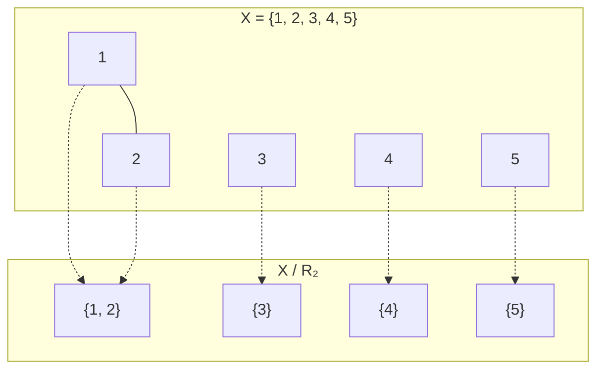
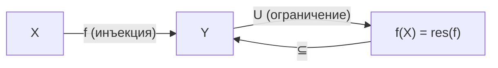

# 📝 Лекция 1: Отношения, эквивалентность, порядок, индукция, мощности и счётность

> **Дата:** `2026-09-08`  
> **Предмет:** Математический анализ (1 семестр)  
> **Преподаватель:** ИТМО  
> **Правила сдачи:** см. линейную алгебру (аналогичная БРС-система).  
> **Консультация:** Четверг, 12:00, с ментором.  
> **Рекомендуемая литература:**
> 1. *Зорич В. А.* — «Математический анализ» (основной учебник, фундаментальный двухтомник).
> 2. *Будин А.* — «Анализ» (компактное пособие).
> 3. *Ross K.* — «Elementary Calculus» (англоязычный вводный курс, хорош для интуиции).
> 4. *Виноградов И. М.* — «Математический анализ» (классический советский курс).
> 5. *Демидович Б. П.* — «Задачник» (обязательный сборник задач, без него невозможно сдать экзамен!).
> 6. *Макаров Б. М., Голузина М. Г., Подкорытов А. Н.* — «Избранные задачи по вещественному анализу» (**«самый лучший матан»** — цитата лектора).

---

## 🧭 Навигация по конспекту
1. [Организация курса и литература](#организация-курса-и-литература)
2. [Отношения: определение и примеры](#1-отношения-определение-и-примеры)
   - [Определение отношения](#11-определение-отношения)
   - [Семь примеров отношений](#12-семь-примеров-отношений)
3. [Отношения эквивалентности](#2-отношения-эквивалентности)
   - [Определение и три аксиомы](#21-определение-и-три-аксиомы)
   - [Классы эквивалентности](#22-классы-эквивалентности)
   - [Факторможество X/R](#23-факторможество-xr)
   - [Лемма корректности](#24-лемма-корректности-классы-не-перекрываются)
   - [Построение ℤ и ℚ через факторизацию](#25-построение-mathbbz-и-mathbbq-через-факторизацию)
4. [Отношения порядка](#3-отношения-порядка)
   - [Частичный порядок (ЧУМ)](#31-частичный-порядок-чум)
   - [Линейный порядок](#32-линейный-порядок)
5. [Принцип математической индукции](#4-принцип-математической-индукции)
   - [Формулировка принципа](#41-формулировка-принципа)
   - [Эквивалентная формулировка](#42-эквивалентная-формулировка-наименьший-элемент)
   - [Доказательство эквивалентности](#43-доказательство-эквивалентности-1-iff-2)
6. [Мощности множеств](#5-мощности-множеств)
   - [Равномощность и обозначения](#51-равномощность-и-обозначения)
   - [Начальные отрезки и конечные множества](#52-начальные-отрезки-и-конечные-множества)
   - [Лемма о конечности и равномощности](#53-лемма-о-конечности-и-равномощности)
7. [Счётность](#6-счётность)
   - [Определение счётного множества](#61-определение-счётного-множества)
   - [Теорема Кантора (X ≠ P(X))](#62-теорема-кантора)
   - [Свойства счётных множеств](#63-свойства-счётных-множеств)
   - [Диагональный процесс Кантора](#64-диагональный-процесс-кантора-mathbbn-times-mathbbn-счётно)
   - [Счётное объединение не более чем счётных](#65-счётное-объединение-не-более-чем-счётных-множеств)
8. [Примеры и типовые задачи](#-примеры-и-типовые-задачи)
9. [Вопросы для самопроверки к коллоквиуму / экзамену](#-вопросы-для-самопроверки-к-коллоквиуму--экзамену)

---

## 📌 Краткое резюме (TL;DR)
1. **Отношение** на $X$ — это любое подмножество $R \subseteq X \times X$. Отношение **эквивалентности** разбивает множество на непересекающиеся **классы** (примеры: равенство, «жить в одном доме», сравнимость $\pmod{n}$). Через факторизацию из $\mathbb{N}$ строятся $\mathbb{Z}$ и $\mathbb{Q}$.
2. **Отношение частичного порядка** $\preccurlyeq$ задаёт структуру ЧУМ (рефлексивность, антисимметричность, транзитивность). **Линейный** порядок — ЧУМ, в котором любые два элемента сравнимы.
3. **Принцип индукции**: если $P_0$ истинно и $P_k \Rightarrow P_{k+1}$, то $P_n$ истинно $\forall n \in \mathbb{N}$. Это **эквивалентно** тому, что в $\mathbb{N}$ каждое непустое подмножество имеет наименьший элемент.
4. **Мощность**: $|X| = |Y|$, если $\exists$ биекция $X \to Y$. Множество **конечно**, если $|X| = |\overline{n}|$ для некоторого $n \in \mathbb{N}$, и **счётно**, если $|X| = |\mathbb{N}|$.
5. **Теорема Кантора**: $|X| < |\mathcal{P}(X)|$ — множество строго «меньше» своего булеана (т.е. бесконечных мощностей — бесконечно много!).
6. **Счётные множества**: $\mathbb{N}, \mathbb{Z}, \mathbb{Q}$ — счётны. Счётное объединение не более чем счётных множеств счётно. $\mathbb{N} \times \mathbb{N}$ счётно (диагональный процесс Кантора).

---

## Организация курса и литература

> [!info] Организационные вопросы
> - **Правила сдачи** аналогичны линейной алгебре (см. [[Линейная алгебра]])
> - **Консультация с ментором**: четверг, 12:00
> - Лектор особо выделил задачник **Демидовича** — без него подготовка к экзамену практически невозможна
> - Сборник «Избранные задачи по вещественному анализу» (Макаров, Голузина, Подкорытов) охарактеризован как **«самый лучший матан»**

> [!tip] Совет по литературе
> Начинайте с **Зорича** (теория + упражнения) и параллельно решайте **Демидовича** (задачи). **Ross** — отличный вариант, если хотите разобраться в интуиции на английском языке. Для глубокого понимания и олимпиадного уровня — «Избранные задачи» Макарова.

---

## 1. Отношения: определение и примеры

### 1.1 Определение отношения

> [!danger] Определение 1 (Отношение)
> Пусть $X, Y$ — множества. **Отношением** между $X$ и $Y$ называется любое подмножество
> $$R \subseteq X \times X$$
> Если $(x, y) \in R$, говорим, что элементы $x$ и $y$ **находятся в отношении** $R$.

**Зачем это нужно?** Отношения — это абстрактный фундамент для понятий «равенство», «порядок», «эквивалентность», «делимость» и т.д. Всё, что мы знаем об арифметике, алгебре и анализе, опирается на отношения.

> [!info] Запись и обозначения
> Обычно пишут $xRy$ вместо $(x, y) \in R$ (например, $x = y$, $x \leq y$, $x \mid y$). В данном курсе используется запись с парой: $(x, y) \in R \overset{\text{def}}{\Longleftrightarrow} \text{некоторое свойство}$.

### 1.2 Семь примеров отношений

Лектор привёл **семь** конкретных примеров на лекции, разберём каждый подробно:

> [!example] Пример ① — Равенство (стандартное)
> $X$ — произвольное множество; $(x, y) \in R \overset{\text{def}}{\Longleftrightarrow} x = y$.
>
> **Частные случаи:** $X = \mathbb{N}, \mathbb{Z}, \mathbb{Q}, \mathbb{Q}_{\geq 0}, \mathbb{R}, \mathbb{C}$.
>
> Равенство — это «образцовое» отношение эквивалентности (рефлексивно, симметрично, транзитивно). Каждый класс эквивалентности — синглтон $\{x\}$.

> [!example] Пример ② — Аналогия (на множестве объектов)
> $X$ — множество некоторых объектов (абстрактных); $(A, B) \in R \overset{\text{def}}{\Longleftrightarrow} A$ аналогичен $B$.
>
> Если аналогия рефлексивна, симметрична и транзитивна, то это отношение эквивалентности.

> [!example] Пример ③ — Конкретные пары (на конечном множестве)
> $X = \{1, 2, 3, 4, 5\}$.
> - $R_1 = \{(1,1); (2,2); (3,3); (4,4); (5,5)\}$ — **диагональ** (отношение равенства на $X$).
> - $R_2 = \{(1,1); (2,2); (3,3); (4,4); (5,5); (1,2); (2,1)\}$ — диагональ + пара $(1,2)$ и обратная $(2,1)$. Это тоже отношение эквивалентности: классы $\{1,2\}$, $\{3\}$, $\{4\}$, $\{5\}$.

> [!example] Пример ④ — Сравнимость по модулю $n$ (фиксированному)
> $X = \mathbb{Z}$, $n \in \mathbb{Z}$ фиксировано.
> $$(a, b) \in R \overset{\text{def}}{\Longleftrightarrow} n \mid (a - b)$$
> т.е. «$(a - b)$ делится на $n$».
>
> **Это классическое отношение эквивалентности!** Оно порождает **классы вычетов** — фактормножество $\mathbb{Z}/n\mathbb{Z}$.

> [!tip] Что нужно знать: Арифметика остатков
> Для $n = 3$: классы вычетов — $[0] = \{\ldots, -3, 0, 3, 6, \ldots\}$, $[1] = \{\ldots, -2, 1, 4, 7, \ldots\}$, $[2] = \{\ldots, -1, 2, 5, 8, \ldots\}$.
> Фактормножество $\mathbb{Z}/3\mathbb{Z} = \{[0], [1], [2]\}$ — это кольцо вычетов, основа модулярной арифметики, криптографии (RSA) и теории чисел.

> [!example] Пример ⑤ — На парах натуральных чисел
> $X = \mathbb{N} \times \mathbb{N}$, $R \subseteq X \times X$:
> $$((a,b), (c,d)) \in R \overset{\text{def}}{\Longleftrightarrow} a + d = b + c$$
> Свойства: **рефлексивно** ($a + b = b + a$ ✓), **симметрично** ($a + d = b + c \Leftrightarrow c + b = d + a$ ✓).
>
> Это отношение используется для **конструкции целых чисел** $\mathbb{Z}$ из $\mathbb{N}$ (см. раздел 2.5).

> [!example] Пример ⑥ — На парах (целое × положительное натуральное)
> $X = \mathbb{Z} \times (\mathbb{N} \setminus \{0\})$:
> $$((m, n), (p, q)) \in R \overset{\text{def}}{\Longleftrightarrow} mq = np$$
> Это отношение используется для **конструкции рациональных чисел** $\mathbb{Q}$ — пара $(m, n)$ кодирует дробь $\frac{m}{n}$, и $\frac{m}{n} = \frac{p}{q}$ ровно тогда, когда $mq = np$.

> [!example] Пример ⑦ — «Жить в одном доме» (бытовой пример)
> $X$ — жители Санкт-Петербурга. $(a, b) \in R \overset{\text{def}}{\Longleftrightarrow}$ $a$ и $b$ живут в одном доме.
>
> - **Рефлексивно?** Да — каждый живёт в том же доме, что и он сам.
> - **Симметрично?** Да — если $a$ живёт с $b$ в одном доме, то и $b$ с $a$.
> - **Транзитивно?** Да — если $a$ и $b$ в одном доме, и $b$ и $c$ в одном доме, то $a$ и $c$ тоже.
>
> Классы эквивалентности — **жители каждого дома**. Фактормножество — множество домов Петербурга!

---

## 2. Отношения эквивалентности

### 2.1 Определение и три аксиомы

> [!danger] Определение 2 (Отношение эквивалентности)
> Отношение $R \subseteq X \times X$ называется **отношением эквивалентности**, если выполнены три свойства:
>
> **(i) Рефлексивность:** $\quad \forall x \in X: \; (x, x) \in R$
> — каждый элемент эквивалентен самому себе.
>
> **(ii) Симметричность:** $\quad \forall x, y \in X: \; (x, y) \in R \Rightarrow (y, x) \in R$
> — если $x$ эквивалентен $y$, то и $y$ эквивалентен $x$.
>
> **(iii) Транзитивность:** $\quad \forall x, y, z \in X: \; (x, y) \in R \text{ и } (y, z) \in R \Rightarrow (x, z) \in R$
> — цепочка эквивалентностей замыкается.

> [!tip] Мнемоника «РСТ»
> Запомните три буквы: **Р**ефлексивность, **С**имметричность, **Т**ранзитивность. Каждый раз, когда вас просят «доказать, что это отношение эквивалентности», вы должны проверить все три свойства.

### 2.2 Классы эквивалентности

> [!danger] Определение 2a (Класс эквивалентности)
> Пусть $R \subseteq X \times X$ — отношение эквивалентности. Для каждого элемента $x \in X$ определим:
> $$[x] = \{y \in X \mid (y, x) \in R\} \subseteq X$$
> $[x]$ называется **классом эквивалентности** элемента $x$. Элемент $x$ называется **представителем** класса $[x]$.

Интуитивно: $[x]$ — это «облако» всех элементов, которые «неразличимы» от $x$ с точки зрения отношения $R$.

> [!info] Важное свойство
> $x \in [x]$ — представитель всегда лежит в своём классе (следствие рефлексивности).

### 2.3 Факторможество $X/R$

> [!danger] Определение 2b (Факторможество)
> $$X / R := \{[x] \mid x \in X\} \subseteq \mathcal{P}(X)$$
> **Факторможество** — это множество **всех** классов эквивалентности. Иначе говоря, мы «склеиваем» эквивалентные элементы в один класс.

### 2.4 Лемма корректности (классы не перекрываются)

> [!danger] Лемма (Корректность классов эквивалентности)
> Классы эквивалентности **либо совпадают, либо не пересекаются**:
> $$\forall a, b \in X: \quad [a] \cap [b] \neq \varnothing \Rightarrow [a] = [b]$$
> Культурная запись: $X = \bigsqcup_{[x] \in X/R} [x]$ — множество $X$ разбивается на непересекающиеся классы.

**Доказательство** (разобранное на лекции):
1. $x \in [x]$ — по рефлексивности.
2. Допустим $[a] \cap [b] \neq \varnothing$, т.е. $\exists c \in [a] \cap [b]$.
3. Тогда $(c, a) \in R$ и $(c, b) \in R$.
4. По симметричности: $(a, c) \in R$.
5. По транзитивности: из $(a, c) \in R$ и $(c, b) \in R$ получаем $(a, b) \in R$.
6. Покажем, что $[a] = [b]$:
   - Берём любой $t \in [a]$, т.е. $(t, a) \in R$.
   - Из $(a, b) \in R$ по транзитивности: $(t, b) \in R$, т.е. $t \in [b]$.
   - Аналогично в обратную сторону. $\blacksquare$

> [!tip] Зачем эта лемма?
> Она гарантирует, что отношение эквивалентности **корректно разбивает** множество на части без «наложений». Это фундаментальный факт, который используется при конструкции $\mathbb{Z}$, $\mathbb{Q}$, классов вычетов, факторгрупп и т.д.

### 2.5 Построение $\mathbb{Z}$ и $\mathbb{Q}$ через факторизацию

Один из самых красивых примеров применения отношений эквивалентности — **строгое построение числовых систем** из более примитивных.

#### Построение $\mathbb{Z}$ (Пример ⑤ с лекции)

> [!danger] Определение (Целые числа)
> $$\mathbb{Z} \overset{\text{def}}{=} (\mathbb{N} \times \mathbb{N}) / R$$
> где $((a, b), (c, d)) \in R \Leftrightarrow a + d = b + c$.
>
> Интуиция: пара $(a, b)$ кодирует разность $a - b$.

| Пара $(a, b)$ | Интуитивное значение $a - b$ | Класс $[(a, b)]$ |
| :---: | :---: | :---: |
| $(3, 0)$ | $+3$ | $\{(3,0), (4,1), (5,2), \ldots\}$ |
| $(0, 2)$ | $-2$ | $\{(0,2), (1,3), (2,4), \ldots\}$ |
| $(1, 1)$ | $0$ | $\{(0,0), (1,1), (2,2), \ldots\}$ |

> [!info] Важно!
> В $\mathbb{N}$ нет отрицательных чисел, и вычитание не всегда определено. Но пару $(a, b)$ мы интерпретируем как «$a - b$», и эквивалентность $(a,b) \sim (c,d) \Leftrightarrow a + d = b + c$ корректно группирует все пары, кодирующие одно и то же целое число.

#### Построение $\mathbb{Q}$ (Пример ⑥ с лекции)

> [!danger] Определение (Рациональные числа)
> $$\mathbb{Q} \overset{\text{def}}{=} (\mathbb{Z} \times (\mathbb{N} \setminus \{0\})) / R$$
> где $((m, n), (p, q)) \in R \Leftrightarrow mq = np$.
>
> Интуиция: пара $(m, n)$ кодирует дробь $\frac{m}{n}$.

> [!tip] Что нужно знать: Почему «факторможество ≃ знакомые числа»?
> Когда лектор пишет $\mathbb{Z} := (\mathbb{N} \times \mathbb{N})/R$, он **определяет** целые числа как классы эквивалентности. Это не просто упражнение в абстракции — это **единственный строгий** способ построить $\mathbb{Z}$ из $\mathbb{N}$, не используя понятие «отрицательное число» или «вычитание» заранее.

---

## 3. Отношения порядка

### 3.1 Частичный порядок (ЧУМ)

> [!danger] Определение 3 (Отношение частичного порядка)
> Отношение $\preccurlyeq \; \subseteq X \times X$ называется **отношением частичного порядка**, если:
>
> **(i) Рефлексивность:** $\quad a \preccurlyeq a \quad (:= (a, a) \in \preccurlyeq)$
>
> **(ii) Антисимметричность:** $\quad a \preccurlyeq b \text{ и } b \preccurlyeq a \;\Rightarrow\; a = b \quad \forall a, b \in X$
>
> **(iii) Транзитивность:** $\quad a \preccurlyeq b \text{ и } b \preccurlyeq c \;\Rightarrow\; a \preccurlyeq c$
>
> Пара $(X, \preccurlyeq)$ называется **частично упорядоченным множеством** (ЧУМ).

> [!warning] Отличие от эквивалентности!
> | Свойство | Эквивалентность | Порядок |
> | :--- | :---: | :---: |
> | Рефлексивность | ✅ | ✅ |
> | Симметричность | ✅ | ❌ |
> | **Анти**симметричность | ❌ | ✅ |
> | Транзитивность | ✅ | ✅ |
>
> Ключевое отличие: в порядке из $a \preccurlyeq b$ и $b \preccurlyeq a$ следует $a = b$ (антисимметричность), а в эквивалентности — наоборот, $(a,b) \in R$ обязывает $(b,a) \in R$ (симметричность).

### Примеры ЧУМ

> [!example] Примеры частичных порядков
> **①** $\mathbb{N}, \mathbb{Z}, \mathbb{Q}, \mathbb{R}$ с обычным $\leq$. Здесь все подмножества сравнимы — это на самом деле **линейный** порядок (см. далее).
>
> **②** $X = \mathcal{P}(A)$ — множество всех подмножеств $A$; $\preccurlyeq \; := \; \subseteq$ (включение множеств). Это ЧУМ, но **не** линейный порядок: например, $\{1\}$ и $\{2\}$ несравнимы ($\{1\} \not\subseteq \{2\}$ и $\{2\} \not\subseteq \{1\}$).
> Заметьте: $A \preccurlyeq B$ и $B \preccurlyeq A$ $\Rightarrow$ $A = B$ — это антисимметричность.
>
> **③** $\mathbb{N}$; $a \preccurlyeq b \overset{\text{def}}{\Longleftrightarrow} a \mid b$ (делимость). Это ЧУМ: делимость рефлексивна ($a \mid a$), антисимметрична (для натуральных чисел $a \mid b$ и $b \mid a$ $\Rightarrow$ $a = b$), транзитивна. Но **не линейный**: 2 и 3 несравнимы.

### 3.2 Линейный порядок

> [!danger] Определение (Линейный порядок)
> ЧУМ $(X, \preccurlyeq)$ называется **линейно упорядоченным** (линейный порядок), если:
> $$\forall a, b \in X: \quad a \preccurlyeq b \;\text{ или }\; b \preccurlyeq a \;\text{ или }\; a = b$$
> (любые два элемента сравнимы).

> [!example] Примеры линейных порядков
> - $(\mathbb{N}, \leq)$, $(\mathbb{Z}, \leq)$, $(\mathbb{R}, \leq)$ — стандартные числовые множества.
> - Лексикографический порядок на строках (как в словаре).

> [!info] Пример нелинейного ЧУМ
> $A = \{0, 1, 2, 3, 4, 5\}$, $B = \{0, 2, 4, 5\}$. Тогда $A \times B$ с покомпонентным порядком — ЧУМ, но не линейный (пара $(0, 2)$ и $(1, 0)$ несравнимы).

---

## 4. Принцип математической индукции

### 4.1 Формулировка принципа

> [!danger] Определение / Аксиома (Принцип математической индукции)
> Пусть $\{P_n\}_{n \in \mathbb{N}}$ — семейство утверждений, занумерованное натуральными числами. Предположим:
> 1. $P_0$ **истинно** (база индукции),
> 2. $\forall k \in \mathbb{N}: \; P_k \text{ истинно} \Rightarrow P_{k+1} \text{ истинно}$ (шаг индукции).
>
> **Тогда** $P_n$ истинно $\forall n \in \mathbb{N}$.

> [!tip] Аналогия с костяшками домино
> Представьте бесконечный ряд костяшек домино:
> - **База**: вы толкаете первую костяшку (она падает = $P_0$ истинно).
> - **Шаг**: каждая падающая костяшка гарантированно сбивает следующую ($P_k \Rightarrow P_{k+1}$).
> - **Вывод**: все костяшки упадут ($P_n$ истинно $\forall n$).

### 4.2 Эквивалентная формулировка (наименьший элемент)

> [!danger] Утверждение (Эквивалентность)
> Следующие два утверждения эквивалентны:
>
> **(1)** Принцип индукции (как выше).
>
> **(2)** $\forall A \subseteq \mathbb{N}$, $A \neq \varnothing$: множество $A$ содержит **наименьший элемент**.
>
> $$\boxed{(1) \Longleftrightarrow (2)}$$

> [!info] Что говорит свойство (2)?
> Это **принцип наименьшего элемента** (well-ordering principle): любое непустое подмножество натуральных чисел имеет минимум. Это фундаментальное свойство $\mathbb{N}$, которое **не выполняется** для $\mathbb{Z}$ (например, $\mathbb{Z}$ не имеет наименьшего элемента).

### 4.3 Доказательство эквивалентности $(1) \Leftrightarrow (2)$

> [!example] Доказательство $(1) \Rightarrow (2)$: от противного
> Допустим, $\exists A \subseteq \mathbb{N}$ непустое и без наименьшего элемента.
>
> **Строим противоречие с индукцией:**
> - Заметим, что $0 \notin A$ (иначе 0 был бы наименьшим в $A$, т.к. $0 \leq n$ $\forall n$).
> - Пусть $0, 1, \ldots, k \notin A$. Тогда $k+1 \notin A$ (иначе $k+1$ — наименьший в $A$, ведь все меньшие уже исключены).
> - По индукции: $n \notin A$ $\forall n \in \mathbb{N}$ $\Rightarrow$ $A = \varnothing$. **Противоречие!** $\blacksquare$

> [!example] Доказательство $(2) \Rightarrow (1)$: от противного
> Пусть $P_0$ истинно, шаг $P_k \Rightarrow P_{k+1}$ выполняется, но $\exists n$: $P_n$ ложно.
>
> Рассмотрим $B = \{n \in \mathbb{N} \mid P_n \text{ ложно}\}$. По условию, $B \neq \varnothing$.
>
> По свойству (2), $\exists$ наименьший элемент $b \in B$, $b > 0$ (т.к. $P_0$ истинно).
>
> Тогда $(b - 1) \in \mathbb{N}$ и $P_{b-1}$ **истинно** (т.к. $b$ — наименьший в $B$).
>
> По шагу индукции: $P_{b-1} \Rightarrow P_{(b-1)+1} = P_b$ — значит, $P_b$ **истинно**. **Противоречие!** $\blacksquare$

> [!tip] Практическое применение
> На экзамене и в задачах **обе формулировки** равноправны. Иногда удобнее использовать принцип наименьшего элемента вместо «стандартной» индукции (например, при доказательстве основной теоремы арифметики).

---

## 5. Мощности множеств

### 5.1 Равномощность и обозначения

> [!danger] Определение 4 (Равномощность)
> Множества $X$ и $Y$ **равномощны** (equinumerous), если между ними существует биекция $f: X \to Y$.
>
> **Обозначение:** $|X| = |Y|$.

> [!info] Обозначения для сравнения мощностей
> Для множеств $X$, $Y$ вводим:
>
> $$|X| \leq |Y| \quad \overset{\text{def}}{\Longleftrightarrow} \quad \exists \text{ инъекция } f: X \to Y$$
> $$|X| < |Y| \quad \overset{\text{def}}{\Longleftrightarrow} \quad \exists \text{ инъекция } f: X \to Y, \text{ но не существует биекции}$$

> [!tip] Что нужно знать: Теорема Кантора—Бернштейна
> Если $|X| \leq |Y|$ и $|Y| \leq |X|$, то $|X| = |Y|$. Эта теорема доказывается отдельно (она нетривиальна!) и позволяет сводить доказательство равномощности к построению двух инъекций вместо одной биекции.

### 5.2 Начальные отрезки и конечные множества

> [!danger] Определение (Начальный отрезок)
> $$\overline{n} = \{k \in \mathbb{N} \mid k < n\}$$
> Примеры: $\overline{0} = \varnothing$, $\overline{1} = \{0\}$, $\overline{3} = \{0, 1, 2\}$, $\overline{n} = \{0, 1, \ldots, n-1\}$.

> [!danger] Лемма (О начальных отрезках)
> Если $|\overline{n}| = |\overline{m}|$ (т.е. существует биекция $\overline{n} \to \overline{m}$), то $n = m$.

**Доказательство** (индукция по $n$):
- **База:** $n = 0$: $\overline{0} = \varnothing$. Если $|\varnothing| = |\overline{m}|$, то $\overline{m} = \varnothing$, т.е. $m = 0$. ✓
- **Шаг:** Пусть лемма доказана для $n$. Дана биекция $f: \overline{n+1} \to \overline{m}$.
  - Ограничим: $f|_{\overline{n+1} \setminus \{n\}}: \overline{n+1} \setminus \{n\} \to \overline{m} \setminus \{f(n)\}$.
  - Но $\overline{n+1} \setminus \{n\} \cong \overline{n}$ и $\overline{m} \setminus \{f(n)\} \cong \overline{m-1}$ (с точностью до биекции).
  - По предположению индукции: $n = m - 1$, т.е. $n + 1 = m$. $\blacksquare$

### 5.3 Лемма о конечности и равномощности

> [!danger] Определение (Конечное множество)
> Множество $X$ **конечно**, если $|X| = |\overline{n}|$ для некоторого $n \in \mathbb{N}$. Будем говорить, что **мощность** $X$ равна $n$.
>
> По лемме выше это определение **корректно**: число $n$ определено однозначно.

> [!info] Замечание
> **Равномощность** — рефлексивное, симметричное и транзитивное отношение на множестве всех множеств, т.е. **отношение эквивалентности**.

---

## 6. Счётность

### 6.1 Определение счётного множества

> [!danger] Определение 5 (Счётность)
> Множество $X$ **счётно**, если $|X| = |\mathbb{N}|$, т.е. существует биекция $X \to \mathbb{N}$.
>
> Множество $X$ **не более чем счётно** (= н.б.с.) — если $X$ конечно или счётно.

> [!example] Примеры счётных множеств
> $\mathbb{N}$, $\mathbb{Z}$, $\mathbb{Q}$ — счётны (биекции строятся явно, см. предыдущую лекцию по линейной алгебре).

> [!tip] Маленькое резюме Кантора (Канторова «лестница» множеств)
> $|\mathbb{N}| = |\mathbb{Z}| = |\mathbb{Q}| < |\mathbb{R}| < |\mathcal{P}(\mathbb{R})| < |\mathcal{P}(\mathcal{P}(\mathbb{R}))| < \ldots$
>
> Бесконечных мощностей — бесконечно много!

### 6.2 Теорема Кантора

> [!danger] Теорема (Кантор, 1891)
> Пусть $X$ — произвольное множество. Тогда не существует сюръекции $f: X \to \mathcal{P}(X)$.
>
> **Следствие:** $|X| < |\mathcal{P}(X)|$ — мощность булеана **строго больше** мощности множества.
>
> В частности: $\mathbb{R}$ **несчётно** (поскольку $|\mathbb{R}| = |\mathcal{P}(\mathbb{N})|$, а $|\mathbb{N}| < |\mathcal{P}(\mathbb{N})|$).

**Доказательство** (диагональный аргумент Кантора):

1. Допустим, $\exists f: X \to \mathcal{P}(X)$ — сюръекция. Выделим:
$$D := \{x \in X \mid x \notin f(x)\} \subseteq X$$
2. По сюръективности $f$: $\exists d \in X$ такой, что $f(d) = D$.
3. Спросим: $d \in D$?
   - Если $d \in D$, то по определению $D$: $d \notin f(d) = D$. **Противоречие!**
   - Если $d \notin D$, то $d \notin \{x \mid x \notin f(x)\}$, т.е. $d \in f(d) = D$. **Противоречие!**
4. В обоих случаях — противоречие. Значит, сюръекция невозможна. $\blacksquare$

> [!tip] Связь с парадоксом Рассела
> Структура доказательства — та же самая «самоссылающаяся» конструкция, что и парадокс Рассела: мы строим множество $D$ всех элементов, которые «не описывают самих себя». Но здесь это законная конструкция, не парадокс — она опровергает допущение о сюръективности.

> [!info] Замечание: каноническая инъекция $X \hookrightarrow \mathcal{P}(X)$
> Отображение $\iota: X \to \mathcal{P}(X)$, $x \mapsto \{x\}$ — **инъекция** (но не сюръекция!). Поэтому $|X| \leq |\mathcal{P}(X)|$, и вместе с теоремой получаем строгое неравенство $|X| < |\mathcal{P}(X)|$.

### 6.3 Свойства счётных множеств

> [!danger] Свойства
> **(1)** $\forall A \subseteq \mathbb{N}$: $A$ **конечно или счётно** (т.е. всякое подмножество счётного множества — не более чем счётно).
>
> **(2)** $\mathbb{N} \times \mathbb{N}$ — счётно. Отсюда $\mathbb{N}^m$ — счётно $\forall m \in \mathbb{N}$.

**Доказательство свойства (1):**
Пусть $A \subseteq \mathbb{N}$ бесконечно. Возьмём наименьший элемент $n_1 \in A$ (по принципу наименьшего элемента, $n_1 \geq 0$). Далее возьмём наименьший в $A \setminus \{n_1\}$: $n_2$. Продолжая: $n_k$ — наименьший в $A \setminus \{n_1, \ldots, n_{k-1}\}$.

Получаем:
- Все $n_i \geq i - 1$
- $n_1 < n_2 < n_3 < \ldots$

Построенное отображение $\mathbb{N} \to A$, $i \mapsto n_i$ — **инъекция** (строго возрастающая функция).

**Покажем сюръективность:** если $a \in A$ «не посчитан», то $a > n_i$ $\forall i$. Рассмотрим $n_{a+2}$: на шаге $a + 2$ мы уже выбрали $a + 2$ элементов, каждый $\geq$ порядковому номеру. Тогда $n_{a+2} > a$ — **противоречие!** $\blacksquare$

### 6.4 Диагональный процесс Кантора ($\mathbb{N} \times \mathbb{N}$ счётно)

Это один из самых элегантных фактов теории множеств. Нужно построить биекцию $t: \mathbb{N} \times \mathbb{N} \to \mathbb{N}$.

**Идея:** расположим пары $(k, \ell)$ в таблицу и обходим её **по диагоналям**:

| | $\ell = 0$ | $\ell = 1$ | $\ell = 2$ | $\ldots$ |
| :---: | :---: | :---: | :---: | :---: |
| $k = 0$ | $(0,0)$ | $(0,1)$ | $(0,2)$ | $\ldots$ |
| $k = 1$ | $(1,0)$ | $(1,1)$ | $(1,2)$ | $\ldots$ |
| $k = 2$ | $(2,0)$ | $(2,1)$ | $(2,2)$ | $\ldots$ |
| $\vdots$ | $\vdots$ | $\vdots$ | $\vdots$ | $\ddots$ |

$m$-я диагональ: все пары $(k, \ell)$ с $k + \ell = m$. Она содержит ровно $m + 1$ пару.

> [!danger] Формула биекции (канторова нумерация)
> $$t(k, \ell) = \frac{(k + \ell)(k + \ell + 1)}{2} + k$$
> Здесь $\frac{(k+\ell)(k+\ell+1)}{2}$ — номер начала диагонали с суммой $m = k + \ell$, а $+k$ — позиция внутри диагонали.

> [!example] Пример работы формулы
> - $t(0, 0) = \frac{0 \cdot 1}{2} + 0 = 0$
> - $t(1, 0) = \frac{1 \cdot 2}{2} + 1 = 2$
> - $t(0, 1) = \frac{1 \cdot 2}{2} + 0 = 1$
> - $t(1, 1) = \frac{2 \cdot 3}{2} + 1 = 4$
> - $t(0, 2) = \frac{2 \cdot 3}{2} + 0 = 3$

### 6.5 Счётное объединение не более чем счётных множеств

> [!danger] Предложение (О счётном объединении)
> Пусть $\{A_s\}_{s \in S}$ — набор **не более чем счётных** множеств, и $S$ — тоже **не более чем счётно**.
>
> Тогда $\bigcup_{s \in S} A_s$ — **не более чем счётно**.

**Доказательство:**
1. $\mathbb{N} \xrightarrow{d} S$ — сюръекция (т.к. $S$ н.б.с.).
2. $\mathbb{N} \xrightarrow{w_s} A_s$ — сюръекция для каждого $s \in S$ (т.к. каждое $A_s$ н.б.с.).
3. Тогда $\mathbb{N} \times \mathbb{N} \to \bigcup_{s \in S} A_s$, $(m, n) \mapsto w_{d(m)}(n)$ — сюръекция.
4. Т.к. $\mathbb{N} \times \mathbb{N}$ счётно, а сюръекция из счётного множества на $\bigcup A_s$ означает, что $\bigcup A_s$ н.б.с. $\blacksquare$

> [!tip] Следствия (важно для экзамена!)
> - $\mathbb{Q}$ — счётно (т.к. $\mathbb{Q} = \bigcup_{n=1}^{\infty} \{\frac{m}{n} \mid m \in \mathbb{Z}\}$ — счётное объединение счётных множеств).
> - Множество всех алгебраических чисел — счётно.
> - Множество всех многочленов с рациональными коэффициентами — счётно.
> - А вот $\mathbb{R}$ — **несчётно** (теорема Кантора + $|\mathbb{R}| = |\mathcal{P}(\mathbb{N})|$).

---

## Дополнительный материал: Канторово несчётное множество

> [!info] Канторово несчётное множество (упоминание на лекции)
> $X = \{0, 1\}^{\infty}$ — множество **всех бесконечных последовательностей** из нулей и единиц: $a_n \in X$, где на $n$-м месте стоит $0$ или $1$.
>
> **В последовательности:** ставим 1, если $a_n$ было $0$, и $0$, если было $1$ (инвертируем $n$-й элемент).
>
> Это множество **несчётно**: по теореме Кантора, $|X| = |\{0,1\}^{\mathbb{N}}| = |2^{\mathbb{N}}| = |\mathcal{P}(\mathbb{N})| > |\mathbb{N}|$.
>
> Интуиция: каждую последовательность $d_0 d_1 d_2 \ldots$ можно интерпретировать как двоичную запись числа из отрезка $[0, 1]$.

---

## 📖 Сводная таблица понятий лекции

| Понятие | Определение | Ключевые свойства |
| :--- | :--- | :--- |
| **Отношение** | $R \subseteq X \times X$ | Просто подмножество декартова произведения |
| **Эквивалентность** | Рефл. + Симм. + Транз. | Порождает разбиение на классы |
| **Класс $[x]$** | $\{y \mid (y,x) \in R\}$ | Не пересекаются (лемма) |
| **Факторможество** | $X/R = \{[x] \mid x \in X\}$ | Используется для конструкции $\mathbb{Z}, \mathbb{Q}$ |
| **ЧУМ** | Рефл. + Антисимм. + Транз. | Не все элементы сравнимы |
| **Линейный порядок** | ЧУМ + тотальность | Любые два элемента сравнимы |
| **Индукция** | $P_0 \wedge (P_k \Rightarrow P_{k+1})$ | $\Leftrightarrow$ наименьший элемент в $\mathbb{N}$ |
| **Равномощность** | $\exists$ биекция $X \to Y$ | $|X| = |Y|$ |
| **Конечность** | $|X| = |\overline{n}|$ | По лемме $n$ единственно |
| **Счётность** | $|X| = |\mathbb{N}|$ | $\mathbb{N}, \mathbb{Z}, \mathbb{Q}$ — счётны |
| **Теорема Кантора** | $\nexists$ сюръекция $X \to \mathcal{P}(X)$ | $|X| < |\mathcal{P}(X)|$ всегда |

---

## 💡 Примеры и типовые задачи

> [!example] Задача 1: Проверка эквивалентности
> **Условие:** Пусть $X = \mathbb{Z}$, $(a, b) \in R \Leftrightarrow 5 \mid (a - b)$. Докажите, что $R$ — отношение эквивалентности. Перечислите классы.
>
> **Решение:**
> - *Рефлексивность:* $5 \mid (a - a) = 0$ ✓
> - *Симметричность:* $5 \mid (a - b) \Rightarrow 5 \mid (-(a-b)) = (b - a)$ ✓
> - *Транзитивность:* $5 \mid (a-b)$ и $5 \mid (b-c) \Rightarrow 5 \mid (a-b) + (b-c) = (a-c)$ ✓
>
> Классы: $[0] = \{\ldots, -5, 0, 5, 10, \ldots\}$, $[1] = \{\ldots, -4, 1, 6, 11, \ldots\}$, $[2], [3], [4]$.
> Факторможество: $\mathbb{Z}/5\mathbb{Z} = \{[0], [1], [2], [3], [4]\}$ — «часы с 5 делениями».

> [!example] Задача 2: Индукция
> **Условие:** Докажите, что $1 + 2 + \ldots + n = \frac{n(n+1)}{2}$ для всех $n \geq 1$.
>
> **Решение:**
> - *База* ($n = 1$): $1 = \frac{1 \cdot 2}{2} = 1$ ✓
> - *Шаг:* Пусть $1 + 2 + \ldots + k = \frac{k(k+1)}{2}$ (предположение индукции). Тогда:
> $$1 + 2 + \ldots + k + (k+1) = \frac{k(k+1)}{2} + (k+1) = \frac{k(k+1) + 2(k+1)}{2} = \frac{(k+1)(k+2)}{2}$$
> что совпадает с формулой для $n = k + 1$. $\blacksquare$

> [!example] Задача 3: Теорема Кантора (применение)
> **Условие:** Докажите, что множество $\{0, 1\}^{\mathbb{N}}$ (всех бесконечных бинарных последовательностей) несчётно.
>
> **Решение:** Множество $\{0,1\}^{\mathbb{N}}$ находится в биекции с $\mathcal{P}(\mathbb{N})$: каждому подмножеству $A \subseteq \mathbb{N}$ сопоставим его **характеристическую функцию** $\chi_A: \mathbb{N} \to \{0,1\}$, где $\chi_A(n) = 1 \Leftrightarrow n \in A$.
>
> По теореме Кантора: $|\mathcal{P}(\mathbb{N})| > |\mathbb{N}|$, поэтому $\{0,1\}^{\mathbb{N}}$ несчётно. $\blacksquare$

> [!example] Задача 4: Диагональный процесс
> **Условие:** Используя канторову нумерацию, найдите $t(2, 1)$.
>
> **Решение:** $k = 2$, $\ell = 1$, $m = k + \ell = 3$.
> $$t(2, 1) = \frac{3 \cdot 4}{2} + 2 = 6 + 2 = 8$$

---

## ❓ Вопросы для самопроверки к коллоквиуму / экзамену

- [ ] Дайте определение отношения на множестве $X$. Чем отличается отношение эквивалентности от отношения порядка?
- [ ] Перечислите и объясните три аксиомы отношения эквивалентности (рефлексивность, симметричность, транзитивность).
- [ ] Что такое класс эквивалентности $[x]$? Что такое факторможество $X/R$?
- [ ] Сформулируйте и докажите лемму корректности (классы либо совпадают, либо не пересекаются).
- [ ] Как из $\mathbb{N}$ строятся $\mathbb{Z}$ и $\mathbb{Q}$ через факторизацию? Напишите определения.
- [ ] Дайте определение частичного порядка. Приведите пример ЧУМ, не являющегося линейным порядком.
- [ ] Что такое линейный порядок? Приведите примеры.
- [ ] Сформулируйте принцип математической индукции. Какое утверждение ему эквивалентно?
- [ ] Докажите эквивалентность принципа индукции и принципа наименьшего элемента.
- [ ] Дайте определение равномощности. Что означает $|X| \leq |Y|$ и $|X| < |Y|$?
- [ ] Что такое конечное множество? Что такое мощность конечного множества?
- [ ] Сформулируйте и докажите лемму: если $|\overline{n}| = |\overline{m}|$, то $n = m$.
- [ ] Дайте определение счётного множества. Приведите примеры.
- [ ] Сформулируйте и докажите теорему Кантора ($|X| < |\mathcal{P}(X)|$).
- [ ] Докажите, что любое подмножество $\mathbb{N}$ конечно или счётно.
- [ ] Объясните диагональный процесс Кантора и выведите формулу $t(k, \ell)$.
- [ ] Сформулируйте и докажите предложение о счётном объединении н.б.с. множеств.
- [ ] Является ли множество всех рациональных чисел $\mathbb{Q}$ счётным? Обоснуйте.

---

> [!abstract] Навигация
> ⬅️ *Предыдущая:* *(первая лекция по матанализу)*
> 📚 **Хаб предмета:** [[Математический анализ]]
> 🏠 **Главная:** [[🏠 Главная]]
> ➡️ *Следующая:* *(будет добавлена)*
