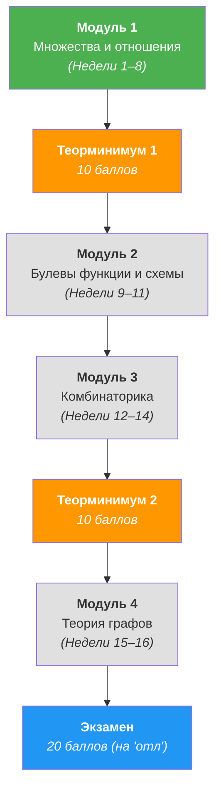

# 🔢 Дискретная математика (1 семестр)

> [!abstract] О предмете
> Фундаментальный курс дискретной математики для Software Engineering в Университете ИТМО. Охватывает математическую логику, теорию множеств, бинарные отношения, булевы функции, комбинаторику и теорию графов.
> 
> **Преподаватель (лектор):** Константин Чухарев ([@Lipen](https://github.com/Lipen), Университет ИТМО)  
> **Официальный репозиторий курса:** [github.com/Lipen/discrete-math-course](https://github.com/Lipen/discrete-math-course)  
> **Основной учебник:** `book.pdf` (в репозитории курса)

> [!info] Регламент аттестации и баллы БРС (100 баллов)
> - **40 баллов — 4 модуля (ДЗ + КР по 10 баллов):**
>   - Формула модуля: $c = \min(d, x)$, где:
>     - $d \in [0, 10]$ — баллы за домашнее задание;
>     - $x \in [0, 10]$ — баллы за письменную контрольную работу.
>   - *Смысл:* сдать только ДЗ или только написать КР недостаточно — баллы «режутся» по минимуму.
> - **20 баллов — 2 теоретических минимума (ТМ):**
>   - ТМ 1 и ТМ 2 по 10 баллов (устные/письменные коллоквиумы по определениям и формулировкам).
> - **20 баллов — Экзамен:**
>   - Полноценный устный/письменный экзамен в конце семестра.
> - **10 баллов — Практики:**
>   - 10 семинаров $\times$ 1 балл за активность и посещаемость.
> - **10 баллов — Лекции:**
>   - Летучки (flash quizzes) в первые 5 минут каждой лекции.
> 
> **Автомат:**
> - Набрать до 80 баллов (оценка «хорошо») можно автоматом без экзамена при закрытии всех ДЗ, КР и ТМ.
> - Оценка «отлично» ($\ge 90$ баллов) строго требует обязательной сдачи экзамена.
> 
> ⚠️ **Требование к оформлению ДЗ 1:** строго рукописный текст на бумаге, оцифрованный в единый PDF-файл (загрузка в Dropbox курса).

---

## 📝 Список лекций

| № | Дата | Тема лекции | Материалы и слайды | Конспект |
| :---: | :---: | :--- | :--- | :---: |
| 1 | `2026-09-09` | **Высказывания, связки, таблицы истинности, законы логики и следствие** | `s1-lec01-statements.typ` | [Открыть ↗](./2026-09-09%20-%20Дискретная%20математика%20-%20Лекция%201,%20высказывания,%20связки,%20таблицы%20истинности,%20законы%20логики%20и%20следствие.md) |

---

## 📖 Программа курса (1 семестр)

> [!tip] Статус изучения
> 🟢 Зелёный — текущий изучаемый модуль (Модуль 1: Логика и Множества)  
> 🟠 Оранжевый — контрольные рубежи (Теорминимумы)  
> ⚪ Серый — запланированные модули  
> 🔵 Синий — итоговая аттестация

---

## 🗺️ Ключевые темы по модулям

### Модуль 1: Множества и бинарные отношения (Недели 1–8)
- ✅ **Лекция 1:** Высказывания, логические связки ($\neg, \land, \lor, \implies, \iff$), таблицы истинности, тавтологии, законы логики, Modus Ponens, теорема дедукции.
- ⏳ **Лекция 2:** Логика предикатов, кванторы ($\forall, \exists, \exists!$), свободные и связанные переменные, правила отрицания кванторов.
- ⏳ **Лекции 3–4:** Наивная теория множеств, операции над множествами, парадокс Рассела, булеан, декартово произведение, разбиения.
- ⏳ **Лекции 5–6:** Бинарные отношения: рефлексивность, симметричность, антисимметричность, транзитивность. Отношение эквивалентности и фактормножество.
- ⏳ **Лекции 7–8:** Отношения частичного и линейного порядка. Решётки. Отображения, инъекции/сюръекции/биекции, мощности множеств и теорема Кантора.

### Модуль 2: Булева алгебра и булевы функции (Недели 9–11)
- Булевы функции от $n$ переменных, двойственность, самодвойственные функции.
- ДНФ, КНФ, совершенные нормальные формы (СДНФ, СКНФ), полиномы Жегалкина.
- Замкнутые классы Поста ($T_0, T_1, S, M, L$) и теорема Поста о функциональной полноте.

### Модуль 3: Комбинаторика (Недели 12–14)
- Базовые комбинаторные правила: сложение, умножение, биекция.
- Перестановки, размещения, сочетания с повторениями и без.
- Бином Ньютона, свойства биномиальных коэффициентов.
- Формула включений-исключений. Числа Стирлинга I и II рода, числа Белла, числа Каталана.

### Модуль 4: Теория графов (Недели 15–16)
- Вершины, рёбра, степени вершин, лемма о рукопожатиях.
- Пути, циклы, связность, компоненты связности.
- Деревья и их эквивалентные характеризации, остовные деревья (Краскал, Прим).
- Эйлеровы и гамильтоновы графы. Двудольные графы и паросочетания (теорема Холла).
- Планарность (формула Эйлера, критерий Понтрягина-Куратовского) и раскраски (хроматическое число).

---

## 📚 Рекомендуемая литература

1. **Чухарев К.** — *«Конспект лекций по дискретной математике»* (`book.pdf`), Университет ИТМО. ⭐ **Основной источник**
2. **Верещагин Н. К., Шень А.** — *«Языки и исчисления»* — М.: МЦНМО. (Логика высказываний и предикатов).
3. **Верещагин Н. К., Шень А.** — *«Начала теории множеств»* — М.: МЦНМО.
4. **Новиков Ф. А.** — *«Дискретная математика для программистов»* — СПб.: Питер.
5. **Судоплатов С. В., Овчинникова Е. В.** — *«Элементы дискретной математики»* — М.: ИНФРА-М.
6. **Андерсон Дж. А.** — *«Дискретная математика и комбинаторика»* — М.: Вильямс.

---

> [!abstract] Навигация
> 🏠 [[🏠 Главная]] • 📚 [[README|Каталог конспектов]]
